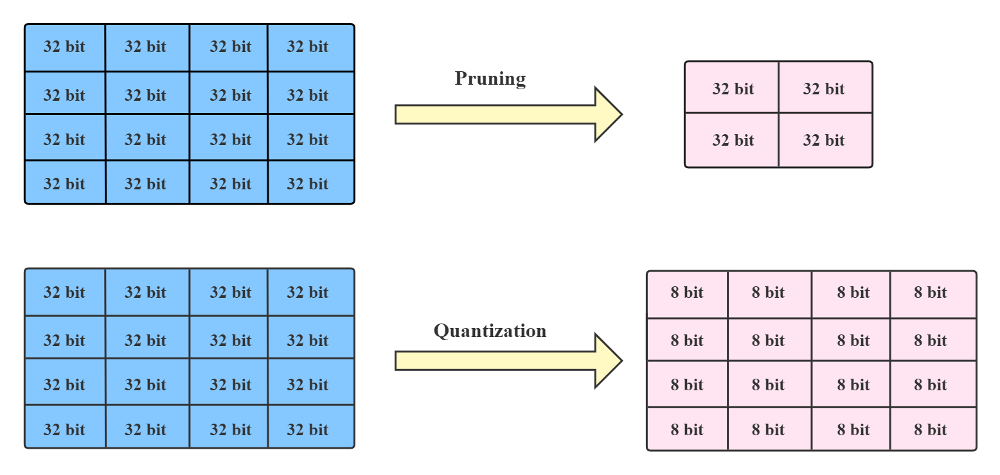
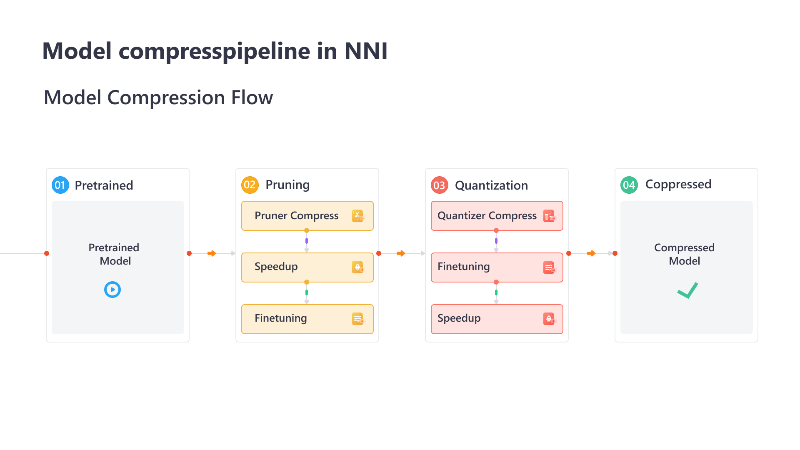
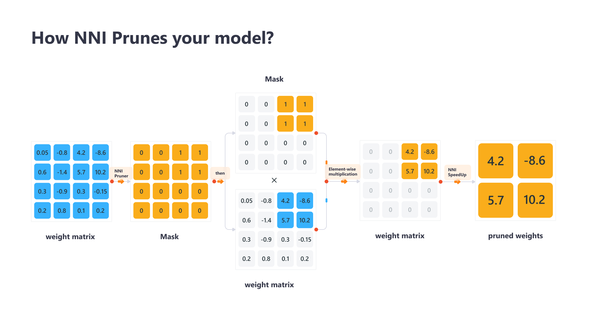

Model Compression with NNI
==========================

.. toctree::
    :hidden:
    :maxdepth: 2

    Pruning <pruning>
    Quantization <quantization>
    Config Specification <compression_config_list>
    Advanced Usage <advanced_usage>

.. Using rubric to prevent the section heading to be include into toc

.. rubric:: Overview

Deep neural networks (DNNs) have achieved great success in many tasks like computer vision, nature launguage processing, speech processing.
However, typical neural networks are both computationally expensive and energy-intensive,
which can be difficult to be deployed on devices with low computation resources or with strict latency requirements.
Therefore, a natural thought is to perform model compression to reduce model size and accelerate model training/inference without losing performance significantly.
Model compression techniques can be divided into two categories: pruning and quantization.
The pruning methods explore the redundancy in the model weights and try to remove/prune the redundant and uncritical weights.
Quantization refers to compress models by reducing the number of bits required to represent weights or activations.
We further elaborate on the two methods, pruning and quantization, in the following chapters. Besides, the figure below visualizes the difference between these two methods.

NNI provides an easy-to-use toolkit to help users design and use model pruning and quantization algorithms.
For users to compress their models, they only need to add several lines in their code.
There are some popular model compression algorithms built-in in NNI.
On the other hand, users could easily customize their new compression algorithms using NNI’s interface.

There are several core features supported by NNI model compression:

* Support many popular pruning and quantization algorithms.
* Automate model pruning and quantization process with state-of-the-art strategies and NNI's auto tuning power.
* Speedup a compressed model to make it have lower inference latency and also make it smaller.
* Provide friendly and easy-to-use compression utilities for users to dive into the compression process and results.
* Concise interface for users to customize their own compression algorithms.

.. rubric:: Compression Pipeline

The overall compression pipeline in NNI is shown above. For compressing a pretrained model, pruning and quantization can be used alone or in combination.
If users want to apply both, a sequential mode is recommended as common practise.

.. note::
  Note that NNI pruners or quantizers are not meant to physically compact the model but for simulating the compression effect. Whereas NNI speedup tool can truly compress model by changing the network architecture and therefore reduce latency.
  To obtain a truly compact model, users should conduct :doc:`pruning speedup <../tutorials/cp_pruning_speedup>` or :doc:`quantizaiton speedup <../tutorials/cp_quantization_speedup>`. 
  The interface and APIs are unified for both PyTorch and TensorFlow. Currently only PyTorch version has been supported, and TensorFlow version will be supported in future.

.. rubric:: Model Speedup

The final goal of model compression is to reduce inference latency and model size.
However, existing model compression algorithms mainly use simulation to check the performance (e.g., accuracy) of compressed model.
For example, using masks for pruning algorithms, and storing quantized values still in float32 for quantization algorithms.
Given the output masks and quantization bits produced by those algorithms, NNI can really speedup the model.

The following figure shows how NNI prunes and speeds up your models. 

The detailed tutorial of Speedup Model with Mask can be found :doc:`here <../tutorials/cp_pruning_speedup>`.
The detailed tutorial of Speedup Model with Calibration Config can be found :doc:`here <../tutorials/cp_quantization_speedup>`.

.. attention::

  NNI's model pruning framework has been upgraded to a more powerful version (named pruning v2 before nni v2.6).
  The old version (`named pruning before nni v2.6 <https://nni.readthedocs.io/en/v2.6/Compression/pruning.html>`_) will be out of maintenance. If for some reason you have to use the old pruning,
  v2.6 is the last nni version to support old pruning version.
