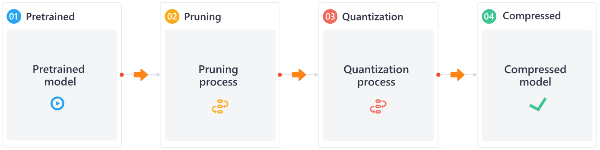
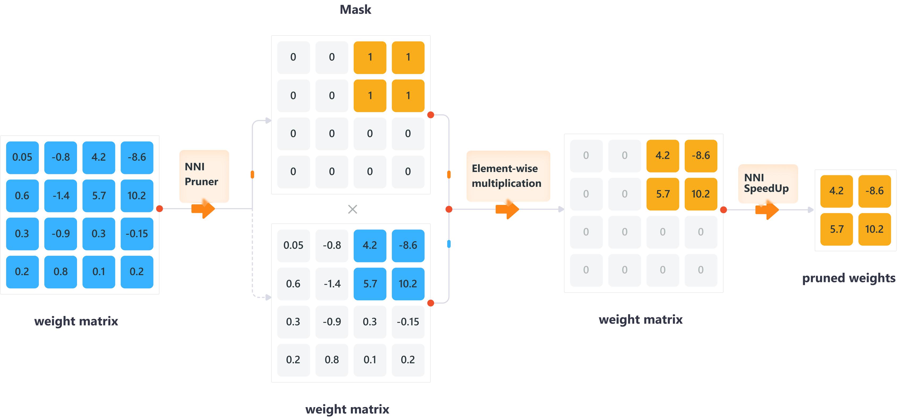

.. 8106afa0f255f5f0f75fb94dd1c0badd

模型压缩
========

..  toctree::
    :hidden:
    :maxdepth: 2

    模型剪枝 <pruning>
    模型量化 <quantization>
    用户配置 <compression_config_list>
    高级用法 <advanced_usage>

深度神经网络（DNNs）在许多领域都取得了巨大的成功。 然而，典型的神经网络是
计算和能源密集型的，很难将其部署在计算资源匮乏
或具有严格延迟要求的设备上。 因此，一个自然的想法就是对模型进行压缩
以减小模型大小并加速模型训练/推断，同时不会显着降低模型性能。 模型压缩
技术可以分为两类：剪枝和量化。 剪枝方法探索模型权重中的冗余，
并尝试删除/修剪冗余和非关键的权重。 量化是指通过减少
权重表示或激活所需的比特数来压缩模型。

.. image:: ../../img/prune_quant.jpg
   :target: ../../img/prune_quant.jpg
   :scale: 40%
   :alt:

.. Using rubric to prevent the section heading to be include into toc

.. rubric:: 概述

NNI 提供了易于使用的工具包来帮助用户设计并使用剪枝和量化算法。
其使用了统一的接口来支持 TensorFlow 和 PyTorch。
对用户来说， 只需要添加几行代码即可压缩模型。
NNI 中也内置了一些主流的模型压缩算法。
用户可以进一步利用 NNI 的自动调优功能找到最佳的压缩模型，
该功能在自动模型压缩部分有详细介绍。
另一方面，用户可以使用 NNI 的接口自定义新的压缩算法。

NNI 具备以下几个核心特性:
* 内置许多流行的剪枝和量化算法。
* 利用最先进的策略和NNI的自动调整能力，来自动化模型剪枝和量化过程。
* 加速模型，使其有更低的推理延迟。
* 提供友好和易于使用的压缩工具，让用户深入到压缩过程和结果。
* 简洁的界面，供用户自定义自己的压缩算法。

.. rubric:: 压缩流程

NNI中模型压缩的整体流程如上图所示。
为了压缩一个预先训练好的模型，可以单独或联合使用修剪和量化。
如果用户希望同时应用这两种模式，建议采用串行模式。

.. note::
  值得注意的是，NNI的pruner或quantizer只能模拟压缩的效果。
  真正能够压缩模型、改变网络结构、降低推理延迟的是NNI的加速工具。
  为了获得一个真正的压缩的模型，用户需要执行 :doc:`剪枝加速 <../tutorials/cp_pruning_speedup>` or :doc:`量化加速 <../tutorials/cp_quantization_speedup>`. 
  PyTorch和TensorFlow的接口都是统一的。目前只支持PyTorch版本，未来将支持TensorFlow版本。

.. rubric:: 支持的剪枝算法

剪枝算法通过去除冗余的权值或网络层对原始模型进行压缩，
可以降低模型的复杂度，减轻过拟合问题。

.. list-table::
   :header-rows: 1
   :widths: auto

   * - 名称
     - 算法简介
   * - :ref:`level-pruner`
     - 根据权重元素的绝对值，对每个权重元素进行剪枝  
   * - :ref:`l1-norm-pruner`
     - 根据权重的最小L1范数进行剪枝 (Pruning Filters for Efficient Convnets) `Reference Paper <https://arxiv.org/abs/1608.08710>`__
   * - :ref:`l2-norm-pruner`
     - 根据权重的最小L2范数进行剪枝
   * - :ref:`fpgm-pruner`
     - 利用几何中值进行滤波器剪剪，实现深度卷积神经网络加速 `Reference Paper <https://arxiv.org/abs/1811.00250>`__
   * - :ref:`slim-pruner`
     - 通过修剪BN层中的缩放因子来剪枝 (Learning Efficient Convolutional Networks through Network Slimming) `Reference Paper <https://arxiv.org/abs/1708.06519>`__
   * - :ref:`activation-apoz-rank-pruner`
     - 基于 APoZ (零的平均百分比) 指标进行剪枝 `Reference Paper <https://arxiv.org/abs/1607.03250>`__
   * - :ref:`activation-mean-rank-pruner`
     - 计算激活函数输出的最小平均值进行剪枝
   * - :ref:`taylor-fo-weight-pruner`
     - 基于权重的一阶泰勒展开剪枝 (Importance Estimation for Neural Network Pruning) `Reference Paper <http://jankautz.com/publications/Importance4NNPruning_CVPR19.pdf>`__
   * - :ref:`admm-pruner`
     - 基于 ADMM 优化技巧剪枝 `Reference Paper <https://arxiv.org/abs/1804.03294>`__
   * - :ref:`linear-pruner`
     - 剪枝过程中稀疏比例线性增长。 每一轮都使用基础的剪枝算法。
   * - :ref:`agp-pruner`
     - 自动化渐进剪枝 (To prune, or not to prune: exploring the efficacy of pruning for model compression) `Reference Paper <https://arxiv.org/abs/1710.01878>`__
   * - :ref:`lottery-ticket-pruner`
     - The Lottery Ticket Hypothesis: Finding Sparse, Trainable Neural Networks `Reference Paper <https://arxiv.org/abs/1803.03635>`__
   * - :ref:`simulated-annealing-pruner`
     - 使用带指导的启发式搜索算法自动剪枝 `Reference Paper <https://arxiv.org/abs/1907.03141>`__
   * - :ref:`auto-compress-pruner`
     - 通过不断地调用 SimulatedAnnealing Pruner 和 ADMM Pruner 来自动剪枝。 `Reference Paper <https://arxiv.org/abs/1907.03141>`__
   * - :ref:`amc-pruner`
     - AMC: AutoML for Model Compression and Acceleration on Mobile Devices `Reference Paper <https://arxiv.org/abs/1802.03494>`__
   * - :ref:`movement-pruner`
     - Movement Pruning: Adaptive Sparsity by Fine-Tuning `Reference Paper <https://arxiv.org/abs/2005.07683>`__

.. rubric:: 支持的量化算法

量化算法通过减少表示权重或激活所需的比特数来压缩原始网络，
从而减少计算量和推理时间。

.. list-table::
   :header-rows: 1
   :widths: auto

   * - 名称
     - 算法简介
   * - :ref:`naive-quantizer`
     - 把权重默认量化到8 bits
   * - :ref:`qat-quantizer`
     - Quantization and Training of Neural Networks for Efficient Integer-Arithmetic-Only Inference. `Reference Paper <http://openaccess.thecvf.com/content_cvpr_2018/papers/Jacob_Quantization_and_Training_CVPR_2018_paper.pdf>`__
   * - :ref:`dorefa-quantizer`
     - DoReFa-Net: Training Low Bitwidth Convolutional Neural Networks with Low Bitwidth Gradients. `Reference Paper <https://arxiv.org/abs/1606.06160>`__
   * - :ref:`bnn-quantizer`
     - Binarized Neural Networks: Training Deep Neural Networks with Weights and Activations Constrained to +1 or -1. `Reference Paper <https://arxiv.org/abs/1602.02830>`__
   * - :ref:`lsq-quantizer`
     - Learned Step Size Quantization. `Reference Paper <https://arxiv.org/pdf/1902.08153.pdf>`__
   * - :ref:`observer-quantizer`
     - 采用后训练量化模式，在校准过程中与观察者一起收集量化信息。

.. rubric:: 模型加速

模型压缩的最终目标是减少推理延迟和模型大小。
然而，现有的模型压缩算法主要是通过仿真来检测压缩模型的性能。
例如，修剪算法使用掩码，量化算法仍将值存储在float32中。
如果能给定这些算法产生的输出掩码和量化位，NNI的加速工具就可以真正地压缩模型。

下图显示了NNI如何修剪和加速您的模型。

关于用剪枝进行模型加速的详细文档可以参考 :doc:`here <../tutorials/cp_pruning_speedup>`.
关于用量化进行模型加速的详细文档可以参考 :doc:`here <../tutorials/cp_quantization_speedup>`.

.. attention::

  NNI的模型剪枝框架已经升级到更高级的版本 (在 nni 2.6 版本前称为pruning v2)。
  旧版本 (`named pruning before nni v2.6 <https://nni.readthedocs.io/en/v2.6/Compression/pruning.html>`_) 不再进行维护. 
  如果出于某些原因您不得不使用，v2.6 是最后的支持旧版剪枝算法的版本。
