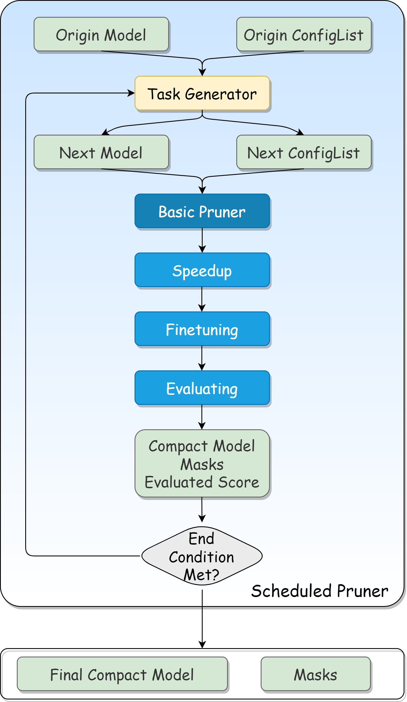

Model Pruning with NNI
======================

Pruning V2 is a refactoring of the old version and provides more powerful functions.
Compared with the old version, the iterative pruning process is detached from the pruner and the pruner is only responsible for pruning and generating the masks once.
What's more, pruning V2 unifies the pruning process and provides a more free combination of pruning components.
Task generator only cares about the pruning effect that should be achieved in each round, and uses a config list to express how to pruning in the next step.
Pruner will reset with the model and config list given by task generator then generate the masks in current step.

For a clearer structure vision, please refer to the figure below.

A pruning process is usually driven by a pruning scheduler, it contains a specific pruner and a task generator.

.. Note::

    But users can also use pruner directly like in the pruning V1.

..  toctree::
    :maxdepth: 2

    Quickstart <../tutorials/pruning_quick_start_mnist>
    Concepts <pruning_concepts>
    Speed Up <../tutorials/pruning_speed_up>
    Pruner V2 Reference <../reference/pruner>
    Pruner Reference (legacy) <../reference/legacy_pruner>
