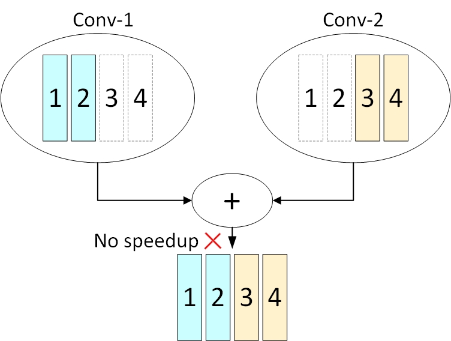

Overview of NNI Model Pruning
=============================

Pruning is a common technique to compress neural network models.
The pruning methods explore the redundancy in the model weights(parameters) and try to remove/prune the redundant and uncritical weights.
The redundant elements are pruned from the model, their values are zeroed and we make sure they don't take part in the back-propagation process.

The following concepts can help you understand pruning in NNI.

Pruning Target
--------------

Pruning target means where we apply the sparsity.
Most pruning methods prune the weights to reduce the model size and accelerate the inference latency.
Other pruning methods also apply sparsity on activations (e.g., inputs, outputs, or feature maps) to accelerate the inference latency.
NNI supports pruning module weights right now, and will support other pruning targets in the future.

.. _basic-pruner:

Basic Pruner
------------

Basic pruner generates the masks for each pruning target (weights) for a determined sparsity ratio.
It usually takes model and config as input arguments, then generates masks for each pruning target.

.. _scheduled-pruner:

Scheduled Pruner
----------------

Scheduled pruner decides how to allocate sparsity ratio to each pruning target,
it also handles the model speedup (after each pruning iteration) and finetuning logic.
From the implementation logic, the scheduled pruner is a combination of pruning scheduler, basic pruner and task generator.

Task generator only cares about the pruning effect that should be achieved in each round, and uses a config list to express how to pruning.
Basic pruner will reset with the model and config list given by task generator then generate the masks.

For a clearer structure vision, please refer to the figure below.

.. image:: ../../img/pruning_process.png
   :target: ../../img/pruning_process.png
   :scale: 30%
   :align: center
   :alt:

More information about scheduled pruning process please refer to :doc:`Pruning Scheduler <pruning_scheduler>`.

Granularity
-----------

Fine-grained pruning or unstructured pruning refers to pruning each individual weights separately.
Coarse-grained pruning or structured pruning is pruning a regular group of weights, such as a convolutional filter.

Only :ref:`level-pruner` and :ref:`admm-pruner` support fine-grained pruning, all other pruners do some kind of structured pruning on weights.

.. _dependency-aware-mode-for-output-channel-pruning:

Dependency-aware Mode for Output Channel Pruning
------------------------------------------------

Currently, we support dependency-aware mode in several ``pruner``: :ref:`l1-norm-pruner`, :ref:`l2-norm-pruner`, :ref:`fpgm-pruner`,
:ref:`activation-apoz-rank-pruner`, :ref:`activation-mean-rank-pruner`, :ref:`taylor-fo-weight-pruner`.

In these pruning algorithms, the pruner will prune each layer separately. While pruning a layer,
the algorithm will quantify the importance of each filter based on some specific metrics(such as l1 norm), and prune the less important output channels.

We use pruning convolutional layers as an example to explain dependency-aware mode.
As :ref:`topology analysis utils <topology-analysis>` shows, if the output channels of two convolutional layers(conv1, conv2) are added together,
then these two convolutional layers have channel dependency with each other (more details please see :ref:`ChannelDependency <topology-analysis>`).
Take the following figure as an example.

If we prune the first 50% of output channels (filters) for conv1, and prune the last 50% of output channels for conv2.
Although both layers have pruned 50% of the filters, the speedup module still needs to add zeros to align the output channels.
In this case, we cannot harvest the speed benefit from the model pruning.

To better gain the speed benefit of the model pruning, we add a dependency-aware mode for the ``Pruner`` that can prune the output channels.
In the dependency-aware mode, the pruner prunes the model not only based on the metric of each output channels, but also the topology of the whole network architecture.

In the dependency-aware mode (``dependency_aware`` is set ``True``), the pruner will try to prune the same output channels for the layers that have the channel dependencies with each other, as shown in the following figure.

.. image:: ../../img/dependency-aware.jpg
   :target: ../../img/dependency-aware.jpg
   :scale: 80%
   :align: center
   :alt: 

Take the dependency-aware mode of :ref:`l1-norm-pruner` as an example.
Specifically, the pruner will calculate the L1 norm (for example) sum of all the layers in the dependency set for each channel.
Obviously, the number of channels that can actually be pruned of this dependency set in the end is determined by the minimum sparsity of layers in this dependency set (denoted by ``min_sparsity``).
According to the L1 norm sum of each channel, the pruner will prune the same ``min_sparsity`` channels for all the layers.
Next, the pruner will additionally prune ``sparsity`` - ``min_sparsity`` channels for each convolutional layer based on its own L1 norm of each channel.
For example, suppose the output channels of ``conv1``, ``conv2`` are added together and the configured sparsities of ``conv1`` and ``conv2`` are 0.3, 0.2 respectively.
In this case, the ``dependency-aware pruner`` will 

* First, prune the same 20% of channels for `conv1` and `conv2` according to L1 norm sum of `conv1` and `conv2`.
* Second, the pruner will additionally prune 10% channels for `conv1` according to the L1 norm of each channel of `conv1`.

In addition, for the convolutional layers that have more than one filter group,
``dependency-aware pruner`` will also try to prune the same number of the channels for each filter group.
Overall, this pruner will prune the model according to the L1 norm of each filter and try to meet the topological constrains (channel dependency, etc) to improve the final speed gain after the speedup process. 

.. Note:: Operations that will be recognized as having channel dependencies: add/sub/mul/div, addcmul/addcdiv, logical_and/or/xor

In the dependency-aware mode, the pruner will provide a better speed gain from the model pruning.
