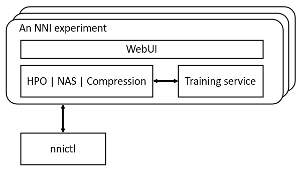

Overview of NNI Experiment
==========================

An NNI experiment is a unit of one tuning process. For example, it is one run of hyper-parameter tuning on a specific search space, it is one run of neural architecture search on a search space, or it is one run of automatic model compression on user specified goal on latency and accuracy. Usually, the tuning process requires many trials to explore feasible and potentially good-performing models. Thus, an important component of NNI experiment is **training service**, which is a unified interface to abstract diverse computation resources (e.g., local machine, remote servers, AKS). Users can easily run the tuning process on their prefered computation resource and platform. On the other hand, NNI experiment provides **WebUI** to visualize the tuning process to users.

During developing a DNN model, users need to manage the tuning process, such as, creating an experiment, adjusting an experiment, kill or rerun a trial in an experiment, dumping experiment data for customized analysis. Also, users may create a new experiment for comparison, or concurrently for new model developing tasks. Thus, NNI provides the functionality of **experiment management**. Users can use :doc:`../reference/nnictl` to interact with experiments.

The relation of the components in NNI experiment is illustrated in the following figure. Hyper-parameter optimization (HPO), neural architecture search (NAS), and model compression are three key features in NNI that help users develop and tune their models. Training serivce provides the ability of parallel running trials on available computation resources. WebUI visualizes the tuning process. *nnictl* is for managing the experiments.

Before reading the following content, you are recommended to go through either :doc:`the quickstart of HPO </tutorials/hpo_quickstart_pytorch/main>` or :doc:`quickstart of NAS </tutorials/hello_nas>` first.

* :doc:`Overview of NNI training service <training_service/overview>`
* :doc:`Introduction to Web Portal <web_portal/web_portal>`
* :doc:`Manange Multiple Experiments <experiment_management>`
