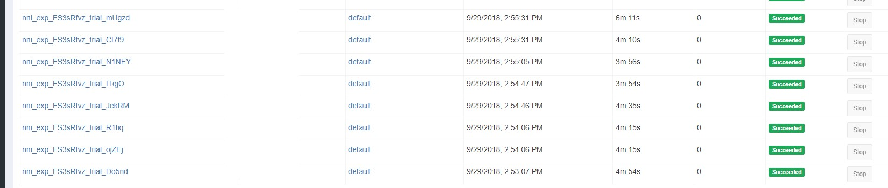
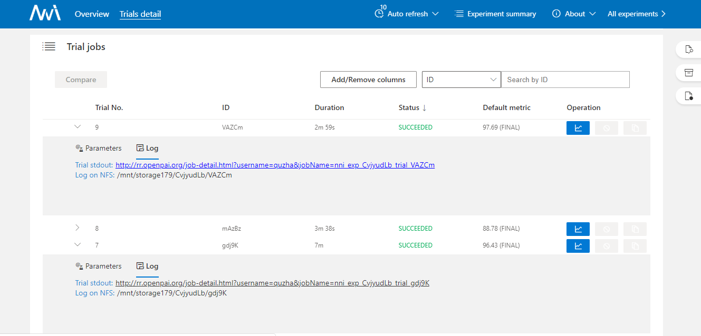
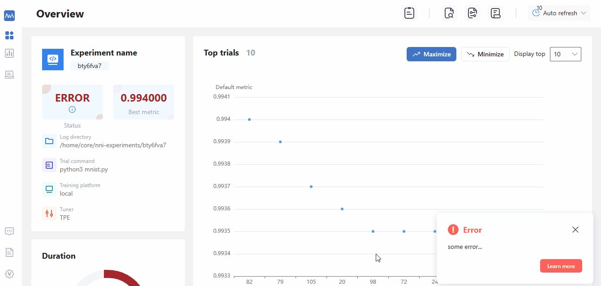

OpenPAI Training Service
========================

NNI supports running an experiment on `OpenPAI <https://github.com/Microsoft/pai>`__. OpenPAI manages computing resources and is optimized for deep learning. Through docker technology, the computing hardware are decoupled with software, so that it's easy to run distributed jobs, switch with different deep learning frameworks, or run other kinds of jobs on consistent environments.

Prerequisite
------------

1. Before starting to use OpenPAI training service, you should have an account to access an `OpenPAI <https://github.com/Microsoft/pai>`__ cluster. See `here <https://github.com/Microsoft/pai>`__ if you don't have any OpenPAI account and want to deploy an OpenPAI cluster. Please note that, on OpenPAI, your trial program will run in Docker containers.

2. Get token. Open web portal of OpenPAI, and click ``My profile`` button in the top-right side.

   .. image:: ../../../img/pai_profile.jpg
      :scale: 80%

   Click ``copy`` button in the page to copy a jwt token.

   .. image:: ../../../img/pai_token.jpg
      :scale: 67%

3. Mount NFS storage to local machine. If you don't know where to find the NFS storage, please click ``Submit job`` button in web portal.

   .. image:: ../../../img/pai_job_submission_page.jpg
      :scale: 50%

   Find the data management region in job submission page.

   .. image:: ../../../img/pai_data_management_page.jpg
      :scale: 33%  

   The ``Preview container paths`` is the NFS host and path that OpenPAI provided, you need to mount the corresponding host and path to your local machine first, then NNI could use the OpenPAI's NFS storage to upload data/code to or download from OpenPAI cluster. To mount the storage, please use ``mount`` command, for example:

   .. code-block:: bash

      sudo mount -t nfs4 gcr-openpai-infra02:/pai/data /local/mnt

   Then the ``/data`` folder in container will be mounted to ``/local/mnt`` folder in your local machine. Please keep in mind that ``localStorageMountPoint`` should be set to ``/local/mnt`` in this case.

4. Get OpenPAI's storage config name and ``containerStorageMountPoint``. They can also be found in data management region in job submission page. Please find the ``Name`` and ``Path`` of your ``Team share storage``. They should be put into ``storageConfigName`` and ``containerStorageMountPoint``. For example,

   .. code-block:: yaml

      storageConfigName: confignfs-data
      containerStorageMountPoint: /mnt/confignfs-data

Usage
-----

We show an example configuration here with YAML (Python configuration should be similar).

.. code-block:: yaml

   trialGpuNumber: 0
   trialConcurrency: 1
   ...
   trainingService:
     platform: openpai
     host: http://123.123.123.123
     username: ${your user name}
     token: ${your token}
     dockerImage: msranni/nni
     trialCpuNumber: 1
     trialMemorySize: 8GB
     storageConfigName: confignfs-data
     localStorageMountPoint: /local/mnt
     containerStorageMountPoint: /mnt/confignfs-data

Once completing the configuration and run nnictl / use Python to launch the experiment. NNI will start to spawn trials to your specified OpenPAI platform.

The job name format is something like ``nni_exp_{experiment_id}_trial_{trial_id}``. You can see jobs created by NNI on the OpenPAI cluster's web portal, like:

.. note:: For OpenPAI training service, NNI will start an additional rest server and listen on a port which is your NNI WebUI's port plus 1. For example, if your WebUI port is ``8080``, the rest server will listen on ``8081``, to receive metrics from trial job running in Kubernetes. So you should ``enable 8081`` TCP port in your firewall rule to allow incoming traffic.

Once a trial job is completed, you can go to NNI WebUI's overview page (like ``http://localhost:8080/oview``) to check trial's information. For example, you can expand a trial information in trial list view, click the logPath link like:

Configuration References
------------------------

Compared with :doc:`local` and :doc:`remote`, OpenPAI training service supports the following additional configurations.

.. list-table::
   :header-rows: 1
   :widths: auto

   * - Field name
     - Description
   * - username
     - Required field. User name of OpenPAI platform.
   * - token
     - Required field. Authentication key of OpenPAI platform.
   * - host
     - Required field. The host of OpenPAI platform. It's PAI's job submission page URI, like ``10.10.5.1``. The default protocol in NNI is HTTPS. If your PAI's cluster has disabled https, please use the URI in ``http://10.10.5.1`` format.
   * - trialCpuNumber
     - Optional field. Should be positive number based on your trial program's CPU requirement. If it's not set in trial configuration, it should be set in the config specified in ``openpaiConfig`` or ``openpaiConfigFile`` field.
   * - trialMemorySize
     - Optional field. Should be in format like ``2gb`` based on your trial program's memory requirement. If it's not set in trial configuration, it should be set in the config specified in ``openpaiConfig`` or ``openpaiConfigFile`` field.
   * - dockerImage
     - Optional field. In OpenPAI training service, your trial program will be scheduled by OpenPAI to run in `Docker container <https://www.docker.com/>`__. This key is used to specify the Docker image used to create the container in which your trial will run. Upon every NNI release, we build `a docker image <https://hub.docker.com/r/msranni/nni>`__ with `this Dockerfile <https://hub.docker.com/r/msranni/nni>`__. You can either use this image directly in your config file, or build your own image. If it's not set in trial configuration, it should be set in the config specified in ``openpaiConfig`` or ``openpaiConfigFile`` field.
   * - virtualCluster
     - Optional field. Set the virtualCluster of OpenPAI. If omitted, the job will run on ``default`` virtual cluster.
   * - localStorageMountPoint
     - Required field. Set the mount path in the machine you start the experiment.
   * - containerStorageMountPoint
     - Optional field. Set the mount path in your container used in OpenPAI.
   * - storageConfigName
     - Optional field. Set the storage name used in OpenPAI. If it's not set in trial configuration, it should be set in the config specified in ``openpaiConfig`` or ``openpaiConfigFile`` field.
   * - openpaiConfigFile
     - Optional field. Set the file path of OpenPAI job configuration, the file is in yaml format. If users set ``openpaiConfigFile`` in NNI's configuration file, there's no need to specify the fields ``storageConfigName``, ``virtualCluster``, ``dockerImage``, ``trialCpuNumber``, ``trialGpuNumber``, ``trialMemorySize`` in configuration. These fields will use the values from the config file specified by  ``openpaiConfigFile``.
   * - openpaiConfig
     - Optional field. Similar to ``openpaiConfigFile``, but instead of referencing an external file, using this field you embed the content into NNI's config YAML.

.. note::

   #. The job name in OpenPAI's configuration file will be replaced by a new job name, the new job name is created by NNI, the name format is ``nni_exp_{this.experimentId}_trial_{trialJobId}`` .
   #. If users set multiple taskRoles in OpenPAI's configuration file, NNI will wrap all of these taskRoles and start multiple tasks in one trial job, users should ensure that only one taskRole report metric to NNI, otherwise there might be some conflict error.

Data management
---------------

Before using NNI to start your experiment, users should set the corresponding mount data path in your nniManager machine. OpenPAI has their own storage (NFS, AzureBlob ...), and the storage will used in OpenPAI will be mounted to the container when it start a job. Users should set the OpenPAI storage type by ``paiStorageConfigName`` field to choose a storage in OpenPAI. Then users should mount the storage to their nniManager machine, and set the ``nniManagerNFSMountPath`` field in configuration file, NNI will generate bash files and copy data in ``codeDir`` to the ``nniManagerNFSMountPath`` folder, then NNI will start a trial job. The data in ``nniManagerNFSMountPath`` will be sync to OpenPAI storage, and will be mounted to OpenPAI's container. The data path in container is set in ``containerNFSMountPath``, NNI will enter this folder first, and then run scripts to start a trial job. 

Version check
-------------

NNI support version check feature in since version 0.6. It is a policy to insure the version of NNIManager is consistent with trialKeeper, and avoid errors caused by version incompatibility.
Check policy:

#. NNIManager before v0.6 could run any version of trialKeeper, trialKeeper support backward compatibility.
#. Since version 0.6, NNIManager version should keep same with triakKeeper version. For example, if NNIManager version is 0.6, trialKeeper version should be 0.6 too.
#. Note that the version check feature only check first two digits of version.For example, NNIManager v0.6.1 could use trialKeeper v0.6 or trialKeeper v0.6.2, but could not use trialKeeper v0.5.1 or trialKeeper v0.7.

If you could not run your experiment and want to know if it is caused by version check, you could check your webUI, and there will be an error message about version check.

   

With local training service, the whole experiment (e.g., tuning algorithms, trials) runs on a single machine, i.e., user's dev machine. The generated trials run on this machine following ``trialConcurrency`` set in the configuration yaml file. If GPUs are used by trial, local training service will allocate required number of GPUs for each trial, like a resource scheduler.
