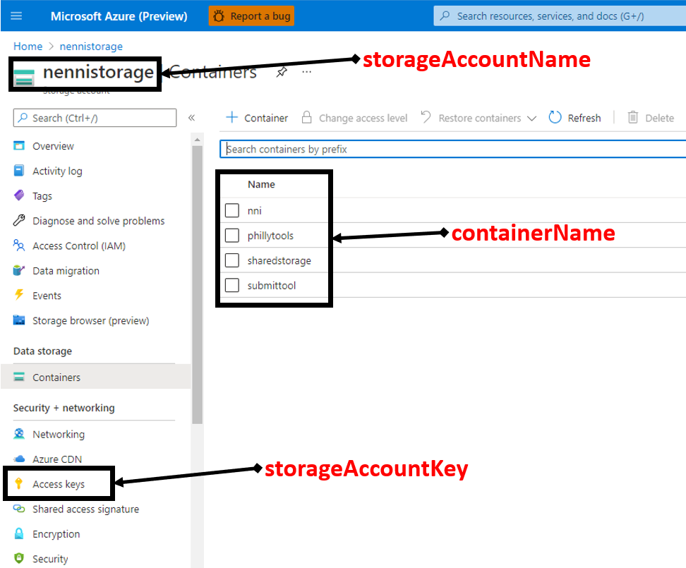

How to Use Shared Storage
=========================

If you want to use your own storage during using NNI, shared storage can satisfy you.
Instead of using training service native storage, shared storage can bring you more convenience.
All the information generated by the experiment will be stored under ``/nni`` folder in your shared storage.
All the output produced by the trial will be located under ``/nni/{EXPERIMENT_ID}/trials/{TRIAL_ID}/nnioutput`` folder in your shared storage.
This saves you from finding for experiment-related information in various places.
Remember that your trial working directory is ``/nni/{EXPERIMENT_ID}/trials/{TRIAL_ID}``, so if you upload your data in this shared storage, you can open it like a local file in your trial code without downloading it.
And we will develop more practical features in the future based on shared storage. The config reference can be found `here <../reference/experiment_config.html#sharedstorageconfig>`_.

.. note::
    Shared storage is currently in the experimental stage. We suggest use AzureBlob under Ubuntu/CentOS/RHEL, and NFS under Ubuntu/CentOS/RHEL/Fedora/Debian for remote.
    And make sure your local machine can mount NFS or fuse AzureBlob and the machine used in training service has ``sudo`` permission without password. We only support shared storage under training service with reuse mode for now.

.. note::
    What is the difference between training service native storage and shared storage? Training service native storage is usually provided by the specific training service.
    E.g., the local storage on remote machine in remote mode, the provided storage in openpai mode. These storages might not easy to use, e.g., users have to upload datasets to all remote machines to train the model.
    In these cases, shared storage can automatically mount to the machine in the training platform. Users can directly save and load data from the shared storage. All the data/log used/generated in one experiment can be placed under the same place.
    After the experiment is finished, shared storage will automatically unmount from the training platform.

Example
-------
If you want to use AzureBlob, add below to your config. Full config file see :githublink:`mnist-sharedstorage/config_azureblob.yml <examples/trials/mnist-sharedstorage/config_azureblob.yml>`.

.. code-block:: yaml

    sharedStorage:
        storageType: AzureBlob
        # please set localMountPoint as absolute path and localMountPoint should outside the code directory
        # because nni will copy user code to localMountPoint
        localMountPoint: ${your/local/mount/point}
        # remoteMountPoint is the mount point on training service machine, it can be set as both absolute path and relative path
        # make sure you have `sudo` permission without password on training service machine
        remoteMountPoint: ${your/remote/mount/point}
        storageAccountName: ${replace_to_your_storageAccountName}
        storageAccountKey: ${replace_to_your_storageAccountKey}
        containerName: ${replace_to_your_containerName}
        # usermount means you have already mount this storage on localMountPoint
        # nnimount means nni will try to mount this storage on localMountPoint
        # nomount means storage will not mount in local machine, will support partial storages in the future 
        localMounted: nnimount

You can find ``storageAccountName``, ``storageAccountKey``, ``containerName`` on azure storage account portal.

If you want to use NFS, add below to your config. Full config file see :githublink:`mnist-sharedstorage/config_nfs.yml <examples/trials/mnist-sharedstorage/config_nfs.yml>`.

.. code-block:: yaml

    sharedStorage:
        storageType: NFS
        localMountPoint: ${your/local/mount/point}
        remoteMountPoint: ${your/remote/mount/point}
        nfsServer: ${nfs-server-ip}
        exportedDirectory: ${nfs/exported/directory}
        # usermount means you have already mount this storage on localMountPoint
        # nnimount means nni will try to mount this storage on localMountPoint
        # nomount means storage will not mount in local machine, will support partial storages in the future 
        localMounted: nnimount
