Web Portal
==========

Web portal is for users to conveniently visualize their NNI experiments, tuning and training progress, detailed metrics, and error logs. Web portal also allows users to control their NNI experiments, trials, such as updating an experiment of its concurrency, duration, rerunning trials.

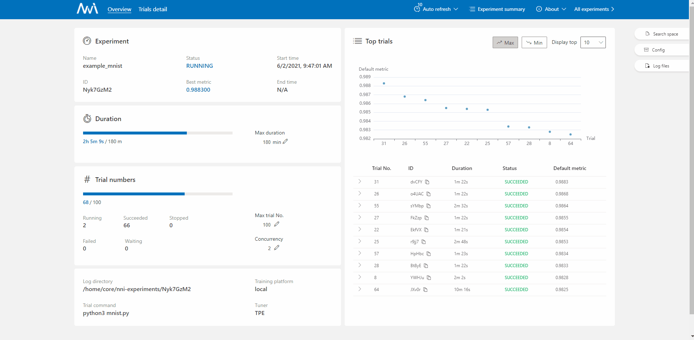

Q&A
---

There are many trials in the detail table but ``Default Metric`` chart is empty
^^^^^^^^^^^^^^^^^^^^^^^^^^^^^^^^^^^^^^^^^^^^^^^^^^^^^^^^^^^^^^^^^^^^^^^^^^^^^^^

.. note::
   First you should know that ``Default metric`` and ``Hyper parameter`` chart only show succeeded trials.

What should you do when you think the chart is strange, such as ``Default metric``, ``Hyper parameter``...
^^^^^^^^^^^^^^^^^^^^^^^^^^^^^^^^^^^^^^^^^^^^^^^^^^^^^^^^^^^^^^^^^^^^^^^^^^^^^^^^^^^^^^^^^^^^^^^^^^^^^^^^^^

* Download the experiment results(``experiment config``, ``trial message`` and ``intermeidate metrics``) from ``Experiment summary`` and then upload these results in your issue.

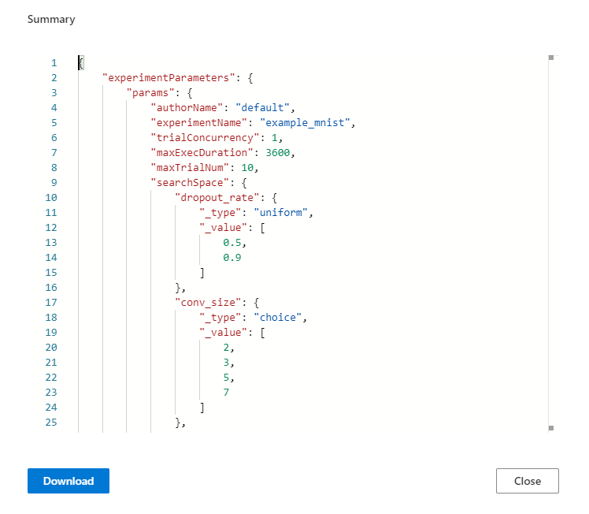

What should you do when your experiment has error
^^^^^^^^^^^^^^^^^^^^^^^^^^^^^^^^^^^^^^^^^^^^^^^^^

* Click the icon in the right of ``experiment status`` and screenshot the error message. 
* And then click the ``learn more`` to download ``nni-manager`` and ``dispatcher`` logfile.
* Please file an issue from the `Feedback` in the `About` and upload above message.

.. image:: ../../../img/webui_img/experiment_error.gif

What should you do when your trial fails
^^^^^^^^^^^^^^^^^^^^^^^^^^^^^^^^^^^^^^^^

* ``Customized trial`` could be used in here. Just submit the same parameters to the experiment to rerun the trial.

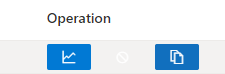

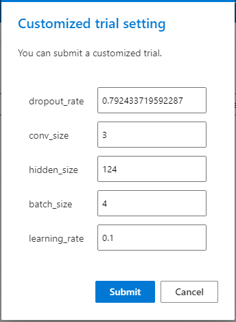

* ``Log model`` will help you find the error reason. There are three buttons ``View trial log``, ``View trial error`` and ``View trial stdout`` on local mode. If you run on the OpenPAI or Kubeflow platform, you could see trial stdout and nfs log.
  If you have any question you could tell us in the issue.

   **local mode:**

   .. image:: ../../../img/webui_img/detail/log_local.png
      :width: 100%

   **OpenPAI, Kubeflow and other mode:**

   .. image:: ../../../img/webui_img/detail_pai.png
      :width: 100%

How to use dict intermediate result
^^^^^^^^^^^^^^^^^^^^^^^^^^^^^^^^^^^

`The discussion <https://github.com/microsoft/nni/discussions/4289>`_ could help you.

.. _exp-manage-webportal:

Experiments management
----------------------

Experiments management page could manage many experiments on your machine. 

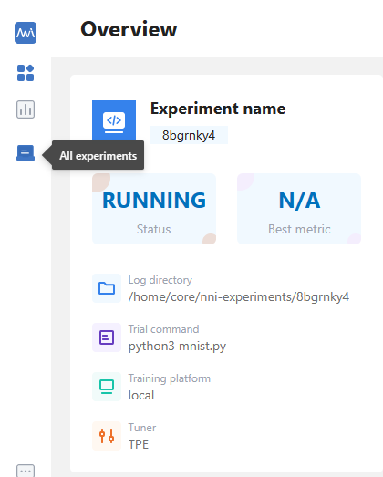

* On the ``All experiments`` page, you can see all the experiments on your machine. 

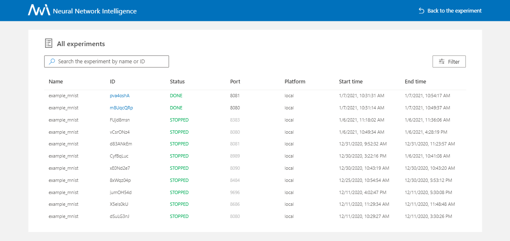

* When you want to see more details about an experiment you could click the trial id, look that:

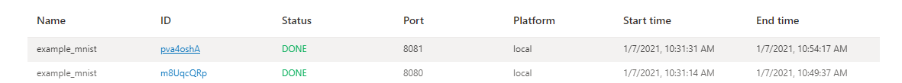

* If has many experiments on the table, you can use the ``filter`` button.

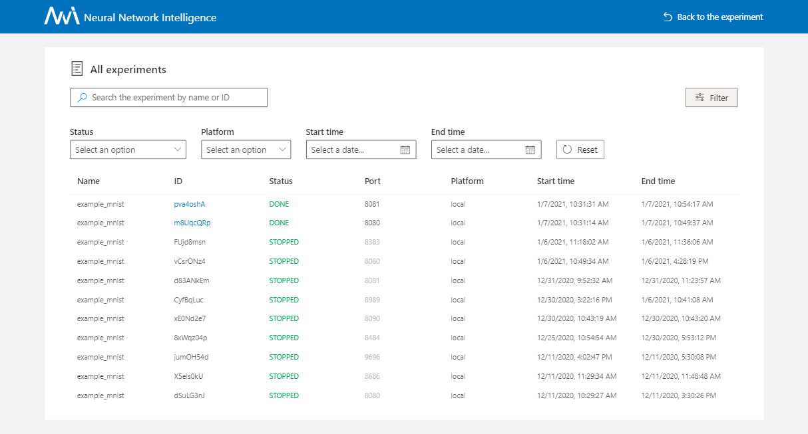

Experiment details
------------------

View overview page
^^^^^^^^^^^^^^^^^^

* On the overview tab, you can see the experiment information and status and the performance of ``top trials``.

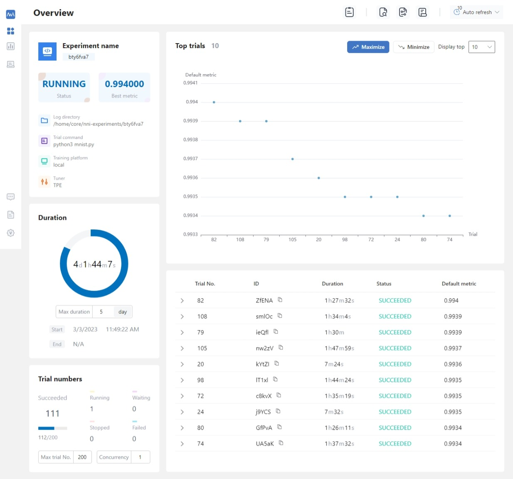

* If you want to see experiment search space and config, please click the right button ``Search space`` and ``Config`` (when you hover on this button).

   **Search space file:**

   .. image:: ../../../img/webui_img/search_space.png
      :width: 80%

   **Config file:**

   .. image:: ../../../img/webui_img/config.png
      :width: 80%

* You can view and download ``nni-manager/dispatcher log files`` on here.

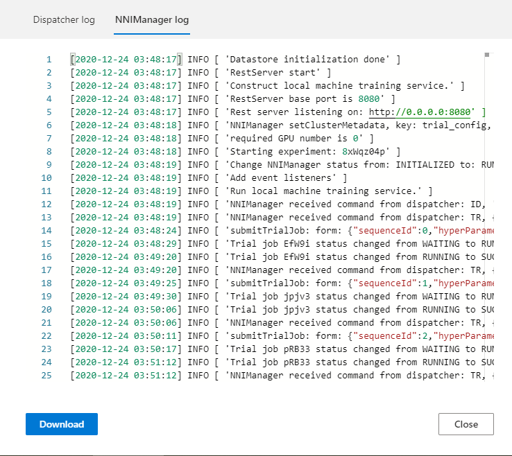

* If your experiment has many trials, you can change the refresh interval here.

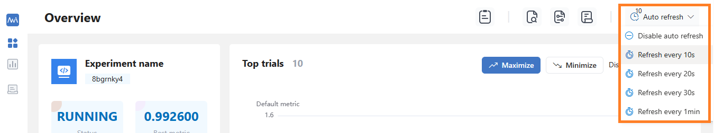

* You can change some experiment configurations such as ``maxExecDuration``, ``maxTrialNum`` and ``trial concurrency`` on here.

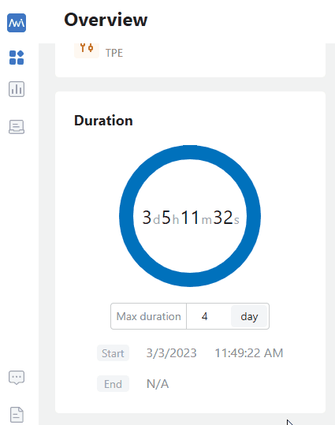

View job default metric
^^^^^^^^^^^^^^^^^^^^^^^

* Click the tab ``Default metric`` to see the point chart of all trials. Hover to see its specific default metric and search space message.

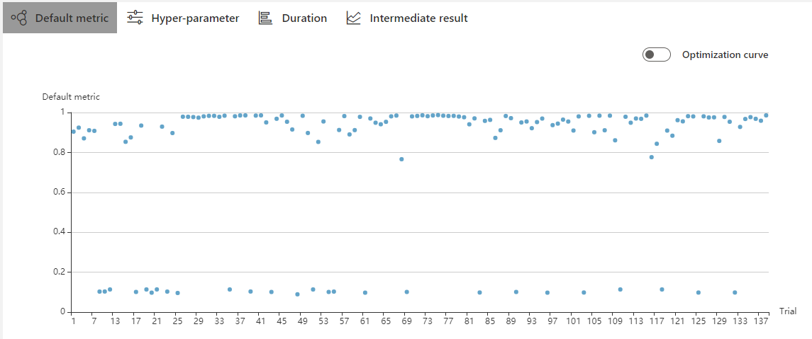

* Turn on the switch named ``Optimization curve`` to see the experiment's optimization curve.

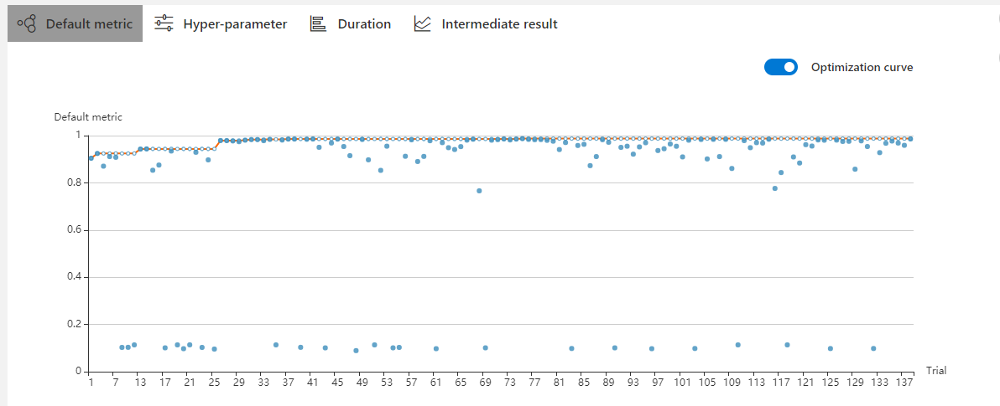

View hyper parameter
^^^^^^^^^^^^^^^^^^^^

Click the tab ``Hyper-parameter`` to see the parallel chart.

* You can click the ``add/remove`` button to add or remove axes.
* Drag the axes to swap axes on the chart.
* You can select the percentage to see top trials.

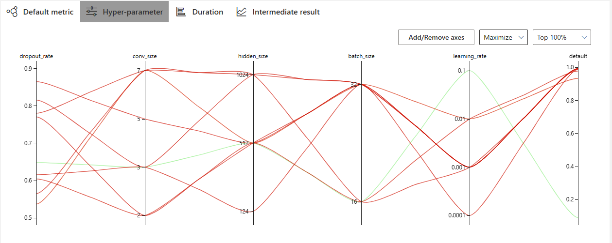

View Trial Duration
^^^^^^^^^^^^^^^^^^^

Click the tab ``Trial Duration`` to see the bar chart.

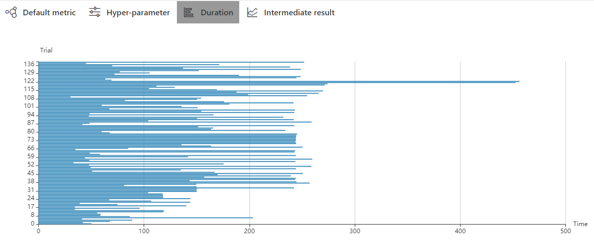

View Trial Intermediate Result chart
^^^^^^^^^^^^^^^^^^^^^^^^^^^^^^^^^^^^

Click the tab ``Intermediate Result`` to see the line chart.

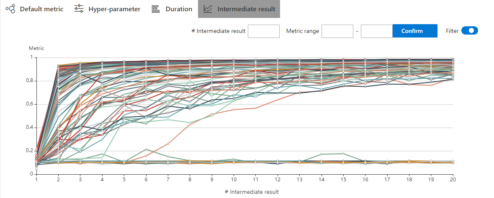

The trial may have many intermediate results in the training process. In order to see the trend of some trials more clearly, we set a filtering function for the intermediate result chart.

You may find that these trials will get better or worse at an intermediate result. This indicates that it is an important and relevant intermediate result. To take a closer look at the point here, you need to enter its corresponding X-value at #Intermediate. Then input the range of metrics on this intermedia result. In the picture below, we choose the No. 4 intermediate result and set the range of metrics to 0.8-1.

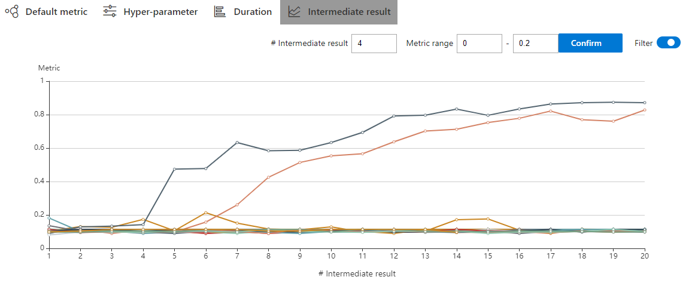

View trials status
^^^^^^^^^^^^^^^^^^

Click the tab ``Trials Detail`` to see the status of all trials. Specifically:

* Trial detail: trial's id, trial's duration, start time, end time, status, accuracy, and search space file.

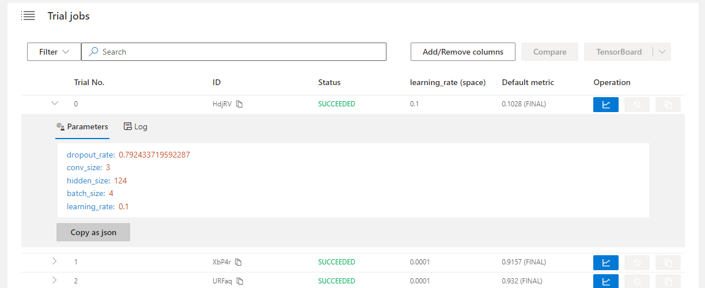

* Support searching for a specific trial by its id, status, Trial No. and trial parameters.

   **Trial id:**
   

   .. image:: ../../../img/webui_img/detail/search_id.png
      :width: 80%

   **Trial No.:**

   .. image:: ../../../img/webui_img/detail/search_No.png
      :width: 80%

   **Trial status:**

   .. image:: ../../../img/webui_img/detail/search_status.png
      :width: 80%

   **Trial parameters:**

      ``parameters whose type is choice:``
      

      .. image:: ../../../img/webui_img/detail/search_parameter_choice.png
         :width: 80%

      ``parameters whose type is not choice:``
      

      .. image:: ../../../img/webui_img/detail/search_parameter_range.png
         :width: 80%

* The button named ``Add column`` can select which column to show on the table. If you run an experiment whose final result is a dict, you can see other keys in the table. You can choose the column ``Intermediate count`` to watch the trial's progress.

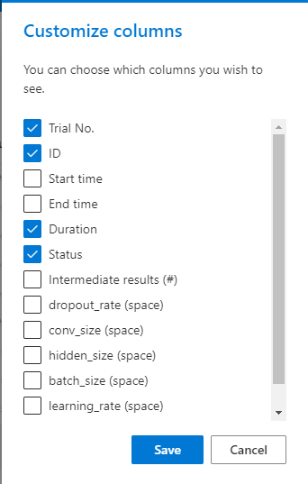

* If you want to compare some trials, you can select them and then click ``Compare`` to see the results.

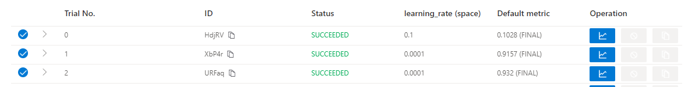

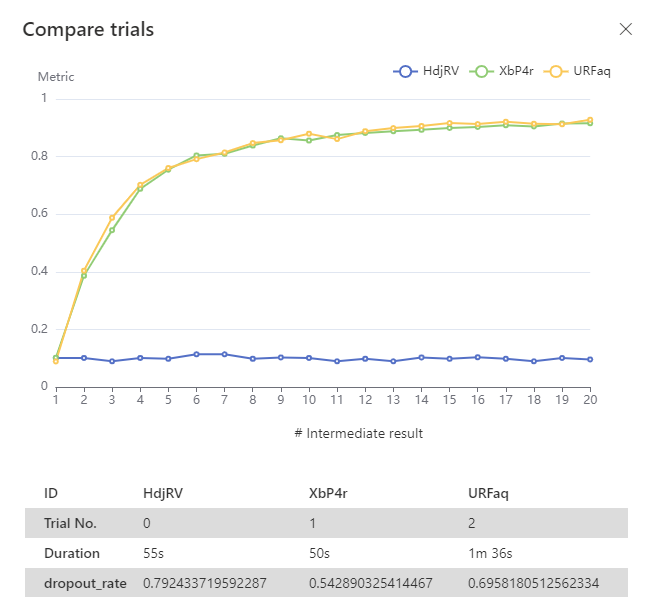

* You can use the button named ``Copy as python`` to copy the trial's parameters.

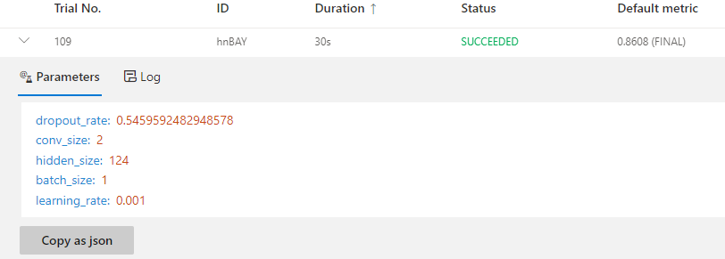

* Intermediate Result chart: you can see the default metric in this chart by clicking the intermediate button.

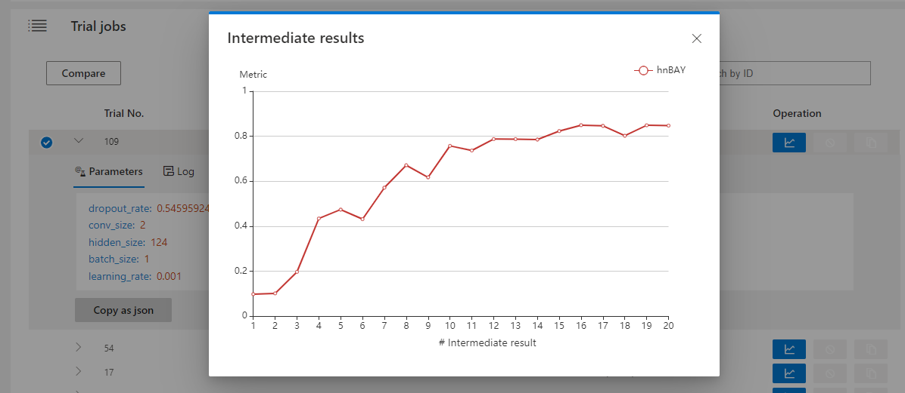

* Kill: you can kill a job that status is running.

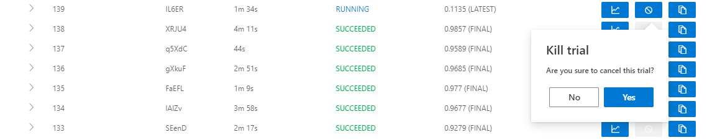

