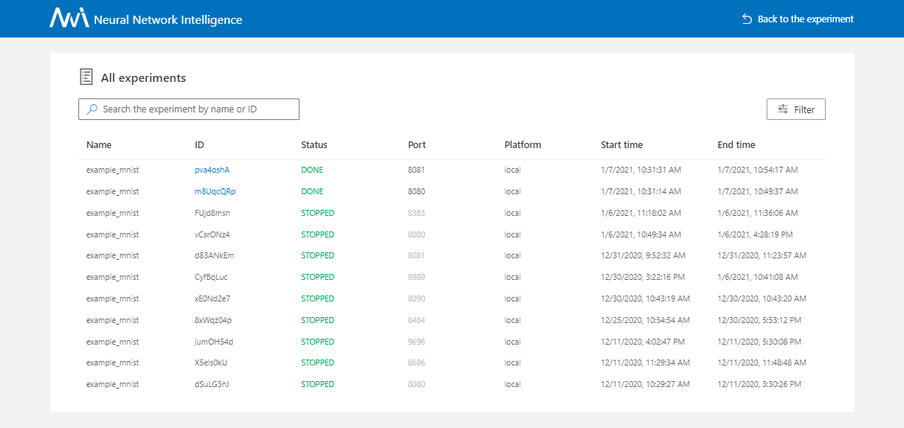
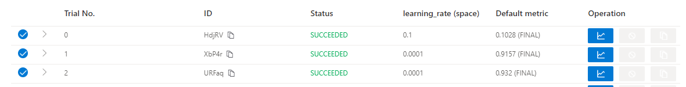
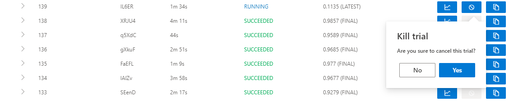

.. 424a57ff9c92c3f4738a9beabc4cfb50

Web 界面
========

Q&A
---

在 detail 页面的表格里明明有很多 trial 但是 Default Metric 图是空的没有数据
^^^^^^^^^^^^^^^^^^^^^^^^^^^^^^^^^^^^^^^^^^^^^^^^^^^^^^^^^^^^^^^^^^^^^^^^^^^^^

.. note::
   首先你要明白 ``Default metric`` 和 ``Hyper parameter`` 图只展示成功 trial。

当你觉得 ``Default metric``、``Hyper parameter`` 图有问题的时候应该做什么
^^^^^^^^^^^^^^^^^^^^^^^^^^^^^^^^^^^^^^^^^^^^^^^^^^^^^^^^^^^^^^^^^^^^^^^^^^

* 从 Experiment summary 下载实验结果（实验配置，trial 信息，中间值），并把这些结果上传进 issue 里。

.. image:: ../../../img/webui-img/summary.png
   :target: ../../../img/webui-img/summary.png
   :alt: summary

当你的实验有故障时应该做什么
^^^^^^^^^^^^^^^^^^^^^^^^^^^^^

* 点击实验状态右边的小图标把 error 信息截屏。
* 然后点击 learn about 去下载 log 文件。And then click the ``learn about`` to download ``nni-manager`` and ``dispatcher`` logfile.
* 点击页面导航栏的 About 按钮点 Feedback 开一个 issue，附带上以上的截屏和 log 信息。

.. image:: ../../../img/webui-img/experimentError.png
   :target: ../../../img/webui-img/experimentError.png
   :alt: experimentError

当你的 trial 跑失败了你应该怎么做
^^^^^^^^^^^^^^^^^^^^^^^^^^^^^^^^^^

* 使用 Customized trial 功能。向实验提交相同的 trial 参数即可。

.. image:: ../../../img/webui-img/detail/customizedTrialButton.png
   :target: ../../../img/webui-img/detail/customizedTrialButton.png
   :alt: customizedTrialButton

.. image:: ../../../img/webui-img/detail/customizedTrial.png
   :target: ../../../img/webui-img/detail/customizedTrial.png
   :alt: customizedTrial

* ``Log 模块`` 能帮助你找到错误原因。 有三个按钮： ``View trial log``, ``View trial error`` 和 ``View trial stdout`` 可查 log。如果你用 OpenPai 或者 Kubeflow，你能看到 trial stdout 和 nfs log。
    有任何问题请在 issue 里联系我们。

**local mode：**

**OpenPAI, Kubeflow and other mode：**

.. image:: ../../../img/webui-img/detail-pai.png
   :target: ../../../img/webui-img/detail-pai.png
   :alt: detailPai

怎样去使用 dict intermediate result
^^^^^^^^^^^^^^^^^^^^^^^^^^^^^^^^^^^^^

`The discussion <https://github.com/microsoft/nni/discussions/4289>`_ 能帮助你。

.. _exp-manage-webportal:

实验管理
--------

实验管理页面能统筹你机器上的所有实验。 

.. image:: ../../../img/webui-img/managerExperimentList/experimentListNav.png
   :target: ../../../img/webui-img/managerExperimentList/experimentListNav.png
   :alt: ExperimentList nav

* 在 ``All experiments`` 页面，可以看到机器上的所有 Experiment。 

* 查看 Experiment 更多详细信息时，可以单击 trial ID 跳转至该 Experiment 详情页，如下所示：

.. image:: ../../../img/webui-img/managerExperimentList/toAnotherExp.png
   :target: ../../../img/webui-img/managerExperimentList/toAnotherExp.png
   :alt: See this experiment detail

* 如果表格里有很多 Experiment，可以使用 ``filter`` 按钮。

.. image:: ../../../img/webui-img/managerExperimentList/expFilter.png
   :target: ../../../img/webui-img/managerExperimentList/expFilter.png
   :alt: filter button

实验详情
--------

查看实验 overview 页面
^^^^^^^^^^^^^^^^^^^^^^^

* 在 Overview 标签上，可看到 Experiment trial 的概况、搜索空间以及 ``top trials`` 的结果。

.. image:: ../../../img/webui-img/full-oview.png
   :target: ../../../img/webui-img/full-oview.png
   :alt: overview

* 如果想查看 Experiment 配置和搜索空间，点击右边的 ``Search space`` 和 ``Config`` 按钮。

   **搜索空间文件：**

   .. image:: ../../../img/webui-img/searchSpace.png
      :target: ../../../img/webui-img/searchSpace.png
      :alt: searchSpace

   **配置文件：**

   .. image:: ../../../img/webui-img/config.png
      :target: ../../../img/webui-img/config.png
      :alt: config

* 你可以在这里查看和下载 ``nni-manager/dispatcher 日志文件``。

.. image:: ../../../img/webui-img/review-log.png
   :target: ../../../img/webui-img/review-log.png
   :alt: logfile

* 如果 Experiment 包含了较多 Trial，可改变刷新间隔。

.. image:: ../../../img/webui-img/refresh-interval.png
   :target: ../../../img/webui-img/refresh-interval.png
   :alt: refresh

* 在这里修改 Experiment 配置（例如 ``maxExecDuration``, ``maxTrialNum`` 和 ``trial concurrency``）。

.. image:: ../../../img/webui-img/edit-experiment-param.png
   :target: ../../../img/webui-img/edit-experiment-param.png
   :alt: editExperimentParams

查看 trial 最终结果
^^^^^^^^^^^^^^^^^^^^^

* ``Default metric`` 是所有 trial 的最终结果图。 在每一个结果上悬停鼠标可以看到 trial 信息，比如 trial id、No. 超参等。

.. image:: ../../../img/webui-img/default-metric.png
   :target: ../../../img/webui-img/default-metric.png
   :alt: defaultMetricGraph

* 打开 ``Optimization curve`` 来查看 Experiment 的优化曲线。

.. image:: ../../../img/webui-img/best-curve.png
   :target: ../../../img/webui-img/best-curve.png
   :alt: bestCurveGraph

查看超参
^^^^^^^^^^

单击 ``Hyper-parameter`` 标签查看平行坐标系图。

* 可以点击 ``添加/删除`` 按钮来添加或删减纵坐标轴。
* 直接在图上拖动轴线来交换轴线位置。
* 通过调节百分比来查看 top trial。

.. image:: ../../../img/webui-img/hyperPara.png
   :target: ../../../img/webui-img/hyperPara.png
   :alt: hyperParameterGraph

查看 Trial 运行时间
^^^^^^^^^^^^^^^^^^^^^^

点击 ``Trial Duration`` 标签来查看柱状图。

.. image:: ../../../img/webui-img/trial_duration.png
   :target: ../../../img/webui-img/trial_duration.png
   :alt: trialDurationGraph

查看 Trial 中间结果
^^^^^^^^^^^^^^^^^^^^^^

单击 ``Intermediate Result`` 标签查看折线图。

.. image:: ../../../img/webui-img/trials_intermeidate.png
   :target: ../../../img/webui-img/trials_intermeidate.png
   :alt: trialIntermediateGraph

Trial 在训练过程中可能有大量中间结果。 为了更清楚的理解一些 Trial 的趋势，可以为中间结果图设置过滤功能。

这样可以发现 Trial 在某个中间结果上会变得更好或更差。 这表明它是一个重要的并相关的中间结果。 如果要仔细查看这个点，可以在 #Intermediate 中输入其 X 坐标。 并输入这个中间结果的指标范围。 在下图中，选择了第四个中间结果并将指标范围设置为了 0.8 -1。

.. image:: ../../../img/webui-img/filter-intermediate.png
   :target: ../../../img/webui-img/filter-intermediate.png
   :alt: filterIntermediateGraph

查看 Trial 状态
^^^^^^^^^^^^^^^^^^

点击 ``Trials Detail`` 标签查看所有 Trial 的状态。具体如下：

* Trial 详情：Trial id，持续时间，开始时间，结束时间，状态，精度和 search space 文件。

.. image:: ../../../img/webui-img/detail-local.png
   :target: ../../../img/webui-img/detail-local.png
   :alt: detailLocalImage

* * 支持通过 id，状态，Trial 编号以及参数来搜索。

   **Trial id：**
   

   .. image:: ../../../img/webui-img/detail/searchId.png
      :target: ../../../img/webui-img/detail/searchId.png
      :alt: searchTrialId

   **Trial No.：**

   .. image:: ../../../img/webui-img/detail/searchNo.png
      :target: ../../../img/webui-img/detail/searchNo.png
      :alt: searchTrialNo.

   **Trial status：**

   .. image:: ../../../img/webui-img/detail/searchStatus.png
      :target: ../../../img/webui-img/detail/searchStatus.png
      :alt: searchStatus

   **Trial parameters：**

      ``类型为 choice 的参数：``
      

      .. image:: ../../../img/webui-img/detail/searchParameterChoice.png
         :target: ../../../img/webui-img/detail/searchParameterChoice.png
         :alt: searchParameterChoice

      ``类型不是 choice 的参数：``
      

      .. image:: ../../../img/webui-img/detail/searchParameterRange.png
         :target: ../../../img/webui-img/detail/searchParameterRange.png
         :alt: searchParameterRange

* ``Add column`` 按钮可选择在表格中显示的列。 如果 Experiment 的最终结果是 dict，则可以在表格中查看其它键。可选择 ``Intermediate count`` 列来查看 Trial 进度。

.. image:: ../../../img/webui-img/addColumn.png
   :target: ../../../img/webui-img/addColumn.png
   :alt: addColumnGraph

* 如果要比较某些 Trial，可选择并点击 ``Compare`` 来查看结果。

.. image:: ../../../img/webui-img/compare.png
   :target: ../../../img/webui-img/compare.png
   :alt: compareTrialsGraph

* 可使用 ``Copy as python`` 按钮来拷贝 Trial 的参数。

.. image:: ../../../img/webui-img/copyParameter.png
   :target: ../../../img/webui-img/copyParameter.png
   :alt: copyTrialParameters

* 中间结果图：可在此图中通过点击 intermediate 按钮来查看默认指标。

.. image:: ../../../img/webui-img/intermediate.png
   :target: ../../../img/webui-img/intermediate.png
   :alt: intermeidateGraph

* Kill: 可终止正在运行的 trial。

