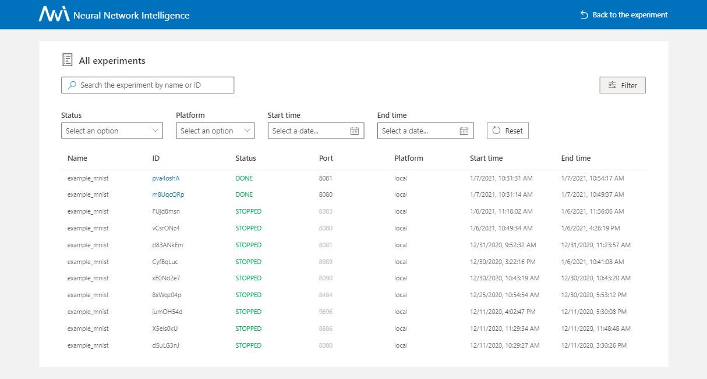
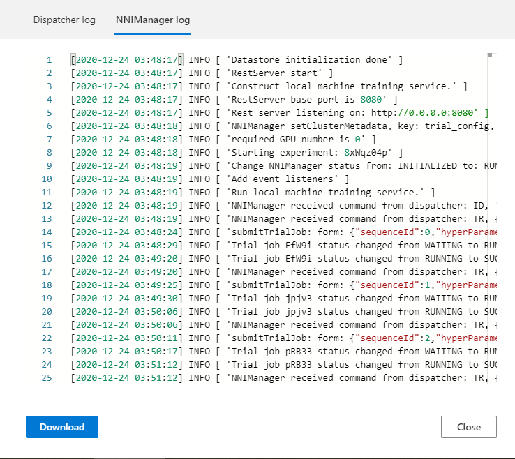
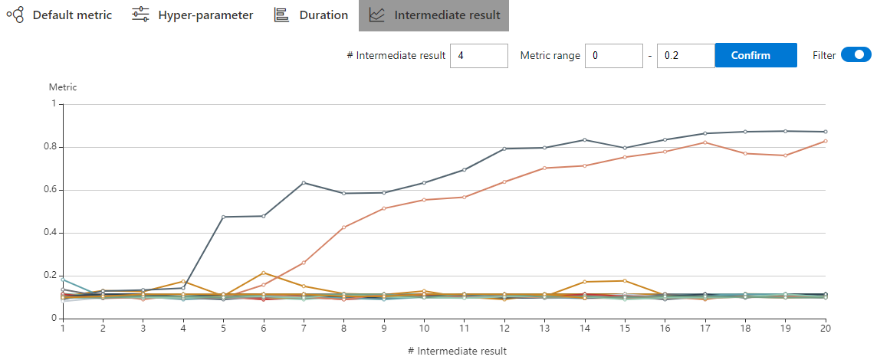
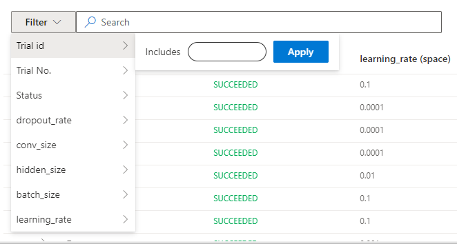
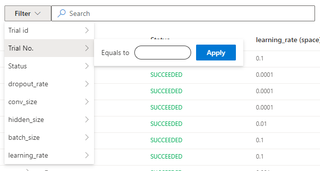
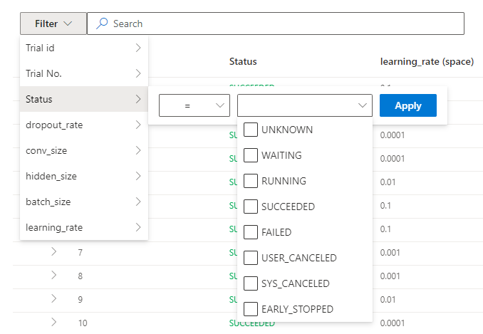
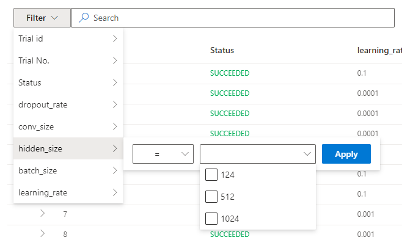
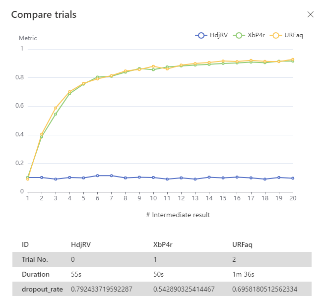

.. bb68c969dbc2b3a2ec79d323cbd31401

Web 界面
==================

Experiments 管理
-----------------------

点击导航栏上的 ``All experiments`` 标签。

.. image:: ../../img/webui-img/managerExperimentList/experimentListNav.png
   :target: ../../img/webui-img/managerExperimentList/experimentListNav.png
   :alt: ExperimentList nav

* 在 ``All experiments`` 页面，可以看到机器上的所有 Experiment。 

.. image:: ../../img/webui-img/managerExperimentList/expList.png
   :target: ../../img/webui-img/managerExperimentList/expList.png
   :alt: Experiments list

* 查看 Experiment 更多详细信息时，可以单击 trial ID 跳转至该 Experiment 详情页，如下所示：

.. image:: ../../img/webui-img/managerExperimentList/toAnotherExp.png
   :target: ../../img/webui-img/managerExperimentList/toAnotherExp.png
   :alt: See this experiment detail

* 如果表格里有很多 Experiment，可以使用 ``filter`` 按钮。

查看概要页面
-----------------

点击 ``Overview`` 标签。

* 在 Overview 标签上，可看到 Experiment trial 的概况、搜索空间以及 ``top trials`` 的结果。

.. image:: ../../img/webui-img/full-oview.png
   :target: ../../img/webui-img/full-oview.png
   :alt: overview

如果想查看 Experiment 配置和搜索空间，点击右边的 ``Search space`` 和 ``Config`` 按钮。

   1. 搜索空间文件：

      .. image:: ../../img/webui-img/searchSpace.png
         :target: ../../img/webui-img/searchSpace.png
         :alt: searchSpace

   2. 配置文件：

      .. image:: ../../img/webui-img/config.png
         :target: ../../img/webui-img/config.png
         :alt: config

* 你可以在这里查看和下载 ``nni-manager/dispatcher 日志文件``。

* 如果 Experiment 包含了较多 Trial，可改变刷新间隔。

.. image:: ../../img/webui-img/refresh-interval.png
   :target: ../../img/webui-img/refresh-interval.png
   :alt: refresh

* 单击按钮 ``Experiment summary`` ，可以查看和下载 Experiment 结果（``Experiment 配置``，``trial 信息`` 和 ``中间结果`` ）。

.. image:: ../../img/webui-img/summary.png
   :target: ../../img/webui-img/summary.png
   :alt: summary

* 在这里修改 Experiment 配置（例如 ``maxExecDuration``, ``maxTrialNum`` 和 ``trial concurrency``）。

.. image:: ../../img/webui-img/edit-experiment-param.png
   :target: ../../img/webui-img/edit-experiment-param.png
   :alt: editExperimentParams

* 通过单击 ``Learn about`` ，可以查看错误消息和 ``nni-manager/dispatcher 日志文件``

.. image:: ../../img/webui-img/experimentError.png
   :target: ../../img/webui-img/experimentError.png
   :alt: experimentError

* ``About`` 菜单内含有版本信息以及问题反馈渠道。

查看 trial 最终结果
----------------------------------------------

* ``Default metric`` 是所有 trial 的最终结果图。 在每一个结果上悬停鼠标可以看到 trial 信息，比如 trial id、No.、超参等。

.. image:: ../../img/webui-img/default-metric.png
   :target: ../../img/webui-img/default-metric.png
   :alt: defaultMetricGraph

* 打开 ``Optimization curve`` 来查看 Experiment 的优化曲线。

.. image:: ../../img/webui-img/best-curve.png
   :target: ../../img/webui-img/best-curve.png
   :alt: bestCurveGraph

查看超参
--------------------

单击 ``Hyper-parameter`` 标签查看平行坐标系图。

* 可以点击 ``添加/删除`` 按钮来添加或删减纵坐标轴。
* 直接在图上拖动轴线来交换轴线位置。
* 通过调节百分比来查看 top trial。

.. image:: ../../img/webui-img/hyperPara.png
   :target: ../../img/webui-img/hyperPara.png
   :alt: hyperParameterGraph

查看 Trial 运行时间
-------------------

点击 ``Trial Duration`` 标签来查看柱状图。

.. image:: ../../img/webui-img/trial_duration.png
   :target: ../../img/webui-img/trial_duration.png
   :alt: trialDurationGraph

查看 Trial 中间结果
------------------------------------

单击 ``Intermediate Result`` 标签查看折线图。

.. image:: ../../img/webui-img/trials_intermeidate.png
   :target: ../../img/webui-img/trials_intermeidate.png
   :alt: trialIntermediateGraph

Trial 在训练过程中可能有大量中间结果。 为了更清楚的理解一些 Trial 的趋势，可以为中间结果图设置过滤功能。

这样可以发现 Trial 在某个中间结果上会变得更好或更差。 这表明它是一个重要的并相关的中间结果。 如果要仔细查看这个点，可以在 #Intermediate 中输入其 X 坐标。 并输入这个中间结果的指标范围。 在下图中，选择了第四个中间结果并将指标范围设置为了 0.8 -1。

查看 Trial 状态
------------------

点击 ``Trials Detail`` 标签查看所有 Trial 的状态。具体如下：

* Trial 详情：Trial id，持续时间，开始时间，结束时间，状态，精度和 search space 文件。

.. image:: ../../img/webui-img/detail-local.png
   :target: ../../img/webui-img/detail-local.png
   :alt: detailLocalImage

* 支持通过 id，状态，Trial 编号以及参数来搜索。  

1. Trial id： 

2. Trial No.： 

3. Trial 状态：

4. Trial 参数：

(1) 类型为 choice 的参数：

(2) 类型不是 choice 的参数：

.. image:: ../../img/webui-img/detail/searchParameterRange.png
   :target: ../../img/webui-img/detail/searchParameterRange.png
   :alt: searchParameterRange

* ``Add column`` 按钮可选择在表格中显示的列。 如果 Experiment 的最终结果是 dict，则可以在表格中查看其它键。可选择 ``Intermediate count`` 列来查看 Trial 进度。

.. image:: ../../img/webui-img/addColumn.png
   :target: ../../img/webui-img/addColumn.png
   :alt: addColumnGraph

* 如果要比较某些 Trial，可选择并点击 ``Compare`` 来查看结果。

.. image:: ../../img/webui-img/select-trial.png
   :target: ../../img/webui-img/select-trial.png
   :alt: selectTrialGraph

* ``Tensorboard`` 请参考 `此文档 <Tensorboard.rst>`__。

* 可使用 ``Copy as python`` 按钮来拷贝 Trial 的参数。

.. image:: ../../img/webui-img/copyParameter.png
   :target: ../../img/webui-img/copyParameter.png
   :alt: copyTrialParameters

* 您可以在 ``Log`` 选项卡上看到 Trial 日志。 在本地模式下有 ``View trial log``, ``View trial error`` 和 ``View trial stdout`` 三个按钮。 * 如果在 OpenPAI 或 Kubeflow 平台上运行，还可以看到 hdfsLog。

1. 本机模式

.. image:: ../../img/webui-img/detail/log-local.png
   :target: ../../img/webui-img/detail/log-local.png
   :alt: logOnLocal

2. OpenPAI、Kubeflow 等模式：

.. image:: ../../img/webui-img/detail-pai.png
   :target: ../../img/webui-img/detail-pai.png
   :alt: detailPai

* 中间结果图：可在此图中通过点击 intermediate 按钮来查看默认指标。

.. image:: ../../img/webui-img/intermediate.png
   :target: ../../img/webui-img/intermediate.png
   :alt: intermeidateGraph

* Kill: 可终止正在运行的任务。

.. image:: ../../img/webui-img/kill-running.png
   :target: ../../img/webui-img/kill-running.png
   :alt: killTrial

* 自定义 Trial：您可以更改此 Trial 参数，然后将其提交给 Experiment。如果您想重新运行失败的 Trial ，您可以向 Experiment 提交相同的参数。

.. image:: ../../img/webui-img/detail/customizedTrialButton.png
   :target: ../../img/webui-img/detail/customizedTrialButton.png
   :alt: customizedTrialButton

.. image:: ../../img/webui-img/detail/customizedTrial.png
   :target: ../../img/webui-img/detail/customizedTrial.png
   :alt: customizedTrial
