HPO Benchmark Example Statistics
================================

A Benchmark Example
^^^^^^^^^^^^^^^^^^^

As an example, we ran the "nnismall" benchmark with the random forest search space on the following 8 tuners: "TPE",
"Random", "Anneal", "Evolution", "SMAC", "GPTuner", "MetisTuner", "DNGOTuner". For convenience of reference, we also list
the search space we experimented on here. Note that the way in which the search space is written may significantly affect
hyperparameter optimization performance, and we plan to conduct further experiments on how well NNI built-in tuners adapt
to different search space formulations using this benchmarking tool.

.. code-block:: json

   {
       "n_estimators": {"_type":"randint", "_value": [8, 512]},
       "max_depth": {"_type":"choice", "_value": [4, 8, 16, 32, 64, 128, 256, 0]},
       "min_samples_leaf": {"_type":"randint", "_value": [1, 8]},
       "min_samples_split": {"_type":"randint", "_value": [2, 16]},
       "max_leaf_nodes": {"_type":"randint", "_value": [0, 4096]}
    }

As some of the tasks contains a considerable amount of training data, it took about 2 days to run the whole benchmark on
one tuner. For a more detailed description of the tasks, please check
``/examples/trials/benchmarking/automlbenchmark/nni/benchmarks/nnismall_description.txt``. For binary and multi-class
classification tasks, the metric "auc" and "logloss" were used for evaluation, while for regression, "r2" and "rmse" were used.

After the script finishes, the final scores of each tuner are summarized in the file ``results[time]/reports/performances.txt``.
Since the file is large, we only show the following screenshot and summarize other important statistics instead.

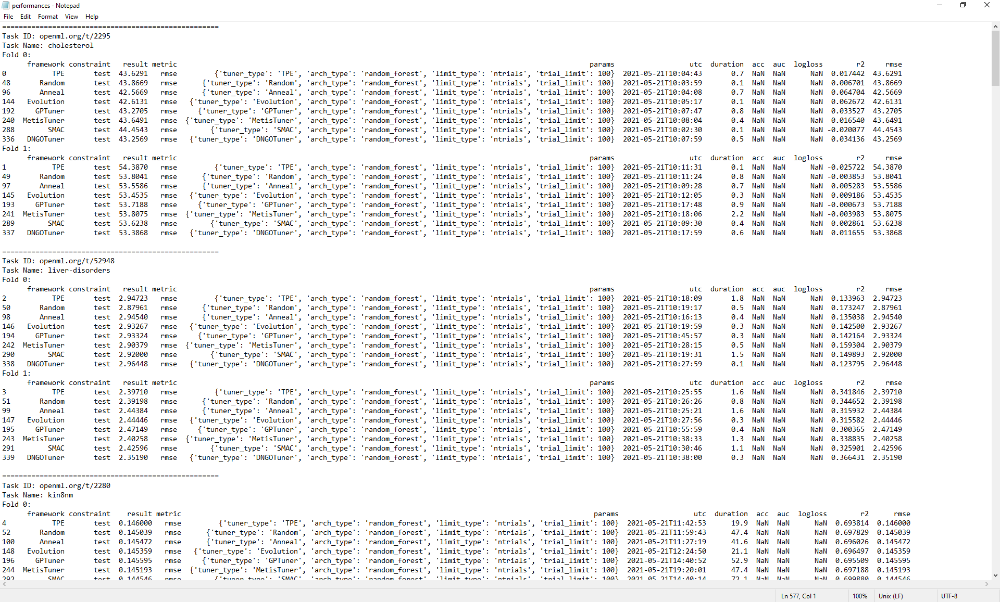

When the results are parsed, the tuners are also ranked based on their final performance. The following three tables show
the average ranking of the tuners for each metric (logloss, rmse, auc).

Also, for every tuner, their performance for each type of metric is summarized (another view of the same data).
We present this statistics in the fourth table. Note that this information can be found at ``results[time]/reports/rankings.txt``.

Average rankings for metric rmse (for regression tasks). We found that Anneal performs the best among all NNI built-in tuners.

.. list-table::
   :header-rows: 1

   * - Tuner Name
     - Average Ranking
   * - Anneal
     - 3.75
   * - Random
     - 4.00
   * - Evolution
     - 4.44
   * - DNGOTuner
     - 4.44
   * - SMAC
     - 4.56
   * - TPE
     - 4.94
   * - GPTuner
     - 4.94
   * - MetisTuner
     - 4.94

Average rankings for metric auc (for classification tasks). We found that SMAC performs the best among all NNI built-in tuners.

.. list-table::
   :header-rows: 1

   * - Tuner Name
     - Average Ranking
   * - SMAC
     - 3.67
   * - GPTuner
     - 4.00
   * - Evolution
     - 4.22
   * - Anneal
     - 4.39
   * - MetisTuner
     - 4.39
   * - TPE
     - 4.67
   * - Random
     - 5.33
   * - DNGOTuner
     - 5.33

Average rankings for metric logloss (for classification tasks). We found that Random performs the best among all NNI built-in tuners.

.. list-table::
   :header-rows: 1

   * - Tuner Name
     - Average Ranking
   * - Random
     - 3.36
   * - DNGOTuner
     - 3.50
   * - SMAC
     - 3.93
   * - GPTuner
     - 4.64
   * - TPE
     - 4.71
   * - Anneal
     - 4.93
   * - Evolution
     - 5.00
   * - MetisTuner
     - 5.93

To view the same data in another way, for each tuner, we present the average rankings on different types of metrics. From the table, we can find that, for example, the DNGOTuner performs better for the tasks whose metric is "logloss" than for the tasks with metric "auc". We hope this information can to some extent guide the choice of tuners given some knowledge of task types.

.. list-table::
   :header-rows: 1

   * - Tuner Name
     - rmse
     - auc
     - logloss
   * - TPE
     - 4.94
     - 4.67
     - 4.71
   * - Random
     - 4.00
     - 5.33
     - 3.36
   * - Anneal
     - 3.75
     - 4.39
     - 4.93
   * - Evolution
     - 4.44
     - 4.22
     - 5.00
   * - GPTuner
     - 4.94
     - 4.00
     - 4.64
   * - MetisTuner
     - 4.94
     - 4.39
     - 5.93
   * - SMAC
     - 4.56
     - 3.67
     - 3.93
   * - DNGOTuner
     - 4.44
     - 5.33
     - 3.50

Besides these reports, our script also generates two graphs for each fold of each task: one graph presents the best score received by each tuner until trial x, and another graph shows the score that each tuner receives in trial x. These two graphs can give some information regarding how the tuners are "converging" to their final solution. We found that for "nnismall", tuners on the random forest model with search space defined in ``/examples/trials/benchmarking/automlbenchmark/nni/extensions/NNI/architectures/run_random_forest.py`` generally converge to the final solution after 40 to 60 trials. As there are too much graphs to incldue in a single report (96 graphs in total), we only present 10 graphs here.

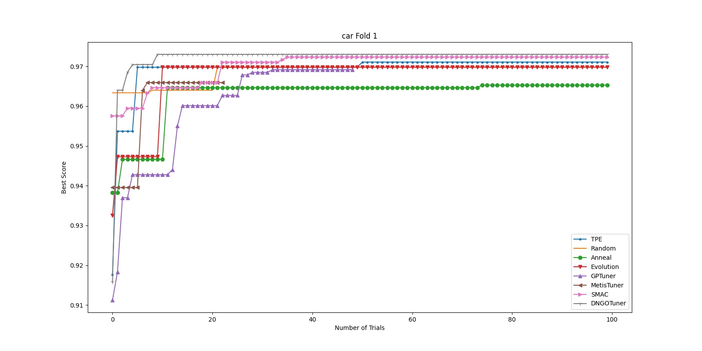

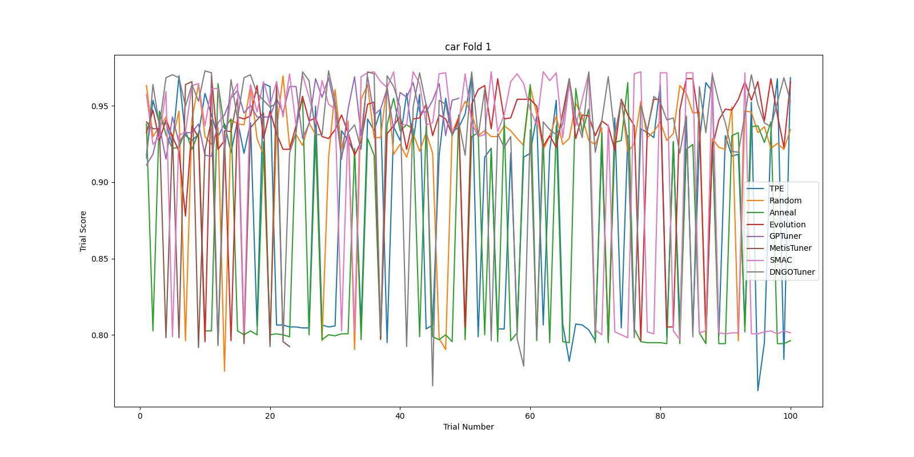

The previous two graphs are generated for fold 1 of the task "car". In the first graph, we observe that most tuners find a relatively good solution within 40 trials. In this experiment, among all tuners, the DNGOTuner converges fastest to the best solution (within 10 trials). Its best score improved for three times in the entire experiment. In the second graph, we observe that most tuners have their score flucturate between 0.8 and 1 throughout the experiment. However, it seems that the Anneal tuner (green line) is more unstable (having more fluctuations) while the GPTuner has a more stable pattern. This may be interpreted as the Anneal tuner explores more aggressively than the GPTuner and thus its scores for different trials vary a lot. Regardless, although this pattern can to some extent hint a tuner's position on the explore-exploit tradeoff, it is not a comprehensive evaluation of a tuner's effectiveness.

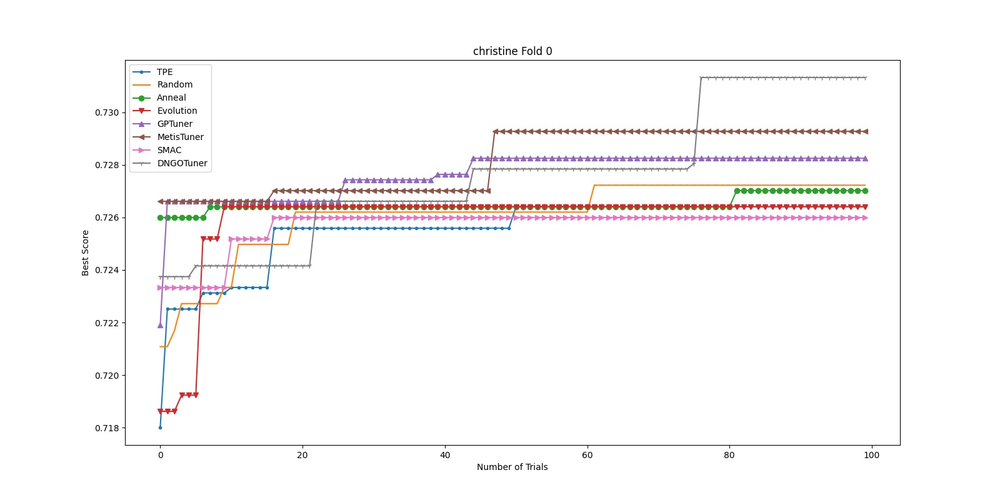

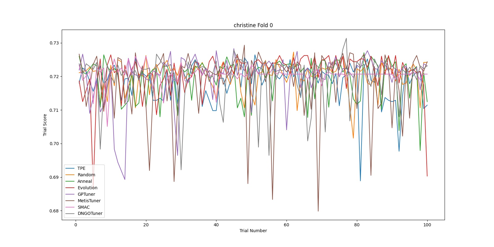

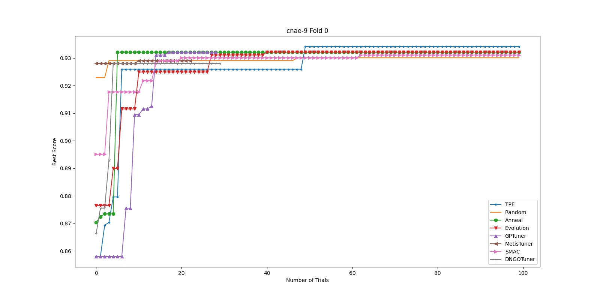

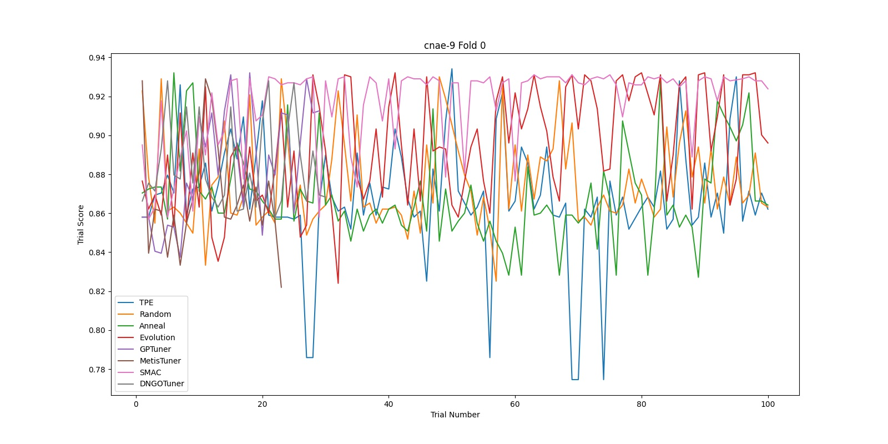

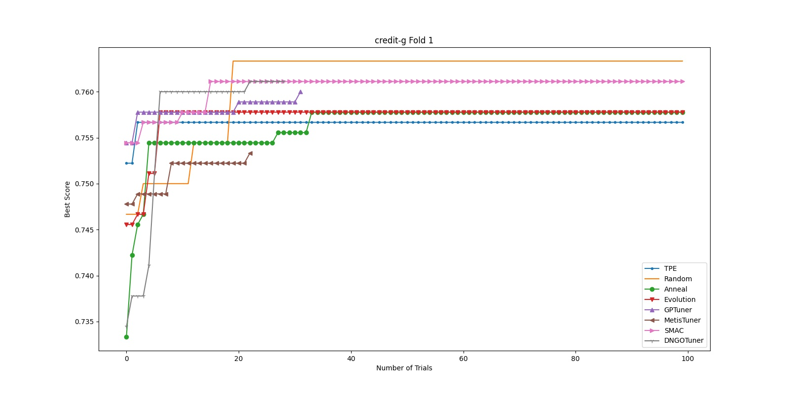

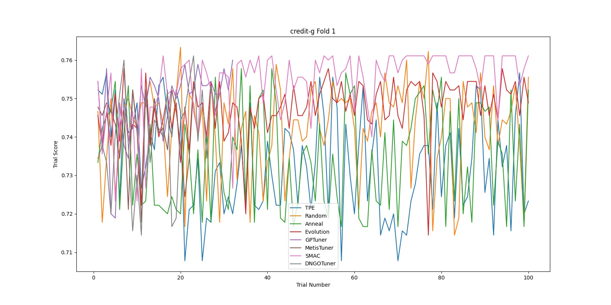

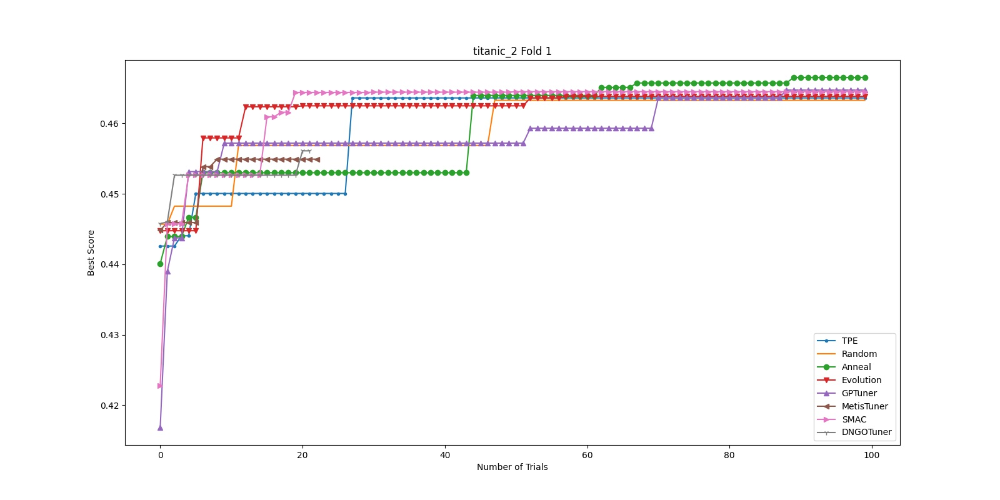

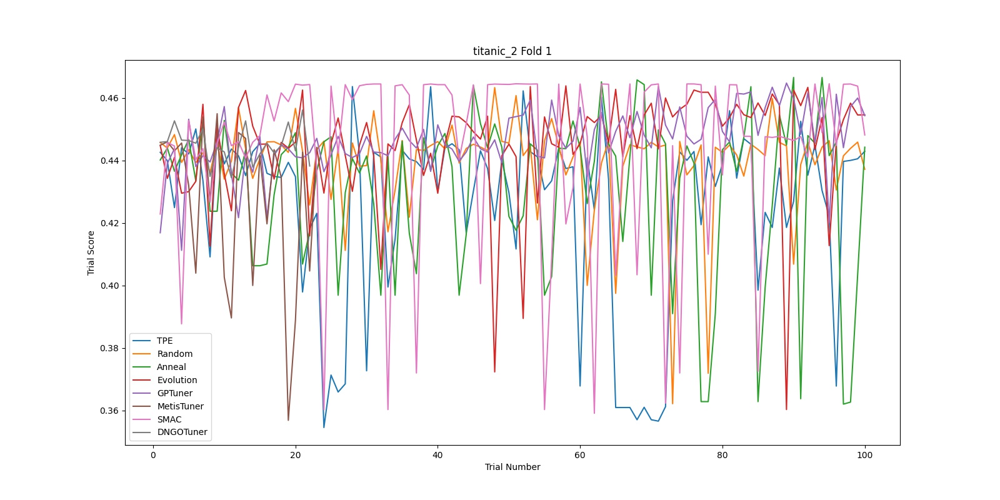
