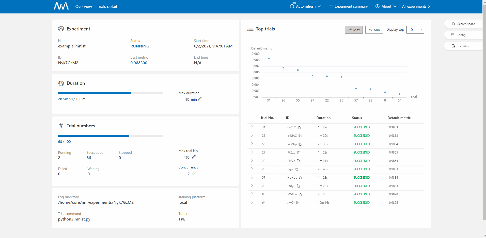

Hyperparameter Optimization Overview
====================================

Auto hyperparameter optimization (HPO), or auto tuning, is one of the key features of NNI.

Introduction to HPO
-------------------

In machine learning, a hyperparameter is a parameter whose value is used to control learning process,
and HPO is the problem of choosing a set of optimal hyperparameters for a learning algorithm.
(`From <https://en.wikipedia.org/wiki/Hyperparameter_(machine_learning)>`__
`Wikipedia <https://en.wikipedia.org/wiki/Hyperparameter_optimization>`__)

Following code snippet demonstrates a naive HPO process:

.. code-block:: python

    best_hyperparameters = None
    best_accuracy = 0

    for learning_rate in [0.1, 0.01, 0.001, 0.0001]:
        for momentum in [i / 10 for i in range(10)]:
            for activation_type in ['relu', 'tanh', 'sigmoid']:
                model = build_model(activation_type)
                train_model(model, learning_rate, momentum)
                accuracy = evaluate_model(model)

                if accuracy > best_accuracy:
                    best_accuracy = accuracy
                    best_hyperparameters = (learning_rate, momentum, activation_type)

    print('Best hyperparameters:', best_hyperparameters)

You may have noticed, the example will train 4×10×3=120 models in total.
Since it consumes so much computing resources, you may want to:

1. :ref:`Find the best hyperparameter set with less iterations. <hpo-overview-tuners>`
2. :ref:`Train the models on distributed platforms. <hpo-overview-platforms>`
3. :ref:`Have a portal to monitor and control the process. <hpo-overview-portal>`

NNI will do them for you.

Key Features of NNI HPO
-----------------------

.. _hpo-overview-tuners:

Tuning Algorithms
^^^^^^^^^^^^^^^^^

NNI provides *tuners* to speed up the process of finding best hyperparameter set.

A tuner, or a tuning algorithm, decides the order in which hyperparameter sets are evaluated.
Based on the results of historical hyperparameter sets, an efficient tuner can predict where the best hyperparameters locates around,
and finds them in much fewer attempts.

The naive example above evaluates all possible hyperparameter sets in constant order, ignoring the historical results.
This is the brute-force tuning algorithm called *grid search*.

NNI has out-of-the-box support for a variety of popular tuners.
It includes naive algorithms like random search and grid search, Bayesian-based algorithms like TPE and SMAC,
RL based algorithms like PPO, and much more.

Main article: :doc:`tuners`

.. _hpo-overview-platforms:

Training Platforms
^^^^^^^^^^^^^^^^^^

If you are not interested in distributed platforms, you can simply run NNI HPO with current computer,
just like any ordinary Python library.

And when you want to leverage more computing resources, NNI provides built-in integration for training platforms
from simple on-premise servers to scalable commercial clouds.

With NNI you can write one piece of model code, and concurrently evaluate hyperparameter sets on local machine, SSH servers,
Kubernetes-based clusters, AzureML service, and much more.

Main article: :doc:`/experiment/training_service/overview`

.. _hpo-overview-portal:

Web Portal
^^^^^^^^^^

NNI provides a web portal to monitor training progress, to visualize hyperparameter performance,
to manually customize hyperparameters, and to manage multiple HPO experiments.

Main article: :doc:`/experiment/web_portal/web_portal`

Tutorials
---------

To start using NNI HPO, choose the quickstart tutorial of your favorite framework:

* :doc:`PyTorch tutorial </tutorials/hpo_quickstart_pytorch/main>`
* :doc:`TensorFlow tutorial </tutorials/hpo_quickstart_tensorflow/main>`

Extra Features
--------------

After you are familiar with basic usage, you can explore more HPO features:

* :doc:`Use command line tool to create and manage experiments (nnictl) </reference/nnictl>`

  * :doc:`nnictl example </tutorials/hpo_nnictl/nnictl>`

* :doc:`Early stop non-optimal models (assessor) <assessors>`
* :doc:`TensorBoard integration </experiment/web_portal/tensorboard>`
* :doc:`Implement your own algorithm <custom_algorithm>`
* :doc:`Benchmark tuners <hpo_benchmark>`
