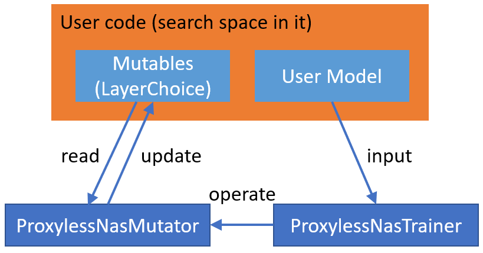

Exploration Strategy
====================

There are two types of model space exploration approach: **Multi-trial NAS** and **One-shot NAS**. Mutli-trial NAS trains each sampled model in the model space independently, while One-shot NAS samples the model from a super model. After constructing the model space, users can use either exploration approach to explore the model space. 

.. _multi-trial-nas:

Multi-trial strategy
--------------------

Multi-trial NAS means each sampled model from model space is trained independently. A typical multi-trial NAS is `NASNet <https://arxiv.org/abs/1707.07012>`__. In multi-trial NAS, users need model evaluator to evaluate the performance of each sampled model, and need an exploration strategy to sample models from a defined model space. Here, users could use NNI provided model evaluators or write their own model evalutor. They can simply choose a exploration strategy. Advanced users can also customize new exploration strategy.

To use an exploration strategy, users simply instantiate an exploration strategy and pass the instantiated object to :class:`nni.retiarii.nn.pytorch.RetiariiExperiment`. Below is a simple example.

.. code-block:: python

  import nni.retiarii.strategy as strategy

  exploration_strategy = strategy.Random(dedup=True)

Rather than using ``strategy.Random``, users can choose one of the strategies from below.

.. _random-strategy:

Random
^^^^^^

.. autoclass:: nni.retiarii.strategy.Random
   :members:
   :noindex:

.. _grid-search-strategy:

GridSearch
^^^^^^^^^^

.. autoclass:: nni.retiarii.strategy.GridSearch
   :members:
   :noindex:

.. _regularized-evolution-strategy:

RegularizedEvolution
^^^^^^^^^^^^^^^^^^^^

.. autoclass:: nni.retiarii.strategy.RegularizedEvolution
   :members:
   :noindex:

.. _tpe-strategy:

TPE
^^^

.. autoclass:: nni.retiarii.strategy.TPE
   :members:
   :noindex:

.. _policy-based-rl-strategy:

PolicyBasedRL
^^^^^^^^^^^^^

.. autoclass:: nni.retiarii.strategy.PolicyBasedRL
   :members:
   :noindex:

.. _one-shot-nas:

One-shot strategy
-----------------

One-shot NAS algorithms leverage weight sharing among models in neural architecture search space to train a supernet, and use this supernet to guide the selection of better models. This type of algorihtms greatly reduces computational resource compared to independently training each model from scratch (which we call "Multi-trial NAS"). NNI has supported many popular One-shot NAS algorithms as following.

.. _darts-strategy:

DARTS
^^^^^

The paper `DARTS: Differentiable Architecture Search <https://arxiv.org/abs/1806.09055>`__ addresses the scalability challenge of architecture search by formulating the task in a differentiable manner. Their method is based on the continuous relaxation of the architecture representation, allowing efficient search of the architecture using gradient descent.

Authors' code optimizes the network weights and architecture weights alternatively in mini-batches. They further explore the possibility that uses second order optimization (unroll) instead of first order, to improve the performance.

Implementation on NNI is based on the `official implementation <https://github.com/quark0/darts>`__ and a `popular 3rd-party repo <https://github.com/khanrc/pt.darts>`__. DARTS on NNI is designed to be general for arbitrary search space. A CNN search space tailored for CIFAR10, same as the original paper, is implemented as a use case of DARTS.

..  autoclass:: nni.retiarii.oneshot.pytorch.DartsTrainer
    :noindex:

Reproduction Results
""""""""""""""""""""

The above-mentioned example is meant to reproduce the results in the paper, we do experiments with first and second order optimization. Due to the time limit, we retrain *only the best architecture* derived from the search phase and we repeat the experiment *only once*. Our results is currently on par with the results reported in paper. We will add more results later when ready.

.. list-table::
   :header-rows: 1
   :widths: auto

   * - 
     - In paper
     - Reproduction
   * - First order (CIFAR10)
     - 3.00 +/- 0.14
     - 2.78
   * - Second order (CIFAR10)
     - 2.76 +/- 0.09
     - 2.80

Examples
""""""""

:githublink:`Example code <examples/nas/oneshot/darts>`

.. code-block:: bash

   # In case NNI code is not cloned. If the code is cloned already, ignore this line and enter code folder.
   git clone https://github.com/Microsoft/nni.git

   # search the best architecture
   cd examples/nas/oneshot/darts
   python3 search.py

   # train the best architecture
   python3 retrain.py --arc-checkpoint ./checkpoints/epoch_49.json

Limitations
"""""""""""

* DARTS doesn't support DataParallel and needs to be customized in order to support DistributedDataParallel.

.. _enas-strategy:

ENAS
^^^^

The paper `Efficient Neural Architecture Search via Parameter Sharing <https://arxiv.org/abs/1802.03268>`__ uses parameter sharing between child models to accelerate the NAS process. In ENAS, a controller learns to discover neural network architectures by searching for an optimal subgraph within a large computational graph. The controller is trained with policy gradient to select a subgraph that maximizes the expected reward on the validation set. Meanwhile the model corresponding to the selected subgraph is trained to minimize a canonical cross entropy loss.

Implementation on NNI is based on the `official implementation in Tensorflow <https://github.com/melodyguan/enas>`__, including a general-purpose Reinforcement-learning controller and a trainer that trains target network and this controller alternatively. Following paper, we have also implemented macro and micro search space on CIFAR10 to demonstrate how to use these trainers. Since code to train from scratch on NNI is not ready yet, reproduction results are currently unavailable.

..  autoclass:: nni.retiarii.oneshot.pytorch.EnasTrainer
    :noindex:

Examples
""""""""

:githublink:`Example code <examples/nas/oneshot/enas>`

.. code-block:: bash

   # In case NNI code is not cloned. If the code is cloned already, ignore this line and enter code folder.
   git clone https://github.com/Microsoft/nni.git

   # search the best architecture
   cd examples/nas/oneshot/enas

   # search in macro search space
   python3 search.py --search-for macro

   # search in micro search space
   python3 search.py --search-for micro

   # view more options for search
   python3 search.py -h

.. _fbnet-strategy:

FBNet
^^^^^

.. note:: This one-shot NAS is still implemented under NNI NAS 1.0, and will `be migrated to Retiarii framework in v2.4 <https://github.com/microsoft/nni/issues/3814>`__.

For the mobile application of facial landmark, based on the basic architecture of PFLD model, we have applied the FBNet (Block-wise DNAS) to design an concise model with the trade-off between latency and accuracy. References are listed as below:

* `FBNet: Hardware-Aware Efficient ConvNet Design via Differentiable Neural Architecture Search <https://arxiv.org/abs/1812.03443>`__
* `PFLD: A Practical Facial Landmark Detector <https://arxiv.org/abs/1902.10859>`__

FBNet is a block-wise differentiable NAS method (Block-wise DNAS), where the best candidate building blocks can be chosen by using Gumbel Softmax random sampling and differentiable training. At each layer (or stage) to be searched, the diverse candidate blocks are side by side planned (just like the effectiveness of structural re-parameterization), leading to sufficient pre-training of the supernet. The pre-trained supernet is further sampled for finetuning of the subnet, to achieve better performance.

.. image:: ../../img/fbnet.png

PFLD is a lightweight facial landmark model for realtime application. The architecture of PLFD is firstly simplified for acceleration, by using the stem block of PeleeNet, average pooling with depthwise convolution and eSE module.

To achieve better trade-off between latency and accuracy, the FBNet is further applied on the simplified PFLD for searching the best block at each specific layer. The search space is based on the FBNet space, and optimized for mobile deployment by using the average pooling with depthwise convolution and eSE module etc.

Experiments
"""""""""""

To verify the effectiveness of FBNet applied on PFLD, we choose the open source dataset with 106 landmark points as the benchmark:

* `Grand Challenge of 106-Point Facial Landmark Localization <https://arxiv.org/abs/1905.03469>`__

The baseline model is denoted as MobileNet-V3 PFLD (`Reference baseline <https://github.com/Hsintao/pfld_106_face_landmarks>`__), and the searched model is denoted as Subnet. The experimental results are listed as below, where the latency is tested on Qualcomm 625 CPU (ARMv8):

.. list-table::
   :header-rows: 1
   :widths: auto

   * - Model
     - Size
     - Latency
     - Validation NME
   * - MobileNet-V3 PFLD
     - 1.01MB
     - 10ms
     - 6.22%
   * - Subnet
     - 693KB
     - 1.60ms
     - 5.58%

Example
"""""""

`Example code <https://github.com/microsoft/nni/tree/master/examples/nas/oneshot/pfld>`__

Please run the following scripts at the example directory.

The Python dependencies used here are listed as below:

.. code-block:: bash

   numpy==1.18.5
   opencv-python==4.5.1.48
   torch==1.6.0
   torchvision==0.7.0
   onnx==1.8.1
   onnx-simplifier==0.3.5
   onnxruntime==1.7.0

To run the tutorial, follow the steps below:

1. **Data Preparation**: Firstly, you should download the dataset `106points dataset <https://drive.google.com/file/d/1I7QdnLxAlyG2Tq3L66QYzGhiBEoVfzKo/view?usp=sharing>`__ to the path ``./data/106points`` . The dataset includes the train-set and test-set:

   .. code-block:: bash

      ./data/106points/train_data/imgs
      ./data/106points/train_data/list.txt
      ./data/106points/test_data/imgs
      ./data/106points/test_data/list.txt

2. **Search**: Based on the architecture of simplified PFLD, the setting of multi-stage search space and hyper-parameters for searching should be firstly configured to construct the supernet. For example,

   .. code-block::

      from lib.builder import search_space
      from lib.ops import PRIMITIVES
      from lib.supernet import PFLDInference, AuxiliaryNet
      from nni.algorithms.nas.pytorch.fbnet import LookUpTable, NASConfig,

      # configuration of hyper-parameters
      # search_space defines the multi-stage search space
      nas_config = NASConfig(
         model_dir="./ckpt_save",
         nas_lr=0.01,
         mode="mul",
         alpha=0.25,
         beta=0.6,
         search_space=search_space,
      )
      # lookup table to manage the information
      lookup_table = LookUpTable(config=nas_config, primitives=PRIMITIVES)
      # created supernet
      pfld_backbone = PFLDInference(lookup_table)

   After creation of the supernet with the specification of search space and hyper-parameters, we can run below command to start searching and training of the supernet:

   .. code-block:: bash

      python train.py --dev_id "0,1" --snapshot "./ckpt_save" --data_root "./data/106points"

   The validation accuracy will be shown during training, and the model with best accuracy will be saved as ``./ckpt_save/supernet/checkpoint_best.pth``.

3. **Finetune**: After pre-training of the supernet, we can run below command to sample the subnet and conduct the finetuning:

   .. code-block:: bash

      python retrain.py --dev_id "0,1" --snapshot "./ckpt_save" --data_root "./data/106points" \
                        --supernet "./ckpt_save/supernet/checkpoint_best.pth"

   The validation accuracy will be shown during training, and the model with best accuracy will be saved as ``./ckpt_save/subnet/checkpoint_best.pth``.

4. **Export**: After the finetuning of subnet, we can run below command to export the ONNX model:

   .. code-block:: bash

      python export.py --supernet "./ckpt_save/supernet/checkpoint_best.pth" \
                       --resume "./ckpt_save/subnet/checkpoint_best.pth"

   ONNX model is saved as ``./output/subnet.onnx``, which can be further converted to the mobile inference engine by using `MNN <https://github.com/alibaba/MNN>`__ .
   The checkpoints of pre-trained supernet and subnet are offered as below:

   * `Supernet <https://drive.google.com/file/d/1TCuWKq8u4_BQ84BWbHSCZ45N3JGB9kFJ/view?usp=sharing>`__
   * `Subnet <https://drive.google.com/file/d/160rkuwB7y7qlBZNM3W_T53cb6MQIYHIE/view?usp=sharing>`__
   * `ONNX model <https://drive.google.com/file/d/1s-v-aOiMv0cqBspPVF3vSGujTbn_T_Uo/view?usp=sharing>`__

.. _spos-strategy:

SPOS
^^^^

Proposed in `Single Path One-Shot Neural Architecture Search with Uniform Sampling <https://arxiv.org/abs/1904.00420>`__ is a one-shot NAS method that addresses the difficulties in training One-Shot NAS models by constructing a simplified supernet trained with an uniform path sampling method, so that all underlying architectures (and their weights) get trained fully and equally. An evolutionary algorithm is then applied to efficiently search for the best-performing architectures without any fine tuning.

Implementation on NNI is based on `official repo <https://github.com/megvii-model/SinglePathOneShot>`__. We implement a trainer that trains the supernet and a evolution tuner that leverages the power of NNI framework that speeds up the evolutionary search phase.

..  autoclass:: nni.retiarii.oneshot.pytorch.SinglePathTrainer
    :noindex:

Examples
""""""""

Here is a use case, which is the search space in paper. However, we applied latency limit instead of flops limit to perform the architecture search phase.

:githublink:`Example code <examples/nas/oneshot/spos>`

**Requirements:** Prepare ImageNet in the standard format (follow the script `here <https://gist.github.com/BIGBALLON/8a71d225eff18d88e469e6ea9b39cef4>`__). Linking it to ``data/imagenet`` will be more convenient. Download the checkpoint file from `here <https://1drv.ms/u/s!Am_mmG2-KsrnajesvSdfsq_cN48?e=aHVppN>`__ (maintained by `Megvii <https://github.com/megvii-model>`__) if you don't want to retrain the supernet. Put ``checkpoint-150000.pth.tar`` under ``data`` directory. After preparation, it's expected to have the following code structure:

.. code-block:: bash

   spos
   ├── architecture_final.json
   ├── blocks.py
   ├── data
   │   ├── imagenet
   │   │   ├── train
   │   │   └── val
   │   └── checkpoint-150000.pth.tar
   ├── network.py
   ├── readme.md
   ├── supernet.py
   ├── evaluation.py
   ├── search.py
   └── utils.py

Then follow the 3 steps:

1. **Train Supernet**:

   .. code-block:: bash

      python supernet.py

   This will export the checkpoint to ``checkpoints`` directory, for the next step.

   .. note:: The data loading used in the official repo is `slightly different from usual <https://github.com/megvii-model/SinglePathOneShot/issues/5>`__, as they use BGR tensor and keep the values between 0 and 255 intentionally to align with their own DL framework. The option ``--spos-preprocessing`` will simulate the behavior used originally and enable you to use the checkpoints pretrained.

2. **Evolution Search**: Single Path One-Shot leverages evolution algorithm to search for the best architecture. In the paper, the search module, which is responsible for testing the sampled architecture, recalculates all the batch norm for a subset of training images, and evaluates the architecture on the full validation set.
   In this example, it will inherit the ``state_dict`` of supernet from `./data/checkpoint-150000.pth.tar`, and search the best architecture with the regularized evolution strategy. Search in the supernet with the following command

   .. code-block:: bash

      python search.py

   NNI support a latency filter to filter unsatisfied model from search phase. Latency is predicted by Microsoft nn-Meter (https://github.com/microsoft/nn-Meter). To apply the latency filter, users could run search.py with additional arguments ``--latency-filter``. Here is an example:

   .. code-block:: bash

      python search.py --latency-filter cortexA76cpu_tflite21

   Note that the latency filter is only supported for base execution engine.

   The final architecture exported from every epoch of evolution can be found in ``trials`` under the working directory of your tuner, which, by default, is ``$HOME/nni-experiments/your_experiment_id/trials``.

3. **Train for Evaluation**:

   .. code-block:: bash

      python evaluation.py

   By default, it will use ``architecture_final.json``. This architecture is provided by the official repo (converted into NNI format). You can use any architecture (e.g., the architecture found in step 2) with ``--fixed-arc`` option.

Known Limitations
"""""""""""""""""

* Block search only. Channel search is not supported yet.

Current Reproduction Results
""""""""""""""""""""""""""""

Reproduction is still undergoing. Due to the gap between official release and original paper, we compare our current results with official repo (our run) and paper.

* Evolution phase is almost aligned with official repo. Our evolution algorithm shows a converging trend and reaches ~65% accuracy at the end of search. Nevertheless, this result is not on par with paper. For details, please refer to `this issue <https://github.com/megvii-model/SinglePathOneShot/issues/6>`__.
* Retrain phase is not aligned. Our retraining code, which uses the architecture released by the authors, reaches 72.14% accuracy, still having a gap towards 73.61% by official release and 74.3% reported in original paper.

.. _proxylessnas-strategy:

ProxylessNAS
^^^^^^^^^^^^

The paper `ProxylessNAS: Direct Neural Architecture Search on Target Task and Hardware <https://arxiv.org/pdf/1812.00332.pdf>`__ removes proxy, it directly learns the architectures for large-scale target tasks and target hardware platforms. They address high memory consumption issue of differentiable NAS and reduce the computational cost to the same level of regular training while still allowing a large candidate set. Please refer to the paper for the details.

..  autoclass:: nni.retiarii.oneshot.pytorch.ProxylessTrainer
    :noindex:

Usage
"""""

To use ProxylessNAS training/searching approach, users need to specify search space in their model using :doc:`NNI NAS interface <./construct_space>`, e.g., ``LayerChoice``, ``InputChoice``. After defining and instantiating the model, the following work can be leaved to ProxylessNasTrainer by instantiating the trainer and passing the model to it.

.. code-block:: python

   trainer = ProxylessTrainer(model,
                              loss=LabelSmoothingLoss(),
                              dataset=None,
                              optimizer=optimizer,
                              metrics=lambda output, target: accuracy(output, target, topk=(1, 5,)),
                              num_epochs=120,
                              log_frequency=10,
                              grad_reg_loss_type=args.grad_reg_loss_type, 
                              grad_reg_loss_params=grad_reg_loss_params, 
                              applied_hardware=args.applied_hardware, dummy_input=(1, 3, 224, 224),
                              ref_latency=args.reference_latency)
   trainer.train()
   trainer.export(args.arch_path)

The complete example code can be found :githublink:`here <examples/nas/oneshot/proxylessnas>`.

Implementation
""""""""""""""

The implementation on NNI is based on the `offical implementation <https://github.com/mit-han-lab/ProxylessNAS>`__. The official implementation supports two training approaches: gradient descent and RL based. In our current implementation on NNI, gradient descent training approach is supported. The complete support of ProxylessNAS is ongoing.

The official implementation supports different targeted hardware, including 'mobile', 'cpu', 'gpu8', 'flops'.  In NNI repo, the hardware latency prediction is supported by `Microsoft nn-Meter <https://github.com/microsoft/nn-Meter>`__. nn-Meter is an accurate inference latency predictor for DNN models on diverse edge devices. nn-Meter support four hardwares up to now, including ``cortexA76cpu_tflite21``, ``adreno640gpu_tflite21``, ``adreno630gpu_tflite21``, and ``myriadvpu_openvino2019r2``. Users can find more information about nn-Meter on its website. More hardware will be supported in the future. Users could find more details about applying ``nn-Meter`` `here <./HardwareAwareNAS.rst>`__ .

Below we will describe implementation details. Like other one-shot NAS algorithms on NNI, ProxylessNAS is composed of two parts: *search space* and *training approach*. For users to flexibly define their own search space and use built-in ProxylessNAS training approach, please refer to :githublink:`example code <examples/nas/oneshot/proxylessnas>` for a reference.

ProxylessNAS training approach is composed of ProxylessLayerChoice and ProxylessNasTrainer. ProxylessLayerChoice instantiates MixedOp for each mutable (i.e., LayerChoice), and manage architecture weights in MixedOp. **For DataParallel**, architecture weights should be included in user model. Specifically, in ProxylessNAS implementation, we add MixedOp to the corresponding mutable (i.e., LayerChoice) as a member variable. The ProxylessLayerChoice class also exposes two member functions, i.e., ``resample``, ``finalize_grad``, for the trainer to control the training of architecture weights.

Reproduction Results
""""""""""""""""""""

To reproduce the result, we first run the search, we found that though it runs many epochs the chosen architecture converges at the first several epochs. This is probably induced by hyper-parameters or the implementation, we are working on it.
