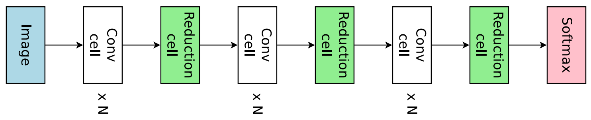
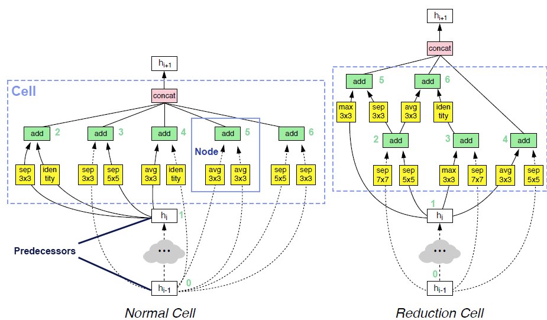
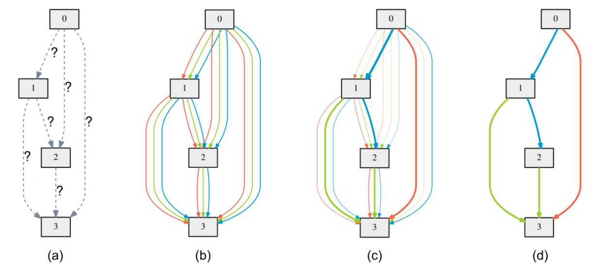
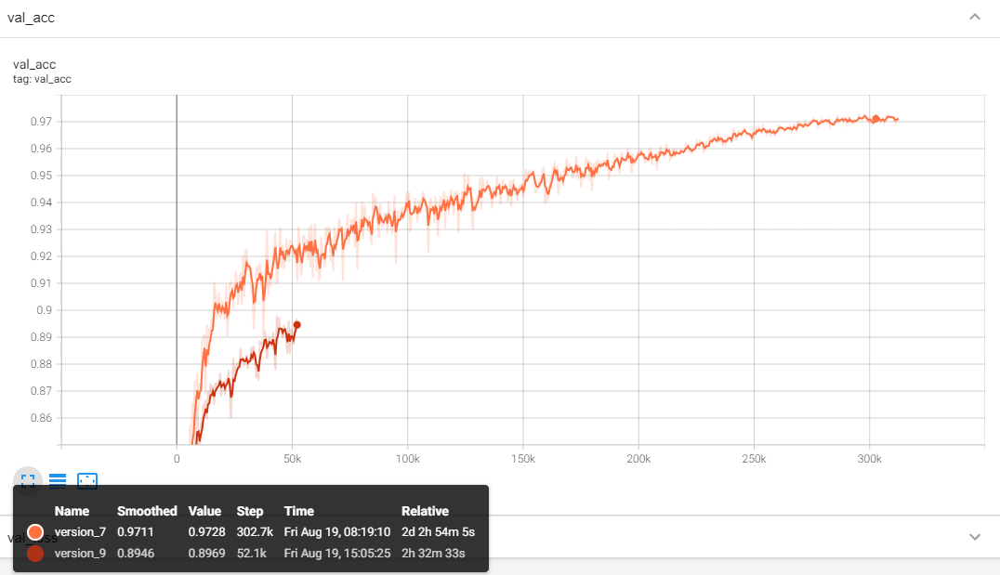

.. DO NOT EDIT.
.. THIS FILE WAS AUTOMATICALLY GENERATED BY SPHINX-GALLERY.
.. TO MAKE CHANGES, EDIT THE SOURCE PYTHON FILE:
.. "tutorials/darts.py"
.. LINE NUMBERS ARE GIVEN BELOW.

.. only:: html

    .. note::
        :class: sphx-glr-download-link-note

        :ref:`Go to the end <sphx_glr_download_tutorials_darts.py>`
        to download the full example code

.. rst-class:: sphx-glr-example-title

.. _sphx_glr_tutorials_darts.py:

Searching in DARTS search space
===============================

In this tutorial, we demonstrate how to search in the famous model space proposed in `DARTS`_.

Through this process, you will learn:

* How to use the built-in model spaces from NNI's model space hub.
* How to use one-shot exploration strategies to explore a model space.
* How to customize evaluators to achieve the best performance.

In the end, we get a strong-performing model on CIFAR-10 dataset, which achieves up to 97.28% accuracy.

.. attention::

   Running this tutorial requires a GPU.
   If you don't have one, you can set ``gpus`` in :class:`~nni.nas.evaluator.pytorch.Classification` to be 0,
   but do note that it will be much slower.

.. _DARTS: https://arxiv.org/abs/1806.09055

Use a pre-searched DARTS model
------------------------------

Similar to `the beginner tutorial of PyTorch <https://pytorch.org/tutorials/beginner/blitz/cifar10_tutorial.html>`__,
we begin with CIFAR-10 dataset, which is a image classification dataset of 10 categories.
The images in CIFAR-10 are of size 3x32x32, i.e., RGB-colored images of 32x32 pixels in size.

We first load the CIFAR-10 dataset with torchvision.

.. GENERATED FROM PYTHON SOURCE LINES 32-49

.. code-block:: default

    import nni
    import torch
    from torchvision import transforms
    from torchvision.datasets import CIFAR10
    from nni.nas.evaluator.pytorch import DataLoader

    CIFAR_MEAN = [0.49139968, 0.48215827, 0.44653124]
    CIFAR_STD = [0.24703233, 0.24348505, 0.26158768]

    transform_valid = transforms.Compose([
        transforms.ToTensor(),
        transforms.Normalize(CIFAR_MEAN, CIFAR_STD),
    ])
    valid_data = nni.trace(CIFAR10)(root='./data', train=False, download=True, transform=transform_valid)
    valid_loader = DataLoader(valid_data, batch_size=256, num_workers=6)

.. rst-class:: sphx-glr-script-out

 .. code-block:: none

    Files already downloaded and verified

.. GENERATED FROM PYTHON SOURCE LINES 50-70

.. note::

   If you are to use multi-trial strategies, wrapping CIFAR10 with :func:`nni.trace` and
   use DataLoader from ``nni.nas.evaluator.pytorch`` (instead of ``torch.utils.data``) are mandatory.
   Otherwise, it's optional.

NNI presents many built-in model spaces, along with many *pre-searched models* in :doc:`model space hub </nas/space_hub>`,
which are produced by most popular NAS literatures.
A pre-trained model is a saved network that was previously trained on a large dataset like CIFAR-10 or ImageNet.
You can easily load these models as a starting point, validate their performances, and finetune them if you need.

In this tutorial, we choose one from `DARTS`_ search space, which is natively trained on our target dataset, CIFAR-10,
so as to save the tedious steps of finetuning.

.. tip::

   Finetuning a pre-searched model on other datasets is no different from finetuning *any model*.
   We recommend reading
   `this tutorial of object detection finetuning <https://pytorch.org/tutorials/intermediate/torchvision_tutorial.html>`__
   if you want to know how finetuning is generally done in PyTorch.

.. GENERATED FROM PYTHON SOURCE LINES 71-93

.. code-block:: default

    from nni.nas.hub.pytorch import DARTS as DartsSpace

    darts_v2_model = DartsSpace.load_searched_model('darts-v2', pretrained=True, download=True)

    def evaluate_model(model, cuda=False):
        device = torch.device('cuda' if cuda else 'cpu')
        model.to(device)
        model.eval()
        with torch.no_grad():
            correct = total = 0
            for inputs, targets in valid_loader:
                inputs, targets = inputs.to(device), targets.to(device)
                logits = model(inputs)
                _, predict = torch.max(logits, 1)
                correct += (predict == targets).sum().cpu().item()
                total += targets.size(0)
        print('Accuracy:', correct / total)
        return correct / total

    evaluate_model(darts_v2_model, cuda=True)  # Set this to false if there's no GPU.

.. rst-class:: sphx-glr-script-out

 .. code-block:: none

    /home/yugzhan/miniconda3/envs/cu102/lib/python3.8/site-packages/ray/autoscaler/_private/cli_logger.py:57: FutureWarning: Not all Ray CLI dependencies were found. In Ray 1.4+, the Ray CLI, autoscaler, and dashboard will only be usable via `pip install 'ray[default]'`. Please update your install command.
      warnings.warn(
    /home/yugzhan/nni/nni/nas/profiler/pytorch/utils/shape_formula.py:107: UserWarning: Cannot find a default in torch.ops.aten because <built-in method relu of PyCapsule object at 0x7fa2d74d25a0> has no attribute default. Skip registering the shape inference formula.
      warnings.warn(f'Cannot find a {name} in torch.ops.aten because {object} has no attribute {name}. '
    /home/yugzhan/nni/nni/nas/profiler/pytorch/utils/shape_formula.py:107: UserWarning: Cannot find a default in torch.ops.aten because <built-in method gelu of PyCapsule object at 0x7fa2d74d25d0> has no attribute default. Skip registering the shape inference formula.
      warnings.warn(f'Cannot find a {name} in torch.ops.aten because {object} has no attribute {name}. '
    /home/yugzhan/nni/nni/nas/profiler/pytorch/utils/shape_formula.py:107: UserWarning: Cannot find a default in torch.ops.aten because <built-in method hardswish of PyCapsule object at 0x7fa2d74d2720> has no attribute default. Skip registering the shape inference formula.
      warnings.warn(f'Cannot find a {name} in torch.ops.aten because {object} has no attribute {name}. '
    /home/yugzhan/nni/nni/nas/profiler/pytorch/utils/shape_formula.py:107: UserWarning: Cannot find a default in torch.ops.aten because <built-in method hardsigmoid of PyCapsule object at 0x7fa2d74d2870> has no attribute default. Skip registering the shape inference formula.
      warnings.warn(f'Cannot find a {name} in torch.ops.aten because {object} has no attribute {name}. '
    /home/yugzhan/nni/nni/nas/profiler/pytorch/utils/shape_formula.py:107: UserWarning: Cannot find a default in torch.ops.aten because <built-in method relu_ of PyCapsule object at 0x7fa2d74d2960> has no attribute default. Skip registering the shape inference formula.
      warnings.warn(f'Cannot find a {name} in torch.ops.aten because {object} has no attribute {name}. '
    /home/yugzhan/nni/nni/nas/profiler/pytorch/utils/shape_formula.py:107: UserWarning: Cannot find a default in torch.ops.aten because <built-in method hardswish_ of PyCapsule object at 0x7fa2d74d2900> has no attribute default. Skip registering the shape inference formula.
      warnings.warn(f'Cannot find a {name} in torch.ops.aten because {object} has no attribute {name}. '
    /home/yugzhan/nni/nni/nas/profiler/pytorch/utils/shape_formula.py:107: UserWarning: Cannot find a default in torch.ops.aten because <built-in method hardsigmoid_ of PyCapsule object at 0x7fa2d74d2930> has no attribute default. Skip registering the shape inference formula.
      warnings.warn(f'Cannot find a {name} in torch.ops.aten because {object} has no attribute {name}. '
    /home/yugzhan/nni/nni/nas/profiler/pytorch/utils/shape_formula.py:107: UserWarning: Cannot find a default in torch.ops.aten because <built-in method hardtanh_ of PyCapsule object at 0x7fa2d74d28d0> has no attribute default. Skip registering the shape inference formula.
      warnings.warn(f'Cannot find a {name} in torch.ops.aten because {object} has no attribute {name}. '
    /home/yugzhan/nni/nni/nas/profiler/pytorch/utils/shape_formula.py:107: UserWarning: Cannot find a default in torch.ops.aten because <built-in method permute of PyCapsule object at 0x7fa2d74d28a0> has no attribute default. Skip registering the shape inference formula.
      warnings.warn(f'Cannot find a {name} in torch.ops.aten because {object} has no attribute {name}. '
    /home/yugzhan/nni/nni/nas/profiler/pytorch/utils/shape_formula.py:107: UserWarning: Cannot find a int in torch.ops.aten because <built-in method select of PyCapsule object at 0x7fa2d74d2990> has no attribute int. Skip registering the shape inference formula.
      warnings.warn(f'Cannot find a {name} in torch.ops.aten because {object} has no attribute {name}. '
    /home/yugzhan/nni/nni/nas/profiler/pytorch/utils/shape_formula.py:107: UserWarning: Cannot find a default in torch.ops.aten because <built-in method cat of PyCapsule object at 0x7fa2d74d26f0> has no attribute default. Skip registering the shape inference formula.
      warnings.warn(f'Cannot find a {name} in torch.ops.aten because {object} has no attribute {name}. '
    /home/yugzhan/nni/nni/nas/profiler/pytorch/utils/shape_formula.py:107: UserWarning: Cannot find a dim in torch.ops.aten because <built-in method mean of PyCapsule object at 0x7fa2d74d29f0> has no attribute dim. Skip registering the shape inference formula.
      warnings.warn(f'Cannot find a {name} in torch.ops.aten because {object} has no attribute {name}. '
    /home/yugzhan/nni/nni/nas/profiler/pytorch/utils/shape_formula.py:107: UserWarning: Cannot find a default in torch.ops.aten because <built-in method _log_softmax of PyCapsule object at 0x7fa2d74d2a20> has no attribute default. Skip registering the shape inference formula.
      warnings.warn(f'Cannot find a {name} in torch.ops.aten because {object} has no attribute {name}. '
    /home/yugzhan/nni/nni/nas/profiler/pytorch/utils/shape_formula.py:112: UserWarning: Fail to register shape inference formula for aten operator _reshape_alias because: No such operator aten::_reshape_alias
      warnings.warn(f'Fail to register shape inference formula for aten operator {name} because: {e}')
    /home/yugzhan/nni/nni/nas/profiler/pytorch/utils/shape_formula.py:107: UserWarning: Cannot find a Tensor in torch.ops.aten because <built-in method add of PyCapsule object at 0x7fa2d74d2ab0> has no attribute Tensor. Skip registering the shape inference formula.
      warnings.warn(f'Cannot find a {name} in torch.ops.aten because {object} has no attribute {name}. '
    /home/yugzhan/nni/nni/nas/profiler/pytorch/utils/shape_formula.py:107: UserWarning: Cannot find a Tensor in torch.ops.aten because <built-in method mul of PyCapsule object at 0x7fa2d74d2a80> has no attribute Tensor. Skip registering the shape inference formula.
      warnings.warn(f'Cannot find a {name} in torch.ops.aten because {object} has no attribute {name}. '
    /home/yugzhan/nni/nni/nas/profiler/pytorch/utils/shape_formula.py:107: UserWarning: Cannot find a Tensor in torch.ops.aten because <built-in method slice of PyCapsule object at 0x7fa2d74d2a50> has no attribute Tensor. Skip registering the shape inference formula.
      warnings.warn(f'Cannot find a {name} in torch.ops.aten because {object} has no attribute {name}. '
    Accuracy: 0.9737

    0.9737

.. GENERATED FROM PYTHON SOURCE LINES 94-158

The journey of using a pre-searched model could end here. Or you are interested,
we can go a step further to search a model within :class:`~nni.nas.hub.pytorch.DARTS` space on our own.

Use the DARTS model space
-------------------------

The model space provided in `DARTS`_ originated from `NASNet <https://arxiv.org/abs/1707.07012>`__,
where the full model is constructed by repeatedly stacking a single computational unit (called a **cell**).
There are two types of cells within a network. The first type is called *normal cell*, and the second type is called *reduction cell*.
The key difference between normal and reduction cell is that the reduction cell will downsample the input feature map,
and decrease its resolution. Normal and reduction cells are stacked alternately, as shown in the following figure.

A cell takes outputs from two previous cells as inputs and contains a collection of *nodes*.
Each node takes two previous nodes within the same cell (or the two cell inputs),
and applies an *operator* (e.g., convolution, or max-pooling) to each input,
and sums the outputs of operators as the output of the node.
The output of cell is the concatenation of all the nodes that are never used as inputs of another node.
Users could read `NDS <https://arxiv.org/pdf/1905.13214.pdf>`__ or `ENAS <https://arxiv.org/abs/1802.03268>`__ for more details.

We illustrate an example of cells in the following figure.

The search space proposed in `DARTS`_ paper introduced two modifications to the original space
in `NASNet <https://arxiv.org/abs/1707.07012>`__.

Firstly, the operator candidates have been narrowed down to seven:

- Max pooling 3x3
- Average pooling 3x3
- Skip connect (Identity)
- Separable convolution 3x3
- Separable convolution 5x5
- Dilated convolution 3x3
- Dilated convolution 5x5

Secondly, the output of cell is the concatenate of **all the nodes within the cell**.

As the search space is based on cell, once the normal and reduction cell has been fixed, we can stack them for indefinite times.
To save the search cost, the common practice is to reduce the number of filters (i.e., channels) and number of stacked cells
during the search phase, and increase them back when training the final searched architecture.

.. note::

   `DARTS`_ is one of those papers that innovate both in search space and search strategy.
   In this tutorial, we will search on **model space** provided by DARTS with **search strategy** proposed by DARTS.
   We refer to them as *DARTS model space* (``DartsSpace``) and *DARTS strategy* (``DartsStrategy``), respectively.
   We did NOT imply that the :class:`~nni.nas.hub.pytorch.DARTS` space and
   :class:`~nni.nas.strategy.DARTS` strategy has to used together.
   You can always explore the DARTS space with another search strategy, or use your own strategy to search a different model space.

In the following example, we initialize a :class:`~nni.nas.hub.pytorch.DARTS`
model space, with 16 initial filters and 8 stacked cells.
The network is specialized for CIFAR-10 dataset with 32x32 input resolution.

The :class:`~nni.nas.hub.pytorch.DARTS` model space here is provided by :doc:`model space hub </nas/space_hub>`,
where we have supported multiple popular model spaces for plug-and-play.

.. tip::

   The model space here can be replaced with any space provided in the hub,
   or even customized spaces built from scratch.

.. GENERATED FROM PYTHON SOURCE LINES 159-166

.. code-block:: default

    model_space = DartsSpace(
        width=16,           # the initial filters (channel number) for the model
        num_cells=8,        # the number of stacked cells in total
        dataset='cifar'     # to give a hint about input resolution, here is 32x32
    )

.. GENERATED FROM PYTHON SOURCE LINES 167-174

Search on the model space
-------------------------

.. warning::

   Please set ``fast_dev_run`` to False to reproduce the our claimed results.
   Otherwise, only a few mini-batches will be run.

.. GENERATED FROM PYTHON SOURCE LINES 175-178

.. code-block:: default

    fast_dev_run = True

.. GENERATED FROM PYTHON SOURCE LINES 179-190

Evaluator
^^^^^^^^^

To begin exploring the model space, one firstly need to have an evaluator to provide the criterion of a "good model".
As we are searching on CIFAR-10 dataset, one can easily use the :class:`~nni.nas.evaluator.pytorch.Classification`
as a starting point.

Note that for a typical setup of NAS, the model search should be on validation set, and the evaluation of the final searched model
should be on test set. However, as CIFAR-10 dataset doesn't have a test dataset (only 50k train + 10k valid),
we have to split the original training set into a training set and a validation set.
The recommended train/val split by `DARTS`_ strategy is 1:1.

.. GENERATED FROM PYTHON SOURCE LINES 191-229

.. code-block:: default

    import numpy as np
    from nni.nas.evaluator.pytorch import Classification
    from torch.utils.data import SubsetRandomSampler

    transform = transforms.Compose([
        transforms.RandomCrop(32, padding=4),
        transforms.RandomHorizontalFlip(),
        transforms.ToTensor(),
        transforms.Normalize(CIFAR_MEAN, CIFAR_STD),
    ])

    train_data = nni.trace(CIFAR10)(root='./data', train=True, download=True, transform=transform)

    num_samples = len(train_data)
    indices = np.random.permutation(num_samples)
    split = num_samples // 2

    search_train_loader = DataLoader(
        train_data, batch_size=64, num_workers=6,
        sampler=SubsetRandomSampler(indices[:split]),
    )

    search_valid_loader = DataLoader(
        train_data, batch_size=64, num_workers=6,
        sampler=SubsetRandomSampler(indices[split:]),
    )

    evaluator = Classification(
        learning_rate=1e-3,
        weight_decay=1e-4,
        train_dataloaders=search_train_loader,
        val_dataloaders=search_valid_loader,
        max_epochs=10,
        gpus=1,
        fast_dev_run=fast_dev_run,
    )

.. rst-class:: sphx-glr-script-out

 .. code-block:: none

    Files already downloaded and verified
    /home/yugzhan/miniconda3/envs/cu102/lib/python3.8/site-packages/pytorch_lightning/trainer/connectors/accelerator_connector.py:446: LightningDeprecationWarning: Setting `Trainer(gpus=1)` is deprecated in v1.7 and will be removed in v2.0. Please use `Trainer(accelerator='gpu', devices=1)` instead.
      rank_zero_deprecation(

.. GENERATED FROM PYTHON SOURCE LINES 230-250

Strategy
^^^^^^^^

We will use `DARTS`_ (Differentiable ARchiTecture Search) as the search strategy to explore the model space.
:class:`~nni.nas.strategy.DARTS` strategy belongs to the category of :ref:`one-shot strategy <one-shot-nas>`.
The fundamental differences between One-shot strategies and :ref:`multi-trial strategies <multi-trial-nas>` is that,
one-shot strategy combines search with model training into a single run.
Compared to multi-trial strategies, one-shot NAS doesn't need to iteratively spawn new trials (i.e., models),
and thus saves the excessive cost of model training.

.. note::

   It's worth mentioning that one-shot NAS also suffers from multiple drawbacks despite its computational efficiency.
   We recommend
   `Weight-Sharing Neural Architecture Search: A Battle to Shrink the Optimization Gap <https://arxiv.org/abs/2008.01475>`__
   and
   `How Does Supernet Help in Neural Architecture Search? <https://arxiv.org/abs/2010.08219>`__ for interested readers.

:class:`~nni.nas.strategy.DARTS` strategy is provided as one of NNI's :doc:`built-in search strategies </nas/exploration_strategy>`.
Using it can be as simple as one line of code.

.. GENERATED FROM PYTHON SOURCE LINES 251-256

.. code-block:: default

    from nni.nas.strategy import DARTS as DartsStrategy

    strategy = DartsStrategy()

.. GENERATED FROM PYTHON SOURCE LINES 257-275

.. tip:: The ``DartsStrategy`` here can be replaced by any search strategies, even multi-trial strategies.

If you want to know how DARTS strategy works, here is a brief version.
Under the hood, DARTS converts the cell into a densely connected graph, and put operators on edges (see the following figure).
Since the operators are not decided yet, every edge is a weighted mixture of multiple operators (multiple color in the figure).
DARTS then learns to assign the optimal "color" for each edge during the network training.
It finally selects one "color" for each edge, and drops redundant edges.
The weights on the edges are called *architecture weights*.

.. tip:: It's NOT reflected in the figure that, for DARTS model space, exactly two inputs are kept for every node.

Launch experiment
^^^^^^^^^^^^^^^^^

We then come to the step of launching the experiment.
This step is similar to what we have done in the :doc:`beginner tutorial <hello_nas>`.

.. GENERATED FROM PYTHON SOURCE LINES 276-282

.. code-block:: default

    from nni.nas.experiment import NasExperiment

    experiment = NasExperiment(model_space, evaluator, strategy)
    experiment.run()

.. rst-class:: sphx-glr-script-out

 .. code-block:: none

    `training_service` will be ignored for sequential execution engine.
    /home/yugzhan/miniconda3/envs/cu102/lib/python3.8/site-packages/pytorch_lightning/trainer/trainer.py:1555: PossibleUserWarning: The number of training batches (1) is smaller than the logging interval Trainer(log_every_n_steps=50). Set a lower value for log_every_n_steps if you want to see logs for the training epoch.
      rank_zero_warn(

    Training: 0it [00:00, ?it/s]
    Training:   0%|          | 0/1 [00:00<?, ?it/s]
    Epoch 0:   0%|          | 0/1 [00:00<?, ?it/s] 
    Epoch 0: 100%|##########| 1/1 [00:03<00:00,  3.29s/it]
    Epoch 0: 100%|##########| 1/1 [00:03<00:00,  3.30s/it, v_num=, train_loss=2.380, train_acc=0.156]
    Epoch 0: 100%|##########| 1/1 [00:03<00:00,  3.30s/it, v_num=, train_loss=2.380, train_acc=0.156]
    Epoch 0: 100%|##########| 1/1 [00:03<00:00,  3.31s/it, v_num=, train_loss=2.380, train_acc=0.156]

    True

.. GENERATED FROM PYTHON SOURCE LINES 283-295

.. tip::

   The search process can be visualized with tensorboard. For example::

       tensorboard --logdir=./lightning_logs

   Then, open the browser and go to http://localhost:6006/ to monitor the search process.

   .. image:: ../../img/darts_search_process.png

We can then retrieve the best model found by the strategy with ``export_top_models``.
Here, the retrieved model is a dict (called *architecture dict*) describing the selected normal cell and reduction cell.

.. GENERATED FROM PYTHON SOURCE LINES 296-301

.. code-block:: default

    exported_arch = experiment.export_top_models(formatter='dict')[0]

    exported_arch

.. rst-class:: sphx-glr-script-out

 .. code-block:: none

    {'normal/op_2_0': 'sep_conv_3x3', 'normal/input_2_0': [0], 'normal/op_2_1': 'dil_conv_5x5', 'normal/input_2_1': [1], 'normal/op_3_0': 'sep_conv_3x3', 'normal/input_3_0': [2], 'normal/op_3_1': 'sep_conv_5x5', 'normal/input_3_1': [1], 'normal/op_4_0': 'skip_connect', 'normal/input_4_0': [1], 'normal/op_4_1': 'sep_conv_3x3', 'normal/input_4_1': [2], 'normal/op_5_0': 'sep_conv_3x3', 'normal/input_5_0': [0], 'normal/op_5_1': 'sep_conv_3x3', 'normal/input_5_1': [3], 'reduce/op_2_0': 'dil_conv_3x3', 'reduce/input_2_0': [0], 'reduce/op_2_1': 'sep_conv_3x3', 'reduce/input_2_1': [1], 'reduce/op_3_0': 'sep_conv_5x5', 'reduce/input_3_0': [2], 'reduce/op_3_1': 'sep_conv_5x5', 'reduce/input_3_1': [1], 'reduce/op_4_0': 'dil_conv_5x5', 'reduce/input_4_0': [2], 'reduce/op_4_1': 'avg_pool_3x3', 'reduce/input_4_1': [1], 'reduce/op_5_0': 'sep_conv_5x5', 'reduce/input_5_0': [3], 'reduce/op_5_1': 'dil_conv_5x5', 'reduce/input_5_1': [4]}

.. GENERATED FROM PYTHON SOURCE LINES 302-304

The cell can be visualized with the following code snippet
(copied and modified from `DARTS visualization <https://github.com/quark0/darts/blob/master/cnn/visualize.py>`__).

.. GENERATED FROM PYTHON SOURCE LINES 305-360

.. code-block:: default

    import io
    import graphviz
    import matplotlib.pyplot as plt
    from PIL import Image

    def plot_single_cell(arch_dict, cell_name):
        g = graphviz.Digraph(
            node_attr=dict(style='filled', shape='rect', align='center'),
            format='png'
        )
        g.body.extend(['rankdir=LR'])

        g.node('c_{k-2}', fillcolor='darkseagreen2')
        g.node('c_{k-1}', fillcolor='darkseagreen2')
        assert len(arch_dict) % 2 == 0

        for i in range(2, 6):
            g.node(str(i), fillcolor='lightblue')

        for i in range(2, 6):
            for j in range(2):
                op = arch_dict[f'{cell_name}/op_{i}_{j}']
                from_ = arch_dict[f'{cell_name}/input_{i}_{j}']
                if from_ == 0:
                    u = 'c_{k-2}'
                elif from_ == 1:
                    u = 'c_{k-1}'
                else:
                    u = str(from_)
                v = str(i)
                g.edge(u, v, label=op, fillcolor='gray')

        g.node('c_{k}', fillcolor='palegoldenrod')
        for i in range(2, 6):
            g.edge(str(i), 'c_{k}', fillcolor='gray')

        g.attr(label=f'{cell_name.capitalize()} cell')

        image = Image.open(io.BytesIO(g.pipe()))
        return image

    def plot_double_cells(arch_dict):
        image1 = plot_single_cell(arch_dict, 'normal')
        image2 = plot_single_cell(arch_dict, 'reduce')
        height_ratio = max(image1.size[1] / image1.size[0], image2.size[1] / image2.size[0]) 
        _, axs = plt.subplots(1, 2, figsize=(20, 10 * height_ratio))
        axs[0].imshow(image1)
        axs[1].imshow(image2)
        axs[0].axis('off')
        axs[1].axis('off')
        plt.show()

    plot_double_cells(exported_arch)

.. image-sg:: /tutorials/images/sphx_glr_darts_001.png
   :alt: darts
   :srcset: /tutorials/images/sphx_glr_darts_001.png
   :class: sphx-glr-single-img

.. GENERATED FROM PYTHON SOURCE LINES 361-365

.. warning:: The cell above is obtained via ``fast_dev_run`` (i.e., running only 1 mini-batch).

When ``fast_dev_run`` is turned off, we get a model with the following architecture,
where you might notice an interesting fact that around half the operations have selected ``sep_conv_3x3``.

.. GENERATED FROM PYTHON SOURCE LINES 366-402

.. code-block:: default

    plot_double_cells({
        'normal/op_2_0': 'sep_conv_3x3',
        'normal/input_2_0': 1,
        'normal/op_2_1': 'sep_conv_3x3',
        'normal/input_2_1': 0,
        'normal/op_3_0': 'sep_conv_3x3',
        'normal/input_3_0': 1,
        'normal/op_3_1': 'sep_conv_3x3',
        'normal/input_3_1': 2,
        'normal/op_4_0': 'sep_conv_3x3',
        'normal/input_4_0': 1,
        'normal/op_4_1': 'sep_conv_3x3',
        'normal/input_4_1': 0,
        'normal/op_5_0': 'sep_conv_3x3',
        'normal/input_5_0': 1,
        'normal/op_5_1': 'max_pool_3x3',
        'normal/input_5_1': 0,
        'reduce/op_2_0': 'sep_conv_3x3',
        'reduce/input_2_0': 0,
        'reduce/op_2_1': 'sep_conv_3x3',
        'reduce/input_2_1': 1,
        'reduce/op_3_0': 'dil_conv_5x5',
        'reduce/input_3_0': 2,
        'reduce/op_3_1': 'sep_conv_3x3',
        'reduce/input_3_1': 0,
        'reduce/op_4_0': 'dil_conv_5x5',
        'reduce/input_4_0': 2,
        'reduce/op_4_1': 'sep_conv_5x5',
        'reduce/input_4_1': 1,
        'reduce/op_5_0': 'sep_conv_5x5',
        'reduce/input_5_0': 4,
        'reduce/op_5_1': 'dil_conv_5x5',
        'reduce/input_5_1': 2
    })

.. image-sg:: /tutorials/images/sphx_glr_darts_002.png
   :alt: darts
   :srcset: /tutorials/images/sphx_glr_darts_002.png
   :class: sphx-glr-single-img

.. GENERATED FROM PYTHON SOURCE LINES 403-413

Retrain the searched model
--------------------------

What we have got in the last step, is only a cell structure.
To get a final usable model with trained weights, we need to construct a real model based on this structure,
and then fully train it.

To construct a fixed model based on the architecture dict exported from the experiment,
we can use :func:`nni.nas.space.model_context`. Under the with-context, we will creating a fixed model based on ``exported_arch``,
instead of creating a space.

.. GENERATED FROM PYTHON SOURCE LINES 414-420

.. code-block:: default

    from nni.nas.space import model_context

    with model_context(exported_arch):
        final_model = DartsSpace(width=16, num_cells=8, dataset='cifar')

.. GENERATED FROM PYTHON SOURCE LINES 421-422

We then train the model on full CIFAR-10 training dataset, and evaluate it on the original CIFAR-10 validation dataset.

.. GENERATED FROM PYTHON SOURCE LINES 423-426

.. code-block:: default

    train_loader = DataLoader(train_data, batch_size=96, num_workers=6)  # Use the original training data

.. GENERATED FROM PYTHON SOURCE LINES 427-428

The validation data loader can be reused.

.. GENERATED FROM PYTHON SOURCE LINES 429-432

.. code-block:: default

    valid_loader

.. rst-class:: sphx-glr-script-out

 .. code-block:: none

    <torch.utils.data.dataloader.DataLoader object at 0x7fa2eb2f21c0>

.. GENERATED FROM PYTHON SOURCE LINES 433-436

We must create a new evaluator here because a different data split is used.
Also, we should avoid the underlying pytorch-lightning implementation of :class:`~nni.nas.evaluator.pytorch.Classification`
evaluator from loading the wrong checkpoint.

.. GENERATED FROM PYTHON SOURCE LINES 437-453

.. code-block:: default

    max_epochs = 100

    evaluator = Classification(
        learning_rate=1e-3,
        weight_decay=1e-4,
        train_dataloaders=train_loader,
        val_dataloaders=valid_loader,
        max_epochs=max_epochs,
        gpus=1,
        export_onnx=False,          # Disable ONNX export for this experiment
        fast_dev_run=fast_dev_run   # Should be false for fully training
    )

    evaluator.fit(final_model)

.. rst-class:: sphx-glr-script-out

 .. code-block:: none

    /home/yugzhan/miniconda3/envs/cu102/lib/python3.8/site-packages/pytorch_lightning/trainer/connectors/accelerator_connector.py:446: LightningDeprecationWarning: Setting `Trainer(gpus=1)` is deprecated in v1.7 and will be removed in v2.0. Please use `Trainer(accelerator='gpu', devices=1)` instead.
      rank_zero_deprecation(
    /home/yugzhan/miniconda3/envs/cu102/lib/python3.8/site-packages/pytorch_lightning/trainer/trainer.py:1555: PossibleUserWarning: The number of training batches (1) is smaller than the logging interval Trainer(log_every_n_steps=50). Set a lower value for log_every_n_steps if you want to see logs for the training epoch.
      rank_zero_warn(

    Training: 0it [00:00, ?it/s]
    Training:   0%|          | 0/2 [00:00<?, ?it/s]
    Epoch 0:   0%|          | 0/2 [00:00<?, ?it/s] 
    Epoch 0:  50%|#####     | 1/2 [00:00<00:00,  1.77it/s]
    Epoch 0:  50%|#####     | 1/2 [00:00<00:00,  1.77it/s, loss=2.33, v_num=, train_loss=2.330, train_acc=0.104]

    Validation: 0it [00:00, ?it/s]

    Validation:   0%|          | 0/1 [00:00<?, ?it/s]

    Validation DataLoader 0:   0%|          | 0/1 [00:00<?, ?it/s]

    Validation DataLoader 0: 100%|##########| 1/1 [00:00<00:00, 13.64it/s]
    Epoch 0: 100%|##########| 2/2 [00:01<00:00,  1.93it/s, loss=2.33, v_num=, train_loss=2.330, train_acc=0.104]
    Epoch 0: 100%|##########| 2/2 [00:01<00:00,  1.93it/s, loss=2.33, v_num=, train_loss=2.330, train_acc=0.104, val_loss=2.300, val_acc=0.0898]

                                                                          
    Epoch 0: 100%|##########| 2/2 [00:01<00:00,  1.92it/s, loss=2.33, v_num=, train_loss=2.330, train_acc=0.104, val_loss=2.300, val_acc=0.0898]
    Epoch 0: 100%|##########| 2/2 [00:01<00:00,  1.92it/s, loss=2.33, v_num=, train_loss=2.330, train_acc=0.104, val_loss=2.300, val_acc=0.0898]

.. GENERATED FROM PYTHON SOURCE LINES 454-482

.. note:: When ``fast_dev_run`` is turned off, we achieve a validation accuracy of 89.69% after training for 100 epochs.

Reproduce results in DARTS paper
--------------------------------

After a brief walkthrough of search + retrain process with one-shot strategy,
we then fill the gap between our results (89.69%) and the results in the `DARTS` paper.
This is because we didn't introduce some extra training tricks, including `DropPath <https://arxiv.org/pdf/1605.07648v4.pdf>`__,
Auxiliary loss, gradient clipping and augmentations like `Cutout <https://arxiv.org/pdf/1708.04552v2.pdf>`__.
They also train the deeper (20 cells) and wider (36 filters) networks for longer time (600 epochs).
Here we reproduce these tricks to get comparable results with DARTS paper.

Evaluator
^^^^^^^^^

To implement these tricks, we first need to rewrite a few parts of evaluator.

Working with one-shot strategies, evaluators need to be implemented in the style of :ref:`PyTorch-Lightning <lightning-evaluator>`,
The full tutorial can be found in :doc:`/nas/evaluator`.
Putting it briefly, the core part of writing a new evaluator is to write a new LightningModule.
`LightingModule <https://pytorch-lightning.readthedocs.io/en/stable/common/lightning_module.html>`__ is a concept in
PyTorch-Lightning, which organizes the model training process into a list of functions, such as,
``training_step``, ``validation_step``, ``configure_optimizers``, etc.
Since we are merely adding a few ingredients to :class:`~nni.nas.evaluator.pytorch.Classification`,
we can simply inherit :class:`~nni.nas.evaluator.pytorch.ClassificationModule`, which is the underlying LightningModule
behind :class:`~nni.nas.evaluator.pytorch.Classification`.
This could look intimidating at first, but most of them are just plug-and-play tricks which you don't need to know details about.

.. GENERATED FROM PYTHON SOURCE LINES 483-538

.. code-block:: default

    import torch
    from nni.nas.evaluator.pytorch import ClassificationModule

    class DartsClassificationModule(ClassificationModule):
        def __init__(
            self,
            learning_rate: float = 0.001,
            weight_decay: float = 0.,
            auxiliary_loss_weight: float = 0.4,
            max_epochs: int = 600
        ):
            self.auxiliary_loss_weight = auxiliary_loss_weight
            # Training length will be used in LR scheduler
            self.max_epochs = max_epochs
            super().__init__(learning_rate=learning_rate, weight_decay=weight_decay, export_onnx=False)

        def configure_optimizers(self):
            """Customized optimizer with momentum, as well as a scheduler."""
            optimizer = torch.optim.SGD(
                self.parameters(),
                momentum=0.9,
                lr=self.hparams.learning_rate,
                weight_decay=self.hparams.weight_decay
            )
            return {
                'optimizer': optimizer,
                'lr_scheduler': torch.optim.lr_scheduler.CosineAnnealingLR(optimizer, self.max_epochs, eta_min=1e-3)
            }

        def training_step(self, batch, batch_idx):
            """Training step, customized with auxiliary loss."""
            x, y = batch
            if self.auxiliary_loss_weight:
                y_hat, y_aux = self(x)
                loss_main = self.criterion(y_hat, y)
                loss_aux = self.criterion(y_aux, y)
                self.log('train_loss_main', loss_main)
                self.log('train_loss_aux', loss_aux)
                loss = loss_main + self.auxiliary_loss_weight * loss_aux
            else:
                y_hat = self(x)
                loss = self.criterion(y_hat, y)
            self.log('train_loss', loss, prog_bar=True)
            for name, metric in self.metrics.items():
                self.log('train_' + name, metric(y_hat, y), prog_bar=True)
            return loss

        def on_train_epoch_start(self):
            # Set drop path probability before every epoch. This has no effect if drop path is not enabled in model.
            self.model.set_drop_path_prob(self.model.drop_path_prob * self.current_epoch / self.max_epochs)

            # Logging learning rate at the beginning of every epoch
            self.log('lr', self.trainer.optimizers[0].param_groups[0]['lr'])

.. GENERATED FROM PYTHON SOURCE LINES 539-543

The full evaluator is written as follows,
which simply wraps everything (except model space and search strategy of course), in a single object.
:class:`~nni.nas.evaluator.pytorch.Lightning` here is a special type of evaluator.
Don't forget to use the train/val data split specialized for search (1:1) here.

.. GENERATED FROM PYTHON SOURCE LINES 544-560

.. code-block:: default

    from nni.nas.evaluator.pytorch import Lightning, Trainer

    max_epochs = 50

    evaluator = Lightning(
        DartsClassificationModule(0.025, 3e-4, 0., max_epochs),
        Trainer(
            gpus=1,
            max_epochs=max_epochs,
            fast_dev_run=fast_dev_run,
        ),
        train_dataloaders=search_train_loader,
        val_dataloaders=search_valid_loader
    )

.. rst-class:: sphx-glr-script-out

 .. code-block:: none

    /home/yugzhan/miniconda3/envs/cu102/lib/python3.8/site-packages/pytorch_lightning/trainer/connectors/accelerator_connector.py:446: LightningDeprecationWarning: Setting `Trainer(gpus=1)` is deprecated in v1.7 and will be removed in v2.0. Please use `Trainer(accelerator='gpu', devices=1)` instead.
      rank_zero_deprecation(

.. GENERATED FROM PYTHON SOURCE LINES 561-569

Strategy
^^^^^^^^

:class:`~nni.nas.strategy.DARTS` strategy is created with gradient clip turned on.
If you are familiar with PyTorch-Lightning, you might aware that gradient clipping can be enabled in Lightning trainer.
However, enabling gradient clip in the trainer above won't work, because the underlying
implementation of :class:`~nni.nas.strategy.DARTS` strategy is based on
`manual optimization <https://pytorch-lightning.readthedocs.io/en/stable/common/optimization.html>`__.

.. GENERATED FROM PYTHON SOURCE LINES 570-573

.. code-block:: default

    strategy = DartsStrategy(gradient_clip_val=5.)

.. GENERATED FROM PYTHON SOURCE LINES 574-583

Launch experiment
^^^^^^^^^^^^^^^^^

Then we use the newly created evaluator and strategy to launch the experiment again.

.. warning::

   ``model_space`` has to be re-instantiated because a known limitation,
   i.e., one model space instance can't be reused across multiple experiments.

.. GENERATED FROM PYTHON SOURCE LINES 584-594

.. code-block:: default

    model_space = DartsSpace(width=16, num_cells=8, dataset='cifar')

    experiment = NasExperiment(model_space, evaluator, strategy)
    experiment.run()

    exported_arch = experiment.export_top_models(formatter='dict')[0]

    exported_arch

.. rst-class:: sphx-glr-script-out

 .. code-block:: none

    /home/yugzhan/miniconda3/envs/cu102/lib/python3.8/site-packages/pytorch_lightning/trainer/trainer.py:1555: PossibleUserWarning: The number of training batches (1) is smaller than the logging interval Trainer(log_every_n_steps=50). Set a lower value for log_every_n_steps if you want to see logs for the training epoch.
      rank_zero_warn(

    Training: 0it [00:00, ?it/s]
    Training:   0%|          | 0/1 [00:00<?, ?it/s]
    Epoch 0:   0%|          | 0/1 [00:00<?, ?it/s] 
    Epoch 0: 100%|##########| 1/1 [00:02<00:00,  2.84s/it]
    Epoch 0: 100%|##########| 1/1 [00:02<00:00,  2.84s/it, v_num=, train_loss=2.410, train_acc=0.0781]
    Epoch 0: 100%|##########| 1/1 [00:02<00:00,  2.85s/it, v_num=, train_loss=2.410, train_acc=0.0781]
    Epoch 0: 100%|##########| 1/1 [00:02<00:00,  2.86s/it, v_num=, train_loss=2.410, train_acc=0.0781]

    {'normal/op_2_0': 'dil_conv_5x5', 'normal/input_2_0': [0], 'normal/op_2_1': 'dil_conv_5x5', 'normal/input_2_1': [1], 'normal/op_3_0': 'sep_conv_3x3', 'normal/input_3_0': [0], 'normal/op_3_1': 'sep_conv_5x5', 'normal/input_3_1': [2], 'normal/op_4_0': 'avg_pool_3x3', 'normal/input_4_0': [3], 'normal/op_4_1': 'dil_conv_3x3', 'normal/input_4_1': [2], 'normal/op_5_0': 'avg_pool_3x3', 'normal/input_5_0': [0], 'normal/op_5_1': 'sep_conv_5x5', 'normal/input_5_1': [2], 'reduce/op_2_0': 'dil_conv_3x3', 'reduce/input_2_0': [1], 'reduce/op_2_1': 'dil_conv_5x5', 'reduce/input_2_1': [0], 'reduce/op_3_0': 'skip_connect', 'reduce/input_3_0': [0], 'reduce/op_3_1': 'avg_pool_3x3', 'reduce/input_3_1': [1], 'reduce/op_4_0': 'max_pool_3x3', 'reduce/input_4_0': [2], 'reduce/op_4_1': 'max_pool_3x3', 'reduce/input_4_1': [3], 'reduce/op_5_0': 'dil_conv_3x3', 'reduce/input_5_0': [4], 'reduce/op_5_1': 'dil_conv_5x5', 'reduce/input_5_1': [3]}

.. GENERATED FROM PYTHON SOURCE LINES 595-596

We get the following architecture when ``fast_dev_run`` is set to False. It takes around 8 hours on a P100 GPU.

.. GENERATED FROM PYTHON SOURCE LINES 597-633

.. code-block:: default

    plot_double_cells({
        'normal/op_2_0': 'sep_conv_3x3',
        'normal/input_2_0': 0,
        'normal/op_2_1': 'sep_conv_3x3',
        'normal/input_2_1': 1,
        'normal/op_3_0': 'sep_conv_3x3',
        'normal/input_3_0': 1,
        'normal/op_3_1': 'skip_connect',
        'normal/input_3_1': 0,
        'normal/op_4_0': 'sep_conv_3x3',
        'normal/input_4_0': 0,
        'normal/op_4_1': 'max_pool_3x3',
        'normal/input_4_1': 1,
        'normal/op_5_0': 'sep_conv_3x3',
        'normal/input_5_0': 0,
        'normal/op_5_1': 'sep_conv_3x3',
        'normal/input_5_1': 1,
        'reduce/op_2_0': 'max_pool_3x3',
        'reduce/input_2_0': 0,
        'reduce/op_2_1': 'sep_conv_5x5',
        'reduce/input_2_1': 1,
        'reduce/op_3_0': 'dil_conv_5x5',
        'reduce/input_3_0': 2,
        'reduce/op_3_1': 'max_pool_3x3',
        'reduce/input_3_1': 0,
        'reduce/op_4_0': 'max_pool_3x3',
        'reduce/input_4_0': 0,
        'reduce/op_4_1': 'sep_conv_3x3',
        'reduce/input_4_1': 2,
        'reduce/op_5_0': 'max_pool_3x3',
        'reduce/input_5_0': 0,
        'reduce/op_5_1': 'skip_connect',
        'reduce/input_5_1': 2
    })

.. image-sg:: /tutorials/images/sphx_glr_darts_003.png
   :alt: darts
   :srcset: /tutorials/images/sphx_glr_darts_003.png
   :class: sphx-glr-single-img

.. GENERATED FROM PYTHON SOURCE LINES 634-641

Retrain
^^^^^^^

When retraining,
we extend the original dataloader to introduce another trick called `Cutout <https://arxiv.org/pdf/1708.04552v2.pdf>`__.
Cutout is a data augmentation technique that randomly masks out rectangular regions in images.
In CIFAR-10, the typical masked size is 16x16 (the image sizes are 32x32 in the dataset).

.. GENERATED FROM PYTHON SOURCE LINES 642-668

.. code-block:: default

    def cutout_transform(img, length: int = 16):
        h, w = img.size(1), img.size(2)
        mask = np.ones((h, w), np.float32)
        y = np.random.randint(h)
        x = np.random.randint(w)

        y1 = np.clip(y - length // 2, 0, h)
        y2 = np.clip(y + length // 2, 0, h)
        x1 = np.clip(x - length // 2, 0, w)
        x2 = np.clip(x + length // 2, 0, w)

        mask[y1: y2, x1: x2] = 0.
        mask = torch.from_numpy(mask)
        mask = mask.expand_as(img)
        img *= mask
        return img

    transform_with_cutout = transforms.Compose([
        transforms.RandomCrop(32, padding=4),
        transforms.RandomHorizontalFlip(),
        transforms.ToTensor(),
        transforms.Normalize(CIFAR_MEAN, CIFAR_STD),
        cutout_transform,
    ])

.. GENERATED FROM PYTHON SOURCE LINES 669-671

The train dataloader needs to be reinstantiated with the new transform.
The validation dataloader is not affected, and thus can be reused.

.. GENERATED FROM PYTHON SOURCE LINES 672-676

.. code-block:: default

    train_data_cutout = nni.trace(CIFAR10)(root='./data', train=True, download=True, transform=transform_with_cutout)
    train_loader_cutout = DataLoader(train_data_cutout, batch_size=96)

.. rst-class:: sphx-glr-script-out

 .. code-block:: none

    Files already downloaded and verified

.. GENERATED FROM PYTHON SOURCE LINES 677-682

We then create the final model based on the new exported architecture.
This time, auxiliary loss and drop path probability is enabled.

Following the same procedure as paper, we also increase the number of filters to 36, and number of cells to 20,
so as to reasonably increase the model size and boost the performance.

.. GENERATED FROM PYTHON SOURCE LINES 683-687

.. code-block:: default

    with model_context(exported_arch):
        final_model = DartsSpace(width=36, num_cells=20, dataset='cifar', auxiliary_loss=True, drop_path_prob=0.2)

.. GENERATED FROM PYTHON SOURCE LINES 688-689

We create a new evaluator for the retraining process, where the gradient clipping is put into the keyword arguments of trainer.

.. GENERATED FROM PYTHON SOURCE LINES 690-707

.. code-block:: default

    max_epochs = 600

    evaluator = Lightning(
        DartsClassificationModule(0.025, 3e-4, 0.4, max_epochs),
        trainer=Trainer(
            gpus=1,
            gradient_clip_val=5.,
            max_epochs=max_epochs,
            fast_dev_run=fast_dev_run
        ),
        train_dataloaders=train_loader_cutout,
        val_dataloaders=valid_loader,
    )

    evaluator.fit(final_model)

.. rst-class:: sphx-glr-script-out

 .. code-block:: none

    /home/yugzhan/miniconda3/envs/cu102/lib/python3.8/site-packages/pytorch_lightning/trainer/connectors/accelerator_connector.py:446: LightningDeprecationWarning: Setting `Trainer(gpus=1)` is deprecated in v1.7 and will be removed in v2.0. Please use `Trainer(accelerator='gpu', devices=1)` instead.
      rank_zero_deprecation(
    /home/yugzhan/miniconda3/envs/cu102/lib/python3.8/site-packages/pytorch_lightning/trainer/connectors/data_connector.py:224: PossibleUserWarning: The dataloader, train_dataloader, does not have many workers which may be a bottleneck. Consider increasing the value of the `num_workers` argument` (try 16 which is the number of cpus on this machine) in the `DataLoader` init to improve performance.
      rank_zero_warn(
    /home/yugzhan/miniconda3/envs/cu102/lib/python3.8/site-packages/pytorch_lightning/trainer/trainer.py:1555: PossibleUserWarning: The number of training batches (1) is smaller than the logging interval Trainer(log_every_n_steps=50). Set a lower value for log_every_n_steps if you want to see logs for the training epoch.
      rank_zero_warn(

    Training: 0it [00:00, ?it/s]
    Training:   0%|          | 0/2 [00:00<?, ?it/s]
    Epoch 0:   0%|          | 0/2 [00:00<?, ?it/s] 
    Epoch 0:  50%|#####     | 1/2 [00:00<00:00,  1.77it/s]
    Epoch 0:  50%|#####     | 1/2 [00:00<00:00,  1.77it/s, loss=3.36, v_num=, train_loss=3.360, train_acc=0.0729]

    Validation: 0it [00:00, ?it/s]

    Validation:   0%|          | 0/1 [00:00<?, ?it/s]

    Validation DataLoader 0:   0%|          | 0/1 [00:00<?, ?it/s]

    Validation DataLoader 0: 100%|##########| 1/1 [00:00<00:00,  1.55it/s]
    Epoch 0: 100%|##########| 2/2 [00:01<00:00,  1.26it/s, loss=3.36, v_num=, train_loss=3.360, train_acc=0.0729]
    Epoch 0: 100%|##########| 2/2 [00:01<00:00,  1.26it/s, loss=3.36, v_num=, train_loss=3.360, train_acc=0.0729, val_loss=2.300, val_acc=0.0938]

                                                                          
    Epoch 0: 100%|##########| 2/2 [00:01<00:00,  1.25it/s, loss=3.36, v_num=, train_loss=3.360, train_acc=0.0729, val_loss=2.300, val_acc=0.0938]
    Epoch 0: 100%|##########| 2/2 [00:01<00:00,  1.25it/s, loss=3.36, v_num=, train_loss=3.360, train_acc=0.0729, val_loss=2.300, val_acc=0.0938]

.. GENERATED FROM PYTHON SOURCE LINES 708-722

When ``fast_dev_run`` is turned off, after retraining, the architecture yields a top-1 accuracy of 97.12%.
If we take the best snapshot throughout the retrain process,
there is a chance that the top-1 accuracy will be 97.28%.

In the figure, the orange line is the validation accuracy curve after training for 600 epochs,
while the red line corresponding the previous version in this tutorial before adding all the training tricks and
only trains for 100 epochs.

The results outperforms "DARTS (first order) + cutout" in `DARTS`_ paper, which is only 97.00±0.14%.
It's even comparable with "DARTS (second order) + cutout" in the paper (97.24±0.09%),
though we didn't implement the second order version.
The implementation of second order DARTS is in our future plan, and we also welcome your contribution.

.. rst-class:: sphx-glr-timing

   **Total running time of the script:** ( 0 minutes  40.472 seconds)

.. _sphx_glr_download_tutorials_darts.py:

.. only:: html

  .. container:: sphx-glr-footer sphx-glr-footer-example

    .. container:: sphx-glr-download sphx-glr-download-python

      :download:`Download Python source code: darts.py <darts.py>`

    .. container:: sphx-glr-download sphx-glr-download-jupyter

      :download:`Download Jupyter notebook: darts.ipynb <darts.ipynb>`

.. only:: html

 .. rst-class:: sphx-glr-signature

    `Gallery generated by Sphinx-Gallery <https://sphinx-gallery.github.io>`_
