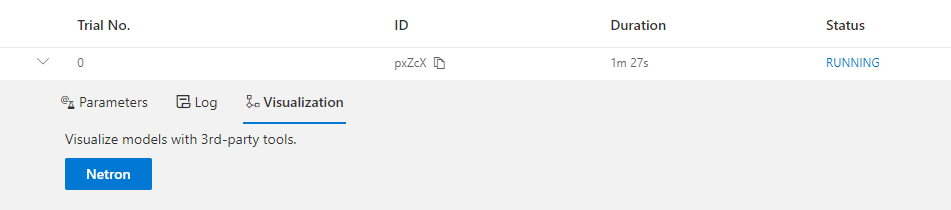

.. 8a873f2c9cb0e8e3ed2d66b9d16c330f

.. DO NOT EDIT.
.. THIS FILE WAS AUTOMATICALLY GENERATED BY SPHINX-GALLERY.
.. TO MAKE CHANGES, EDIT THE SOURCE PYTHON FILE:
.. "tutorials/hello_nas.py"
.. LINE NUMBERS ARE GIVEN BELOW.

.. only:: html

    .. note::
        :class: sphx-glr-download-link-note

        Click :ref:`here <sphx_glr_download_tutorials_hello_nas.py>`
        to download the full example code

.. rst-class:: sphx-glr-example-title

.. _sphx_glr_tutorials_hello_nas.py:

架构搜索入门教程
================

这是 NNI 上的神经架构搜索（NAS）的入门教程。
在本教程中，我们将借助 NNI 的 NAS 框架，即 *Retiarii*，在 MNIST 数据集上实现网络结构搜索。
我们以多尝试的架构搜索为例来展示如何构建和探索模型空间。

神经架构搜索任务主要有三个关键组成部分，即

* 模型搜索空间，定义了一个要探索的模型的集合。
* 一个合适的策略作为探索这个模型空间的方法。
* 一个模型评估器，用于为搜索空间中每个模型评估性能。

目前，Retiarii 只支持 PyTorch，并对 **PyTorch 1.7 到 1.10** 进行了测试。
所以本教程假定您使用 PyTorch 作为深度学习框架。未来我们会支持更多框架。

定义您的模型空间
----------------------

模型空间是由用户定义的，用来表达用户想要探索的一组模型，其中包含有潜力的好模型。
在 NNI 的框架中，模型空间由两部分定义：基本模型和基本模型上可能的变化。

.. GENERATED FROM PYTHON SOURCE LINES 26-34

定义基本模型
^^^^^^^^^^^^^^^^^

定义基本模型与定义 PyTorch（或 TensorFlow）模型几乎相同。
通常，您只需将代码 ``import torch.nn as nn`` 替换为
``import nni.retiarii.nn.pytorch as nn`` 以使用我们打包的 PyTorch 模块。

下面是定义基本模型的一个非常简单的示例。

.. GENERATED FROM PYTHON SOURCE LINES 35-61

.. code-block:: default

    import torch
    import torch.nn.functional as F
    import nni.retiarii.nn.pytorch as nn
    from nni.retiarii import model_wrapper

    @model_wrapper      # this decorator should be put on the out most
    class Net(nn.Module):
        def __init__(self):
            super().__init__()
            self.conv1 = nn.Conv2d(1, 32, 3, 1)
            self.conv2 = nn.Conv2d(32, 64, 3, 1)
            self.dropout1 = nn.Dropout(0.25)
            self.dropout2 = nn.Dropout(0.5)
            self.fc1 = nn.Linear(9216, 128)
            self.fc2 = nn.Linear(128, 10)

        def forward(self, x):
            x = F.relu(self.conv1(x))
            x = F.max_pool2d(self.conv2(x), 2)
            x = torch.flatten(self.dropout1(x), 1)
            x = self.fc2(self.dropout2(F.relu(self.fc1(x))))
            output = F.log_softmax(x, dim=1)
            return output

.. GENERATED FROM PYTHON SOURCE LINES 62-104

.. tip:: 记住，您应该使用 ``import nni.retiarii.nn.pytorch as nn`` 和 :meth:`nni.retiarii.model_wrapper`。
    许多错误都是因为忘记使用某一个。
    另外，要使用 ``nn.init`` 的子模块，可以使用 ``torch.nn``，例如， ``torch.nn.init`` 而不是 ``nn.init``。

定义模型变化
^^^^^^^^^^^^^^^^^^^^^^

基本模型只是一个具体模型，而不是模型空间。 我们提供 :doc:`模型变化的 API </nas/construct_space>`
让用户表达如何改变基本模型。 即构建一个包含许多模型的搜索空间。

基于上述基本模型，我们可以定义如下模型空间。

.. code-block:: diff

  @model_wrapper
  class Net(nn.Module):
    def __init__(self):
      super().__init__()
      self.conv1 = nn.Conv2d(1, 32, 3, 1)
  -   self.conv2 = nn.Conv2d(32, 64, 3, 1)
  +   self.conv2 = nn.LayerChoice([
  +       nn.Conv2d(32, 64, 3, 1),
  +       DepthwiseSeparableConv(32, 64)
  +   ])
  -   self.dropout1 = nn.Dropout(0.25)
  +   self.dropout1 = nn.Dropout(nn.ValueChoice([0.25, 0.5, 0.75]))
      self.dropout2 = nn.Dropout(0.5)
  -   self.fc1 = nn.Linear(9216, 128)
  -   self.fc2 = nn.Linear(128, 10)
  +   feature = nn.ValueChoice([64, 128, 256])
  +   self.fc1 = nn.Linear(9216, feature)
  +   self.fc2 = nn.Linear(feature, 10)

    def forward(self, x):
      x = F.relu(self.conv1(x))
      x = F.max_pool2d(self.conv2(x), 2)
      x = torch.flatten(self.dropout1(x), 1)
      x = self.fc2(self.dropout2(F.relu(self.fc1(x))))
      output = F.log_softmax(x, dim=1)
      return output

结果是以下代码：

.. GENERATED FROM PYTHON SOURCE LINES 104-147

.. code-block:: default

    class DepthwiseSeparableConv(nn.Module):
        def __init__(self, in_ch, out_ch):
            super().__init__()
            self.depthwise = nn.Conv2d(in_ch, in_ch, kernel_size=3, groups=in_ch)
            self.pointwise = nn.Conv2d(in_ch, out_ch, kernel_size=1)

        def forward(self, x):
            return self.pointwise(self.depthwise(x))

    @model_wrapper
    class ModelSpace(nn.Module):
        def __init__(self):
            super().__init__()
            self.conv1 = nn.Conv2d(1, 32, 3, 1)
            # LayerChoice is used to select a layer between Conv2d and DwConv.
            self.conv2 = nn.LayerChoice([
                nn.Conv2d(32, 64, 3, 1),
                DepthwiseSeparableConv(32, 64)
            ])
            # ValueChoice is used to select a dropout rate.
            # ValueChoice can be used as parameter of modules wrapped in `nni.retiarii.nn.pytorch`
            # or customized modules wrapped with `@basic_unit`.
            self.dropout1 = nn.Dropout(nn.ValueChoice([0.25, 0.5, 0.75]))  # choose dropout rate from 0.25, 0.5 and 0.75
            self.dropout2 = nn.Dropout(0.5)
            feature = nn.ValueChoice([64, 128, 256])
            self.fc1 = nn.Linear(9216, feature)
            self.fc2 = nn.Linear(feature, 10)

        def forward(self, x):
            x = F.relu(self.conv1(x))
            x = F.max_pool2d(self.conv2(x), 2)
            x = torch.flatten(self.dropout1(x), 1)
            x = self.fc2(self.dropout2(F.relu(self.fc1(x))))
            output = F.log_softmax(x, dim=1)
            return output

    model_space = ModelSpace()
    model_space

.. rst-class:: sphx-glr-script-out

 Out:

 .. code-block:: none

    ModelSpace(
      (conv1): Conv2d(1, 32, kernel_size=(3, 3), stride=(1, 1))
      (conv2): LayerChoice([Conv2d(32, 64, kernel_size=(3, 3), stride=(1, 1)), DepthwiseSeparableConv(
        (depthwise): Conv2d(32, 32, kernel_size=(3, 3), stride=(1, 1), groups=32)
        (pointwise): Conv2d(32, 64, kernel_size=(1, 1), stride=(1, 1))
      )], label='model_1')
      (dropout1): Dropout(p=0.25, inplace=False)
      (dropout2): Dropout(p=0.5, inplace=False)
      (fc1): Linear(in_features=9216, out_features=64, bias=True)
      (fc2): Linear(in_features=64, out_features=10, bias=True)
    )

.. GENERATED FROM PYTHON SOURCE LINES 148-182

这个例子使用了两个模型变化的 API， :class:`nn.LayerChoice <nni.retiarii.nn.pytorch.LayerChoice>` 和 :class:`nn.InputChoice <nni.retiarii.nn.pytorch.ValueChoice>`。
:class:`nn.LayerChoice <nni.retiarii.nn.pytorch.LayerChoice>` 可以从一系列的候选子模块中（在本例中为两个），为每个采样模型选择一个。
它可以像原来的 PyTorch 子模块一样使用。
:class:`nn.InputChoice <nni.retiarii.nn.pytorch.ValueChoice>` 的参数是一个候选值列表，语义是为每个采样模型选择一个值。

更详细的 API 描述和用法可以在 :doc:`这里 </nas/construct_space>` 找到。

.. note::

    我们正在积极丰富模型变化的 API，使得您可以轻松构建模型空间。
    如果当前支持的模型变化的 API 不能表达您的模型空间，
    请参考 :doc:`这篇文档 </nas/mutator>` 来自定义突变。

探索定义的模型空间
-------------------------------------------

简单来讲，有两种探索方法：
(1) 独立评估每个采样到的模型，这是 :ref:`多尝试 NAS <multi-trial-nas>` 中的搜索方法。
(2) 单尝试共享权重型的搜索，简称单尝试 NAS。
我们在本教程中演示了第一种方法。第二种方法用户可以参考 :ref:`这里 <one-shot-nas>`。

首先，用户需要选择合适的探索策略来探索定义好的模型空间。
其次，用户需要选择或自定义模型性能评估来评估每个探索模型的性能。

选择探索策略
^^^^^^^^^^^^^^^^^^^^^^^^^^^^

Retiarii 支持许多 :doc:`探索策略</nas/exploration_strategy>`。

只需选择（即实例化）探索策略，就如下面的代码演示的一样：

.. GENERATED FROM PYTHON SOURCE LINES 182-186

.. code-block:: default

    import nni.retiarii.strategy as strategy
    search_strategy = strategy.Random(dedup=True)  # dedup=False if deduplication is not wanted

.. rst-class:: sphx-glr-script-out

 Out:

 .. code-block:: none

    /home/yugzhan/miniconda3/envs/cu102/lib/python3.8/site-packages/ray/autoscaler/_private/cli_logger.py:57: FutureWarning: Not all Ray CLI dependencies were found. In Ray 1.4+, the Ray CLI, autoscaler, and dashboard will only be usable via `pip install 'ray[default]'`. Please update your install command.
      warnings.warn(

.. GENERATED FROM PYTHON SOURCE LINES 187-200

挑选或自定义模型评估器
^^^^^^^^^^^^^^^^^^^^^^^^^^^^^^^^^^^

在探索过程中，探索策略反复生成新模型。模型评估器负责训练并验证每个生成的模型以获得模型的性能。
该性能作为模型的得分被发送到探索策略以帮助其生成更好的模型。

Retiarii 提供了 :doc:`内置模型评估器 </nas/evaluator>`，但在此之前，
我们建议使用 :class:`FunctionalEvaluator <nni.retiarii.evaluator.FunctionalEvaluator>`，即用一个函数包装您自己的训练和评估代码。
这个函数应该接收一个单一的模型类并使用 :func:`nni.report_final_result` 报告这个模型的最终分数。

此处的示例创建了一个简单的评估器，该评估器在 MNIST 数据集上运行，训练 2 个 epoch，并报告其在验证集上的准确率。

.. GENERATED FROM PYTHON SOURCE LINES 200-268

.. code-block:: default

    import nni

    from torchvision import transforms
    from torchvision.datasets import MNIST
    from torch.utils.data import DataLoader

    def train_epoch(model, device, train_loader, optimizer, epoch):
        loss_fn = torch.nn.CrossEntropyLoss()
        model.train()
        for batch_idx, (data, target) in enumerate(train_loader):
            data, target = data.to(device), target.to(device)
            optimizer.zero_grad()
            output = model(data)
            loss = loss_fn(output, target)
            loss.backward()
            optimizer.step()
            if batch_idx % 10 == 0:
                print('Train Epoch: {} [{}/{} ({:.0f}%)]\tLoss: {:.6f}'.format(
                    epoch, batch_idx * len(data), len(train_loader.dataset),
                    100. * batch_idx / len(train_loader), loss.item()))

    def test_epoch(model, device, test_loader):
        model.eval()
        test_loss = 0
        correct = 0
        with torch.no_grad():
            for data, target in test_loader:
                data, target = data.to(device), target.to(device)
                output = model(data)
                pred = output.argmax(dim=1, keepdim=True)
                correct += pred.eq(target.view_as(pred)).sum().item()

        test_loss /= len(test_loader.dataset)
        accuracy = 100. * correct / len(test_loader.dataset)

        print('\nTest set: Accuracy: {}/{} ({:.0f}%)\n'.format(
              correct, len(test_loader.dataset), accuracy))

        return accuracy

    def evaluate_model(model_cls):
        # "model_cls" is a class, need to instantiate
        model = model_cls()

        device = torch.device('cuda') if torch.cuda.is_available() else torch.device('cpu')
        model.to(device)

        optimizer = torch.optim.Adam(model.parameters(), lr=1e-3)
        transf = transforms.Compose([transforms.ToTensor(), transforms.Normalize((0.1307,), (0.3081,))])
        train_loader = DataLoader(MNIST('data/mnist', download=True, transform=transf), batch_size=64, shuffle=True)
        test_loader = DataLoader(MNIST('data/mnist', download=True, train=False, transform=transf), batch_size=64)

        for epoch in range(3):
            # train the model for one epoch
            train_epoch(model, device, train_loader, optimizer, epoch)
            # test the model for one epoch
            accuracy = test_epoch(model, device, test_loader)
            # call report intermediate result. Result can be float or dict
            nni.report_intermediate_result(accuracy)

        # report final test result
        nni.report_final_result(accuracy)

.. GENERATED FROM PYTHON SOURCE LINES 269-270

创建评估器

.. GENERATED FROM PYTHON SOURCE LINES 270-274

.. code-block:: default

    from nni.retiarii.evaluator import FunctionalEvaluator
    evaluator = FunctionalEvaluator(evaluate_model)

.. GENERATED FROM PYTHON SOURCE LINES 275-286

这里的 ``train_epoch`` 和 ``test_epoch`` 可以是任何自定义函数，用户可以在其中编写自己的训练逻辑。

建议这里的 ``evaluate_model`` 不接受除 ``model_cls`` 之外的其他参数。
但是，在 `高级教程 </nas/evaluator>` 中，我们将展示如何使用其他参数，以免您确实需要这些参数。
未来，我们将支持对评估器的参数进行变化（通常称为“超参数调优”）。

启动实验
--------------------

一切都已准备就绪，现在就可以开始做模型搜索的实验了。如下所示。

.. GENERATED FROM PYTHON SOURCE LINES 287-293

.. code-block:: default

    from nni.retiarii.experiment.pytorch import RetiariiExperiment, RetiariiExeConfig
    exp = RetiariiExperiment(model_space, evaluator, [], search_strategy)
    exp_config = RetiariiExeConfig('local')
    exp_config.experiment_name = 'mnist_search'

.. GENERATED FROM PYTHON SOURCE LINES 294-295

以下配置可以用于控制最多/同时运行多少试验。

.. GENERATED FROM PYTHON SOURCE LINES 295-299

.. code-block:: default

    exp_config.max_trial_number = 4   # 最多运行 4 个实验
    exp_config.trial_concurrency = 2  # 最多同时运行 2 个试验

.. GENERATED FROM PYTHON SOURCE LINES 300-302

如果要使用 GPU，请设置以下配置。
如果您希望使用被占用了的 GPU（比如 GPU 上可能正在运行 GUI），则 ``use_active_gpu`` 应设置为 true。

.. GENERATED FROM PYTHON SOURCE LINES 302-306

.. code-block:: default

    exp_config.trial_gpu_number = 1
    exp_config.training_service.use_active_gpu = True

.. GENERATED FROM PYTHON SOURCE LINES 307-308

启动实验。 在一个有两块 GPU 的工作站上完成整个实验大约需要几分钟时间。

.. GENERATED FROM PYTHON SOURCE LINES 308-311

.. code-block:: default

    exp.run(exp_config, 8081)

.. rst-class:: sphx-glr-script-out

 Out:

 .. code-block:: none

    INFO:nni.experiment:Creating experiment, Experiment ID: z8ns5fv7
    INFO:nni.experiment:Connecting IPC pipe...
    INFO:nni.experiment:Starting web server...
    INFO:nni.experiment:Setting up...
    INFO:nni.runtime.msg_dispatcher_base:Dispatcher started
    INFO:nni.retiarii.experiment.pytorch:Web UI URLs: http://127.0.0.1:8081 http://10.190.172.35:8081 http://192.168.49.1:8081 http://172.17.0.1:8081
    INFO:nni.retiarii.experiment.pytorch:Start strategy...
    INFO:root:Successfully update searchSpace.
    INFO:nni.retiarii.strategy.bruteforce:Random search running in fixed size mode. Dedup: on.
    INFO:nni.retiarii.experiment.pytorch:Stopping experiment, please wait...
    INFO:nni.retiarii.experiment.pytorch:Strategy exit
    INFO:nni.retiarii.experiment.pytorch:Waiting for experiment to become DONE (you can ctrl+c if there is no running trial jobs)...
    INFO:nni.runtime.msg_dispatcher_base:Dispatcher exiting...
    INFO:nni.retiarii.experiment.pytorch:Experiment stopped

.. GENERATED FROM PYTHON SOURCE LINES 312-330

除了 ``local`` 训练平台，用户还可以使用 :doc:`不同的训练平台 </experiment/training_service/overview>` 来运行 Retiarii 试验。

可视化实验
----------------------

用户可以可视化他们的架构搜索实验，就像可视化超参调优实验一样。
例如，在浏览器中打开 ``localhost:8081``，8081 是您在 ``exp.run`` 中设置的端口。
详情请参考 :doc:`这里</experiment/web_portal/web_portal>`。

我们支持使用第三方可视化引擎（如 `Netron <https://netron.app/>`__）对模型进行可视化。
这可以通过单击每个试验的详细面板中的“可视化”来使用。
请注意，当前的可视化是基于 `onnx <https://onnx.ai/>`__，
因此，如果模型不能导出为 onnx，可视化是不可行的。

内置评估器（例如 Classification）会将模型自动导出到文件中。
对于您自己的评估器，您需要将文件保存到 ``$NNI_OUTPUT_DIR/model.onnx``。
例如，

.. GENERATED FROM PYTHON SOURCE LINES 330-344

.. code-block:: default

    import os
    from pathlib import Path

    def evaluate_model_with_visualization(model_cls):
        model = model_cls()
        # dump the model into an onnx
        if 'NNI_OUTPUT_DIR' in os.environ:
            dummy_input = torch.zeros(1, 3, 32, 32)
            torch.onnx.export(model, (dummy_input, ),
                              Path(os.environ['NNI_OUTPUT_DIR']) / 'model.onnx')
        evaluate_model(model_cls)

.. GENERATED FROM PYTHON SOURCE LINES 345-353

重新启动实验，Web 界面上会显示一个按钮。

导出最优模型
-----------------

搜索完成后，用户可以使用 ``export_top_models`` 导出最优模型。

.. GENERATED FROM PYTHON SOURCE LINES 353-357

.. code-block:: default

    for model_dict in exp.export_top_models(formatter='dict'):
        print(model_dict)

.. rst-class:: sphx-glr-script-out

 Out:

 .. code-block:: none

    {'model_1': '0', 'model_2': 0.25, 'model_3': 64}

.. GENERATED FROM PYTHON SOURCE LINES 358-362

输出是一个 JSON 对象，记录了最好的模型的每一个选择都选了什么。
如果用户想要搜出来的模型的源代码，他们可以使用 :ref:`基于图的引擎 <graph-based-execution-engine>`，只需增加如下两行。

.. GENERATED FROM PYTHON SOURCE LINES 362-365

.. code-block:: default

    exp_config.execution_engine = 'base'
    export_formatter = 'code'

.. rst-class:: sphx-glr-timing

   **Total running time of the script:** ( 2 minutes  4.499 seconds)

.. _sphx_glr_download_tutorials_hello_nas.py:

.. only :: html

 .. container:: sphx-glr-footer
    :class: sphx-glr-footer-example

  .. container:: sphx-glr-download sphx-glr-download-python

     :download:`Download Python source code: hello_nas.py <hello_nas.py>`

  .. container:: sphx-glr-download sphx-glr-download-jupyter

     :download:`Download Jupyter notebook: hello_nas.ipynb <hello_nas.ipynb>`

.. only:: html

 .. rst-class:: sphx-glr-signature

    `Gallery generated by Sphinx-Gallery <https://sphinx-gallery.github.io>`_
