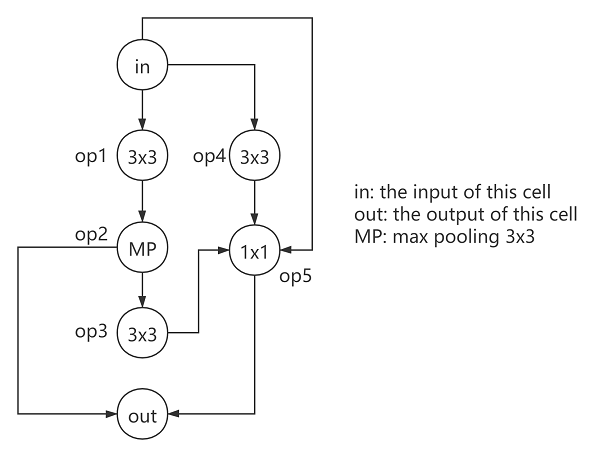
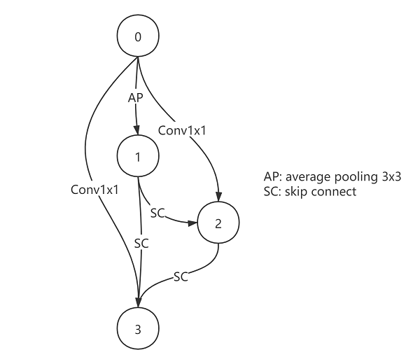

.. DO NOT EDIT.
.. THIS FILE WAS AUTOMATICALLY GENERATED BY SPHINX-GALLERY.
.. TO MAKE CHANGES, EDIT THE SOURCE PYTHON FILE:
.. "tutorials/nasbench_as_dataset.py"
.. LINE NUMBERS ARE GIVEN BELOW.

.. only:: html

    .. note::
        :class: sphx-glr-download-link-note

        :ref:`Go to the end <sphx_glr_download_tutorials_nasbench_as_dataset.py>`
        to download the full example code

.. rst-class:: sphx-glr-example-title

.. _sphx_glr_tutorials_nasbench_as_dataset.py:

Use NAS Benchmarks as Datasets
==============================

In this tutorial, we show how to use NAS Benchmarks as datasets.
For research purposes we sometimes desire to query the benchmarks for architecture accuracies,
rather than train them one by one from scratch.
NNI has provided query tools so that users can easily get the retrieve the data in NAS benchmarks.

.. GENERATED FROM PYTHON SOURCE LINES 12-19

Prerequisites
-------------
This tutorial assumes that you have already prepared your NAS benchmarks under cache directory
(by default, ``~/.cache/nni/nasbenchmark``).
If you haven't, please follow the data preparation guide in :doc:`/nas/benchmarks`.

As a result, the directory should look like:

.. GENERATED FROM PYTHON SOURCE LINES 19-23

.. code-block:: default

    import os
    os.listdir(os.path.expanduser('~/.cache/nni/nasbenchmark'))

.. rst-class:: sphx-glr-script-out

 .. code-block:: none

    ['nds-5745c235.db', 'nasbench201-b2b60732.db', 'nasbench101-209f5694.db']

.. GENERATED FROM PYTHON SOURCE LINES 24-30

.. code-block:: default

    import pprint

    from nni.nas.benchmark.nasbench101 import query_nb101_trial_stats
    from nni.nas.benchmark.nasbench201 import query_nb201_trial_stats
    from nni.nas.benchmark.nds import query_nds_trial_stats

.. GENERATED FROM PYTHON SOURCE LINES 31-37

NAS-Bench-101
-------------

Use the following architecture as an example:

.. GENERATED FROM PYTHON SOURCE LINES 37-54

.. code-block:: default

    arch = {
        'op1': 'conv3x3-bn-relu',
        'op2': 'maxpool3x3',
        'op3': 'conv3x3-bn-relu',
        'op4': 'conv3x3-bn-relu',
        'op5': 'conv1x1-bn-relu',
        'input1': [0],
        'input2': [1],
        'input3': [2],
        'input4': [0],
        'input5': [0, 3, 4],
        'input6': [2, 5]
    }
    for t in query_nb101_trial_stats(arch, 108, include_intermediates=True):
        pprint.pprint(t)

.. rst-class:: sphx-glr-script-out

 .. code-block:: none

    {'config': {'arch': {'input1': [0],
                         'input2': [1],
                         'input3': [2],
                         'input4': [0],
                         'input5': [0, 3, 4],
                         'input6': [2, 5],
                         'op1': 'conv3x3-bn-relu',
                         'op2': 'maxpool3x3',
                         'op3': 'conv3x3-bn-relu',
                         'op4': 'conv3x3-bn-relu',
                         'op5': 'conv1x1-bn-relu'},
                'hash': '00005c142e6f48ac74fdcf73e3439874',
                'id': 4,
                'num_epochs': 108,
                'num_vertices': 7},
     'id': 10,
     'intermediates': [{'current_epoch': 54,
                        'id': 19,
                        'test_acc': 77.40384340286255,
                        'train_acc': 82.82251358032227,
                        'training_time': 883.4580078125,
                        'valid_acc': 77.76442170143127},
                       {'current_epoch': 108,
                        'id': 20,
                        'test_acc': 92.11738705635071,
                        'train_acc': 100.0,
                        'training_time': 1769.1279296875,
                        'valid_acc': 92.41786599159241}],
     'parameters': 8.55553,
     'test_acc': 92.11738705635071,
     'train_acc': 100.0,
     'training_time': 106147.67578125,
     'valid_acc': 92.41786599159241}
    {'config': {'arch': {'input1': [0],
                         'input2': [1],
                         'input3': [2],
                         'input4': [0],
                         'input5': [0, 3, 4],
                         'input6': [2, 5],
                         'op1': 'conv3x3-bn-relu',
                         'op2': 'maxpool3x3',
                         'op3': 'conv3x3-bn-relu',
                         'op4': 'conv3x3-bn-relu',
                         'op5': 'conv1x1-bn-relu'},
                'hash': '00005c142e6f48ac74fdcf73e3439874',
                'id': 4,
                'num_epochs': 108,
                'num_vertices': 7},
     'id': 11,
     'intermediates': [{'current_epoch': 54,
                        'id': 21,
                        'test_acc': 82.04126358032227,
                        'train_acc': 87.96073794364929,
                        'training_time': 883.6810302734375,
                        'valid_acc': 82.91265964508057},
                       {'current_epoch': 108,
                        'id': 22,
                        'test_acc': 91.90705418586731,
                        'train_acc': 100.0,
                        'training_time': 1768.2509765625,
                        'valid_acc': 92.45793223381042}],
     'parameters': 8.55553,
     'test_acc': 91.90705418586731,
     'train_acc': 100.0,
     'training_time': 106095.05859375,
     'valid_acc': 92.45793223381042}
    {'config': {'arch': {'input1': [0],
                         'input2': [1],
                         'input3': [2],
                         'input4': [0],
                         'input5': [0, 3, 4],
                         'input6': [2, 5],
                         'op1': 'conv3x3-bn-relu',
                         'op2': 'maxpool3x3',
                         'op3': 'conv3x3-bn-relu',
                         'op4': 'conv3x3-bn-relu',
                         'op5': 'conv1x1-bn-relu'},
                'hash': '00005c142e6f48ac74fdcf73e3439874',
                'id': 4,
                'num_epochs': 108,
                'num_vertices': 7},
     'id': 12,
     'intermediates': [{'current_epoch': 54,
                        'id': 23,
                        'test_acc': 80.58894276618958,
                        'train_acc': 86.34815812110901,
                        'training_time': 883.4569702148438,
                        'valid_acc': 81.1598539352417},
                       {'current_epoch': 108,
                        'id': 24,
                        'test_acc': 92.15745329856873,
                        'train_acc': 100.0,
                        'training_time': 1768.9759521484375,
                        'valid_acc': 93.04887652397156}],
     'parameters': 8.55553,
     'test_acc': 92.15745329856873,
     'train_acc': 100.0,
     'training_time': 106138.55712890625,
     'valid_acc': 93.04887652397156}

.. GENERATED FROM PYTHON SOURCE LINES 55-66

An architecture of NAS-Bench-101 could be trained more than once.
Each element of the returned generator is a dict which contains one of the training results of this trial config
(architecture + hyper-parameters) including train/valid/test accuracy,
training time, number of epochs, etc. The results of NAS-Bench-201 and NDS follow similar formats.

NAS-Bench-201
-------------

Use the following architecture as an example:

.. GENERATED FROM PYTHON SOURCE LINES 66-78

.. code-block:: default

    arch = {
        '0_1': 'avg_pool_3x3',
        '0_2': 'conv_1x1',
        '1_2': 'skip_connect',
        '0_3': 'conv_1x1',
        '1_3': 'skip_connect',
        '2_3': 'skip_connect'
    }
    for t in query_nb201_trial_stats(arch, 200, 'cifar100'):
        pprint.pprint(t)

.. rst-class:: sphx-glr-script-out

 .. code-block:: none

    {'config': {'arch': {'0_1': 'avg_pool_3x3',
                         '0_2': 'conv_1x1',
                         '0_3': 'conv_1x1',
                         '1_2': 'skip_connect',
                         '1_3': 'skip_connect',
                         '2_3': 'skip_connect'},
                'dataset': 'cifar100',
                'id': 7,
                'num_cells': 5,
                'num_channels': 16,
                'num_epochs': 200},
     'flops': 15.65322,
     'id': 3,
     'latency': 0.013182918230692545,
     'ori_test_acc': 53.11,
     'ori_test_evaluation_time': 1.0195916947864352,
     'ori_test_loss': 1.7307863704681397,
     'parameters': 0.135156,
     'seed': 999,
     'test_acc': 53.07999995727539,
     'test_evaluation_time': 0.5097958473932176,
     'test_loss': 1.731276072692871,
     'train_acc': 57.82,
     'train_loss': 1.5116578379058838,
     'training_time': 2888.4371995925903,
     'valid_acc': 53.14000000610351,
     'valid_evaluation_time': 0.5097958473932176,
     'valid_loss': 1.7302966793060304}
    {'config': {'arch': {'0_1': 'avg_pool_3x3',
                         '0_2': 'conv_1x1',
                         '0_3': 'conv_1x1',
                         '1_2': 'skip_connect',
                         '1_3': 'skip_connect',
                         '2_3': 'skip_connect'},
                'dataset': 'cifar100',
                'id': 7,
                'num_cells': 5,
                'num_channels': 16,
                'num_epochs': 200},
     'flops': 15.65322,
     'id': 7,
     'latency': 0.013182918230692545,
     'ori_test_acc': 51.93,
     'ori_test_evaluation_time': 1.0195916947864352,
     'ori_test_loss': 1.7572312774658203,
     'parameters': 0.135156,
     'seed': 777,
     'test_acc': 51.979999938964845,
     'test_evaluation_time': 0.5097958473932176,
     'test_loss': 1.7429540189743042,
     'train_acc': 57.578,
     'train_loss': 1.5114233912658692,
     'training_time': 2888.4371995925903,
     'valid_acc': 51.88,
     'valid_evaluation_time': 0.5097958473932176,
     'valid_loss': 1.7715086591720581}
    {'config': {'arch': {'0_1': 'avg_pool_3x3',
                         '0_2': 'conv_1x1',
                         '0_3': 'conv_1x1',
                         '1_2': 'skip_connect',
                         '1_3': 'skip_connect',
                         '2_3': 'skip_connect'},
                'dataset': 'cifar100',
                'id': 7,
                'num_cells': 5,
                'num_channels': 16,
                'num_epochs': 200},
     'flops': 15.65322,
     'id': 11,
     'latency': 0.013182918230692545,
     'ori_test_acc': 53.38,
     'ori_test_evaluation_time': 1.0195916947864352,
     'ori_test_loss': 1.7281623031616211,
     'parameters': 0.135156,
     'seed': 888,
     'test_acc': 53.67999998779297,
     'test_evaluation_time': 0.5097958473932176,
     'test_loss': 1.7327697801589965,
     'train_acc': 57.792,
     'train_loss': 1.5091403088760376,
     'training_time': 2888.4371995925903,
     'valid_acc': 53.08000000610352,
     'valid_evaluation_time': 0.5097958473932176,
     'valid_loss': 1.7235548280715942}

.. GENERATED FROM PYTHON SOURCE LINES 79-80

Intermediate results are also available.

.. GENERATED FROM PYTHON SOURCE LINES 80-85

.. code-block:: default

    for t in query_nb201_trial_stats(arch, None, 'imagenet16-120', include_intermediates=True):
        print(t['config'])
        print('Intermediates:', len(t['intermediates']))

.. rst-class:: sphx-glr-script-out

 .. code-block:: none

    {'id': 4, 'arch': {'0_1': 'avg_pool_3x3', '0_2': 'conv_1x1', '0_3': 'conv_1x1', '1_2': 'skip_connect', '1_3': 'skip_connect', '2_3': 'skip_connect'}, 'num_epochs': 12, 'num_channels': 16, 'num_cells': 5, 'dataset': 'imagenet16-120'}
    Intermediates: 12
    {'id': 8, 'arch': {'0_1': 'avg_pool_3x3', '0_2': 'conv_1x1', '0_3': 'conv_1x1', '1_2': 'skip_connect', '1_3': 'skip_connect', '2_3': 'skip_connect'}, 'num_epochs': 200, 'num_channels': 16, 'num_cells': 5, 'dataset': 'imagenet16-120'}
    Intermediates: 200
    {'id': 8, 'arch': {'0_1': 'avg_pool_3x3', '0_2': 'conv_1x1', '0_3': 'conv_1x1', '1_2': 'skip_connect', '1_3': 'skip_connect', '2_3': 'skip_connect'}, 'num_epochs': 200, 'num_channels': 16, 'num_cells': 5, 'dataset': 'imagenet16-120'}
    Intermediates: 200
    {'id': 8, 'arch': {'0_1': 'avg_pool_3x3', '0_2': 'conv_1x1', '0_3': 'conv_1x1', '1_2': 'skip_connect', '1_3': 'skip_connect', '2_3': 'skip_connect'}, 'num_epochs': 200, 'num_channels': 16, 'num_cells': 5, 'dataset': 'imagenet16-120'}
    Intermediates: 200

.. GENERATED FROM PYTHON SOURCE LINES 86-95

NDS
---

Use the following architecture as an example:

Here, ``bot_muls``, ``ds``, ``num_gs``, ``ss`` and ``ws`` stand for "bottleneck multipliers",
"depths", "number of groups", "strides" and "widths" respectively.

.. GENERATED FROM PYTHON SOURCE LINES 97-105

.. code-block:: default

    model_spec = {
        'bot_muls': [0.0, 0.25, 0.25, 0.25],
        'ds': [1, 16, 1, 4],
        'num_gs': [1, 2, 1, 2],
        'ss': [1, 1, 2, 2],
        'ws': [16, 64, 128, 16]
    }

.. GENERATED FROM PYTHON SOURCE LINES 106-107

Use none as a wildcard.

.. GENERATED FROM PYTHON SOURCE LINES 107-110

.. code-block:: default

    for t in query_nds_trial_stats('residual_bottleneck', None, None, model_spec, None, 'cifar10'):
        pprint.pprint(t)

.. rst-class:: sphx-glr-script-out

 .. code-block:: none

    {'best_test_acc': 90.48,
     'best_train_acc': 96.356,
     'best_train_loss': 0.116,
     'config': {'base_lr': 0.1,
                'cell_spec': {},
                'dataset': 'cifar10',
                'generator': 'random',
                'id': 45505,
                'model_family': 'residual_bottleneck',
                'model_spec': {'bot_muls': [0.0, 0.25, 0.25, 0.25],
                               'ds': [1, 16, 1, 4],
                               'num_gs': [1, 2, 1, 2],
                               'ss': [1, 1, 2, 2],
                               'ws': [16, 64, 128, 16]},
                'num_epochs': 100,
                'proposer': 'resnext-a',
                'weight_decay': 0.0005},
     'final_test_acc': 90.39,
     'final_train_acc': 96.298,
     'final_train_loss': 0.116,
     'flops': 69.890986,
     'id': 45505,
     'iter_time': 0.065,
     'parameters': 0.083002,
     'seed': 1}

.. GENERATED FROM PYTHON SOURCE LINES 111-121

.. code-block:: default

    model_spec = {
        'bot_muls': [0.0, 0.25, 0.25, 0.25],
        'ds': [1, 16, 1, 4],
        'num_gs': [1, 2, 1, 2],
        'ss': [1, 1, 2, 2],
        'ws': [16, 64, 128, 16]
    }
    for t in query_nds_trial_stats('residual_bottleneck', None, None, model_spec, None, 'cifar10', include_intermediates=True):
        pprint.pprint(t['intermediates'][:10])

.. rst-class:: sphx-glr-script-out

 .. code-block:: none

    [{'current_epoch': 1,
      'id': 4494501,
      'test_acc': 41.76,
      'train_acc': 30.421000000000006,
      'train_loss': 1.793},
     {'current_epoch': 2,
      'id': 4494502,
      'test_acc': 54.66,
      'train_acc': 47.24,
      'train_loss': 1.415},
     {'current_epoch': 3,
      'id': 4494503,
      'test_acc': 59.97,
      'train_acc': 56.983,
      'train_loss': 1.179},
     {'current_epoch': 4,
      'id': 4494504,
      'test_acc': 62.91,
      'train_acc': 61.955,
      'train_loss': 1.048},
     {'current_epoch': 5,
      'id': 4494505,
      'test_acc': 66.16,
      'train_acc': 64.493,
      'train_loss': 0.983},
     {'current_epoch': 6,
      'id': 4494506,
      'test_acc': 66.5,
      'train_acc': 66.274,
      'train_loss': 0.937},
     {'current_epoch': 7,
      'id': 4494507,
      'test_acc': 67.55,
      'train_acc': 67.426,
      'train_loss': 0.907},
     {'current_epoch': 8,
      'id': 4494508,
      'test_acc': 69.45,
      'train_acc': 68.45400000000001,
      'train_loss': 0.878},
     {'current_epoch': 9,
      'id': 4494509,
      'test_acc': 70.14,
      'train_acc': 69.295,
      'train_loss': 0.857},
     {'current_epoch': 10,
      'id': 4494510,
      'test_acc': 69.47,
      'train_acc': 70.304,
      'train_loss': 0.832}]

.. GENERATED FROM PYTHON SOURCE LINES 122-126

.. code-block:: default

    model_spec = {'ds': [1, 12, 12, 12], 'ss': [1, 1, 2, 2], 'ws': [16, 24, 24, 40]}
    for t in query_nds_trial_stats('residual_basic', 'resnet', 'random', model_spec, {}, 'cifar10'):
        pprint.pprint(t)

.. rst-class:: sphx-glr-script-out

 .. code-block:: none

    {'best_test_acc': 93.58,
     'best_train_acc': 99.772,
     'best_train_loss': 0.011,
     'config': {'base_lr': 0.1,
                'cell_spec': {},
                'dataset': 'cifar10',
                'generator': 'random',
                'id': 108998,
                'model_family': 'residual_basic',
                'model_spec': {'ds': [1, 12, 12, 12],
                               'ss': [1, 1, 2, 2],
                               'ws': [16, 24, 24, 40]},
                'num_epochs': 100,
                'proposer': 'resnet',
                'weight_decay': 0.0005},
     'final_test_acc': 93.49,
     'final_train_acc': 99.772,
     'final_train_loss': 0.011,
     'flops': 184.519578,
     'id': 108998,
     'iter_time': 0.059,
     'parameters': 0.594138,
     'seed': 1}

.. GENERATED FROM PYTHON SOURCE LINES 127-128

Get the first one.

.. GENERATED FROM PYTHON SOURCE LINES 128-130

.. code-block:: default

    pprint.pprint(next(query_nds_trial_stats('vanilla', None, None, None, None, None)))

.. rst-class:: sphx-glr-script-out

 .. code-block:: none

    {'best_test_acc': 84.5,
     'best_train_acc': 89.66499999999999,
     'best_train_loss': 0.302,
     'config': {'base_lr': 0.1,
                'cell_spec': {},
                'dataset': 'cifar10',
                'generator': 'random',
                'id': 139492,
                'model_family': 'vanilla',
                'model_spec': {'ds': [1, 12, 12, 12],
                               'ss': [1, 1, 2, 2],
                               'ws': [16, 24, 32, 40]},
                'num_epochs': 100,
                'proposer': 'vanilla',
                'weight_decay': 0.0005},
     'final_test_acc': 84.35,
     'final_train_acc': 89.633,
     'final_train_loss': 0.303,
     'flops': 208.36393,
     'id': 154692,
     'iter_time': 0.058,
     'parameters': 0.68977,
     'seed': 1}

.. GENERATED FROM PYTHON SOURCE LINES 131-132

Count number.

.. GENERATED FROM PYTHON SOURCE LINES 132-183

.. code-block:: default

    model_spec = {'num_nodes_normal': 5, 'num_nodes_reduce': 5, 'depth': 12, 'width': 32, 'aux': False, 'drop_prob': 0.0}
    cell_spec = {
        'normal_0_op_x': 'avg_pool_3x3',
        'normal_0_input_x': 0,
        'normal_0_op_y': 'conv_7x1_1x7',
        'normal_0_input_y': 1,
        'normal_1_op_x': 'sep_conv_3x3',
        'normal_1_input_x': 2,
        'normal_1_op_y': 'sep_conv_5x5',
        'normal_1_input_y': 0,
        'normal_2_op_x': 'dil_sep_conv_3x3',
        'normal_2_input_x': 2,
        'normal_2_op_y': 'dil_sep_conv_3x3',
        'normal_2_input_y': 2,
        'normal_3_op_x': 'skip_connect',
        'normal_3_input_x': 4,
        'normal_3_op_y': 'dil_sep_conv_3x3',
        'normal_3_input_y': 4,
        'normal_4_op_x': 'conv_7x1_1x7',
        'normal_4_input_x': 2,
        'normal_4_op_y': 'sep_conv_3x3',
        'normal_4_input_y': 4,
        'normal_concat': [3, 5, 6],
        'reduce_0_op_x': 'avg_pool_3x3',
        'reduce_0_input_x': 0,
        'reduce_0_op_y': 'dil_sep_conv_3x3',
        'reduce_0_input_y': 1,
        'reduce_1_op_x': 'sep_conv_3x3',
        'reduce_1_input_x': 0,
        'reduce_1_op_y': 'sep_conv_3x3',
        'reduce_1_input_y': 0,
        'reduce_2_op_x': 'skip_connect',
        'reduce_2_input_x': 2,
        'reduce_2_op_y': 'sep_conv_7x7',
        'reduce_2_input_y': 0,
        'reduce_3_op_x': 'conv_7x1_1x7',
        'reduce_3_input_x': 4,
        'reduce_3_op_y': 'skip_connect',
        'reduce_3_input_y': 4,
        'reduce_4_op_x': 'conv_7x1_1x7',
        'reduce_4_input_x': 0,
        'reduce_4_op_y': 'conv_7x1_1x7',
        'reduce_4_input_y': 5,
        'reduce_concat': [3, 6]
    }

    for t in query_nds_trial_stats('nas_cell', None, None, model_spec, cell_spec, 'cifar10'):
        assert t['config']['model_spec'] == model_spec
        assert t['config']['cell_spec'] == cell_spec
        pprint.pprint(t)

.. rst-class:: sphx-glr-script-out

 .. code-block:: none

    {'best_test_acc': 93.37,
     'best_train_acc': 99.91,
     'best_train_loss': 0.006,
     'config': {'base_lr': 0.1,
                'cell_spec': {'normal_0_input_x': 0,
                              'normal_0_input_y': 1,
                              'normal_0_op_x': 'avg_pool_3x3',
                              'normal_0_op_y': 'conv_7x1_1x7',
                              'normal_1_input_x': 2,
                              'normal_1_input_y': 0,
                              'normal_1_op_x': 'sep_conv_3x3',
                              'normal_1_op_y': 'sep_conv_5x5',
                              'normal_2_input_x': 2,
                              'normal_2_input_y': 2,
                              'normal_2_op_x': 'dil_sep_conv_3x3',
                              'normal_2_op_y': 'dil_sep_conv_3x3',
                              'normal_3_input_x': 4,
                              'normal_3_input_y': 4,
                              'normal_3_op_x': 'skip_connect',
                              'normal_3_op_y': 'dil_sep_conv_3x3',
                              'normal_4_input_x': 2,
                              'normal_4_input_y': 4,
                              'normal_4_op_x': 'conv_7x1_1x7',
                              'normal_4_op_y': 'sep_conv_3x3',
                              'normal_concat': [3, 5, 6],
                              'reduce_0_input_x': 0,
                              'reduce_0_input_y': 1,
                              'reduce_0_op_x': 'avg_pool_3x3',
                              'reduce_0_op_y': 'dil_sep_conv_3x3',
                              'reduce_1_input_x': 0,
                              'reduce_1_input_y': 0,
                              'reduce_1_op_x': 'sep_conv_3x3',
                              'reduce_1_op_y': 'sep_conv_3x3',
                              'reduce_2_input_x': 2,
                              'reduce_2_input_y': 0,
                              'reduce_2_op_x': 'skip_connect',
                              'reduce_2_op_y': 'sep_conv_7x7',
                              'reduce_3_input_x': 4,
                              'reduce_3_input_y': 4,
                              'reduce_3_op_x': 'conv_7x1_1x7',
                              'reduce_3_op_y': 'skip_connect',
                              'reduce_4_input_x': 0,
                              'reduce_4_input_y': 5,
                              'reduce_4_op_x': 'conv_7x1_1x7',
                              'reduce_4_op_y': 'conv_7x1_1x7',
                              'reduce_concat': [3, 6]},
                'dataset': 'cifar10',
                'generator': 'random',
                'id': 1,
                'model_family': 'nas_cell',
                'model_spec': {'aux': False,
                               'depth': 12,
                               'drop_prob': 0.0,
                               'num_nodes_normal': 5,
                               'num_nodes_reduce': 5,
                               'width': 32},
                'num_epochs': 100,
                'proposer': 'amoeba',
                'weight_decay': 0.0005},
     'final_test_acc': 93.27,
     'final_train_acc': 99.91,
     'final_train_loss': 0.006,
     'flops': 664.400586,
     'id': 1,
     'iter_time': 0.281,
     'parameters': 4.190314,
     'seed': 1}

.. GENERATED FROM PYTHON SOURCE LINES 184-185

Count number.

.. GENERATED FROM PYTHON SOURCE LINES 185-186

.. code-block:: default

    print('NDS (amoeba) count:', len(list(query_nds_trial_stats(None, 'amoeba', None, None, None, None, None))))

.. rst-class:: sphx-glr-script-out

 .. code-block:: none

    NDS (amoeba) count: 5107

.. rst-class:: sphx-glr-timing

   **Total running time of the script:** ( 1 minutes  51.444 seconds)

.. _sphx_glr_download_tutorials_nasbench_as_dataset.py:

.. only:: html

  .. container:: sphx-glr-footer sphx-glr-footer-example

    .. container:: sphx-glr-download sphx-glr-download-python

      :download:`Download Python source code: nasbench_as_dataset.py <nasbench_as_dataset.py>`

    .. container:: sphx-glr-download sphx-glr-download-jupyter

      :download:`Download Jupyter notebook: nasbench_as_dataset.ipynb <nasbench_as_dataset.ipynb>`

.. only:: html

 .. rst-class:: sphx-glr-signature

    `Gallery generated by Sphinx-Gallery <https://sphinx-gallery.github.io>`_
