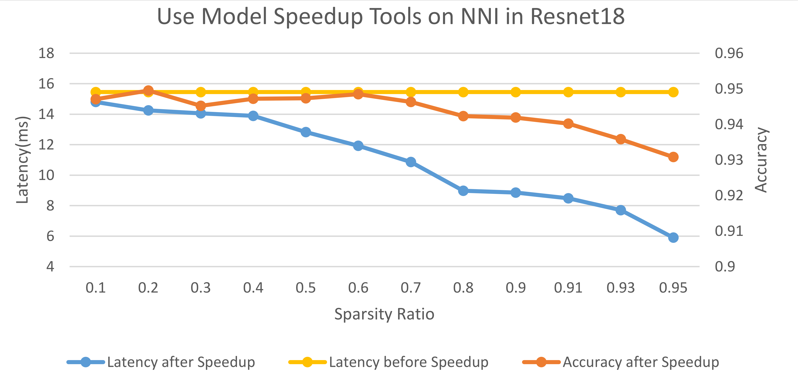

.. DO NOT EDIT.
.. THIS FILE WAS AUTOMATICALLY GENERATED BY SPHINX-GALLERY.
.. TO MAKE CHANGES, EDIT THE SOURCE PYTHON FILE:
.. "tutorials/pruning_speed_up.py"
.. LINE NUMBERS ARE GIVEN BELOW.

.. only:: html

    .. note::
        :class: sphx-glr-download-link-note

        Click :ref:`here <sphx_glr_download_tutorials_pruning_speed_up.py>`
        to download the full example code

.. rst-class:: sphx-glr-example-title

.. _sphx_glr_tutorials_pruning_speed_up.py:

Speed Up Model with Mask
========================

Introduction
------------

Pruning algorithms usually use weight masks to simulate the real pruning. Masks can be used
to check model performance of a specific pruning (or sparsity), but there is no real speedup.
Since model speedup is the ultimate goal of model pruning, we try to provide a tool to users
to convert a model to a smaller one based on user provided masks (the masks come from the
pruning algorithms).

There are two types of pruning. One is fine-grained pruning, it does not change the shape of weights,
and input/output tensors. Sparse kernel is required to speed up a fine-grained pruned layer.
The other is coarse-grained pruning (e.g., channels), shape of weights and input/output tensors usually change due to such pruning.
To speed up this kind of pruning, there is no need to use sparse kernel, just replace the pruned layer with smaller one.
Since the support of sparse kernels in community is limited,
we only support the speedup of coarse-grained pruning and leave the support of fine-grained pruning in future.

Design and Implementation
-------------------------

To speed up a model, the pruned layers should be replaced, either replaced with smaller layer for coarse-grained mask,
or replaced with sparse kernel for fine-grained mask. Coarse-grained mask usually changes the shape of weights or input/output tensors,
thus, we should do shape inference to check are there other unpruned layers should be replaced as well due to shape change.
Therefore, in our design, there are two main steps: first, do shape inference to find out all the modules that should be replaced;
second, replace the modules.

The first step requires topology (i.e., connections) of the model, we use ``jit.trace`` to obtain the model graph for PyTorch.
The new shape of module is auto-inference by NNI, the unchanged parts of outputs during forward and inputs during backward are prepared for reduct.
For each type of module, we should prepare a function for module replacement.
The module replacement function returns a newly created module which is smaller.

Usage
-----

.. GENERATED FROM PYTHON SOURCE LINES 41-44

Generate a mask for the model at first.
We usually use a NNI pruner to generate the masks then use ``ModelSpeedup`` to compact the model.
But in fact ``ModelSpeedup`` is a relatively independent tool, so you can use it independently.

.. GENERATED FROM PYTHON SOURCE LINES 44-55

.. code-block:: default

    import torch
    from scripts.compression_mnist_model import TorchModel, device

    model = TorchModel().to(device)
    # masks = {layer_name: {'weight': weight_mask, 'bias': bias_mask}}
    conv1_mask = torch.ones_like(model.conv1.weight.data)
    # mask the first three output channels in conv1
    conv1_mask[0: 3] = 0
    masks = {'conv1': {'weight': conv1_mask}}

.. GENERATED FROM PYTHON SOURCE LINES 56-57

Show the original model structure.

.. GENERATED FROM PYTHON SOURCE LINES 57-59

.. code-block:: default

    print(model)

.. rst-class:: sphx-glr-script-out

 Out:

 .. code-block:: none

    TorchModel(
      (conv1): Conv2d(1, 6, kernel_size=(5, 5), stride=(1, 1))
      (conv2): Conv2d(6, 16, kernel_size=(5, 5), stride=(1, 1))
      (fc1): Linear(in_features=256, out_features=120, bias=True)
      (fc2): Linear(in_features=120, out_features=84, bias=True)
      (fc3): Linear(in_features=84, out_features=10, bias=True)
    )

.. GENERATED FROM PYTHON SOURCE LINES 60-61

Roughly test the original model inference speed.

.. GENERATED FROM PYTHON SOURCE LINES 61-66

.. code-block:: default

    import time
    start = time.time()
    model(torch.rand(128, 1, 28, 28).to(device))
    print('Original Model - Elapsed Time : ', time.time() - start)

.. rst-class:: sphx-glr-script-out

 Out:

 .. code-block:: none

    Original Model - Elapsed Time :  0.0158078670501709

.. GENERATED FROM PYTHON SOURCE LINES 67-68

Speed up the model and show the model structure after speed up.

.. GENERATED FROM PYTHON SOURCE LINES 68-72

.. code-block:: default

    from nni.compression.pytorch import ModelSpeedup
    ModelSpeedup(model, torch.rand(10, 1, 28, 28).to(device), masks).speedup_model()
    print(model)

.. rst-class:: sphx-glr-script-out

 Out:

 .. code-block:: none

    [2022-02-21 16:02:50] INFO (nni.compression.pytorch.speedup.compressor/MainThread) start to speed up the model
    [2022-02-21 16:02:51] INFO (FixMaskConflict/MainThread) {'conv1': 1, 'conv2': 1}
    /home/ningshang/nni/nni/compression/pytorch/utils/mask_conflict.py:124: UserWarning: This overload of nonzero is deprecated:
            nonzero()
    Consider using one of the following signatures instead:
            nonzero(*, bool as_tuple) (Triggered internally at  /pytorch/torch/csrc/utils/python_arg_parser.cpp:766.)
      all_ones = (w_mask.flatten(1).sum(-1) == count).nonzero().squeeze(1).tolist()
    [2022-02-21 16:02:51] INFO (FixMaskConflict/MainThread) dim0 sparsity: 0.500000
    [2022-02-21 16:02:51] INFO (FixMaskConflict/MainThread) dim1 sparsity: 0.000000
    [2022-02-21 16:02:51] INFO (FixMaskConflict/MainThread) Dectected conv prune dim" 0
    [2022-02-21 16:02:51] INFO (nni.compression.pytorch.speedup.compressor/MainThread) infer module masks...
    [2022-02-21 16:02:51] INFO (nni.compression.pytorch.speedup.compressor/MainThread) Update mask for conv1
    [2022-02-21 16:02:51] INFO (nni.compression.pytorch.speedup.compressor/MainThread) Update mask for .aten::relu.5
    [2022-02-21 16:02:51] INFO (nni.compression.pytorch.speedup.compressor/MainThread) Update mask for .aten::max_pool2d.6
    [2022-02-21 16:02:51] INFO (nni.compression.pytorch.speedup.compressor/MainThread) Update mask for conv2
    [2022-02-21 16:02:51] INFO (nni.compression.pytorch.speedup.compressor/MainThread) Update mask for .aten::relu.7
    [2022-02-21 16:02:51] INFO (nni.compression.pytorch.speedup.compressor/MainThread) Update mask for .aten::max_pool2d.8
    [2022-02-21 16:02:51] INFO (nni.compression.pytorch.speedup.compressor/MainThread) Update mask for .aten::flatten.9
    [2022-02-21 16:02:51] INFO (nni.compression.pytorch.speedup.compressor/MainThread) Update mask for fc1
    [2022-02-21 16:02:51] INFO (nni.compression.pytorch.speedup.compressor/MainThread) Update mask for .aten::relu.10
    [2022-02-21 16:02:51] INFO (nni.compression.pytorch.speedup.compressor/MainThread) Update mask for fc2
    [2022-02-21 16:02:51] INFO (nni.compression.pytorch.speedup.compressor/MainThread) Update mask for .aten::relu.11
    [2022-02-21 16:02:51] INFO (nni.compression.pytorch.speedup.compressor/MainThread) Update mask for fc3
    [2022-02-21 16:02:51] INFO (nni.compression.pytorch.speedup.compressor/MainThread) Update mask for .aten::log_softmax.12
    [2022-02-21 16:02:51] ERROR (nni.compression.pytorch.speedup.jit_translate/MainThread) aten::log_softmax is not Supported! Please report an issue at https://github.com/microsoft/nni. Thanks~
    [2022-02-21 16:02:51] WARNING (nni.compression.pytorch.speedup.compressor/MainThread) Note: .aten::log_softmax.12 does not have corresponding mask inference object
    [2022-02-21 16:02:51] INFO (nni.compression.pytorch.speedup.compressor/MainThread) Update the indirect sparsity for the fc3
    /home/ningshang/nni/nni/compression/pytorch/speedup/infer_mask.py:262: UserWarning: The .grad attribute of a Tensor that is not a leaf Tensor is being accessed. Its .grad attribute won't be populated during autograd.backward(). If you indeed want the gradient for a non-leaf Tensor, use .retain_grad() on the non-leaf Tensor. If you access the non-leaf Tensor by mistake, make sure you access the leaf Tensor instead. See github.com/pytorch/pytorch/pull/30531 for more informations.
      if isinstance(self.output, torch.Tensor) and self.output.grad is not None:
    [2022-02-21 16:02:51] INFO (nni.compression.pytorch.speedup.compressor/MainThread) Update the indirect sparsity for the .aten::relu.11
    /home/ningshang/nni/nni/compression/pytorch/speedup/compressor.py:282: UserWarning: The .grad attribute of a Tensor that is not a leaf Tensor is being accessed. Its .grad attribute won't be populated during autograd.backward(). If you indeed want the gradient for a non-leaf Tensor, use .retain_grad() on the non-leaf Tensor. If you access the non-leaf Tensor by mistake, make sure you access the leaf Tensor instead. See github.com/pytorch/pytorch/pull/30531 for more informations.
      if last_output.grad is not None and tin.grad is not None:
    [2022-02-21 16:02:51] INFO (nni.compression.pytorch.speedup.compressor/MainThread) Update the indirect sparsity for the fc2
    [2022-02-21 16:02:51] INFO (nni.compression.pytorch.speedup.compressor/MainThread) Update the indirect sparsity for the .aten::relu.10
    [2022-02-21 16:02:51] INFO (nni.compression.pytorch.speedup.compressor/MainThread) Update the indirect sparsity for the fc1
    [2022-02-21 16:02:51] INFO (nni.compression.pytorch.speedup.compressor/MainThread) Update the indirect sparsity for the .aten::flatten.9
    [2022-02-21 16:02:51] INFO (nni.compression.pytorch.speedup.compressor/MainThread) Update the indirect sparsity for the .aten::max_pool2d.8
    [2022-02-21 16:02:51] INFO (nni.compression.pytorch.speedup.compressor/MainThread) Update the indirect sparsity for the .aten::relu.7
    [2022-02-21 16:02:51] INFO (nni.compression.pytorch.speedup.compressor/MainThread) Update the indirect sparsity for the conv2
    [2022-02-21 16:02:51] INFO (nni.compression.pytorch.speedup.compressor/MainThread) Update the indirect sparsity for the .aten::max_pool2d.6
    [2022-02-21 16:02:51] INFO (nni.compression.pytorch.speedup.compressor/MainThread) Update the indirect sparsity for the .aten::relu.5
    [2022-02-21 16:02:51] INFO (nni.compression.pytorch.speedup.compressor/MainThread) Update the indirect sparsity for the conv1
    [2022-02-21 16:02:51] INFO (nni.compression.pytorch.speedup.compressor/MainThread) resolve the mask conflict
    [2022-02-21 16:02:51] INFO (nni.compression.pytorch.speedup.compressor/MainThread) replace compressed modules...
    [2022-02-21 16:02:51] INFO (nni.compression.pytorch.speedup.compressor/MainThread) replace module (name: conv1, op_type: Conv2d)
    [2022-02-21 16:02:51] INFO (nni.compression.pytorch.speedup.compressor/MainThread) Warning: cannot replace (name: .aten::relu.5, op_type: aten::relu) which is func type
    [2022-02-21 16:02:51] INFO (nni.compression.pytorch.speedup.compressor/MainThread) Warning: cannot replace (name: .aten::max_pool2d.6, op_type: aten::max_pool2d) which is func type
    [2022-02-21 16:02:51] INFO (nni.compression.pytorch.speedup.compressor/MainThread) replace module (name: conv2, op_type: Conv2d)
    [2022-02-21 16:02:51] INFO (nni.compression.pytorch.speedup.compressor/MainThread) Warning: cannot replace (name: .aten::relu.7, op_type: aten::relu) which is func type
    [2022-02-21 16:02:51] INFO (nni.compression.pytorch.speedup.compressor/MainThread) Warning: cannot replace (name: .aten::max_pool2d.8, op_type: aten::max_pool2d) which is func type
    [2022-02-21 16:02:51] INFO (nni.compression.pytorch.speedup.compressor/MainThread) Warning: cannot replace (name: .aten::flatten.9, op_type: aten::flatten) which is func type
    [2022-02-21 16:02:51] INFO (nni.compression.pytorch.speedup.compressor/MainThread) replace module (name: fc1, op_type: Linear)
    [2022-02-21 16:02:51] INFO (nni.compression.pytorch.speedup.compress_modules/MainThread) replace linear with new in_features: 256, out_features: 120
    [2022-02-21 16:02:51] INFO (nni.compression.pytorch.speedup.compressor/MainThread) Warning: cannot replace (name: .aten::relu.10, op_type: aten::relu) which is func type
    [2022-02-21 16:02:51] INFO (nni.compression.pytorch.speedup.compressor/MainThread) replace module (name: fc2, op_type: Linear)
    [2022-02-21 16:02:51] INFO (nni.compression.pytorch.speedup.compress_modules/MainThread) replace linear with new in_features: 120, out_features: 84
    [2022-02-21 16:02:51] INFO (nni.compression.pytorch.speedup.compressor/MainThread) Warning: cannot replace (name: .aten::relu.11, op_type: aten::relu) which is func type
    [2022-02-21 16:02:51] INFO (nni.compression.pytorch.speedup.compressor/MainThread) replace module (name: fc3, op_type: Linear)
    [2022-02-21 16:02:51] INFO (nni.compression.pytorch.speedup.compress_modules/MainThread) replace linear with new in_features: 84, out_features: 10
    [2022-02-21 16:02:51] INFO (nni.compression.pytorch.speedup.compressor/MainThread) Warning: cannot replace (name: .aten::log_softmax.12, op_type: aten::log_softmax) which is func type
    [2022-02-21 16:02:51] INFO (nni.compression.pytorch.speedup.compressor/MainThread) speedup done
    TorchModel(
      (conv1): Conv2d(1, 3, kernel_size=(5, 5), stride=(1, 1))
      (conv2): Conv2d(3, 16, kernel_size=(5, 5), stride=(1, 1))
      (fc1): Linear(in_features=256, out_features=120, bias=True)
      (fc2): Linear(in_features=120, out_features=84, bias=True)
      (fc3): Linear(in_features=84, out_features=10, bias=True)
    )

.. GENERATED FROM PYTHON SOURCE LINES 73-74

Roughly test the model after speed-up inference speed.

.. GENERATED FROM PYTHON SOURCE LINES 74-78

.. code-block:: default

    start = time.time()
    model(torch.rand(128, 1, 28, 28).to(device))
    print('Speedup Model - Elapsed Time : ', time.time() - start)

.. rst-class:: sphx-glr-script-out

 Out:

 .. code-block:: none

    Speedup Model - Elapsed Time :  0.0026459693908691406

.. GENERATED FROM PYTHON SOURCE LINES 79-247

For combining usage of ``Pruner`` masks generation with ``ModelSpeedup``,
please refer to `Pruning Quick Start <./pruning_quick_start_mnist.html>`__.

NOTE: The current implementation supports PyTorch 1.3.1 or newer.

Limitations
-----------

For PyTorch we can only replace modules, if functions in ``forward`` should be replaced,
our current implementation does not work. One workaround is make the function a PyTorch module.

If you want to speed up your own model which cannot supported by the current implementation,
you need implement the replace function for module replacement, welcome to contribute.

Speedup Results of Examples
---------------------------

The code of these experiments can be found :githublink:`here <examples/model_compress/pruning/speedup/model_speedup.py>`.

These result are tested on the `legacy pruning framework <../comporession/pruning_legacy>`__, new results will coming soon.

slim pruner example
^^^^^^^^^^^^^^^^^^^

on one V100 GPU,
input tensor: ``torch.randn(64, 3, 32, 32)``

.. list-table::
   :header-rows: 1
   :widths: auto

   * - Times
     - Mask Latency
     - Speedup Latency
   * - 1
     - 0.01197
     - 0.005107
   * - 2
     - 0.02019
     - 0.008769
   * - 4
     - 0.02733
     - 0.014809
   * - 8
     - 0.04310
     - 0.027441
   * - 16
     - 0.07731
     - 0.05008
   * - 32
     - 0.14464
     - 0.10027

fpgm pruner example
^^^^^^^^^^^^^^^^^^^

on cpu,
input tensor: ``torch.randn(64, 1, 28, 28)``\ ,
too large variance

.. list-table::
   :header-rows: 1
   :widths: auto

   * - Times
     - Mask Latency
     - Speedup Latency
   * - 1
     - 0.01383
     - 0.01839
   * - 2
     - 0.01167
     - 0.003558
   * - 4
     - 0.01636
     - 0.01088
   * - 40
     - 0.14412
     - 0.08268
   * - 40
     - 1.29385
     - 0.14408
   * - 40
     - 0.41035
     - 0.46162
   * - 400
     - 6.29020
     - 5.82143

l1filter pruner example
^^^^^^^^^^^^^^^^^^^^^^^

on one V100 GPU,
input tensor: ``torch.randn(64, 3, 32, 32)``

.. list-table::
   :header-rows: 1
   :widths: auto

   * - Times
     - Mask Latency
     - Speedup Latency
   * - 1
     - 0.01026
     - 0.003677
   * - 2
     - 0.01657
     - 0.008161
   * - 4
     - 0.02458
     - 0.020018
   * - 8
     - 0.03498
     - 0.025504
   * - 16
     - 0.06757
     - 0.047523
   * - 32
     - 0.10487
     - 0.086442

APoZ pruner example
^^^^^^^^^^^^^^^^^^^

on one V100 GPU,
input tensor: ``torch.randn(64, 3, 32, 32)``

.. list-table::
   :header-rows: 1
   :widths: auto

   * - Times
     - Mask Latency
     - Speedup Latency
   * - 1
     - 0.01389
     - 0.004208
   * - 2
     - 0.01628
     - 0.008310
   * - 4
     - 0.02521
     - 0.014008
   * - 8
     - 0.03386
     - 0.023923
   * - 16
     - 0.06042
     - 0.046183
   * - 32
     - 0.12421
     - 0.087113

SimulatedAnnealing pruner example
^^^^^^^^^^^^^^^^^^^^^^^^^^^^^^^^^

In this experiment, we use SimulatedAnnealing pruner to prune the resnet18 on the cifar10 dataset.
We measure the latencies and accuracies of the pruned model under different sparsity ratios, as shown in the following figure.
The latency is measured on one V100 GPU and the input tensor is  ``torch.randn(128, 3, 32, 32)``.

User configuration for ModelSpeedup
^^^^^^^^^^^^^^^^^^^^^^^^^^^^^^^^^^^

**PyTorch**

..  autoclass:: nni.compression.pytorch.ModelSpeedup

.. rst-class:: sphx-glr-timing

   **Total running time of the script:** ( 0 minutes  8.266 seconds)

.. _sphx_glr_download_tutorials_pruning_speed_up.py:

.. only :: html

 .. container:: sphx-glr-footer
    :class: sphx-glr-footer-example

  .. container:: sphx-glr-download sphx-glr-download-python

     :download:`Download Python source code: pruning_speed_up.py <pruning_speed_up.py>`

  .. container:: sphx-glr-download sphx-glr-download-jupyter

     :download:`Download Jupyter notebook: pruning_speed_up.ipynb <pruning_speed_up.ipynb>`

.. only:: html

 .. rst-class:: sphx-glr-signature

    `Gallery generated by Sphinx-Gallery <https://sphinx-gallery.github.io>`_
