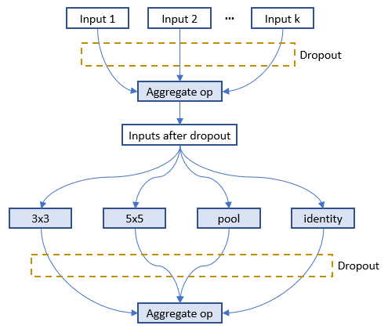
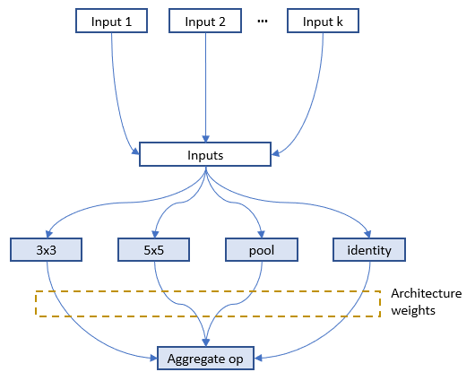

# 神经网络架构搜索的 NNI 编程接口（NAS）

** 这是**实验性的功能**。 目前，仅实现了通用的 NAS 编程接口。 在随后的版本中会支持权重共享。*

自动化的神经网络架构（NAS）搜索在寻找更好的模型方面发挥着越来越重要的作用。 最近的研究工作证明了自动化 NAS 的可行性，并发现了一些超越手动设计和调整的模型。 代表算法有 [NASNet](https://arxiv.org/abs/1707.07012)，[ENAS](https://arxiv.org/abs/1802.03268)，[DARTS](https://arxiv.org/abs/1806.09055)，[Network Morphism](https://arxiv.org/abs/1806.10282)，以及 [Evolution](https://arxiv.org/abs/1703.01041) 等。 新的算法还在不断涌现。 然而，实现这些算法需要很大的工作量，且很难重用其它算法的代码库来实现。

要促进 NAS 创新（例如，设计实现新的 NAS 模型，并列比较不同的 NAS 模型），易于使用且灵活的编程接口非常重要。

<a name="ProgInterface"></a>

## 编程接口

在两种场景下需要用于设计和搜索模型的新的编程接口。 1) 在设计神经网络时，层、子模型或连接有多个可能，并且不确定哪一个或哪种组合表现最好。 如果有一种简单的方法来表达想要尝试的候选层、子模型，将会很有价值。 2) 研究自动化 NAS 时，需要统一的方式来表达神经网络架构的搜索空间， 并在不改变 Trial 代码的情况下来使用不同的搜索算法。

本文基于 [NNI Annotation](../Tutorial/AnnotationSpec.md) 实现了简单灵活的编程接口 。 通过以下示例来详细说明。

### 示例：为层选择运算符

在设计此模型时，第四层的运算符有多个可能的选择，会让模型有更好的表现。 如图所示，在模型代码中可以对第四层使用 Annotation。 此 Annotation 中，共有五个字段：


* **layer_choice**：它是函数调用的 list，每个函数都要在代码或导入的库中实现。 函数的输入参数格式为：`def XXX (input, arg2, arg3, ...)`，其中输入是包含了两个元素的 list。 其中一个是 `fixed_inputs` 的 list，另一个是 `optional_inputs` 中选择输入的 list。 `conv` 和 `pool` 是函数示例。 对于 list 中的函数调用，无需写出第一个参数（即 input）。 注意，只会从这些函数调用中选择一个来执行。
* **fixed_inputs** ：它是变量的 list，可以是前一层输出的张量。 也可以是此层之前的另一个 `nni.mutable_layer` 的 `layer_output`，或此层之前的其它 Python 变量。 list 中的所有变量将被输入 `layer_choice` 中选择的函数（作为输入 list 的第一个元素）。
* **optional_inputs** ：它是变量的 list，可以是前一层的输出张量。 也可以是此层之前的另一个 `nni.mutable_layer` 的 `layer_output`，或此层之前的其它 Python 变量。 只有 `optional_input_size` 变量被输入 `layer_choice` 到所选的函数 （作为输入 list 的第二个元素）。
* **optional_input_size** ：它表示从 `input_candidates` 中选择多少个输入。 它可以是一个数字，也可以是一个范围。 范围 [1, 3] 表示选择 1、2 或 3 个输入。
* **layer_output** ：表示输出的名称。本例中，表示 `layer_choice` 选择的函数的返回值。 这是一个变量名，可以在随后的 Python 代码或 `nni.mutable_layer` 中使用。

此示例有两种写 Annotation 的方法。 对于上面的示例，输入函数的形式是 `[[], [out3]]` 。 对于下面的示例，输入的形式是 `[[out3], []]`。

**调试**：`nnictl trial codegen` 命令可帮助调试 NAS 编程接口。 如果 Experiment `YYY` 中的 Trial 的 `XXX` 出错了，可以运行 `nnictl trial codegen YYY --trial_id XXX` 在当前目录下生成这个 Trial 的可执行代码。 通过运行此代码，可以不需要 NNI 就能调试 Trial 失败的原因。 此命令会编译 Trial 代码，并用实际选择的层次和输入来替换 NNI 的 NAS 代码。

### 示例：为层选择输入的连接

设计层的连接对于制作高性能模型至关重要。 通过此接口，可选择一个层可以采用哪些连接来作为输入。 可以从一组连接中选择几个。 下面的示例从三个候选输入中为 `concat` 这个函数选择两个输入 。 `concat` 还会使用 `fixed_inputs` 获取其上一层的输出 。


### 示例：同时选择运算符和连接

此示例从三个运算符中选择一个，并为其选择两个连接作为输入。 由于输入会有多个变量,，在函数的开头需要调用 `concat` 。


### 示例：[ENAS](https://arxiv.org/abs/1802.03268) 宏搜索空间

为了证明编程接口带来的便利，使用该接口来实现 “ENAS + 宏搜索空间” 的 Trial 代码。 左图是 ENAS 论文中的宏搜索空间。


## 统一的 NAS 搜索空间说明

通过上面的 Annotation 更新 Trial 代码后，即在代码中隐式指定了神经网络架构的搜索空间。 基于该代码，NNI 将自动生成一个搜索空间文件，可作为调优算法的输入。 搜索空间文件遵循以下 JSON 格式。

```javascript
{
    "mutable_1": {
        "_type": "mutable_layer",
        "_value": {
            "layer_1": {
                "layer_choice": ["conv(ch=128)", "pool", "identity"],
                "optional_inputs": ["out1", "out2", "out3"],
                "optional_input_size": 2
            },
            "layer_2": {
                ...
            }
        }
    }
}
```

相应生成的神经网络结构（由调优算法生成）如下：

```javascript
{
    "mutable_1": {
        "layer_1": {
            "chosen_layer": "pool",
            "chosen_inputs": ["out1", "out3"]
        },
        "layer_2": {
            ...
        }
    }
}
```

通过对搜索空间格式和体系结构选择 (choice) 表达式的说明，可以自由地在 NNI 上实现神经体系结构搜索的各种或通用的调优算法。 接下来的工作会提供一个通用的 NAS 算法。

## 支持 One-Shot NAS

One-Shot NAS 是流行的，能在有限的时间和资源预算内找到较好的神经网络结构的方法。 本质上，它会基于搜索空间来构建完整的图，并使用梯度下降最终找到最佳子图。 它有不同的训练方法，如：[training subgraphs (per mini-batch)](https://arxiv.org/abs/1802.03268) ，[training full graph through dropout](http://proceedings.mlr.press/v80/bender18a/bender18a.pdf)，以及 [training with architecture weights (regularization)](https://arxiv.org/abs/1806.09055) 。

如上所示，NNI 支持通用的 NAS。 从用户角度来看，One-Shot NAS 和 NAS 具有相同的搜索空间规范，因此，它们可以使用相同的编程接口，只是在训练模式上有所不同。 NNI 提供了四种训练模式：

***classic_mode***: [上文](#ProgInterface)对此模式有相应的描述，每个子图是一个 Trial 任务。 要使用此模式，需要启用 NNI Annotation，并在 Experiment 配置文件中为 NAS 指定一个 Tuner。 [这里](https://github.com/microsoft/nni/tree/master/examples/trials/mnist-nas)是如何实现 Trial 和配置文件的例子。 [这里](https://github.com/microsoft/nni/tree/master/examples/tuners/random_nas_tuner)是一个简单的 NAS Tuner。

***enas_mode***: 参考 [ENAS 论文](https://arxiv.org/abs/1802.03268)的训练方法。 它基于神经网络架构搜索空间来构建全图，每个 mini-batch 只激活一个子图。 [详细说明](#ENASMode)。 （当前仅支持 TensorFlow）。

要使用 enas_mode，需要在配置的 `trial` 部分增加如下字段。

```diff
trial:
    command: 运行 Trial 的命令
    codeDir: Trial 代码的目录
    gpuNum: 每个 Trial 所需要的 GPU 数量

+   #choice: classic_mode, enas_mode, oneshot_mode
+   nasMode: enas_mode
```

与 classic_mode 类似，在 enas_mode 中，需要为 NAS 指定 Tuner，其会从 Tuner（或者论文中的术语：Controller）中接收子图。 由于 Trial 任务要从 Tuner 中接收多个子图，每个子图用于一个 mini-batch，需要在 Trial 代码中增加两行来接收下一个子图（`nni.training_update`），并返回当前子图的结果。 示例如下：

```python
for _ in range(num):
    # 接收并启用一个新的子图
    """@nni.training_update(tf=tf, session=self.session)"""
    loss, _ = self.session.run([loss_op, train_op])
    # 返回这个 mini-batch 的损失值
    """@nni.report_final_result(loss)"""
```

在这里，`nni.training_update`用来在全图上进行更新。 在 enas_mode 中，更新表示接收一个子图，并在下一个 mini-batch 中启用它。 在 darts_mode 中，更新表示训练架构权重（参考 darts_mode 中的详细说明）。 在 enas_mode 中，需要将导入的 TensorFlow 包传入 `tf`，并将会话传入 `session`。

***oneshot_mode***: 遵循[论文](http://proceedings.mlr.press/v80/bender18a/bender18a.pdf)中的训练方法。 与 enas_mode 通过训练大量子图来训练全图有所不同，oneshot_mode 中构建了全图，并将 dropout 添加到候选的输入以及候选的输出操作中。 然后像其它深度学习模型一样进行训练。 [详细说明](#OneshotMode)。 （当前仅支持 TensorFlow）。

要使用 oneshot_mode，需要在配置的 `trial` 部分增加如下字段。 在此模式中，不需要使用 Tuner，只需要在配置文件中添加任意一个Tuner。 此外，也不需要增加 `nni.training_update`，因为在训练过程中不需要更新。

```diff
trial:
    command: 运行 Trial 的命令
    codeDir: Trial 代码的目录
    gpuNum: 每个 Trial 所需要的 GPU 数量

+   #choice: classic_mode, enas_mode, oneshot_mode
+   nasMode: oneshot_mode
```

***darts_mode***: 参考 [论文](https://arxiv.org/abs/1806.09055)中的训练方法。 与 oneshot_mode 类似。 有两个不同之处，首先 darts_mode 只将架构权重添加到候选操作的输出中，另外是交错的来训练模型权重和架构权重。 [详细说明](#DartsMode)。

要使用 darts_mode，需要在配置的 `trial` 部分增加如下字段。 在此模式中，不需要使用 Tuner，只需要在配置文件中添加任意一个Tuner。

```diff
trial:
    command: 运行 Trial 的命令
    codeDir: Trial 代码的目录
    gpuNum: 每个 Trial 所需要的 GPU 数量

+   #choice: classic_mode, enas_mode, oneshot_mode
+   nasMode: darts_mode
```

在使用 darts_mode 时，需要按照如下所示调用 `nni.training_update`，来更新架构权重。 更新架构权重时，和训练数据一样也需要`损失值`（即, `feed_dict`）。

```python
for _ in range(num):
    # 训练架构权重
    """@nni.training_update(tf=tf, session=self.session, loss=loss, feed_dict=feed_dict)"""
    loss, _ = self.session.run([loss_op, train_op])
```

**注意**：对于 enas_mode、oneshot_mode、以及 darts_mode，NNI 仅能在训练阶段时有用。 NNI 不处理它们的推理阶段。 对于 enas_mode，推理阶段需要通过 Controller 来生成新的子图。 对于 oneshot_mode，推理阶段会随机采样生成新的子图，并选择其中好的子图。 对于 darts_mode，推理过程会根据架构权重来修剪掉一些候选的操作。

<a name="ENASMode"></a>

### enas_mode

在 enas_mode 中，编译后的 Trial 代码会构建完整的图形（而不是子图），会接收所选择的架构，并在完整的图形上对此体系结构进行小型的批处理训练，然后再请求另一个架构。 通过 [NNI 多阶段 Experiment](./MultiPhase.md) 来支持。

具体来说，使用 TensorFlow 的 Trial，通过 TensorFlow 变量来作为信号，并使用 TensorFlow 的条件函数来控制搜索空间（全图）来提高灵活性。这意味着根据这些信号，可以变为不同的多个子图。 [这里](https://github.com/microsoft/nni/tree/master/examples/trials/mnist-nas/enas_mode)是 enas_mode 的示例。

<a name="OneshotMode"></a>

### oneshot_mode

下图展示了 Dropout 通过 `nni.mutable_layers` 添加在全图的位置，输入的是 1-k 个候选输入，4 个操作是候选的操作。



如[论文](http://proceedings.mlr.press/v80/bender18a/bender18a.pdf)中的建议，应该为每层的输入实现 Dropout 方法。 当 0 < r < 1 是模型超参的取值范围（默认值为 0.01），k 是某层可选超参的数量，Dropout 比率设为 r^(1/k)。 fan-in 越高，每个输入被丢弃的可能性越大。 但某层丢弃所有可选输入的概率是常数，与 fan-in 无关。 假设 r = 0.05。 如果某层有 k = 2 个可选的输入，每个输入都会以独立的 0.051/2 ≈ 0.22 的概率被丢弃，也就是说有 0.78 的概率被保留。 如果某层有 k = 7 个可选的输入，每个输入都会以独立的 0.051/7 ≈ 0.65 的概率被丢弃，也就是说有 0.35 的概率被保留。 在这两种情况下，丢弃所有可选输入的概率是 5%。 候选操作的输出会通过同样的方法被丢弃。 [这里](https://github.com/microsoft/nni/tree/master/examples/trials/mnist-nas/oneshot_mode)是 oneshot_mode 的示例。

<a name="DartsMode"></a>

### darts_mode

下图显示了通过 `nni.mutable_layers` 在全图中为某层加入架构权重，每个候选操作的输出会乘以架构权重。



在 `nni.training_update` 中，TensorFlow 的 MomentumOptimizer 通过传递的 `loss` 和 `feed_dict` 来训练架构权重。 [这里](https://github.com/microsoft/nni/tree/master/examples/trials/mnist-nas/darts_mode)是 darts_mode 的示例。

### [**待实现**] One-Shot NAS 的多 Trial 任务。

One-Shot NAS 通常只有一个带有完整图的 Trial 任务。 但是，同时运行多个 Trial 任务会很有用。 例如，在 enas_mode 中，多个 Trial 任务可以共享全图的权重来加速模型训练或收敛。 一些 One-Shot 不够稳定，运行多个 Trial 任务可以提升找到更好模型的概率。

NNI 原生支持运行多个 Trial 任务。 下图显示了 NNI 上如何运行多个 Trial 任务。


=============================================================

## NNI 上 NAS 的系统设计

### Experiment 执行的基本流程

NNI 的 Annotation 编译器会将 Trial 代码转换为可以接收架构选择并构建相应模型（如图）的代码。 NAS 的搜索空间可以看作是一个完整的图（在这里，完整的图意味着允许所有提供的操作符和连接来构建图），调优算法所选择的是其子图。 默认情况下，编译时 Trial 代码仅构建并执行子图。


上图显示了 Trial 代码如何在 NNI 上运行。 `nnictl` 处理 Trial 代码，并生成搜索空间文件和编译后的 Trial 代码。 前者会输入 Tuner，后者会在 Trial 代码运行时使用。

[使用 NAS 的简单示例](https://github.com/microsoft/nni/tree/master/examples/trials/mnist-nas)。

### [**待实现**] 权重共享

在所选择的架构（即 Trial）之间共享权重可以加速模型搜索。 例如，适当地继承已完成 Trial 的权重可加速新 Trial 的收敛。 One-shot NAS（例如，ENAS，Darts）更为激进，不同架构（即子图）的训练会在完整图中共享相同的权重。


权重分配（转移）在加速 NAS 中有关键作用，而找到有效的权重共享方式仍是热门的研究课题。 NNI 提供了一个键值存储，用于存储和加载权重。 Tuner 和 Trial 使用 KV 客户端库来访问存储。

NNI 上的权重共享示例。

## 通用的 NAS 调优算法

与超参数调优一样，NAS 也需要相对通用的算法。 通用编程接口使其更容易。 这是 NAS 上[基于 PPO 算法的 RL Tuner](https://github.com/microsoft/nni/tree/master/src/sdk/pynni/nni/ppo_tuner)。 期待社区努力设计和实施更好的 NAS 调优算法。

## [**待实现**] 导出最佳神经网络架构和代码

Experiment 完成后，可通过 `nnictl experiment export --code` 来导出用最好的神经网络结构和 Trial 代码。

## 结论和未来的工作

如本文所示，不同的 NAS 算法和执行模式，可通过相同的编程接口来支持。

在这一领域有许多系统和机器学习方向的有趣的研究主题。