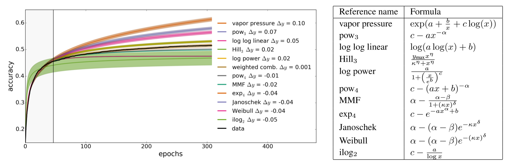

# NNI 中的 Curve Fitting Assessor

## 1. 介绍

The Curve Fitting Assessor is an LPA (learning, predicting, assessing) algorithm. It stops a pending trial X at step S if the prediction of the final epoch's performance is worse than the best final performance in the trial history.

In this algorithm, we use 12 curves to fit the learning curve. The set of parametric curve models are chosen from this [reference paper](http://aad.informatik.uni-freiburg.de/papers/15-IJCAI-Extrapolation_of_Learning_Curves.pdf). The learning curves' shape coincides with our prior knowledge about the form of learning curves: They are typically increasing, saturating functions.

所有学习曲线模型被合并到了单个，更强大的模型中。 合并的模型通过加权线性混合：

with the new combined parameter vector

Assuming additive Gaussian noise and the noise parameter being initialized to its maximum likelihood estimate.

We determine the maximum probability value of the new combined parameter vector by learning the historical data. We use such a value to predict future trial performance and stop the inadequate experiments to save computing resources.

Concretely, this algorithm goes through three stages of learning, predicting, and assessing.

* 步骤 1：学习。 We will learn about the trial history of the current trial and determine the \xi at the Bayesian angle. First of all, We fit each curve using the least-squares method, implemented by `fit_theta`. After we obtained the parameters, we filter the curve and remove the outliers, implemented by `filter_curve`. Finally, we use the MCMC sampling method. implemented by `mcmc_sampling`, to adjust the weight of each curve. Up to now, we have determined all the parameters in \xi.

* 步骤 2：预测。 It calculates the expected final result accuracy, implemented by `f_comb`, at the target position (i.e., the total number of epochs) by \xi and the formula of the combined model.

* Step3: If the fitting result doesn't converge, the predicted value will be `None`. In this case, we return `AssessResult.Good` to ask for future accuracy information and predict again. Furthermore, we will get a positive value from the `predict()` function. If this value is strictly greater than the best final performance in history * `THRESHOLD`(default value = 0.95), return `AssessResult.Good`, otherwise, return `AssessResult.Bad`

下图显示了此算法在 MNIST Trial 历史数据上结果。其中绿点表示 Assessor 获得的数据，蓝点表示将来，但未知的数据，红色线条是 Curve fitting Assessor 的预测曲线。

## 2. 用法

要使用 Curve Fitting Assessor，需要在 Experiment 的 YAML 配置文件进行如下改动。

    assessor:
        builtinAssessorName: Curvefitting
        classArgs:
          # (必须) epoch 的总数。
          # 需要此数据来决定需要预测的点。
          epoch_num: 20
          # (可选) 选项: maximize, minimize
          *  optimize_mode 的默认值是 maximize
          optimize_mode: maximize
          # (可选) 为了节约计算资源，在收到了 start_step 个中间结果后，才开始预测。
          # start_step 的默认值是 6。
          start_step: 6
          # (可选) 决定是否提前终止的阈值。
          # 例如，如果 threshold = 0.95, optimize_mode = maximize，最好的历史结果是 0.9，那么会在 Trial 的预测值低于 0.95 * 0.9 = 0.855 时停止。
          * 阈值的默认值是 0.95。
          # 注意：如果选择了 minimize 模式，要让 threshold >= 1.0 (如 threshold=1.1)
          threshold: 0.95
          # (可选) gap 是两次评估之间的间隔次数。
          # 例如：如果 gap = 2, start_step = 6，就会评估第 6, 8, 10, 12... 个中间结果。
          * gap 的默认值是 1。
          gap: 1
    

## 3. 文件结构

The assessor has a lot of different files, functions, and classes. Here we briefly describe a few of them.

* `curvefunctions.py` includes all the function expressions and default parameters.
* `modelfactory.py` includes learning and predicting; the corresponding calculation part is also implemented here.
* `curvefitting_assessor.py` is the assessor which receives the trial history and assess whether to early stop the trial.

## 4. TODO

* 进一步提高预测精度，并在更多模型上测试。