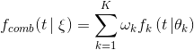

# NNI 中的 Curve Fitting Assessor

## Introduction

Curve Fitting Assessor 是一个 LPA (learning, predicting, assessing，即学习、预测、评估) 的算法。 如果预测的 Trial X 在 step S 比性能最好的 Trial 要差，就会提前终止它。

此算法中采用了 12 种曲线来拟合学习曲线。 这组参数曲线模型来自于[参考论文](http://aad.informatik.uni-freiburg.de/papers/15-IJCAI-Extrapolation_of_Learning_Curves.pdf)。 学习曲线的形状与先验知识是一致的：都是典型的递增的、饱和的函数。


所有学习曲线模型被合并到了单个，更强大的模型中。 合并的模型通过加权线性混合：



合并后的新参数向量


假设增加一个高斯噪声，且噪声参数初始化为最大似然估计。

通过学习历史数据来确定新的组合参数向量的最大概率值。 用这样的方法来预测后面的 Trial 性能，并停止不好的 Trial 来节省计算资源。

具体来说，该算法有学习、预测和评估三个阶段。

* 步骤 1：学习。 从当前 Trial 的历史中学习，并从贝叶斯角度决定 \xi 。 首先，使用由 `fit_theta` 实现的最小二乘法。 获得参数后，过滤曲线并移除异常点（由 `filter_curve` 实现）。 最后，使用 MCMC 采样方法。 由 `mcmc_sampling` 实现，来调整每条曲线的权重。 至此，确定了 \xi 中的所有参数。

* 步骤 2：预测。 用 \xi 和混合模型公式，由 `f_comb` 实现了，在目标位置（例如 epoch 的总数）来计算期望的最终结果精度。

* 步骤 3：如果拟合结果不收敛，则预测值将为 `None`。 在这种情况下，会返回 `AssessResult.Good/code> 来请求进一步的精度和预测信息。 此外，将从 <code>predict()` 函数获得正确值。 如果该值大于历史最好结果 * `THRESHOLD`（默认为 0.95），则返回 `AssessResult.Good`，否则返回 `AssessResult.Bad`。

下图显示了此算法在 MNIST Trial 历史数据上结果。其中绿点表示 Assessor 获得的数据，蓝点表示将来，但未知的数据，红色线条是 Curve fitting Assessor 的预测曲线。


## Usage

要使用 Curve Fitting Assessor，需要在 Experiment 的 YAML 配置文件进行如下改动。

```yaml
assessor:
  builtinAssessorName: Curvefitting
  classArgs:
    # (required)The total number of epoch.
    # 需要此数据来决定需要预测的点。
    epoch_num: 20
    # (optional) In order to save our computing resource, we start to predict when we have more than only after receiving start_step number of reported intermediate results.
    # The default value of start_step is 6.
    start_step: 6
    # (optional) The threshold that we decide to early stop the worse performance curve.
    # For example: if threshold = 0.95, best performance in the history is 0.9, then we will stop the trial which predict value is lower than 0.95 * 0.9 = 0.855.
    # The default value of threshold is 0.95.
    threshold: 0.95
    # (optional) The gap interval between Assesor judgements.
    # 例如：如果 gap = 2, start_step = 6，就会评估第 6, 8, 10, 12... 个中间结果。
    # The default value of gap is 1.
    gap: 1
```

## Limitation

According to the original paper, only incremental functions are supported. Therefore this assessor can only be used to maximize optimization metrics. For example, it can be used for accuracy, but not for loss.

## File Structure

The assessor has a lot of different files, functions, and classes. Here we briefly describe a few of them.

* `curvefunctions.py` 包含了所有函数表达式和默认参数。
* `modelfactory.py` 包括学习和预测部分，并实现了相应的计算部分。
* `curvefitting_assessor.py` 是接收 Trial 历史数据并评估是否需要提前终止的 Assessor。

## TODO

* 进一步提高预测精度，并在更多模型上测试。