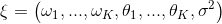

NNI 中的 Curve Fitting Assessor
===============================

介绍
------------

Curve Fitting Assessor 是一个 LPA (learning, predicting, assessing，即学习、预测、评估) 的算法。 如果预测的 Trial X 在 step S 比性能最好的 Trial 要差，就会提前终止它。

此算法中采用了 12 种曲线来拟合学习曲线。 这组参数曲线模型来自于 `参考论文 <http://aad.informatik.uni-freiburg.de/papers/15-IJCAI-Extrapolation_of_Learning_Curves.pdf>`__。 学习曲线的形状与先验知识是一致的：都是典型的递增的、饱和的函数。

.. image:: ../../img/curvefitting_learning_curve.PNG
   :target: ../../img/curvefitting_learning_curve.PNG
   :alt: learning_curve

所有学习曲线模型被合并到了单个，更强大的模型中。 合并的模型通过加权线性混合：

.. image:: ../../img/curvefitting_f_comb.gif
   :target: ../../img/curvefitting_f_comb.gif
   :alt: f_comb

合并后的新参数向量

假设增加一个高斯噪声，且噪声参数初始化为最大似然估计。

通过学习历史数据来确定新的组合参数向量的最大概率值。 用这样的方法来预测后面的 Trial 性能，并停止不好的 Trial 来节省计算资源。

具体来说，该算法有学习、预测和评估三个阶段。

* 
  步骤 1：学习。 从当前 Trial 的历史中学习，并从贝叶斯角度决定 \xi 。 首先，使用由 ``fit_theta`` 实现的最小二乘法。 获得参数后，过滤曲线并移除异常点（由 ``filter_curve`` 实现）。 最后，使用 MCMC 采样方法。 由 ``mcmc_sampling`` 实现，来调整每条曲线的权重。 至此，确定了 \xi 中的所有参数。

* 
  步骤 2：预测。 用 \xi 和混合模型公式，由 ``f_comb`` 实现了，在目标位置（例如 epoch 的总数）来计算期望的最终结果精度。

* 
  步骤 3：如果拟合结果不收敛，则预测值将为 ``None``。 在这种情况下，会返回 ``AssessResult.Good`` 来请求进一步的精度和预测信息。 此外，将从 ``predict()`` 函数获得正确值。 如果该值大于历史最好结果 * ``THRESHOLD``（默认为 0.95），则返回 ``AssessResult.Good``，否则返回 ``AssessResult.Bad``。

下图显示了此算法在 MNIST Trial 历史数据上结果。其中绿点表示 Assessor 获得的数据，蓝点表示将来，但未知的数据，红色线条是 Curve fitting Assessor 的预测曲线。

.. image:: ../../img/curvefitting_example.PNG
   :target: ../../img/curvefitting_example.PNG
   :alt: examples

用法
-----

要使用 Curve Fitting Assessor，需要在 Experiment 的 YAML 配置文件进行如下改动。

.. code-block:: yaml

   assessor:
     builtinAssessorName: Curvefitting
     classArgs:
       # （必需）epoch总数
       # 需要此数据来决定需要预测的点。
       epoch_num: 20
       #（可选）为了节约计算资源，仅在收到 start_step 个中间结果后，才开始进行预测。
       # start_step 的默认值是 6。
       start_step: 6
       # （可选）决定是否提前终止的阈值。
       # 例如，如果 threshold = 0.95，最好的历史结果是 0.9，那么会在 Trial 的预测值低于 0.95 * 0.9 = 0.855 时停止。
       # 阈值的默认值是 0.95。
       threshold: 0.95
       #（可选）gap 是两次评估之间的间隔次数。
       # 例如：如果 gap = 2, start_step = 6，就会评估第 6, 8, 10, 12... 个中间结果。
       # gap 的默认值是 1。
       gap: 1

局限性
----------

根据原始论文，仅支持递增函数。 因此，此 Assessor 仅可用于最大化优化指标的场景。 例如，它可用于准确度，但不能用于损失值。

文件结构
--------------

Assessor 有大量的文件、函数和类。 在这里，会简要描述其中一部分。

* ``curvefunctions.py`` 包含了所有函数表达式和默认参数。
* ``curvefunctions.py`` 包括学习和预测部分，并实现了相应的计算部分。
* ``curvefitting_assessor.py`` 是接收 Trial 历史数据并评估是否需要提前终止的 Assessor。

TODO
----

* 进一步提高预测精度，并在更多模型上测试。
