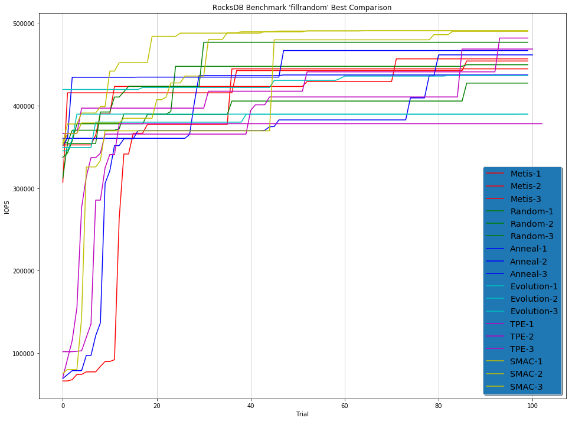
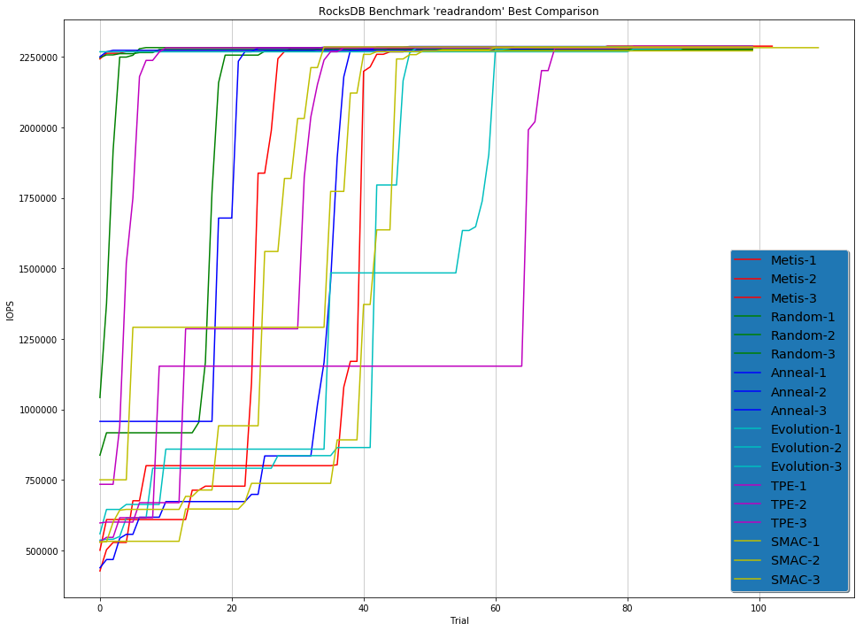

超参数优化的对比
=======================================

*匿名作者*

超参优化算法（HPO）在几个问题上的对比。

超参数优化算法如下：

* `Random Search（随机搜索） <../Tuner/BuiltinTuner.rst>`__
* `Grid Search（网格搜索） <../Tuner/BuiltinTuner.rst>`__
* `Evolution <../Tuner/BuiltinTuner.rst>`__
* `Anneal <../Tuner/BuiltinTuner.rst>`__
* `Metis <../Tuner/BuiltinTuner.rst>`__
* `TPE <../Tuner/BuiltinTuner.rst>`__
* `SMAC <../Tuner/BuiltinTuner.rst>`__
* `HyperBand <../Tuner/BuiltinTuner.rst>`__
* `BOHB <../Tuner/BuiltinTuner.rst>`__

所有算法都在 NNI 本机环境下运行。

环境：

.. code-block:: bash

   OS: Linux Ubuntu 16.04 LTS
   CPU: Intel(R) Xeon(R) CPU E5-2690 v3 @ 2.60GHz 2600 MHz
   Memory: 112 GB
   NNI Version: v0.7
   NNI Mode(local|pai|remote): local
   Python version: 3.6
   Is conda or virtualenv used?: Conda
   is running in docker?: no

AutoGBDT 示例
----------------

问题描述
^^^^^^^^^^^^^^^^^^^

超参搜索上的非凸问题 `AutoGBDT <../TrialExample/GbdtExample.rst>`__ 示例。

搜索空间
^^^^^^^^^^^^

.. code-block:: json

   {
     "num_leaves": {
       "_type": "choice",
       "_value": [10, 12, 14, 16, 18, 20, 22, 24, 28, 32, 48, 64, 96, 128]
     },
     "learning_rate": {
       "_type": "choice",
       "_value": [0.00001, 0.0001, 0.001, 0.01, 0.05, 0.1, 0.2, 0.5]
     },
     "max_depth": {
       "_type": "choice",
       "_value": [-1, 2, 3, 4, 5, 6, 8, 10, 12, 14, 16, 18, 20, 22, 24, 28, 32, 48, 64, 96, 128]
     },
     "feature_fraction": {
       "_type": "choice",
       "_value": [0.9, 0.8, 0.7, 0.6, 0.5, 0.4, 0.3, 0.2]
     },
     "bagging_fraction": {
       "_type": "choice",
       "_value": [0.9, 0.8, 0.7, 0.6, 0.5, 0.4, 0.3, 0.2]
     },
     "bagging_freq": {
       "_type": "choice",
       "_value": [1, 2, 4, 8, 10, 12, 14, 16]
     }
   }

总搜索空间为 1, 204, 224 次，将最大 Trial 次数设置为 1000。 时间限制为 48 小时。

结果
^^^^^^^

.. list-table::
   :header-rows: 1
   :widths: auto

   * - 算法
     - 最好的损失值
     - 最好的 5 次损失的平均值
     - 最好的 10 次损失的平均值
   * - Random Search
     - 0.418854
     - 0.420352
     - 0.421553
   * - Random Search
     - 0.417364
     - 0.420024
     - 0.420997
   * - Random Search
     - 0.417861
     - 0.419744
     - 0.420642
   * - Grid Search
     - 0.498166
     - 0.498166
     - 0.498166
   * - Evolution
     - 0.409887
     - 0.409887
     - 0.409887
   * - Evolution
     - 0.413620
     - 0.413875
     - 0.414067
   * - Evolution
     - 0.409887
     - 0.409887
     - 0.409887
   * - Anneal
     - 0.414877
     - 0.417289
     - 0.418281
   * - Anneal
     - 0.409887
     - 0.409887
     - 0.410118
   * - Anneal
     - 0.413683
     - 0.416949
     - 0.417537
   * - Metis
     - 0.416273
     - 0.420411
     - 0.422380
   * - Metis
     - 0.420262
     - 0.423175
     - 0.424816
   * - Metis
     - 0.421027
     - 0.424172
     - 0.425714
   * - TPE
     - 0.414478
     - 0.414478
     - 0.414478
   * - TPE
     - 0.415077
     - 0.417986
     - 0.418797
   * - TPE
     - 0.415077
     - 0.417009
     - 0.418053
   * - SMAC
     - **0.408386**
     - **0.408386**
     - **0.408386**
   * - SMAC
     - 0.414012
     - 0.414012
     - 0.414012
   * - SMAC
     - **0.408386**
     - **0.408386**
     - **0.408386**
   * - BOHB
     - 0.410464
     - 0.415319
     - 0.417755
   * - BOHB
     - 0.418995
     - 0.420268
     - 0.422604
   * - BOHB
     - 0.415149
     - 0.418072
     - 0.418932
   * - HyperBand
     - 0.414065
     - 0.415222
     - 0.417628
   * - HyperBand
     - 0.416807
     - 0.417549
     - 0.418828
   * - HyperBand
     - 0.415550
     - 0.415977
     - 0.417186
   * - GP
     - 0.414353
     - 0.418563
     - 0.420263
   * - GP
     - 0.414395
     - 0.418006
     - 0.420431
   * - GP
     - 0.412943
     - 0.416566
     - 0.418443

此例中，所有算法都使用了默认参数。 Metis 算法因为其高斯计算过程的复杂度为 O(n^3) 而运行非常慢，因此仅执行了 300 次 Trial。

RocksDB 的 'fillrandom' 和 'readrandom' 基准测试
------------------------------------------------------

问题描述
^^^^^^^^^^^^^^^^^^^

`DB_Bench <https://github.com/facebook/rocksdb/wiki/Benchmarking-tools>`__ 是用来做 `RocksDB <https://rocksdb.org/>`__ 性能基准测试的工具。 有多个参数需要调优。

``DB_Bench`` 的性能与计算机配置和安装方法有关。 在 ``DB_Bench`` Linux 系统上运行，并将 Rock 作为共享库安装。

计算机配置
^^^^^^^^^^^^^^^^^^^^^

.. code-block:: bash

   RocksDB:    version 6.1
   CPU:        6 * Intel(R) Xeon(R) CPU E5-2690 v4 @ 2.60GHz
   CPUCache:   35840 KB
   Keys:       16 bytes each
   Values:     100 bytes each (50 bytes after compression)
   Entries:    1000000

存储性能
^^^^^^^^^^^^^^^^^^^

**延迟** ：每个 IO 请求都需要一些时间才能完成，这称为平均延迟。 有几个因素会影响此时间，包括网络连接质量和硬盘IO性能。

**IOPS**： **每秒的 IO 操作数量**，这意味着可以在一秒钟内完成的 *读取或写入操作次数*。

**IO 大小**： **每个 IO 请求的大小**。 根据操作系统和需要磁盘访问的应用程序、服务，它将同时发出读取或写入一定数量数据的请求。

**吞吐量（以 MB/s 为单位）= 平均 IO 大小 x IOPS** 

IOPS 与在线处理能力有关，我们在实验中使用 IOPS 作为指标。

搜索空间
^^^^^^^^^^^^

.. code-block:: json

   {
     "max_background_compactions": {
       "_type": "quniform",
       "_value": [1, 256, 1]
     },
     "block_size": {
       "_type": "quniform",
       "_value": [1, 500000, 1]
     },
     "write_buffer_size": {
       "_type": "quniform",
       "_value": [1, 130000000, 1]
     },
     "max_write_buffer_number": {
       "_type": "quniform",
       "_value": [1, 128, 1]
     },
     "min_write_buffer_number_to_merge": {
       "_type": "quniform",
       "_value": [1, 32, 1]
     },
     "level0_file_num_compaction_trigger": {
       "_type": "quniform",
       "_value": [1, 256, 1]
     },
     "level0_slowdown_writes_trigger": {
       "_type": "quniform",
       "_value": [1, 1024, 1]
     },
     "level0_stop_writes_trigger": {
       "_type": "quniform",
       "_value": [1, 1024, 1]
     },
     "cache_size": {
       "_type": "quniform",
       "_value": [1, 30000000, 1]
     },
     "compaction_readahead_size": {
       "_type": "quniform",
       "_value": [1, 30000000, 1]
     },
     "new_table_reader_for_compaction_inputs": {
       "_type": "randint",
       "_value": [1]
     }
   }

搜索空间非常大（约10 的 40 次方），将最大 Trial 次数设置为 100 以限制资源。

结果
^^^^^^^

fillrandom 基准
^^^^^^^^^^^^^^^^^^^^^

.. list-table::
   :header-rows: 1
   :widths: auto

   * - 模型
     - 最高 IOPS（重复 1 次）
     - 最高 IOPS（重复 2 次）
     - 最高 IOPS（重复 3 次）
   * - Random
     - 449901
     - 427620
     - 477174
   * - Anneal
     - 461896
     - 467150
     - 437528
   * - Evolution
     - 436755
     - 389956
     - 389790
   * - TPE
     - 378346
     - 482316
     - 468989
   * - SMAC
     - 491067
     - 490472
     - **491136**
   * - Metis
     - 444920
     - 457060
     - 454438

图：

readrandom 基准
^^^^^^^^^^^^^^^^^^^^^^

.. list-table::
   :header-rows: 1
   :widths: auto

   * - 模型
     - 最高 IOPS（重复 1 次）
     - 最高 IOPS（重复 2 次）
     - 最高 IOPS（重复 3 次）
   * - Random
     - 2276157
     - 2285301
     - 2275142
   * - Anneal
     - 2286330
     - 2282229
     - 2284012
   * - Evolution
     - 2286524
     - 2283673
     - 2283558
   * - TPE
     - 2287366
     - 2282865
     - 2281891
   * - SMAC
     - 2270874
     - 2284904
     - 2282266
   * - Metis
     - **2287696**
     - 2283496
     - 2277701

图：

