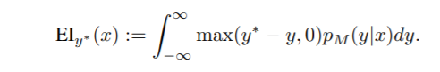
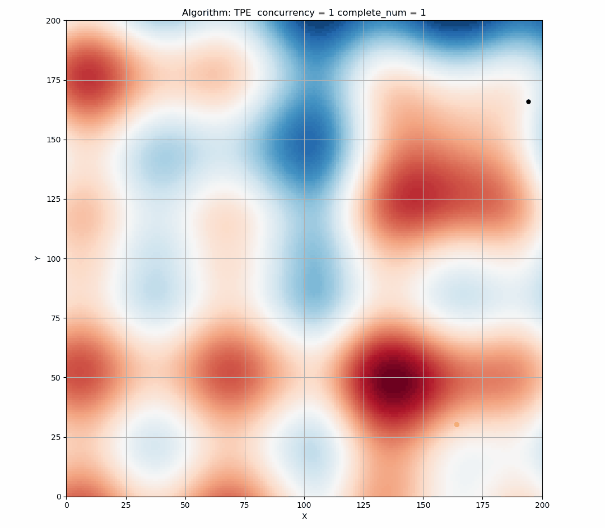
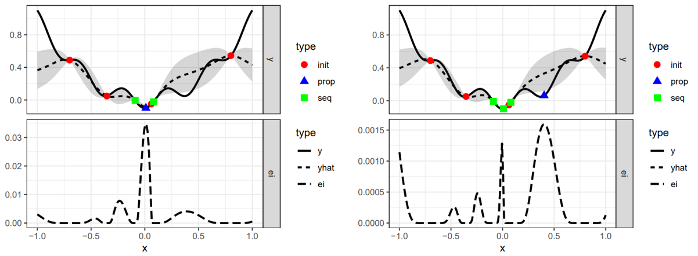
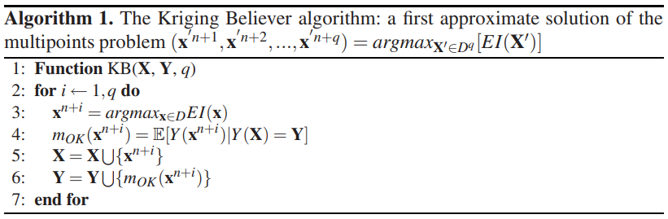
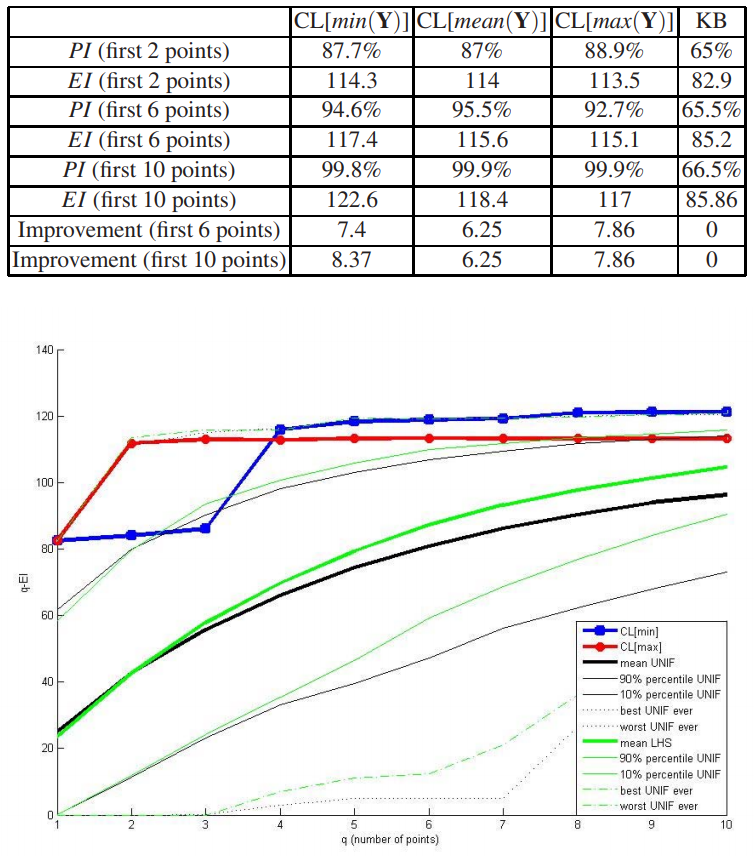

.. role:: raw-html(raw)
   :format: html

并行化顺序算法：TPE
========================================

为了利用多个计算节点，TPE 方法是异步运行的，这样能避免浪费时间等待 Trial 评估的完成。 TPE 方法使用了叫做 constant liar 的方法：每次候选点 x* 生成时，会临时分配一个假的评估结果 y。在评估完成后，用返回的真实损失值 f(x*) 来替换假的评估结果。

介绍和问题
-------------------------

基于顺序模型的全局优化
^^^^^^^^^^^^^^^^^^^^^^^^^^^^^^^^^^^^^^^^^^

基于顺序模型的全局优化（SMBO）算法已经用于许多应用中，但适应度函数的评估成本比较高。 在应用中，真实的适应度函数 f: X → R 评估成本较高，通过采用基于模型算法近似的 f 来替代，可降低其评估成本。 通常，在 SMBO 算法内层循环是用数值优化或其它转换方式来替代。 点 x* 最大化的替代项（或它的转换形式）作为真实函数 f 评估的替代值。 这种类似于主动学习的算法模板总结如下。 SMBO 算法的不同之处在于，给定一个 f 的模型（或替代项）的情况下，获得 x* 的优化的标准，以及通过观察历史 H 来模拟 f。

.. image:: ../../img/parallel_tpe_search4.PNG
   :target: ../../img/parallel_tpe_search4.PNG
   :alt: 

本算法优化了预期改进（Expected Improvement，EI）的标准。 其它建议的标准包括，概率改进（Probability of Improvement）、预期改进（Expected Improvement）最小化条件熵（minimizing the Conditional Entropy of the Minimizer）、以及 bandit-based 的标准。 在 TPE 中考虑到直观，选择了 EI，其在多种设置下都展示了较好的效果。 预期改进（EI）是在模型 M 下，当 f(x) （负向）超过某个阈值 y* 时，对 f 的预期：X → RN。

由于 p(y|x) 计算成本较高，TPE 通过 p(x|y) 和 p(y) 来为 p(y|x) 建模。TPE 通过下列两个密度来定义 p(x|y)：

.. image:: ../../img/parallel_tpe_search_tpe.PNG
   :target: ../../img/parallel_tpe_search_tpe.PNG
   :alt: 

l(x) 是通过观察 {x(i)} 来形成的密度，使得相应的损失 f(x(i)) 小于 y∗，
而 g(x) 是使用剩余的观测值来形成的密度。 TPE 算法取决于 y∗ 大于观测到的最好的 f(x)，这样可以使用一些点来形成 l(x)。 TPE 算法选择了 y* 来作为一些观测值 y 的分位数 γ，因此 p(y<\ ``y∗``\ ) = γ，但不需要为特定的 p(y) 建模。 l 和 g 的树形结构使得根据 l 来计算多个候选项变得容易，可根据 g(x)/l(x) 来进行评估。 在每次迭代中，算法返回了具有最大 EI 的候选 x*。

这是 TPE 算法在二维搜索空间上的模拟。 不同的背景色表示了不同的值。 可以看出，TPE 在探索（exploration）和挖掘（exploitation）方面的表现都很好。 （黑色表示此轮样本的点，黄色表示历史点。）

**由于 EI 是连续函数，因此 EI 的最高 x 在某个状态下是确定的 。** 如下图所示，蓝色三角形表示在当前状态下最有可能进行采样的点。

TPE 在顺序执行时表现很好，但当并发性较大时，会 **在相同的 EI 状态下产生大量的点**，过于集中的点会减少 Tuner 探索的能力，造成了资源的浪费。

这是当 ``concurrency=60`` 时的模拟图，这种现象非常明显。

.. image:: ../../img/parallel_tpe_search2.gif
   :target: ../../img/parallel_tpe_search2.gif
   :alt: 

研究的解决方案
-----------------

近似 q-EI 最大化
^^^^^^^^^^^^^^^^^^^^^^^^^^^^^^

下面介绍的多点标准的新的 Experiment 设计一步解决此优化问题。

.. image:: ../../img/parallel_tpe_search_qEI.PNG
   :target: ../../img/parallel_tpe_search_qEI.PNG
   :alt: 

但是，当 q 增加时，q-EI 的计算变得很密集。 研究发现，四种流行的贪心策略可在解决此问题时，减少计算成本。

方案 1: Believing the OK Predictor: KB(Kriging Believer) 启发式策略
^^^^^^^^^^^^^^^^^^^^^^^^^^^^^^^^^^^^^^^^^^^^^^^^^^^^^^^^^^^^^^^^^^^^^^^^^^^^^^^^^^^

Kriging Believer 策略用等价于 Kriging 预测期望值的确定性值替换在最后一次迭代中选择的位置的响应的条件知识。 保持与上次相同的记号，此策略可归纳如下：

这种顺序策略使用了 q-points 设计，在计算量上是可承受的，因为它依赖于分析已知的 EI，在 d 维上进行了优化。 但此方法有失败的风险，因为相信 OK Predictor 可以预测超过观察到的数据，可能导致多轮迭代中的序列会陷入非最优区域。 第二种策略可降低这种风险。

方案 2: CL(Constant Liar) 启发式策略
^^^^^^^^^^^^^^^^^^^^^^^^^^^^^^^^^^^^^^^^^^^^^^^^^^^^

考虑一种顺序策略，在每次迭代时会更新元模型（但不会重新估计超参），其中值 L 来自外部固定值，称为”lie（谎言）”。 Constant Liar 策略在每次迭代时使用相同的值 L：最大化 EI（即找到 xn+1），将模型实现为 y(xn+1) = L， 始终使用 L∈R：

.. image:: ../../img/parallel_tpe_search_cl.PNG
   :target: ../../img/parallel_tpe_search_cl.PNG
   :alt: 

L 应在逻辑上根据 y 在 X 处获取的值来确定，可考虑使用的三个值：min{Y}, mean{Y}, 以及 max{Y}。 **L 越大，算法的探索性就越大，反之亦然。**

根据上述方法进行模拟。 下图显示了使用均值 liar，来最大化 q-EI。 能看到这些点开始分散了。

实验
----------

Branin-Hoo
^^^^^^^^^^

最后一章介绍的四种优化方法通过 Branin-Hoo 函数进行了比较，这是全局优化中的经典测试用例。

.. image:: ../../img/parallel_tpe_search_branin.PNG
   :target: ../../img/parallel_tpe_search_branin.PNG
   :alt: 

a, b, c, r, s 以及 t 的推荐值分别为：a = 1, b = 5.1 ⁄ (4π2), c = 5 ⁄ π, r = 6, s = 10, t = 1 ⁄ (8π)。 此函数有三个全局最小值点 (-3.14, 12.27), (3.14, 2.27), (9.42, 2.47)。

下表为给定 constant liar 策略（最小、最大值）下，比较了前 q 个点（q ∈ [1,10]）。每个 q 绘制 2000 个 q 点，这 2000 个 q 点随机采用 LHS。

正如图中所见，，CL[max] 和 CL[min] 与随机相比，产生了更好的 q-EI 结果，尤其是 q 值很小时。

高斯混合模型函数（Gaussian Mixed Model function）
^^^^^^^^^^^^^^^^^^^^^^^^^^^^^^^^^^^^^^^^^^^^^^^^^^^^^^^^^^

以下比较了使用和不使用并行优化的情况。 二维多模的高斯混合分布的模拟结果如下：

.. list-table::
   :header-rows: 1
   :widths: auto

   * - 
     - concurrency=80
     - concurrency=60
     - concurrency=40
     - concurrency=20
     - concurrency=10
   * - 未使用并行优化
     - avg =  0.4841 :raw-html:` ` var =  0.1953
     - avg =  0.5155 :raw-html:` ` var =  0.2219
     - avg =  0.5773 :raw-html:` ` var =  0.2570
     - avg =  0.4680 :raw-html:` ` var =  0.1994
     - avg = 0.2774 :raw-html:` ` var = 0.1217
   * - 未使用并行优化
     - avg =  0.2132 :raw-html:` ` var = 0.0700
     - avg =  0.2177\ :raw-html:` `\ var =  0.0796
     - avg =  0.1835 :raw-html:` ` var =  0.0533
     - avg =  0.1671 :raw-html:` ` var =  0.0413
     - avg =  0.1918 :raw-html:` ` var =  0.0697

注意：每次测试的样本总数为 240（确保成本相等）。 每种形式下的 Trial 重复了 1000 次，表中值为 1000 个 Trial 中最好结果的平均值和方差。

参考
----------

[1] James Bergstra, Remi Bardenet, Yoshua Bengio, Balazs Kegl. "Algorithms for Hyper-Parameter Optimization". `链接 <https://papers.nips.cc/paper/4443-algorithms-for-hyper-parameter-optimization.pdf>`__

[2] Meng-Hiot Lim, Yew-Soon Ong. "Computational Intelligence in Expensive Optimization Problems". `链接 <https://link.springer.com/content/pdf/10.1007%2F978-3-642-10701-6.pdf>`__

[3] M. Jordan, J. Kleinberg, B. Scho¨lkopf. "Pattern Recognition and Machine Learning". `链接 <http://users.isr.ist.utl.pt/~wurmd/Livros/school/Bishop%20-%20Pattern%20Recognition%20And%20Machine%20Learning%20-%20Springer%20%202006.pdf>`__
