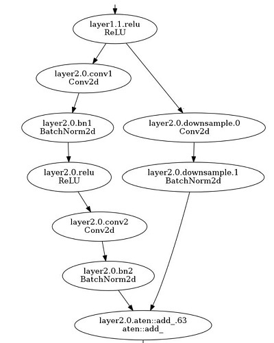

# Analysis Utils for Model Compression

```eval_rst
.. contents::
```

We provide several easy-to-use tools for users to analyze their model during model compression.

## Sensitivity Analysis
First, we provide a sensitivity analysis tool (**SensitivityAnalysis**) for users to analyze the sensitivity of each convolutional layer in their model. Specifically, the SensitiviyAnalysis gradually prune each layer of the model, and test the accuracy of the model at the same time. Note that, SensitivityAnalysis only prunes a layer once a time, and the other layers are set to their original weights. According to the accuracies of different convolutional layers under different sparsities, we can easily find out which layers the model accuracy is more sensitive to.

### Usage

The following codes show the basic usage of the SensitivityAnalysis.
```python
from nni.compression.torch.utils.sensitivity_analysis import SensitivityAnalysis

def val(model):
    model.eval()
    total = 0
    correct = 0
    with torch.no_grad():
        for batchid, (data, label) in enumerate(val_loader):
            data, label = data.cuda(), label.cuda()
            out = model(data)
            _, predicted = out.max(1)
            total += data.size(0)
            correct += predicted.eq(label).sum().item()
    return correct / total

s_analyzer = SensitivityAnalysis(model=net, val_func=val)
sensitivity = s_analyzer.analysis(val_args=[net])
os.makedir(outdir)
s_analyzer.export(os.path.join(outdir, filename))
```

Two key parameters of SensitivityAnalysis are `model`, and `val_func`. `model` is the neural network that to be analyzed and the `val_func` is the validation function that returns the model accuracy/loss/ or other metrics on the validation dataset. Due to different scenarios may have different ways to calculate the loss/accuracy, so users should prepare a function that returns the model accuracy/loss on the dataset and pass it to SensitivityAnalysis. SensitivityAnalysis can export the sensitivity results as a csv file usage is shown in the example above.

Futhermore, users can specify the sparsities values used to prune for each layer by optional parameter `sparsities`.
```python
s_analyzer = SensitivityAnalysis(model=net, val_func=val, sparsities=[0.25, 0.5, 0.75])
```
the SensitivityAnalysis will prune 25% 50% 75% weights gradually for each layer, and record the model's accuracy at the same time (SensitivityAnalysis only prune a layer once a time, the other layers are set to their original weights). If the sparsities is not set, SensitivityAnalysis will use the numpy.arange(0.1, 1.0, 0.1) as the default sparsity values.

Users can also speed up the progress of sensitivity analysis by the early_stop_mode and early_stop_value option. By default, the SensitivityAnalysis will test the accuracy under all sparsities for each layer. In contrast, when the early_stop_mode and early_stop_value are set, the sensitivity analysis for a layer will stop, when the accuracy/loss has already met the threshold set by early_stop_value. We support four early stop modes:  minimize, maximize, dropped, raised.

minimize: The analysis stops when the validation metric return by the val_func lower than `early_stop_value`.

maximize: The analysis stops when the validation metric return by the val_func larger than `early_stop_value`.

dropped: The analysis stops when the validation metric has dropped by `early_stop_value`.

raised: The analysis stops when the validation metric has raised by `early_stop_value`.

```python
s_analyzer = SensitivityAnalysis(model=net, val_func=val, sparsities=[0.25, 0.5, 0.75], early_stop_mode='dropped', early_stop_value=0.1)
```
If users only want to analyze several specified convolutional layers, users can specify the target conv layers by the `specified_layers` in analysis function. `specified_layers` is a list that consists of the Pytorch module names of the conv layers. For example
```python
sensitivity = s_analyzer.analysis(val_args=[net], specified_layers=['Conv1'])
```
In this example, only the `Conv1` layer is analyzed. In addtion, users can quickly and easily achieve the analysis parallelization by launching multiple processes and assigning different conv layers of the same model to each process.


### Output example
The following lines are the example csv file exported from SensitivityAnalysis. The first line is constructed by 'layername' and sparsity list. Here the sparsity value means how much weight SensitivityAnalysis prune for each layer. Each line below records the model accuracy when this layer is under different sparsities. Note that, due to the early_stop option, some layers may not have model accuracies/losses under all sparsities, for example, its accuracy drop has already exceeded the threshold set by the user.
```
layername,0.05,0.1,0.2,0.3,0.4,0.5,0.7,0.85,0.95
features.0,0.54566,0.46308,0.06978,0.0374,0.03024,0.01512,0.00866,0.00492,0.00184
features.3,0.54878,0.51184,0.37978,0.19814,0.07178,0.02114,0.00438,0.00442,0.00142
features.6,0.55128,0.53566,0.4887,0.4167,0.31178,0.19152,0.08612,0.01258,0.00236
features.8,0.55696,0.54194,0.48892,0.42986,0.33048,0.2266,0.09566,0.02348,0.0056
features.10,0.55468,0.5394,0.49576,0.4291,0.3591,0.28138,0.14256,0.05446,0.01578
```

## Topology Analysis
We also provide several tools for the topology analysis during the model compression. These tools are to help users compress their model better. Because of the complex topology of the network, when compressing the model, users often need to spend a lot of effort to check whether the compression configuration is reasonable. So we provide these tools for topology analysis to reduce the burden on users.

### ChannelDependency
Complicated models may have residual connection/concat operations in their models. When the user prunes these models, they need to be careful about the channel-count dependencies between the convolution layers in the model. Taking the following residual block in the resnet18 as an example. The output features of the `layer2.0.conv2` and `layer2.0.downsample.0` are added together, so the number of the output channels of `layer2.0.conv2` and `layer2.0.downsample.0` should be the same, or there may be a tensor shape conflict.




If the layers have channel dependency are assigned with different sparsities (here we only discuss the structured pruning by L1FilterPruner/L2FilterPruner), then there will be a shape conflict during these layers. Even the pruned model with mask works fine, the pruned model cannot be speedup to the final model directly that runs on the devices, because there will be a shape conflict when the model tries to add/concat the outputs of these layers. This tool is to find the layers that have channel count dependencies to help users better prune their model.

#### Usage
```python
from nni.compression.torch.utils.shape_dependency import ChannelDependency
data = torch.ones(1, 3, 224, 224).cuda()
channel_depen = ChannelDependency(net, data)
channel_depen.export('dependency.csv')
```

#### Output Example
The following lines are the output example of torchvision.models.resnet18 exported by ChannelDependency. The layers at the same line have output channel dependencies with each other. For example, layer1.1.conv2, conv1, and layer1.0.conv2 have output channel dependencies with each other, which means the output channel(filters) numbers of these three layers should be same with each other, otherwise, the model may have shape conflict.
```
Dependency Set,Convolutional Layers
Set 1,layer1.1.conv2,layer1.0.conv2,conv1
Set 2,layer1.0.conv1
Set 3,layer1.1.conv1
Set 4,layer2.0.conv1
Set 5,layer2.1.conv2,layer2.0.conv2,layer2.0.downsample.0
Set 6,layer2.1.conv1
Set 7,layer3.0.conv1
Set 8,layer3.0.downsample.0,layer3.1.conv2,layer3.0.conv2
Set 9,layer3.1.conv1
Set 10,layer4.0.conv1
Set 11,layer4.0.downsample.0,layer4.1.conv2,layer4.0.conv2
Set 12,layer4.1.conv1
```

### MaskConflict
When the masks of different layers in a model have conflict (for example, assigning different sparsities for the layers that have channel dependency), we can fix the mask conflict by MaskConflict. Specifically, the MaskConflict loads the masks exported by the pruners(L1FilterPruner, etc), and check if there is mask conflict, if so, MaskConflict sets the conflicting masks to the same value.

```
from nni.compression.torch.utils.mask_conflict import fix_mask_conflict
fixed_mask = fix_mask_conflict('./resnet18_mask', net, data)
```

### Model FLOPs/Parameters Counter
We provide a model counter for calculating the model FLOPs and parameters. This counter supports calculating FLOPs/parameters of a normal model without masks, it can also calculates FLOPs/parameters of a model with mask wrappers, which helps users easily check model complexity during model compression on NNI. Note that, for sturctured pruning, we only identify the remained filters according to its mask, which not taking the pruned input channels into consideration, so the calculated FLOPs will be larger than real number (i.e., the number calculated after Model Speedup).

### Usage
```
from nni.compression.torch.utils.counter import count_flops_params

# Given input size (1, 1, 28, 28) 
flops, params = count_flops_params(model, (1, 1, 28, 28))
# Format output size to M (i.e., 10^6)
print(f'FLOPs: {flops/1e6:.3f}M,  Params: {params/1e6:.3f}M)
```