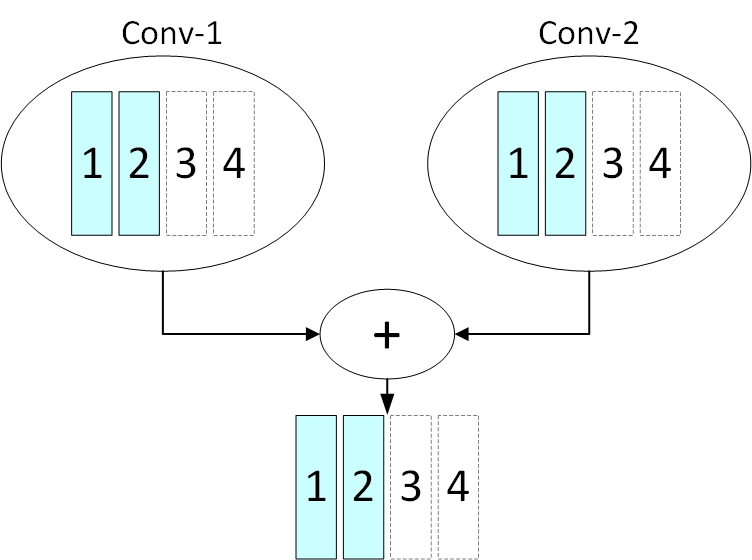
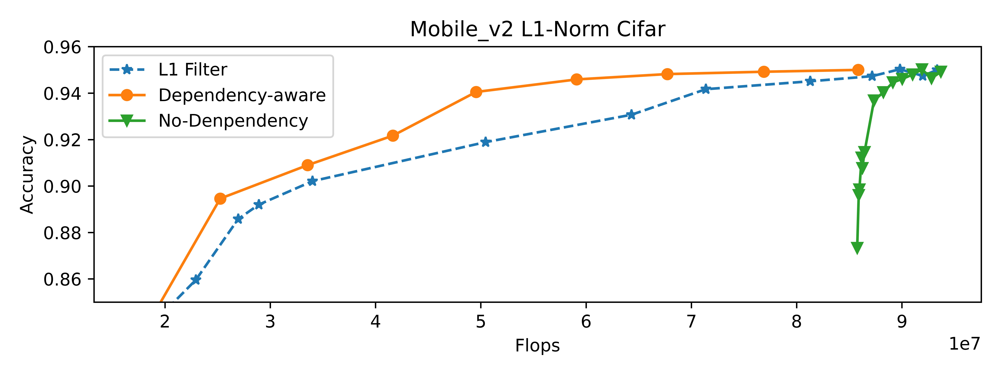

滤波器剪枝的依赖感知模式
========================================

目前，我们有几种针对卷积层的滤波剪枝算法，分别为：FPGM Pruner, L1Filter Pruner, L2Filter Pruner, Activation APoZ Rank Filter Pruner, Activation Mean Rank Filter Pruner, Taylor FO On Weight Pruner。 在这些滤波器剪枝算法中，剪枝器将分别对每个卷积层进行剪枝。 在裁剪卷积层时，算法会根据一些特定的规则（如l1-norm）量化每个滤波器的重要性，并裁剪不太重要的滤波器。

就像 `dependency analysis utils <./CompressionUtils.md>`__ 显示，如果将两个卷积层（conv1，conv2）的输出通道相加，这两个卷积层之间将具有通道依赖关系（更多详细信息参见 `Compression Utils <./CompressionUtils.rst>`__\ )。 以下图为例。

.. image:: ../../img/mask_conflict.jpg
   :target: ../../img/mask_conflict.jpg
   :alt: 

如果我们为 conv1 修剪前50%的输出通道（滤波器），并为 conv2 修剪后50%的输出通道， 虽然这两个层都删减了50%的滤波器，但加速模块仍然需要添加零来对齐输出通道。 在这种情况下，我们无法从模型剪枝中获得速度效益。

 为了更好地发挥模型剪枝的速度优势，我们为滤波器剪枝添加了一个依赖感知模式。 在依赖感知模式下，剪枝器不仅根据每个滤波器的l1范数对模型进行剪枝，而且还会基于整个网络结构的拓扑结构对模型进行剪枝。

在依赖关系感知模式下（``dependency_aware`` 设置为``True``），剪枝器将尝试为彼此具有通道依赖关系的层修剪相同的输出通道，如下图所示。

以 L1Filter Pruner 的依赖感知模式为例。 具体来说，剪枝器将为每个通道计算依赖集中所有层的L1范数和。 显然，最终可以从这个依赖集中删除的通道数量是由这个依赖集中，层的最小稀疏性决定的（记作 ``min_sparsity``）。 根据每个通道的 L1 范数和，剪枝器将对所有层修剪相同的 ``min_sparsity`` 通道。 接下来，剪枝器将根据每个卷积层自己的 L1 范数为它们额外修剪 ``sparsity`` - ``min_sparsity`` 通道。 例如，假设 ``conv1``、``conv2`` 的输出通道相加，分别配置稀疏度为0.3和0.2。 在这种情况下，``依赖感知的剪枝器`` 将会 

.. code-block:: bash

   - 首先，根据 `conv1` 和 `conv2` 的 L1 范数和，修剪 `conv1` 和 `conv2` 相同的20%通道。 
   - 其次，剪枝器将根据 `conv1` 每个通道的 L1 范数为 `conv1` 额外修剪10%的通道。

此外，对于具有多个滤波器组的卷积层，``依赖感知剪枝器`` 也将尝试为每个滤波器组修剪相同数量的通道。 总体而言，该剪枝器将根据每个滤波器的 L1 范数对模型进行剪枝，并尝试满足拓扑约束（通道依赖等），以提高加速过程后的最终速度增益。 

在依赖关系感知模式下，剪枝器将为模型修剪提供更好的速度增益。

用法
-----

在本节中，我们将说明如何使用滤波剪枝器的依赖感知模式。 目前，我们有几种 One-Shot 的 Pruner，比如 FPGM Pruner, L1Filter Pruner, L2Filter Pruner, Activation APoZ Rank Filter Pruner, Activation Mean Rank Filter Pruner, Taylor FO On Weight Pruner 支持依赖感知模式。

以为 ``L1FilterPruner`` 启动依赖感知模式为例：

.. code-block:: python

   from nni.algorithms.compression.pytorch.pruning import L1FilterPruner
   config_list = [{ 'sparsity': 0.8, 'op_types': ['Conv2d'] }]
   # dummy_input 对于依赖感知模式是必需的
   dummy_input = torch.ones(1, 3, 224, 224).cuda()
   pruner = L1FilterPruner(model, config_list, dependency_aware=True, dummy_input=dummy_input)
   # 对于 L2FilterPruner
   # pruner = L2FilterPruner(model, config_list, dependency_aware=True, dummy_input=dummy_input)
   # 对于 FPGMPruner
   # pruner = FPGMPruner(model, config_list, dependency_aware=True, dummy_input=dummy_input)
   # 对于 ActivationAPoZRankFilterPruner
   # pruner = ActivationAPoZRankFilterPruner(model, config_list, statistics_batch_num=1, , dependency_aware=True, dummy_input=dummy_input)
   # 对于 ActivationMeanRankFilterPruner
   # pruner = ActivationMeanRankFilterPruner(model, config_list, statistics_batch_num=1, dependency_aware=True, dummy_input=dummy_input)
   # 对于 TaylorFOWeightFilterPruner
   # pruner = TaylorFOWeightFilterPruner(model, config_list, statistics_batch_num=1, dependency_aware=True, dummy_input=dummy_input)

   pruner.compress()

评估
----------

为了比较有无依赖感知模式的剪枝器的性能，我们使用 L1FilterPruner 分别在依赖感知模式打开和关闭下修剪 Mobilenet_v2。 为了简化实验，我们将统一剪枝，这意味着我们为模型中的所有卷积层分配相同的稀疏度。
我们在cifar10数据集上训练了Mobilenet_v2模型，并根据此预先训练的检查点对模型进行裁剪。 下图显示了不同剪枝器剪枝后模型的准确率和 FLOPs。

在图中，``依赖感知`` 表示 L1FilterPruner 启用了依赖感知模式。 ``L1 Filter`` 是没有依赖感知模式的普通 ``L1FilterPruner``，而 ``No-Dependency`` 意味着剪枝器只修剪了与其他层没有通道依赖的层。 如图所示，当启用依赖感知模式时，剪枝器可以在相同的浮点运算率下带来更高的精度。
