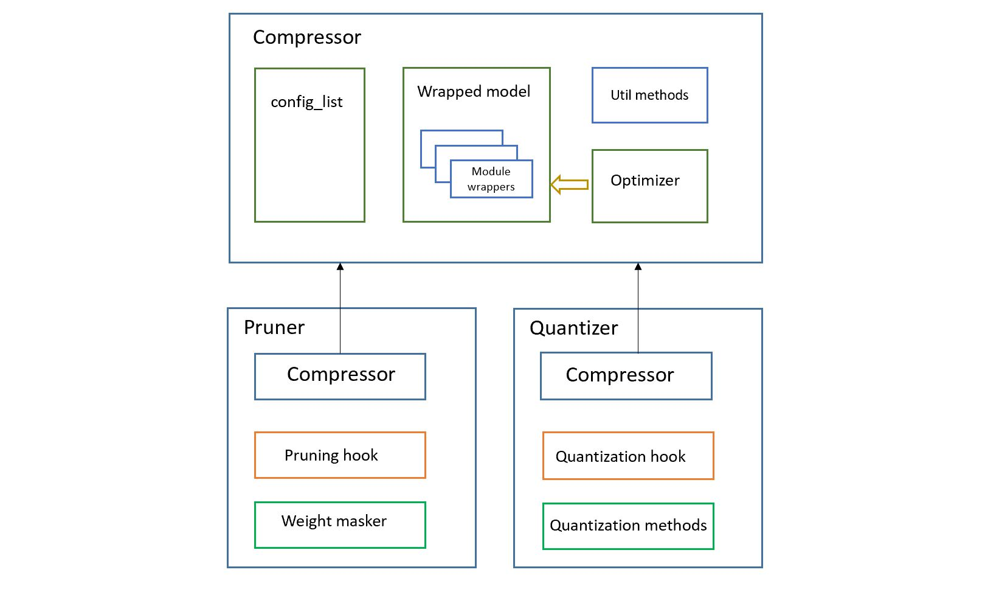

# Framework overview of model compression

```eval_rst
.. contents::
```

Below picture shows the components overview of model compression framework.



There are 3 major components/classes in NNI model compression framework: `Compressor`, `Pruner` and `Quantizer`. Let's look at them in detail one by one:

## Compressor

Compressor is the base class for pruner and quntizer, it provides a unified interface for pruner and quantizer for end users, so that pruner and quantizer can be used in the same way. For example, to use a pruner:

```python
from nni.compression.torch import LevelPruner

# load a pretrained model or train a model before using a pruner

configure_list = [{
    'sparsity': 0.7,
    'op_types': ['Conv2d', 'Linear'],
}]

optimizer = torch.optim.SGD(model.parameters(), lr=0.001, momentum=0.9, weight_decay=1e-4)
pruner = LevelPruner(model, configure_list, optimizer)
model = pruner.compress()

# model is ready for pruning, now start finetune the model,
# the model will be pruned during training automatically
```

To use a quantizer:
```python
from nni.compression.torch import DoReFaQuantizer

configure_list = [{
    'quant_types': ['weight'],
    'quant_bits': {
        'weight': 8,
    },
    'op_types':['Conv2d', 'Linear']
}]
optimizer = torch.optim.SGD(model.parameters(), lr=0.001, momentum=0.9, weight_decay=1e-4)
quantizer = DoReFaQuantizer(model, configure_list, optimizer)
quantizer.compress()

```
View [example code](https://github.com/microsoft/nni/tree/master/examples/model_compress) for more information.

`Compressor` class provides some utility methods for subclass and users:

### Set wrapper attribute

Sometimes `calc_mask` must save some state data, therefore users can use `set_wrappers_attribute` API to register attribute just like how buffers are registered in PyTorch modules. These buffers will be registered to `module wrapper`. Users can access these buffers through `module wrapper`. In above example, we use `set_wrappers_attribute` to set a buffer `if_calculated` which is used as flag indicating if the mask of a layer is already calculated.

### Collect data during forward

Sometimes users want to collect some data during the modules' forward method, for example, the mean value of the activation. This can be done by adding a customized collector to module.

```python
class MyMasker(WeightMasker):
    def __init__(self, model, pruner):
        super().__init__(model, pruner)
        # Set attribute `collected_activation` for all wrappers to store
        # activations for each layer
        self.pruner.set_wrappers_attribute("collected_activation", [])
        self.activation = torch.nn.functional.relu

        def collector(wrapper, input_, output):
            # The collected activation can be accessed via each wrapper's collected_activation
            # attribute
            wrapper.collected_activation.append(self.activation(output.detach().cpu()))

        self.pruner.hook_id = self.pruner.add_activation_collector(collector)
```

The collector function will be called each time the forward method runs.

Users can also remove this collector like this:

```python
# Save the collector identifier
collector_id = self.pruner.add_activation_collector(collector)

# When the collector is not used any more, it can be remove using
# the saved collector identifier
self.pruner.remove_activation_collector(collector_id)
```

***

## Pruner

A pruner receives `model`, `config_list` and `optimizer` as arguments. It prunes the model per the `config_list` during training loop by adding a hook on `optimizer.step()`.

Pruner class is a subclass of Compressor, so it contains everything in the Compressor class and some additional components only for pruning, it contains:

### Weight masker

A `weight masker` is the implementation of pruning algorithms, it can prune a specified layer wrapped by `module wrapper` with specified sparsity.

### Pruning module wrapper

A `pruning module wrapper` is a module containing:

1. the origin module
2. some buffers used by `calc_mask`
3. a new forward method that applies masks before running the original forward method.

the reasons to use `module wrapper`:

1. some buffers are needed by `calc_mask` to calculate masks and these buffers should be registered in `module wrapper` so that the original modules are not contaminated.
2. a new `forward` method is needed to apply masks to weight before calling the real `forward` method.

### Pruning hook

A pruning hook is installed on a pruner when the pruner is constructed, it is used to call pruner's calc_mask method at `optimizer.step()` is invoked.


***

## Quantizer

Quantizer class is also a subclass of `Compressor`, it is used to compress models by reducing the number of bits required to represent weights or activations, which can reduce the computations and the inference time. It contains:

### Quantization module wrapper

Each module/layer of the model to be quantized is wrapped by a quantization module wrapper, it provides a new `forward` method to quantize the original module's weight, input and output.

### Quantization hook

A quantization hook is installed on a quntizer when it is constructed, it is call at `optimizer.step()`.

### Quantization methods

`Quantizer` class provides following methods for subclass to implement quantization algorithms:

```python
class Quantizer(Compressor):
    """
    Base quantizer for pytorch quantizer
    """
    def quantize_weight(self, weight, wrapper, **kwargs):
        """
        quantize should overload this method to quantize weight.
        This method is effectively hooked to :meth:`forward` of the model.
        Parameters
        ----------
        weight : Tensor
            weight that needs to be quantized
        wrapper : QuantizerModuleWrapper
            the wrapper for origin module
        """
        raise NotImplementedError('Quantizer must overload quantize_weight()')

    def quantize_output(self, output, wrapper, **kwargs):
        """
        quantize should overload this method to quantize output.
        This method is effectively hooked to :meth:`forward` of the model.
        Parameters
        ----------
        output : Tensor
            output that needs to be quantized
        wrapper : QuantizerModuleWrapper
            the wrapper for origin module
        """
        raise NotImplementedError('Quantizer must overload quantize_output()')

    def quantize_input(self, *inputs, wrapper, **kwargs):
        """
        quantize should overload this method to quantize input.
        This method is effectively hooked to :meth:`forward` of the model.
        Parameters
        ----------
        inputs : Tensor
            inputs that needs to be quantized
        wrapper : QuantizerModuleWrapper
            the wrapper for origin module
        """
        raise NotImplementedError('Quantizer must overload quantize_input()')

```

***

## Multi-GPU support

On multi-GPU training, buffers and parameters are copied to multiple GPU every time the `forward` method runs on multiple GPU. If buffers and parameters are updated in the `forward` method, an `in-place` update is needed to ensure the update is effective. Since `calc_mask` is called in the `optimizer.step` method, which happens after the `forward` method and happens only on one GPU, it supports multi-GPU naturally.

