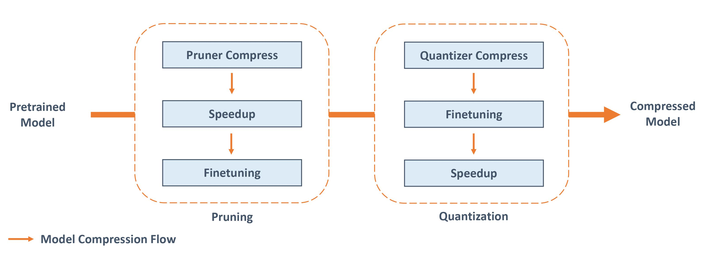

.. 37577199d91c137b881450f825f38fa2

使用 NNI 进行模型压缩
====================

.. contents::

目前的大型神经网络较之以往具有更多的层和节点，而如何降低其存储和计算成本是一个重要的话题，尤其是针对于那些需要实时响应的应用程序。
模型压缩的相关方法可以用于解决这些问题。

NNI 的模型压缩工具包，提供了最先进的模型压缩算法和策略，帮助压缩并加速模型。NNI 模型压缩支持的主要功能有：

* 支持多种流行的剪枝和量化算法。
* 通过 NNI 强大的自动调优功能，可使用最先进的策略来自动化模型的剪枝和量化过程。
* 加速压缩的模型，使其在推理时有更低的延迟，同时文件也会变小。
* 提供友好易用的压缩工具，帮助用户深入了解压缩过程和结果。
* 提供简洁的接口，帮助用户实现自己的压缩算法。

压缩流水线
----------

NNI整体的模型压缩流水线图。对于压缩一个预训练的模型，剪枝和量化可以单独使用或结合使用。 

.. note::
  NNI 压缩算法并不意味着真正使模型变小或者减少延迟，NNI 的加速工具才可以真正压缩模型并减少延迟。要获得真正压缩后的模型，用户应该进行 `模型加速 <./ModelSpeedup.rst>`__。* 注意，PyTorch 和 TensorFlow 有统一的 API 接口，当前仅支持 PyTorch 版本，未来会提供 TensorFlow 的支持。

支持的算法
----------

包括剪枝和量化算法。

剪枝算法
^^^^^^^^

剪枝算法通过删除冗余权重或层通道来压缩原始网络，从而降低模型复杂性并解决过拟合问题。

.. list-table::
   :header-rows: 1
   :widths: auto

   * - 名称
     - 算法简介
   * - `Level Pruner <Pruner.rst#level-pruner>`__
     - 根据权重的绝对值，来按比例修剪权重。
   * - `AGP Pruner <../Compression/Pruner.rst#agp-pruner>`__
     - 自动的逐步剪枝（To prune, or not to prune: exploring the efficacy of pruning for model compression）`参考论文 <https://arxiv.org/abs/1710.01878>`__
   * - `Lottery Ticket Pruner <../Compression/Pruner.rst#lottery-ticket>`__
     - "The Lottery Ticket Hypothesis: Finding Sparse, Trainable Neural Networks" 提出的剪枝过程。 它会反复修剪模型。 `参考论文 <https://arxiv.org/abs/1803.03635>`__
   * - `FPGM Pruner <../Compression/Pruner.rst#fpgm-pruner>`__
     - Filter Pruning via Geometric Median for Deep Convolutional Neural Networks Acceleration `参考论文 <https://arxiv.org/pdf/1811.00250.pdf>`__
   * - `L1Filter Pruner <../Compression/Pruner.rst#l1filter-pruner>`__
     - 在卷积层中具有最小 L1 权重规范的剪枝滤波器。（Pruning Filters for Efficient Convnets） `参考论文 <https://arxiv.org/abs/1608.08710>`__
   * - `L2Filter Pruner <../Compression/Pruner.rst#l2filter-pruner>`__
     - 在卷积层中具有最小 L2 权重规范的剪枝滤波器。
   * - `ActivationAPoZRankFilterPruner <../Compression/Pruner.rst#activationapozrankfilter-pruner>`__
     - 基于指标 APoZ（平均百分比零）的剪枝滤波器，该指标测量（卷积）图层激活值中零的百分比。 `参考论文 <https://arxiv.org/abs/1607.03250>`__
   * - `ActivationMeanRankFilterPruner <../Compression/Pruner.rst#activationmeanrankfilter-pruner>`__
     - 基于计算输出激活最小平均值指标的剪枝滤波器。
   * - `Slim Pruner <../Compression/Pruner.rst#slim-pruner>`__
     - 通过修剪 BN 层中的缩放因子来修剪卷积层中的通道。 (Learning Efficient Convolutional Networks through Network Slimming) `参考论文 <https://arxiv.org/abs/1708.06519>`__
   * - `TaylorFO Pruner <../Compression/Pruner.rst#taylorfoweightfilter-pruner>`__
     - 基于一阶泰勒展开的权重对滤波器剪枝。 (Importance Estimation for Neural Network Pruning) `参考论文 <http://jankautz.com/publications/Importance4NNPruning_CVPR19.pdf>`__
   * - `ADMM Pruner <../Compression/Pruner.rst#admm-pruner>`__
     - 基于 ADMM 优化技术的剪枝。 `参考论文 <https://arxiv.org/abs/1804.03294>`__
   * - `NetAdapt Pruner <../Compression/Pruner.rst#netadapt-pruner>`__
     - 在满足计算资源预算的情况下，对预训练的网络迭代剪枝。 `参考论文 <https://arxiv.org/abs/1804.03230>`__
   * - `SimulatedAnnealing Pruner <../Compression/Pruner.rst#simulatedannealing-pruner>`__
     - 通过启发式的模拟退火算法进行自动剪枝。 `参考论文 <https://arxiv.org/abs/1907.03141>`__
   * - `AutoCompress Pruner <../Compression/Pruner.rst#autocompress-pruner>`__
     - 通过迭代调用 SimulatedAnnealing Pruner 和 ADMM Pruner 进行自动剪枝。 `参考论文 - <https://arxiv.org/abs/1907.03141>`__
   * - `AMC Pruner <../Compression/Pruner.rst#amc-pruner>`__
     - AMC: AutoML for Model Compression and Acceleration on Mobile Devices `参考论文 <https://arxiv.org/pdf/1802.03494.pdf>`__
   * - `Transformer Head Pruner <../Compression/Pruner.rst#transformer-head-pruner>`__
     - 针对transformer中的注意力头的剪枝.

参考此 :githublink:`基准测试 <../CommunitySharings/ModelCompressionComparison.rst>` 来查看这些剪枝器在一些基准问题上的表现。

量化算法
^^^^^^^^

量化算法通过减少表示权重或激活函数所需的精度位数来压缩原始网络，这可以减少计算和推理时间。

.. list-table::
   :header-rows: 1
   :widths: auto

   * - 名称
     - 算法简介
   * - `Naive Quantizer <../Compression/Quantizer.rst#naive-quantizer>`__
     - 默认将权重量化为 8 位。
   * - `QAT Quantizer <../Compression/Quantizer.rst#qat-quantizer>`__
     - Quantization and Training of Neural Networks for Efficient Integer-Arithmetic-Only Inference. `参考论文 <http://openaccess.thecvf.com/content_cvpr_2018/papers/Jacob_Quantization_and_Training_CVPR_2018_paper.pdf>`__
   * - `DoReFa Quantizer <../Compression/Quantizer.rst#dorefa-quantizer>`__
     - DoReFa-Net: Training Low Bitwidth Convolutional Neural Networks with Low Bitwidth Gradients. `参考论文 <https://arxiv.org/abs/1606.06160>`__
   * - `BNN Quantizer <../Compression/Quantizer.rst#bnn-quantizer>`__
     - Binarized Neural Networks: Training Deep Neural Networks with Weights and Activations Constrained to +1 or -1. `参考论文 <https://arxiv.org/abs/1602.02830>`__
   * - `LSQ Quantizer <../Compression/Quantizer.rst#lsq-quantizer>`__
     - Learned step size quantization. `参考论文 <https://arxiv.org/pdf/1902.08153.pdf>`__
   * - `Observer Quantizer <../Compression/Quantizer.rst#observer-quantizer>`__
     - Post training quantizaiton. 使用 observer 在校准期间收集量化信息。

模型加速
--------

模型压缩的目的是减少推理延迟和模型大小。但现有的模型压缩算法主要通过模拟的方法来检查压缩模型性能（如精度）。例如，剪枝算法中使用掩码，而量化算法中量化值仍然是以 32 位浮点数来存储。只要给出这些算法产生的掩码和量化位，NNI 可真正的加速模型。基于掩码的模型加速详细教程可以在 `这里 <./ModelSpeedup.rst>`__ 找到。混合精度量化的详细教程可以在 `这里 <./QuantizationSpeedup.rst>`__ 找到。

压缩工具
--------

压缩工具包括了一些有用的工具，能帮助用户理解并分析要压缩的模型。例如，可检查每层对剪枝的敏感度。可很容易的计算模型的 FLOPs 和参数数量。`点击这里 <./CompressionUtils.rst>`__，查看压缩工具的完整列表。

高级用法
--------

NNI 模型压缩提供了简洁的接口，用于自定义新的压缩算法。接口的设计理念是，将框架相关的实现细节包装起来，让用户能聚焦于压缩逻辑。用户可以进一步了解我们的压缩框架，并根据我们的框架定制新的压缩算法（剪枝算法或量化算法）。此外，还可利用 NNI 的自动调参功能来自动的压缩模型。参考 `这里 <./advanced.rst>`__ 了解更多细节。

参考和反馈
----------

* 在Github 中 `提交此功能的 Bug <https://github.com/microsoft/nni/issues/new?template=bug-report.rst>`__
* 在Github 中 `提交新功能或请求改进 <https://github.com/microsoft/nni/issues/new?template=enhancement.rst>`__
* 了解更多关于 NNI 中的 `特征工程 <../FeatureEngineering/Overview.rst>`__\ ;
* 了解更多关于 NNI 中的 `NAS <../NAS/Overview.rst>`__\ ;
* 了解更多关于 NNI 中的 `超参调优 <../Tuner/BuiltinTuner.rst>`__\ ;
