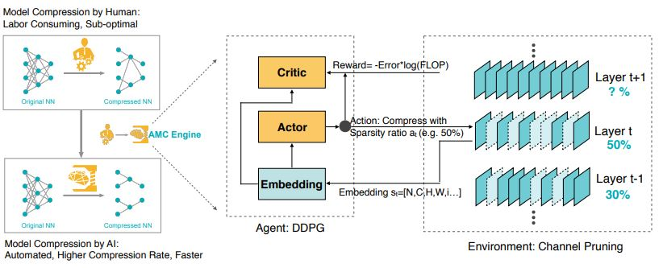
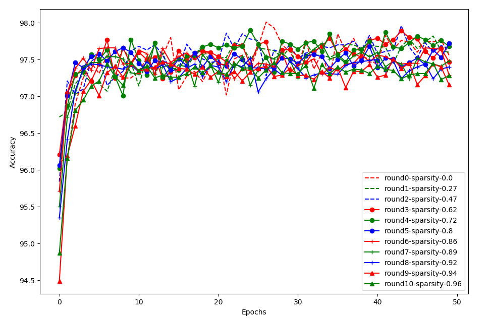

NNI 支持的剪枝算法
===================================

NNI 提供了一些支持细粒度权重剪枝和结构化的滤波器剪枝算法。 **细粒度的剪枝** 通常会导致非结构化的模型，这需要特定的硬件或软件来加速这样的稀疏网络。  NNI 还提供了算法来进行 **剪枝规划**。

**细粒度剪枝**

* `Level Pruner <#level-pruner>`__

**滤波器剪枝**

* `Slim Pruner <#slim-pruner>`__
* `FPGM Pruner <#fpgm-pruner>`__
* `L1Filter Pruner <#l1filter-pruner>`__
* `L2Filter Pruner <#l2filter-pruner>`__
* `Activation APoZ Rank Filter Pruner <#activationAPoZRankFilter-pruner>`__
* `Activation Mean Rank Filter Pruner <#activationmeanrankfilter-pruner>`__
* `Taylor FO On Weight Pruner <#taylorfoweightfilter-pruner>`__

**剪枝计划**

* `AGP Pruner <#agp-pruner>`__
* `NetAdapt Pruner <#netadapt-pruner>`__
* `SimulatedAnnealing Pruner <#simulatedannealing-pruner>`__
* `AutoCompress Pruner <#autocompress-pruner>`__
* `AMC Pruner <#amc-pruner>`__
* `Sensitivity Pruner <#sensitivity-pruner>`__

**其它**

* `ADMM Pruner <#admm-pruner>`__
* `Lottery Ticket Hypothesis <#lottery-ticket-hypothesis>`__

Level Pruner
------------

这是个基本的一次性 Pruner：可设置目标稀疏度（以分数表示，0.6 表示会剪除 60%）。 

首先按照绝对值对指定层的权重排序。 然后按照所需的稀疏度，将值最小的权重屏蔽为 0。

用法
^^^^^

TensorFlow 代码

.. code-block:: python

   from nni.algorithms.compression.tensorflow.pruning import LevelPruner
   config_list = [{ 'sparsity': 0.8, 'op_types': ['default'] }]
   pruner = LevelPruner(model, config_list)
   pruner.compress()

PyTorch 代码

.. code-block:: python

   from nni.algorithms.compression.pytorch.pruning import LevelPruner
   config_list = [{ 'sparsity': 0.8, 'op_types': ['default'] }]
   pruner = LevelPruner(model, config_list)
   pruner.compress()

Level Pruner 的用户配置
^^^^^^^^^^^^^^^^^^^^^^^^^^^^^^^^^^^

PyTorch

..  autoclass:: nni.algorithms.compression.pytorch.pruning.LevelPruner

TensorFlow 
""""""""""

..  autoclass:: nni.algorithms.compression.tensorflow.pruning.LevelPruner

Slim Pruner
-----------

这是一次性的 Pruner，在 `Learning Efficient Convolutional Networks through Network Slimming <https://arxiv.org/pdf/1708.06519.pdf>`__ 中提出，作者 Zhuang Liu, Jianguo Li, Zhiqiang Shen, Gao Huang, Shoumeng Yan 以及 Changshui Zhang。

.. image:: ../../img/slim_pruner.png
   :target: ../../img/slim_pruner.png
   :alt: 

..

   Slim Pruner **会遮盖卷据层通道之后 BN 层对应的缩放因子**，训练时在缩放因子上的 L1 正规化应在批量正规化 (BN) 层之后来做。BN 层的缩放因子在修剪时，是 **全局排序的**，因此稀疏模型能自动找到给定的稀疏度。

用法
^^^^^

PyTorch 代码

.. code-block:: python

   from nni.algorithms.compression.pytorch.pruning import SlimPruner
   config_list = [{ 'sparsity': 0.8, 'op_types': ['BatchNorm2d'] }]
   pruner = SlimPruner(model, config_list)
   pruner.compress()

Slim Pruner 的用户配置
^^^^^^^^^^^^^^^^^^^^^^^^^^^^^^^^^^

**PyTorch**

..  autoclass:: nni.algorithms.compression.pytorch.pruning.SlimPruner

复现实验
^^^^^^^^^^^^^^^^^^^^^

我们复现了 `Learning Efficient Convolutional Networks through Network Slimming <https://arxiv.org/pdf/1708.06519.pdf>`__ 中的一项实验。根据论文，对 CIFAR-10 上的 **VGGNet** 剪除了 ``70%`` 的通道，即约 ``88.5%`` 的参数。 我们的实验结果如下：

.. list-table::
   :header-rows: 1
   :widths: auto

   * - 模型
     - 错误率(论文/我们的)
     - 参数量
     - 剪除率
   * - VGGNet
     - 6.34/6.40
     - 20.04M
     - 
   * - Pruned-VGGNet
     - 6.20/6.26
     - 2.03M
     - 88.5%

实验代码在 :githublink:`这里 <examples/model_compress/>`

----

FPGM Pruner
-----------

这是一种一次性的 Pruner，FPGM Pruner 是论文 `Filter Pruning via Geometric Median for Deep Convolutional Neural Networks Acceleration <https://arxiv.org/pdf/1811.00250.pdf>`__ 的实现

具有最小几何中位数的 FPGMPruner 修剪滤波器。

 
.. image:: ../../img/fpgm_fig1.png
   :target: ../../img/fpgm_fig1.png
   :alt: 

..

   以前的方法使用 “smaller-norm-less-important” 准则来修剪卷积神经网络中规范值较小的。 本文中，分析了基于规范的准则，并指出其所依赖的两个条件不能总是满足：(1) 过滤器的规范偏差应该较大；(2) 过滤器的最小规范化值应该很小。 为了解决此问题，提出了新的过滤器修建方法，即 Filter Pruning via Geometric Median (FPGM)，可不考虑这两个要求来压缩模型。 与以前的方法不同，FPGM 通过修剪冗余的，而不是相关性更小的部分来压缩 CNN 模型。 

我们还为这个 Pruner 提供了一个依赖感知模式，以更好地提高修剪的速度。 请参考 `dependency-aware <./DependencyAware.rst>`__ 获取更多信息。

用法
^^^^^

PyTorch 代码

.. code-block:: python

   from nni.algorithms.compression.pytorch.pruning import FPGMPruner
   config_list = [{
       'sparsity': 0.5,
       'op_types': ['Conv2d']
   }]
   pruner = FPGMPruner(model, config_list)
   pruner.compress()

FPGM Pruner 的用户配置
^^^^^^^^^^^^^^^^^^^^^^^^^^^^^^^^^^

**PyTorch**

..  autoclass:: nni.algorithms.compression.pytorch.pruning.FPGMPruner

L1Filter Pruner
---------------

这是一种一次性的 Pruner，由 `PRUNING FILTERS FOR EFFICIENT CONVNETS <https://arxiv.org/abs/1608.08710>`__ 提出，作者 Hao Li, Asim Kadav, Igor Durdanovic, Hanan Samet 和 Hans Peter Graf。

.. image:: ../../img/l1filter_pruner.png
   :target: ../../img/l1filter_pruner.png
   :alt: 

..

   L1Filter Pruner 修剪 **卷积层** 中的过滤器

   从第 i 个卷积层修剪 m 个过滤器的过程如下：

   #. 对于每个滤波器 :math:`F_{i,j}`，计算其绝对内核权重之和 :math:`s_j=\sum_{l=1}^{n_i}\sum|K_l|`.

   #. 将滤波器按 by :math:`s_j` 排序

   #. 修剪 :math:`m` 具有最小求和值及其相应特征图的筛选器。 在
      下一个卷积层中，被剪除的特征图所对应的内核也被移除。

   #. 为第 :math:`i` 层和第 :math:`i+1` 层创建新的内核权重，
      并保留剩余的内核 权重，复制到新模型中。

此外，我们还为 L1FilterPruner 提供了依赖感知模式。 参考 `dependency-aware mode <./DependencyAware.rst>`__ 获取依赖感知模式的更多细节。

用法
^^^^^

PyTorch 代码

.. code-block:: python

   from nni.algorithms.compression.pytorch.pruning import L1FilterPruner
   config_list = [{ 'sparsity': 0.8, 'op_types': ['Conv2d'] }]
   pruner = L1FilterPruner(model, config_list)
   pruner.compress()

L1Filter Pruner 的用户配置
^^^^^^^^^^^^^^^^^^^^^^^^^^^^^^^^^^^^^^

**PyTorch**

..  autoclass:: nni.algorithms.compression.pytorch.pruning.L1FilterPruner

复现实验
^^^^^^^^^^^^^^^^^^^^^

我们通过 **L1FilterPruner** 实现了 `PRUNING FILTERS FOR EFFICIENT CONVNETS <https://arxiv.org/abs/1608.08710>`__ 中的一项实验， 即论文中，在 CIFAR-10 数据集上修剪 **VGG-16** 的 **VGG-16-pruned-A**，其中大约剪除了 ``64%`` 的参数。 实验结果如下：

.. list-table::
   :header-rows: 1
   :widths: auto

   * - 模型
     - 错误率(论文/我们的)
     - 参数量
     - 剪除率
   * - VGG-16
     - 6.75/6.49
     - 1.5x10^7
     - 
   * - VGG-16-pruned-A
     - 6.60/6.47
     - 5.4x10^6
     - 64.0%

实验代码在 :githublink:`这里 <examples/model_compress/>`

----

L2Filter Pruner
---------------

这是一种结构化剪枝算法，用于修剪权重的最小 L2 规范筛选器。 它被实现为一次性修剪器。

我们还为这个 Pruner 提供了一个依赖感知模式，以更好地提高修剪的速度。 请参考 `dependency-aware <./DependencyAware.rst>`__ 获取更多信息。

用法
^^^^^

PyTorch 代码

.. code-block:: python

   from nni.algorithms.compression.pytorch.pruning import L2FilterPruner
   config_list = [{ 'sparsity': 0.8, 'op_types': ['Conv2d'] }]
   pruner = L2FilterPruner(model, config_list)
   pruner.compress()

L2Filter Pruner 的用户配置
^^^^^^^^^^^^^^^^^^^^^^^^^^^^^^^^^^^^^^

**PyTorch**

..  autoclass:: nni.algorithms.compression.pytorch.pruning.L2FilterPruner

----

ActivationAPoZRankFilter Pruner
-------------------------------

ActivationAPoZRankFilter Pruner 是从卷积层激活的输出，用最小的重要性标准 ``APoZ`` 修剪滤波器，来达到预设的网络稀疏度。 剪枝标准 ``APoZ`` 的解释在论文 `Network Trimming: A Data-Driven Neuron Pruning Approach towards Efficient Deep Architectures <https://arxiv.org/abs/1607.03250>`__ 中。

APoZ 定义为：

.. image:: ../../img/apoz.png
   :target: ../../img/apoz.png
   :alt: 

我们还为这个 Pruner 提供了一个依赖感知模式，以更好地提高修剪的速度。 请参考 `dependency-aware <./DependencyAware.rst>`__ 获取更多信息。

用法
^^^^^

PyTorch 代码

.. code-block:: python

   from nni.algorithms.compression.pytorch.pruning import ActivationAPoZRankFilterPruner
   config_list = [{
       'sparsity': 0.5,
       'op_types': ['Conv2d']
   }]
   pruner = ActivationAPoZRankFilterPruner(model, config_list, statistics_batch_num=1)
   pruner.compress()

注意：ActivationAPoZRankFilterPruner 用于修剪深度神经网络中的卷积层，因此 ``op_types`` 字段仅支持卷积层。

参考 :githublink:`示例 <examples/model_compress/model_prune_torch.py>` 了解更多信息。

ActivationAPoZRankFilterPruner 的用户配置
^^^^^^^^^^^^^^^^^^^^^^^^^^^^^^^^^^^^^^^^^^^^^^^^^^^^^^

**PyTorch**

..  autoclass:: nni.algorithms.compression.pytorch.pruning.ActivationAPoZRankFilterPruner

----

ActivationMeanRankFilter Pruner
-------------------------------

ActivationMeanRankFilterPruner 是从卷积层激活的输出，用最小的重要性标准 
``平均激活`` 来修剪滤波器，来达到预设的网络稀疏度。 剪枝标准 ``平均激活``，在论文 `Pruning Convolutional Neural Networks for Resource Efficient Inference <https://arxiv.org/abs/1611.06440>`__ 的 2.2 节中进行了介绍。 本文中提到的其他修剪标准将在以后的版本中支持。

我们还为这个 Pruner 提供了一个依赖感知模式，以更好地提高修剪的速度。 请参考 `dependency-aware <./DependencyAware.rst>`__ 获取更多信息。

用法
^^^^^

PyTorch 代码

.. code-block:: python

   from nni.algorithms.compression.pytorch.pruning import ActivationMeanRankFilterPruner
   config_list = [{
       'sparsity': 0.5,
       'op_types': ['Conv2d']
   }]
   pruner = ActivationMeanRankFilterPruner(model, config_list, statistics_batch_num=1)
   pruner.compress()

注意：ActivationMeanRankFilterPruner 用于修剪深度神经网络中的卷积层，因此 ``op_types`` 字段仅支持卷积层。

参考 :githublink:`示例 <examples/model_compress/model_prune_torch.py>` 了解更多信息。

ActivationMeanRankFilterPruner 的用户配置
^^^^^^^^^^^^^^^^^^^^^^^^^^^^^^^^^^^^^^^^^^^^^^^^^^^^^

**PyTorch**

..  autoclass:: nni.algorithms.compression.pytorch.pruning.ActivationMeanRankFilterPruner

----

TaylorFOWeightFilter Pruner
---------------------------

TaylorFOWeightFilter Pruner 根据权重上的一阶泰勒展开式，来估计重要性并进行剪枝，从而达到预设的网络稀疏度。 过滤器的估计重要性在论文 `Importance Estimation for Neural Network Pruning <http://jankautz.com/publications/Importance4NNPruning_CVPR19.pdf>`__ 中有定义。 本文中提到的其他修剪标准将在以后的版本中支持。

..

.. image:: ../../img/importance_estimation_sum.png
   :target: ../../img/importance_estimation_sum.png
   :alt: 

我们还为这个 Pruner 提供了一个依赖感知模式，以更好地提高修剪的速度。 请参考 `dependency-aware <./DependencyAware.rst>`__ 获取更多信息。

用法
^^^^^

PyTorch 代码

.. code-block:: python

   from nni.algorithms.compression.pytorch.pruning import TaylorFOWeightFilterPruner
   config_list = [{
       'sparsity': 0.5,
       'op_types': ['Conv2d']
   }]
   pruner = TaylorFOWeightFilterPruner(model, config_list, statistics_batch_num=1)
   pruner.compress()

TaylorFOWeightFilter Pruner 的用户配置
^^^^^^^^^^^^^^^^^^^^^^^^^^^^^^^^^^^^^^^^^^^^^^^^^^

**PyTorch**

..  autoclass:: nni.algorithms.compression.pytorch.pruning.TaylorFOWeightFilterPruner

----

AGP Pruner
----------

这是一种迭代的 Pruner，在 `To prune, or not to prune: exploring the efficacy of pruning for model compression <https://arxiv.org/abs/1710.01878>`__ 中，作者 Michael Zhu 和 Suyog Gupta 提出了一种逐渐修建权重的算法。

..

   引入了一种新的自动逐步剪枝算法，在 n 个剪枝步骤中，稀疏度从初始的稀疏度值 si（通常为 0）增加到最终的稀疏度值 sf，从训练步骤 t0 开始，剪枝频率 ∆t：

   .. image:: ../../img/agp_pruner.png
      :target: ../../img/agp_pruner.png
      :alt: 

   在训练网络时，每隔 ∆t 步更新二值权重掩码，以逐渐增加网络的稀疏性，同时允许网络训练步骤从任何剪枝导致的精度损失中恢复。 根据我们的经验，∆t 设为 100 到 1000 个训练步骤之间时，对于模型最终精度的影响可忽略不计。 一旦模型达到了稀疏度目标 sf，权重掩码将不再更新。 背后的稀疏函数直觉在公式（1）。

用法
^^^^^

通过下列代码，可以在 10 个 Epoch 中将权重稀疏度从 0% 剪枝到 80%。

PyTorch 代码

.. code-block:: python

   from nni.algorithms.compression.pytorch.pruning import AGPPruner
   config_list = [{
       'initial_sparsity': 0,
       'final_sparsity': 0.8,
       'start_epoch': 0,
       'end_epoch': 10,
       'frequency': 1,
       'op_types': ['default']
   }]

   # 读取预训练的模型，或在使用 Pruner 前进行训练。
   # model = MyModel()
   # model.load_state_dict(torch.load('mycheckpoint.pth'))

   # AGP Pruner 会在 optimizer. step() 上回调，在微调模型时剪枝，
   # 因此，必须要有 optimizer 才能完成模型剪枝。
   optimizer = torch.optim.SGD(model.parameters(), lr=0.001, momentum=0.9, weight_decay=1e-4)

   pruner = AGPPruner(model, config_list, optimizer, pruning_algorithm='level')
   pruner.compress()

AGP Pruner 默认使用 ``LevelPruner`` 算法来修建权重，还可以设置 ``pruning_algorithm`` 参数来使用其它剪枝算法：

* ``level``\ : LevelPruner
* ``slim``\ : SlimPruner
* ``l1``\ : L1FilterPruner
* ``l2``\ : L2FilterPruner
* ``fpgm``\ : FPGMPruner
* ``taylorfo``\ : TaylorFOWeightFilterPruner
* ``apoz``\ : ActivationAPoZRankFilterPruner
* ``mean_activation``\ : ActivationMeanRankFilterPruner

在训练代码中每完成一个 Epoch，需要更新一下 Epoch 的值。

PyTorch 代码

.. code-block:: python

   pruner.update_epoch(epoch)

参考 :githublink:`示例 <examples/model_compress/model_prune_torch.py>` 了解更多信息。

AGP Pruner 的用户配置
^^^^^^^^^^^^^^^^^^^^^^^^^^^^^^^^^

**PyTorch**

..  autoclass:: nni.algorithms.compression.pytorch.pruning.AGPPruner

----

NetAdapt Pruner
---------------

NetAdapt 在满足资源预算的情况下，自动简化预训练的网络。 
给定整体稀疏度，NetAdapt 可通过迭代剪枝自动为不同层生成不同的稀疏分布。

参考 `NetAdapt: Platform-Aware Neural Network Adaptation for Mobile Applications <https://arxiv.org/abs/1804.03230>`__ 了解详细信息。

.. image:: ../../img/algo_NetAdapt.png
   :target: ../../img/algo_NetAdapt.png
   :alt: 

用法
^^^^^

PyTorch 代码

.. code-block:: python

   from nni.algorithms.compression.pytorch.pruning import NetAdaptPruner
   config_list = [{
       'sparsity': 0.5,
       'op_types': ['Conv2d']
   }]
   pruner = NetAdaptPruner(model, config_list, short_term_fine_tuner=short_term_fine_tuner, evaluator=evaluator,base_algo='l1', experiment_data_dir='./')
   pruner.compress()

参考 :githublink:`示例 <examples/model_compress/auto_pruners_torch.py>` 了解更多信息。

NetAdapt Pruner 的用户配置
^^^^^^^^^^^^^^^^^^^^^^^^^^^^^^^^^^^^^^

**PyTorch**

..  autoclass:: nni.algorithms.compression.pytorch.pruning.NetAdaptPruner

SimulatedAnnealing Pruner
-------------------------

此 Pruner 基于先验经验，实现了引导式的启发搜索方法，模拟退火（SA）算法。 
增强的模拟退火算法基于以下发现：具有更多权重的深度神经网络层通常具有较高的可压缩度，对整体精度的影响更小。

* 随机初始化剪枝率的分布（稀疏度）。
* 当 current_temperature < stop_temperature 时：

  #. 对当前分布生成扰动
  #. 对扰动的分布进行快速评估
  #. 根据性能和概率来决定是否接受扰动，如果不接受，返回步骤 1
  #. 冷却，current_temperature <- current_temperature * cool_down_rate

更多信息请参考 `AutoCompress: An Automatic DNN Structured Pruning Framework for Ultra-High Compression Rates <https://arxiv.org/abs/1907.03141>`__。

用法
^^^^^

PyTorch 代码

.. code-block:: python

   from nni.algorithms.compression.pytorch.pruning import SimulatedAnnealingPruner
   config_list = [{
       'sparsity': 0.5,
       'op_types': ['Conv2d']
   }]
   pruner = SimulatedAnnealingPruner(model, config_list, evaluator=evaluator, base_algo='l1', cool_down_rate=0.9, experiment_data_dir='./')
   pruner.compress()

参考 :githublink:`示例 <examples/model_compress/auto_pruners_torch.py>` 了解更多信息。

SimulatedAnnealing Pruner 的用户配置
^^^^^^^^^^^^^^^^^^^^^^^^^^^^^^^^^^^^^^^^^^^^^^^^

**PyTorch**

..  autoclass:: nni.algorithms.compression.pytorch.pruning.SimulatedAnnealingPruner

AutoCompress Pruner
-------------------

每一轮中，AutoCompressPruner 会用相同的稀疏度对模型进行剪枝，从而达到总体的稀疏度：

.. code-block:: bash

       1. 使用 SimulatedAnnealingPruner 生成稀疏度分布
       2. 执行基于 ADMM 的结构化剪枝，为下一轮生成剪枝结果。
          这里会使用 `speedup` 来执行真正的剪枝。

更多信息请参考 `AutoCompress: An Automatic DNN Structured Pruning Framework for Ultra-High Compression Rates <https://arxiv.org/abs/1907.03141>`__。

用法
^^^^^

PyTorch 代码

.. code-block:: python

   from nni.algorithms.compression.pytorch.pruning import ADMMPruner
   config_list = [{
           'sparsity': 0.5,
           'op_types': ['Conv2d']
       }]
   pruner = AutoCompressPruner(
               model, config_list, trainer=trainer, evaluator=evaluator,
               dummy_input=dummy_input, num_iterations=3, optimize_mode='maximize', base_algo='l1',
               cool_down_rate=0.9, admm_num_iterations=30, admm_training_epochs=5, experiment_data_dir='./')
   pruner.compress()

参考 :githublink:`示例 <examples/model_compress/auto_pruners_torch.py>` 了解更多信息。

AutoCompress Pruner 的用户配置
^^^^^^^^^^^^^^^^^^^^^^^^^^^^^^^^^^^^^^^^^^

**PyTorch**

..  autoclass:: nni.algorithms.compression.pytorch.pruning.AutoCompressPruner

AMC Pruner
----------

AMC Pruner 利用强化学习来提供模型压缩策略。
这种基于学习的压缩策略比传统的基于规则的压缩策略有更高的压缩比，
更好地保存了精度，节省了人力。

更多信息请参考 `AMC: AutoML for Model Compression and Acceleration on Mobile Devices <https://arxiv.org/pdf/1802.03494.pdf>`__。

用法
^^^^^

PyTorch 代码

.. code-block:: python

   from nni.algorithms.compression.pytorch.pruning import AMCPruner
   config_list = [{
           'op_types': ['Conv2d', 'Linear']
       }]
   pruner = AMCPruner(model, config_list, evaluator, val_loader, flops_ratio=0.5)
   pruner.compress()

你可以参考 :githublink:`示例 <examples/model_compress/amc/>` 获取更多信息。

AutoCompress Pruner 的用户配置
^^^^^^^^^^^^^^^^^^^^^^^^^^^^^^^^^^^^^^^^^^

**PyTorch**

..  autoclass:: nni.algorithms.compression.pytorch.pruning.AMCPruner

复现实验
^^^^^^^^^^^^^^^^^^^^^

我们复现了 `AMC: AutoML for Model Compression and Acceleration on Mobile Devices <https://arxiv.org/pdf/1802.03494.pdf>`__ 中的实验，对于 ImageNet 数据集，压缩后 **MobileNet** 的 FLOPS 降至50%。 我们的实验结果如下：

.. list-table::
   :header-rows: 1
   :widths: auto

   * - 模型
     - Top 1 准确率（论文的/我们的）
     - Top 5 准确率 （论文的/我们的）
     - FLOPS
   * - MobileNet
     - 70.5% / 69.9%
     - 89.3% / 89.1%
     - 50%

实验代码在 :githublink:`这里 <examples/model_compress/amc/>`。

ADMM Pruner
-----------

Alternating Direction Method of Multipliers (ADMM) 是一种数学优化技术，
它将原始的非凸问题分解为两个可以迭代解决的子问题。 在权重修剪问题中，这两个子问题分别通过 1) 梯度下降算法和 2) 欧几里得投影来解决。 

在解决这两个子问题的过程中，原始模型的权重会被改变。 One-Shot Pruner 会根据给定的配置对模型剪枝。

此解决方案框架既适用于非结构化剪枝也适用于结构化剪枝的变体。

更多信息请参考论文 `A Systematic DNN Weight Pruning Framework using Alternating Direction Method of Multipliers <https://arxiv.org/abs/1804.03294>`__。

用法
^^^^^

PyTorch 代码

.. code-block:: python

   from nni.algorithms.compression.pytorch.pruning import ADMMPruner
   config_list = [{
               'sparsity': 0.8,
               'op_types': ['Conv2d'],
               'op_names': ['conv1']
           }, {
               'sparsity': 0.92,
               'op_types': ['Conv2d'],
               'op_names': ['conv2']
           }]
   pruner = ADMMPruner(model, config_list, trainer=trainer, num_iterations=30, epochs=5)
   pruner.compress()

参考 :githublink:`示例 <examples/model_compress/auto_pruners_torch.py>` 了解更多信息。

ADMM Pruner 的用户配置
^^^^^^^^^^^^^^^^^^^^^^^^^^^^^^^^^^

**PyTorch**

..  autoclass:: nni.algorithms.compression.pytorch.pruning.ADMMPruner

Lottery Ticket 假设
-------------------------

`The Lottery Ticket Hypothesis: Finding Sparse, Trainable Neural Networks <https://arxiv.org/abs/1803.03635>`__，作者 Jonathan Frankle 和 Michael Carbin，提供了全面的测量和分析，并阐明了 *lottery ticket 假设*：密集的、随机初始化的、包含子网络的前馈网络 (*winning tickets*) -- 在单独训练时 -- 在相似的迭代次数后达到了与原始网络相似的准确度。

本文中，作者使用叫做 *迭代* 修剪的方法：

..

   #. 随机初始化一个神经网络 f(x;theta_0) (其中 theta\ *0 follows D*\ {theta})。
   #. 将网络训练 j 次，得出参数 theta_j。
   #. 在 theta_j 修剪参数的 p%，创建掩码 m。
   #. 将其余参数重置为 theta_0 的值，创建获胜彩票 f(x;m*theta_0)。
   #. 重复步骤 2、3 和 4。

如果配置的最终稀疏度为 P (e.g., 0.8) 并且有 n 次修建迭代，每次迭代修剪前一轮中剩余权重的 1-(1-P)^(1/n)。

用法
^^^^^

PyTorch 代码

.. code-block:: python

   from nni.algorithms.compression.pytorch.pruning import LotteryTicketPruner
   config_list = [{
       'prune_iterations': 5,
       'sparsity': 0.8,
       'op_types': ['default']
   }]
   pruner = LotteryTicketPruner(model, config_list, optimizer)
   pruner.compress()
   for _ in pruner.get_prune_iterations():
       pruner.prune_iteration_start()
       for epoch in range(epoch_num):
           ...

上述配置意味着有 5 次迭代修剪。 由于在同一次运行中执行了 5 次修剪，LotteryTicketPruner 需要 ``model`` 和 ``optimizer`` ( **注意，如果使用 ``lr_scheduler``，也需要添加** ) 来在每次开始新的修剪迭代时，将其状态重置为初始值。 使用 ``get_prune_iterations`` 来获取修建迭代，并在每次迭代开始时调用 ``prune_iteration_start``。 为了模型能较好收敛，``epoch_num`` 最好足够大。因为假设是在后几轮中具有较高稀疏度的性能（准确度）可与第一轮获得的相当。

*稍后支持 TensorFlow 版本。*

LotteryTicket Pruner 的用户配置
^^^^^^^^^^^^^^^^^^^^^^^^^^^^^^^^^^^^^^^^^^^

**PyTorch**

..  autoclass:: nni.algorithms.compression.pytorch.pruning.LotteryTicketPruner

复现实验
^^^^^^^^^^^^^^^^^^^^^

在重现时，在 MNIST 使用了与论文相同的配置。 实验代码在 :githublink:`这里 <examples/model_compress/lottery_torch_mnist_fc.py>`。 在次实验中，修剪了10次，在每次修剪后，训练了 50 个 epoch。

上图展示了全连接网络的结果。 ``round0-sparsity-0.0`` 是没有剪枝的性能。 与论文一致，修剪约 80% 也能获得与不修剪时相似的性能，收敛速度也会更快。 如果修剪过多（例如，大于 94%），则精度会降低，收敛速度会稍慢。 与本文稍有不同，论文中数据的趋势比较明显。

Sensitivity Pruner
------------------

在每一轮，SensitivityPruner 根据对每一层准确率的敏感度对模型进行剪枝，直到满足整个模型最终配置的稀疏度：

.. code-block:: bash

       1. 分析模型当前状态下各层的敏感度。
       2. 根据敏感度对每一层剪枝。

参考 `Learning both Weights and Connections for Efficient Neural Networks  <https://arxiv.org/abs/1506.02626>`__ 了解更多信息。

用法
^^^^^

PyTorch 代码

.. code-block:: python

   from nni.algorithms.compression.pytorch.pruning import SensitivityPruner
   config_list = [{
           'sparsity': 0.5,
           'op_types': ['Conv2d']
       }]
   pruner = SensitivityPruner(model, config_list, finetuner=fine_tuner, evaluator=evaluator)
   # eval_args and finetune_args 分别是传给 evaluator 和 finetuner 的参数
   pruner.compress(eval_args=[model], finetune_args=[model])

Sensitivity Pruner 的用户配置
^^^^^^^^^^^^^^^^^^^^^^^^^^^^^^^^^^^^^^^^^

**PyTorch**

..  autoclass:: nni.algorithms.compression.pytorch.pruning.SensitivityPruner
