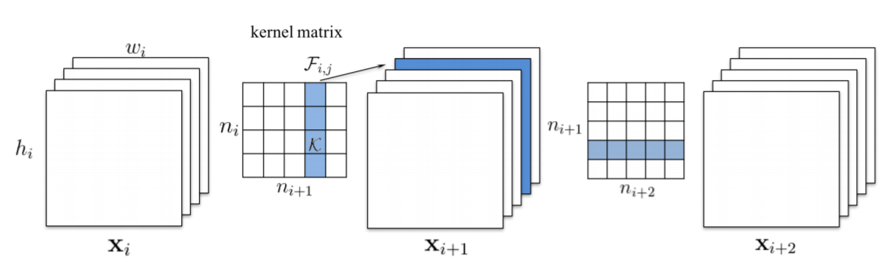
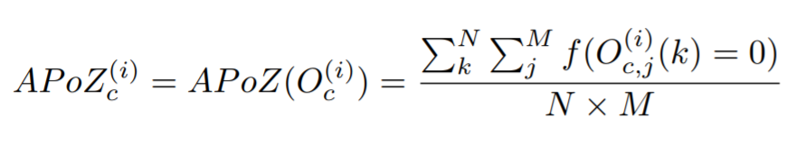
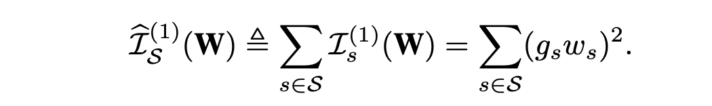

# NNI 支持的剪枝算法

NNI 提供了一些支持细粒度权重剪枝和结构化的滤波器剪枝算法。 **细粒度的剪枝**通常会导致非结构化的模型，这需要特定的硬件或软件来加速这样的稀疏网络。 **滤波器剪枝**通过删除整个滤波器来实现加速。  NNI 还提供了算法来进行**剪枝规划**。


**细粒度剪枝**
* [Level Pruner](#level-pruner)

**滤波器剪枝**
* [Slim Pruner](#slim-pruner)
* [FPGM Pruner](#fpgm-pruner)
* [L1Filter Pruner](#l1filter-pruner)
* [L2Filter Pruner](#l2filter-pruner)
* [APoZ Rank Pruner](#activationapozrankfilterpruner)
* [Activation Mean Rank Pruner](#activationmeanrankfilterpruner)
* [Taylor FO On Weight Pruner](#taylorfoweightfilterpruner)

**剪枝计划**
* [AGP Pruner](#agp-pruner)
* [NetAdapt Pruner](#netadapt-pruner)
* [SimulatedAnnealing Pruner](#simulatedannealing-pruner)
* [AutoCompress Pruner](#autocompress-pruner)

**其它**
* [ADMM Pruner](#admm-pruner)
* [Lottery Ticket 假设](#lottery-ticket-hypothesis)

## Level Pruner

这是个基本的一次性 Pruner：可设置目标稀疏度（以分数表示，0.6 表示会剪除 60%）。

首先按照绝对值对指定层的权重排序。 然后按照所需的稀疏度，将值最小的权重屏蔽为 0。

### 用法

TensorFlow 代码
```python
from nni.compression.tensorflow import LevelPruner
config_list = [{ 'sparsity': 0.8, 'op_types': ['default'] }]
pruner = LevelPruner(model_graph, config_list)
pruner.compress()
```

PyTorch 代码
```python
from nni.compression.torch import LevelPruner
config_list = [{ 'sparsity': 0.8, 'op_types': ['default'] }]
pruner = LevelPruner(model, config_list)
pruner.compress()
```

#### Level Pruner 的用户配置
* **sparsity:**，指定压缩的稀疏度。

***

## Slim Pruner

这是一次性的 Pruner，在 ['Learning Efficient Convolutional Networks through Network Slimming'](https://arxiv.org/pdf/1708.06519.pdf) 中提出，作者 Zhuang Liu, Jianguo Li, Zhiqiang Shen, Gao Huang, Shoumeng Yan 以及 Changshui Zhang。


> Slim Pruner **会遮盖卷据层通道之后 BN 层对应的缩放因子**，训练时在缩放因子上的 L1 正规化应在批量正规化 (BN) 层之后来做。BN 层的缩放因子在修剪时，是**全局排序的**，因此稀疏模型能自动找到给定的稀疏度。

### 用法

PyTorch 代码

```python
from nni.compression.torch import SlimPruner
config_list = [{ 'sparsity': 0.8, 'op_types': ['BatchNorm2d'] }]
pruner = SlimPruner(model, config_list)
pruner.compress()
```

#### Slim Pruner 的用户配置

- **sparsity:**，指定压缩的稀疏度。
- **op_types:** 在 Slim Pruner 中仅支持 BatchNorm2d。

### 重现实验

我们实现了 ['Learning Efficient Convolutional Networks through Network Slimming'](https://arxiv.org/pdf/1708.06519.pdf) 中的一项实验。根据论文，对 CIFAR-10 上的 **VGGNet** 剪除了 $70\%$ 的通道，即约 $88.5\%$ 的参数。 实验结果如下：

| 模型            | 错误率(论文/我们的) | 参数量    | 剪除率   |
| ------------- | ----------- | ------ | ----- |
| VGGNet        | 6.34/6.40   | 20.04M |       |
| Pruned-VGGNet | 6.20/6.26   | 2.03M  | 88.5% |

实验代码在 [examples/model_compress](https://github.com/microsoft/nni/tree/master/examples/model_compress/)

***

## FPGM Pruner

这是一种一次性的 Pruner，FPGM Pruner 是论文 [Filter Pruning via Geometric Median for Deep Convolutional Neural Networks Acceleration](https://arxiv.org/pdf/1811.00250.pdf) 的实现

具有最小几何中位数的 FPGMPruner 修剪滤波器

 
> 以前的方法使用 “smaller-norm-less-important” 准则来修剪卷积神经网络中规范值较小的。 本文中，分析了基于规范的准则，并指出其所依赖的两个条件不能总是满足：(1) 滤波器的规范偏差应该较大；(2) 滤波器的最小规范化值应该很小。 为了解决此问题，提出了新的滤波器修剪方法，即 Filter Pruning via Geometric Median (FPGM)，可不考虑这两个要求来压缩模型。 与以前的方法不同，FPGM 通过修剪冗余的，而不是相关性更小的部分来压缩 CNN 模型。

### 用法

TensorFlow 代码
```python
from nni.compression.tensorflow import FPGMPruner
config_list = [{
    'sparsity': 0.5,
    'op_types': ['Conv2D']
}]
pruner = FPGMPruner(model, config_list)
pruner.compress()
```
PyTorch 代码
```python
from nni.compression.torch import FPGMPruner
config_list = [{
    'sparsity': 0.5,
    'op_types': ['Conv2d']
}]
pruner = FPGMPruner(model, config_list)
pruner.compress()
```

#### FPGM Pruner 的用户配置
- **sparsity:** 卷积滤波器要修剪的百分比。
- **op_types:** 在 L1Filter Pruner 中仅支持 Conv2d。

***

## L1Filter Pruner

这是一种一次性的 Pruner，由 ['PRUNING FILTERS FOR EFFICIENT CONVNETS'](https://arxiv.org/abs/1608.08710) 提出，作者 Hao Li, Asim Kadav, Igor Durdanovic, Hanan Samet 和 Hans Peter Graf。



> L1Filter Pruner 修剪**卷积层**中的滤波器
> 
> 从第 i 个卷积层修剪 m 个滤波器的过程如下：
> 
> 1. 对于每个滤波器 ，计算其绝对内核权重之和
> 2. 将滤波器按  排序。
> 3. 修剪  具有最小求和值及其相应特征图的滤波器。 在 下一个卷积层中，被剪除的特征图所对应的内核也被移除。
> 4. 为第  和  层创建新的内核举证，并保留剩余的内核 权重，并复制到新模型中。

### 用法

PyTorch 代码

```python
from nni.compression.torch import L1FilterPruner
config_list = [{ 'sparsity': 0.8, 'op_types': ['Conv2d'] }]
pruner = L1FilterPruner(model, config_list)
pruner.compress()
```

#### L1Filter Pruner 的用户配置

- **sparsity:**，指定压缩的稀疏度。
- **op_types:** 在 L1Filter Pruner 中仅支持 Conv2d。

### 重现实验

我们通过 **L1FilterPruner** 实现了 ['PRUNING FILTERS FOR EFFICIENT CONVNETS'](https://arxiv.org/abs/1608.08710) 中的一项实验， 即论文中，在 CIFAR-10 数据集上修剪 **VGG-16** 的 **VGG-16-pruned-A**，其中大约剪除了 $64\%$ 的参数。 实验结果如下：

| 模型              | 错误率(论文/我们的) | 参数量      | 剪除率   |
| --------------- | ----------- | -------- | ----- |
| VGG-16          | 6.75/6.49   | 1.5x10^7 |       |
| VGG-16-pruned-A | 6.60/6.47   | 5.4x10^6 | 64.0% |

实验代码在 [examples/model_compress](https://github.com/microsoft/nni/tree/master/examples/model_compress/)

***

## L2Filter Pruner

这是一种结构化剪枝算法，用于修剪权重的最小 L2 规范滤波器。 它被实现为一次性修剪器。

### 用法

PyTorch 代码

```python
from nni.compression.torch import L2FilterPruner
config_list = [{ 'sparsity': 0.8, 'op_types': ['Conv2d'] }]
pruner = L2FilterPruner(model, config_list)
pruner.compress()
```

### L2Filter Pruner 的用户配置

- **sparsity:**，指定压缩的稀疏度。
- **op_types:** 在 L2Filter Pruner 中仅支持 Conv2d。

***

## ActivationAPoZRankFilterPruner

ActivationAPoZRankFilterPruner 是从卷积层激活的输出，用最小的重要性标准 `APoZ` 修剪滤波器，来达到预设的网络稀疏度。 剪枝标准 `APoZ` 的解释在论文 [Network Trimming: A Data-Driven Neuron Pruning Approach towards Efficient Deep Architectures](https://arxiv.org/abs/1607.03250) 中。

APoZ 定义为：



### 用法

PyTorch 代码

```python
from nni.compression.torch import ActivationAPoZRankFilterPruner
config_list = [{
    'sparsity': 0.5,
    'op_types': ['Conv2d']
}]
pruner = ActivationAPoZRankFilterPruner(model, config_list, statistics_batch_num=1)
pruner.compress()
```

注意：ActivationAPoZRankFilterPruner 用于修剪深度神经网络中的卷积层，因此 `op_types` 字段仅支持卷积层。

查看示例进一步了解

### ActivationAPoZRankFilterPruner 的用户配置

- **sparsity:** 卷积滤波器要修剪的百分比。
- **op_types:** 在 ActivationAPoZRankFilterPruner 中仅支持 Conv2d。

***

## ActivationMeanRankFilterPruner

ActivationMeanRankFilterPruner 是从卷积层激活的输出，用最小的重要性标准`平均激活`来修剪滤波器，来达到预设的网络稀疏度。 剪枝标准`平均激活`，在论文 [Pruning Convolutional Neural Networks for Resource Efficient Inference](https://arxiv.org/abs/1611.06440) 的 2.2 节中进行了介绍。 本文中提到的其他修剪标准将在以后的版本中支持。

### 用法

PyTorch 代码

```python
from nni.compression.torch import ActivationMeanRankFilterPruner
config_list = [{
    'sparsity': 0.5,
    'op_types': ['Conv2d']
}]
pruner = ActivationMeanRankFilterPruner(model, config_list, statistics_batch_num=1)
pruner.compress()
```

注意：ActivationMeanRankFilterPruner 用于修剪深度神经网络中的卷积层，因此 `op_types` 字段仅支持卷积层。

查看示例进一步了解

### ActivationMeanRankFilterPruner 的用户配置

- **sparsity:** 卷积滤波器要修剪的百分比。
- **op_types:** 在 ActivationMeanRankFilterPruner 中仅支持 Conv2d。

***

## TaylorFOWeightFilterPruner

TaylorFOWeightFilterPruner 根据权重上的一阶泰勒展开式，来估计重要性并进行剪枝，从而达到预设的网络稀疏度。 滤波器的估计重要性在论文 [Importance Estimation for Neural Network Pruning](http://jankautz.com/publications/Importance4NNPruning_CVPR19.pdf) 中有定义。 本文中提到的其他修剪标准将在以后的版本中支持。
>



### 用法

PyTorch 代码

```python
from nni.compression.torch import TaylorFOWeightFilterPruner
config_list = [{
    'sparsity': 0.5,
    'op_types': ['Conv2d']
}]
pruner = TaylorFOWeightFilterPruner(model, config_list, statistics_batch_num=1)
pruner.compress()
```

查看示例进一步了解

### TaylorFOWeightFilterPruner 的用户配置

- **sparsity:** 卷积滤波器要修剪的百分比。
- **op_types:** 当前 TaylorFOWeightFilterPruner 中仅支持 Conv2d。

***

## AGP Pruner
这是一种迭代的 Pruner，在 [To prune, or not to prune: exploring the efficacy of pruning for model compression](https://arxiv.org/abs/1710.01878)中，作者 Michael Zhu 和 Suyog Gupta 提出了一种逐渐修建权重的算法。
> 我们引入了一种新的自动梯度剪枝算法。这种算法从初始的稀疏度值 si（一般为 0）开始，通过 n 步的剪枝操作，增加到最终所需的稀疏度 sf。从训练步骤 t0 开始，以 ∆t 为剪枝频率：  在神经网络训练时‘逐步增加网络稀疏度时，每训练  ∆t 步更新一次权重剪枝的二进制掩码。同时也允许训练步骤恢复因为剪枝而造成的精度损失。 根据我们的经验，∆t 设为 100 到 1000 个训练步骤之间时，对于模型最终精度的影响可忽略不计。 一旦模型达到了稀疏度目标 sf，权重掩码将不再更新。 公式背后的稀疏函数直觉。

### 用法
通过下列代码，可以在 10 个 Epoch 中将权重稀疏度从 0% 剪枝到 80%。

PyTorch 代码
```python
from nni.compression.torch import AGP_Pruner
config_list = [{
    'initial_sparsity': 0,
    'final_sparsity': 0.8,
    'start_epoch': 0,
    'end_epoch': 10,
    'frequency': 1,
    'op_types': ['default']
}]

# 使用 Pruner 前，加载预训练模型、或训练模型。
# model = MyModel()
# model.load_state_dict(torch.load('mycheckpoint.pth'))

# AGP Pruner 会在 optimizer.step() 上回调，在微调模型时剪枝，
# 因此，必须要有 optimizer 才能完成模型剪枝。
optimizer = torch.optim.SGD(model.parameters(), lr=0.001, momentum=0.9, weight_decay=1e-4)

pruner = AGP_Pruner(model, config_list, optimizer, pruning_algorithm='level')
pruner.compress()
```

AGP Pruner 默认使用 `LevelPruner` 算法来修建权重，还可以设置 `pruning_algorithm` 参数来使用其它剪枝算法：
* `level`: LevelPruner
* `slim`: SlimPruner
* `l1`: L1FilterPruner
* `l2`: L2FilterPruner
* `fpgm`: FPGMPruner
* `taylorfo`: TaylorFOWeightFilterPruner
* `apoz`: ActivationAPoZRankFilterPruner
* `mean_activation`: ActivationMeanRankFilterPruner

在训练代码中每完成一个 Epoch，需要更新一下 Epoch 的值。

PyTorch 代码
```python
pruner.update_epoch(epoch)
```
查看示例进一步了解

#### AGP Pruner 的用户配置
* **initial_sparsity:** 指定了 Compressor 开始压缩的稀疏度。
* **final_sparsity:** 指定了 Compressor 压缩结束时的稀疏度。
* **start_epoch:** 指定了 Compressor 开始压缩时的 Epoch 数值，默认为 0。
* **end_epoch:** 指定了 Compressor 结束压缩时的 Epoch 数值。
* **frequency:** 指定了 Compressor 每过多少个 Epoch 进行一次剪枝，默认 frequency=1。

***

## NetAdapt Pruner
NetAdapt 在满足资源预算的情况下，自动简化预训练的网络。 给定整体稀疏度，NetAdapt 可通过迭代剪枝自动为不同层生成不同的稀疏分布。

参考 [NetAdapt: Platform-Aware Neural Network Adaptation for Mobile Applications](https://arxiv.org/abs/1804.03230) 了解详细信息。


#### 用法

PyTorch 代码

```python
from nni.compression.torch import NetAdaptPruner
config_list = [{
    'sparsity': 0.5,
    'op_types': ['Conv2d']
}]
pruner = NetAdaptPruner(model, config_list, short_term_fine_tuner=short_term_fine_tuner, evaluator=evaluator,base_algo='l1', experiment_data_dir='./')
pruner.compress()
```

参考[示例](https://github.com/microsoft/nni/blob/master/examples/model_compress/auto_pruners_torch.py)了解更多信息。

#### NetAdapt Pruner 的用户配置

- **sparsity:** 整体的稀疏度目标。
- **op_types:** 要剪枝的操作类型。 如果 `base_algo` 是 `l1` 或 `l2`，那么 `op_types` 仅支持 `Conv2d`。
- **short_term_fine_tuner:** 用于快速微调掩码模型。 此函数只有 `model` 参数，在每次剪枝迭代后，对模型进行快速微调。

    示例：
    ```python
    >>> def short_term_fine_tuner(model, epoch=3):
    >>>     device = torch.device("cuda" if torch.cuda.is_available() else "cpu")
    >>>     train_loader = ...
    >>>     criterion = torch.nn.CrossEntropyLoss()
    >>>     optimizer = torch.optim.SGD(model.parameters(), lr=0.01)
    >>>     model.train()
    >>>     for _ in range(epoch):
    >>>         for batch_idx, (data, target) in enumerate(train_loader):
    >>>             data, target = data.to(device), target.to(device)
    >>>             optimizer.zero_grad()
    >>>             output = model(data)
    >>>             loss = criterion(output, target)
    >>>             loss.backward()
    >>>             optimizer.step()
    ```
- **evaluator:** 用于评估掩码模型。 此函数只有 `model` 参数，会返回一个标量值。

    示例::
    ```python
    >>> def evaluator(model):
    >>>     device = torch.device("cuda" if torch.cuda.is_available() else "cpu")
    >>>     val_loader = ...
    >>>     model.eval()
    >>>     correct = 0
    >>>     with torch.no_grad():
    >>>         for data, target in val_loader:
    >>>             data, target = data.to(device), target.to(device)
    >>>             output = model(data)
    >>>             # 获得最大 log 概率分布的索引
    >>>             pred = output.argmax(dim=1, keepdim=True)
    >>>             correct += pred.eq(target.view_as(pred)).sum().item()
    >>>     accuracy = correct / len(val_loader.dataset)
    >>>     return accuracy
    ```
- **optimize_mode:** 优化模式，`maximize` 或 `minimize`，默认为`maximize`。
- **base_algo:** 基础的剪枝算法。 `level`，`l1` 或 `l2`，默认为 `l1`。 给定不同运算符的系数分布，指定的 `base_algo` 会决定对哪个滤波器、通道、权重进行剪枝。
- **sparsity_per_iteration:** 每次迭代要剪枝的稀疏度。 NetAdapt Pruner 在每次迭代时，按相同水平对模型进行剪枝，以便逐步满足计算资源预算。
- **experiment_data_dir:** 保存实验数据的路径，包括为基本剪枝算法生成的 config_list，以及剪枝后模型的性能。


## SimulatedAnnealing Pruner

此 Pruner 基于先验经验，实现了引导式的启发搜索方法，模拟退火（SA）算法。 增强的模拟退火算法基于以下发现：具有更多权重的深度神经网络层通常具有较高的可压缩度，对整体精度的影响更小。

- 随机初始化剪枝率的分布（稀疏度）。
- 当 current_temperature < stop_temperature 时：
    1. 对当前分布生成扰动
    2. 对扰动的分布进行快速评估
    3. 根据性能和概率来决定是否接受扰动，如果不接受，返回步骤 1
    4. 冷却，current_temperature = current_temperature * cool_down_rate

更多详细信息，参考 [AutoCompress: An Automatic DNN Structured Pruning Framework for Ultra-High Compression Rates](https://arxiv.org/abs/1907.03141)。

#### 用法

PyTorch 代码

```python
from nni.compression.torch import SimulatedAnnealingPruner
config_list = [{
    'sparsity': 0.5,
    'op_types': ['Conv2d']
}]
pruner = SimulatedAnnealingPruner(model, config_list, evaluator=evaluator, base_algo='l1', cool_down_rate=0.9, experiment_data_dir='./')
pruner.compress()
```

参考[示例](https://github.com/microsoft/nni/blob/master/examples/model_compress/auto_pruners_torch.py)了解更多信息。

#### SimulatedAnnealing Pruner 的用户配置

- **sparsity:** 整体的稀疏度目标。
- **op_types:** 要剪枝的操作类型。 如果 `base_algo` 是 `l1` 或 `l2`，那么 `op_types` 仅支持 `Conv2d`。
- **evaluator:** 用于评估掩码模型。 此函数只有 `model` 参数，会返回一个标量值。 示例::
    ```python
    >>> def evaluator(model):
    >>>     device = torch.device("cuda" if torch.cuda.is_available() else "cpu")
    >>>     val_loader = ...
    >>>     model.eval()
    >>>     correct = 0
    >>>     with torch.no_grad():
    >>>         for data, target in val_loader:
    >>>             data, target = data.to(device), target.to(device)
    >>>             output = model(data)
    >>>             # 获得最大 log 概率分布的索引
    >>>             pred = output.argmax(dim=1, keepdim=True)
    >>>             correct += pred.eq(target.view_as(pred)).sum().item()
    >>>     accuracy = correct / len(val_loader.dataset)
    >>>     return accuracy
    ```
- **optimize_mode:** 优化模式，`maximize` 或 `minimize`，默认为`maximize`。
- **base_algo:** 基础的剪枝算法。 `level`，`l1` 或 `l2`，默认为 `l1`。 给定不同运算符的系数分布，指定的 `base_algo` 会决定对哪个滤波器、通道、权重进行剪枝。
- **start_temperature:** 模拟退火算法相关参数。
- **stop_temperature:** 模拟退火算法相关参数。
- **cool_down_rate:** 模拟退火算法相关参数。
- **perturbation_magnitude:** 初始化对稀疏度的扰动幅度。 幅度会随着当前温度变小。
- **experiment_data_dir:** 保存实验数据的路径，包括为基本剪枝算法生成的 config_list，剪枝后模型的性能，以及剪枝历史。


## AutoCompress Pruner
每一轮中，AutoCompressPruner 会用相同的稀疏度对模型进行剪枝，从而达到总体的稀疏度：

        1. 使用 SimualtedAnnealingPruner 生成稀疏度分布
        2. 执行基于 ADMM 的结构化剪枝，为下一轮生成剪枝结果。
           这里会使用 `speedup` 来执行真正的剪枝。

更多详细信息，参考 [AutoCompress: An Automatic DNN Structured Pruning Framework for Ultra-High Compression Rates](https://arxiv.org/abs/1907.03141)。

#### 用法

PyTorch 代码

```python
from nni.compression.torch import ADMMPruner
config_list = [{
        'sparsity': 0.5,
        'op_types': ['Conv2d']
    }]
pruner = AutoCompressPruner(
            model, config_list, trainer=trainer, evaluator=evaluator,
            dummy_input=dummy_input, num_iterations=3, optimize_mode='maximize', base_algo='l1',
            cool_down_rate=0.9, admm_num_iterations=30, admm_training_epochs=5, experiment_data_dir='./')
pruner.compress()
```

参考[示例](https://github.com/microsoft/nni/blob/master/examples/model_compress/auto_pruners_torch.py)了解更多信息。

#### AutoCompress Pruner 的用户配置

- **sparsity:** 整体的稀疏度目标。
- **op_types:** 要剪枝的操作类型。 如果 `base_algo` 是 `l1` 或 `l2`，那么 `op_types` 仅支持 `Conv2d`。
- **trainer:** 用于第一个子问题的函数。 用户需要实现此函数，来训练 PyTorch 模型，其参数包括：`model, optimizer, criterion, epoch, callback`。 这里的 `callback` 是 L2 规范化，参考原始论文中的公式 (7)。 `callback` 的逻辑在 Pruner 中实现，用户只需要在 `loss.backward()` 和 `optimizer.step()` 之间插入 `callback()` 即可。 示例：
    ```python
    >>> def trainer(model, criterion, optimizer, epoch, callback):
    >>>     device = torch.device("cuda" if torch.cuda.is_available() else "cpu")
    >>>     train_loader = ...
    >>>     model.train()
    >>>     for batch_idx, (data, target) in enumerate(train_loader):
    >>>         data, target = data.to(device), target.to(device)
    >>>         optimizer.zero_grad()
    >>>         output = model(data)
    >>>         loss = criterion(output, target)
    >>>         loss.backward()
    >>>         # 在 loss.backward() 和 optimizer.step() 中插入 callback
    >>>         if callback:
    >>>             callback()
    >>>         optimizer.step()
    ```
- **evaluator:** 用于评估掩码模型。 此函数只有 `model` 参数，会返回一个标量值。 示例::
    ```python
    >>> def evaluator(model):
    >>>     device = torch.device("cuda" if torch.cuda.is_available() else "cpu")
    >>>     val_loader = ...
    >>>     model.eval()
    >>>     correct = 0
    >>>     with torch.no_grad():
    >>>         for data, target in val_loader:
    >>>             data, target = data.to(device), target.to(device)
    >>>             output = model(data)
    >>>             # 获得最大 log 概率分布的索引
    >>>             pred = output.argmax(dim=1, keepdim=True)
    >>>             correct += pred.eq(target.view_as(pred)).sum().item()
    >>>     accuracy = correct / len(val_loader.dataset)
    >>>     return accuracy
    ```
- **dummy_input:** 用于模型加速的模拟输入，在传入前应该复制到正确的设备上。
- **iterations:** 总共的迭代次数。
- **optimize_mode:** 优化模式，`maximize` 或 `minimize`，默认为`maximize`。
- **base_algo:** 基础的剪枝算法。 `level`，`l1` 或 `l2`，默认为 `l1`。 给定不同运算符的系数分布，指定的 `base_algo` 会决定对哪个滤波器、通道、权重进行剪枝。
- **start_temperature:** 模拟退火算法相关参数。
- **stop_temperature:** 模拟退火算法相关参数。
- **cool_down_rate:** 模拟退火算法相关参数。
- **perturbation_magnitude:** 初始化对稀疏度的扰动幅度。 幅度会随着当前温度变小。
- **admm_num_iterations:** ADMM Pruner 的迭代次数。
- **admm_training_epochs:** ADMMPruner 的第一个优化子问题训练的 Epoch 数量。
- **experiment_data_dir:** 存储临时实验数据的目录。


## ADMM Pruner
Alternating Direction Method of Multipliers (ADMM) 是一种数学优化技术，它将原始的非凸问题分解为两个可以迭代解决的子问题。 在权重修剪问题中，这两个子问题分别通过 1) 梯度下降算法和 2) 欧几里得投影来解决。

在解决这两个子问题的过程中，原始模型的权重会被改变。 One-Shot Pruner 会根据给定的配置对模型剪枝。

此解决方案框架既适用于非结构化剪枝也适用于结构化剪枝的变体。

更多详细信息，参考 [A Systematic DNN Weight Pruning Framework using Alternating Direction Method of Multipliers](https://arxiv.org/abs/1804.03294)。

#### 用法

PyTorch 代码

```python
from nni.compression.torch import ADMMPruner
config_list = [{
            'sparsity': 0.8,
            'op_types': ['Conv2d'],
            'op_names': ['conv1']
        }, {
            'sparsity': 0.92,
            'op_types': ['Conv2d'],
            'op_names': ['conv2']
        }]
pruner = ADMMPruner(model, config_list, trainer=trainer, num_iterations=30, epochs=5)
pruner.compress()
```

参考[示例](https://github.com/microsoft/nni/blob/master/examples/model_compress/auto_pruners_torch.py)了解更多信息。

#### ADMM Pruner 的用户配置

- **sparsity:**，指定压缩的稀疏度。
- **op_types:** 要剪枝的操作类型。 如果 `base_algo` 是 `l1` 或 `l2`，那么 `op_types` 仅支持 `Conv2d`。
- **trainer:** 用于 ADMM 优化中第一个子问题的函数。注意，微调中不会使用它。 用户需要实现此函数，来训练 PyTorch 模型，其参数包括：`model, optimizer, criterion, epoch, callback`。 这里的 `callback` 是 L2 规范化，参考原始论文中的公式 (7)。 `callback` 的逻辑在 Pruner 中实现，用户只需要在 `loss.backward()` 和 `optimizer.step()` 之间插入 `callback()` 即可。

    示例：
    ```python
    >>> def trainer(model, criterion, optimizer, epoch, callback):
    >>>     device = torch.device("cuda" if torch.cuda.is_available() else "cpu")
    >>>     train_loader = ...
    >>>     model.train()
    >>>     for batch_idx, (data, target) in enumerate(train_loader):
    >>>         data, target = data.to(device), target.to(device)
    >>>         optimizer.zero_grad()
    >>>         output = model(data)
    >>>         loss = criterion(output, target)
    >>>         loss.backward()
    >>>         # 在 loss.backward() 和 optimizer.step() 中插入 callback
    >>>         if callback:
    >>>             callback()
    >>>         optimizer.step()
    ```
- **num_iterations:** 迭代次数。
- **training_epochs:** 第一个子问题训练的 Epoch 数量。
- **row:** ADMM 训练的惩罚参数。
- **base_algo:** 基础的剪枝算法。 `level`，`l1` 或 `l2`，默认为 `l1`。 给定不同运算符的系数分布，指定的 `base_algo` 会决定对哪个滤波器、通道、权重进行剪枝。


## Lottery Ticket 假设
[The Lottery Ticket Hypothesis: Finding Sparse, Trainable Neural Networks](https://arxiv.org/abs/1803.03635), 作者 Jonathan Frankle 和 Michael Carbin，提供了全面的测量和分析，并阐明了 *lottery ticket 假设*: 密集的、随机初始化的、包含子网络的前馈网络 (*winning tickets*) -- 在单独训练时 -- 在相似的迭代次数后达到了与原始网络相似的准确度。

本文中，作者使用叫做*迭代剪枝*的方法：
> 1. 随机初始化一个神经网络 f(x;theta_0) (其中 theta_0 为 D_{theta}).
> 2. 将网络训练 j 次，得出参数 theta_j。
> 3. 在 theta_j 修剪参数的 p%，创建掩码 m。
> 4. 将其余参数重置为 theta_0 的值，创建获胜彩票 f(x;m*theta_0)。
> 5. 重复步骤 2、3 和 4。

如果配置的最终稀疏度为 P (e.g., 0.8) 并且有 n 次修建迭代，每次迭代修剪前一轮中剩余权重的 1-(1-P)^(1/n)。

### 用法

PyTorch 代码
```python
from nni.compression.torch import LotteryTicketPruner
config_list = [{
    'prune_iterations': 5,
    'sparsity': 0.8,
    'op_types': ['default']
}]
pruner = LotteryTicketPruner(model, config_list, optimizer)
pruner.compress()
for _ in pruner.get_prune_iterations():
    pruner.prune_iteration_start()
    for epoch in range(epoch_num):
        ...
```

上述配置意味着有 5 次迭代修剪。 由于在同一次运行中执行了 5 次修剪，LotteryTicketPruner 需要 `model` 和 `optimizer` (**注意，如果使用 `lr_scheduler`，也需要添加**) 来在每次开始新的修剪迭代时，将其状态重置为初始值。 使用 `get_prune_iterations` 来获取修建迭代，并在每次迭代开始时调用 `prune_iteration_start`。 为了模型能较好收敛，`epoch_num` 最好足够大。因为假设是在后几轮中具有较高稀疏度的性能（准确度）可与第一轮获得的相当。


*稍后支持 TensorFlow 版本。*

#### LotteryTicketPruner 的用户配置

* **prune_iterations:** 迭代修剪的次数。
* **sparsity:** 压缩完成后的最终稀疏度。

### 重现实验

在重现时，在 MNIST 使用了与论文相同的配置。 [此处](https://github.com/microsoft/nni/tree/master/examples/model_compress/lottery_torch_mnist_fc.py)为实现代码。 在此实验中，修剪了10次，在每次修剪后，训练了 50 个 epoch。


上图展示了全连接网络的结果。 `round0-sparsity-0.0` 是没有剪枝的性能。 与论文一致，修剪约 80% 也能获得与不修剪时相似的性能，收敛速度也会更快。 如果修剪过多（例如，大于 94%），则精度会降低，收敛速度会稍慢。 与本文稍有不同，论文中数据的趋势比较明显。
