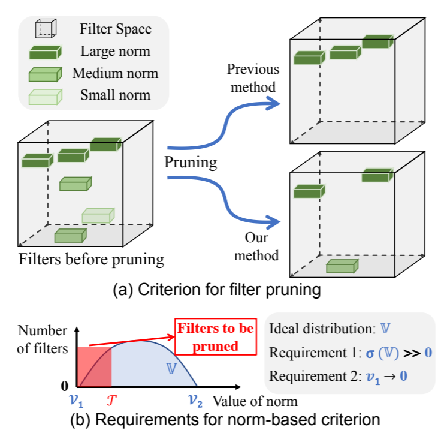

NNI Compressor 中的 Pruner
===

支持的剪枝算法
* [Level Pruner](#level-pruner)
* [AGP Pruner](#agp-pruner)
* [Lottery Ticket 假设](#lottery-ticket-hypothesis)
* [Slim Pruner](#slim-pruner)
* [具有权重等级的 Filter Pruners](#weightrankfilterpruner)
    * [FPGM Pruner](#fpgm-pruner)
    * [L1Filter Pruner](#l1filter-pruner)
    * [L2Filter Pruner](#l2filter-pruner)
* [具有激活等级的 Filter Pruners](#activationrankfilterpruner)
    * [APoZ Rank Pruner](#activationapozrankfilterpruner)
    * [Activation Mean Rank Pruner](#activationmeanrankfilterpruner)
* [具有梯度等级的 Filter Pruners](#gradientrankfilterpruner)
    * [Taylor FO On Weight Pruner](#taylorfoweightfilterpruner)

## Level Pruner

这是个基本的一次性 Pruner：可设置目标稀疏度（以分数表示，0.6 表示会剪除 60%）。

首先按照绝对值对指定层的权重排序。 然后按照所需的稀疏度，将值最小的权重屏蔽为 0。

### 用法

TensorFlow 代码
```python
from nni.compression.tensorflow import LevelPruner
config_list = [{ 'sparsity': 0.8, 'op_types': ['default'] }]
pruner = LevelPruner(model_graph, config_list)
pruner.compress()
```

PyTorch 代码
```python
from nni.compression.torch import LevelPruner
config_list = [{ 'sparsity': 0.8, 'op_types': ['default'] }]
pruner = LevelPruner(model, config_list)
pruner.compress()
```

#### Level Pruner 的用户配置
* **sparsity:**，指定压缩的稀疏度。

***

## AGP Pruner
这是一种迭代的 Pruner，在 [To prune, or not to prune: exploring the efficacy of pruning for model compression](https://arxiv.org/abs/1710.01878)中，作者 Michael Zhu 和 Suyog Gupta 提出了一种逐渐修建权重的算法。
> 我们引入了一种新的自动梯度剪枝算法。这种算法从初始的稀疏度值 si（一般为 0）开始，通过 n 步的剪枝操作，增加到最终所需的稀疏度 sf。从训练步骤 t0 开始，以 ∆t 为剪枝频率：  在神经网络训练时‘逐步增加网络稀疏度时，每训练  ∆t 步更新一次权重剪枝的二进制掩码。同时也允许训练步骤恢复因为剪枝而造成的精度损失。 根据我们的经验，∆t 设为 100 到 1000 个训练步骤之间时，对于模型最终精度的影响可忽略不计。 一旦模型达到了稀疏度目标 sf，权重掩码将不再更新。 公式背后的稀疏函数直觉。

### 用法
通过下列代码，可以在 10 个 Epoch 中将权重稀疏度从 0% 剪枝到 80%。

TensorFlow 代码
```python
from nni.compression.tensorflow import AGP_Pruner
config_list = [{
    'initial_sparsity': 0,
    'final_sparsity': 0.8,
    'start_epoch': 0,
    'end_epoch': 10,
    'frequency': 1,
    'op_types': 'default'
}]
pruner = AGP_Pruner(tf.get_default_graph(), config_list)
pruner.compress()
```
PyTorch 代码
```python
from nni.compression.torch import AGP_Pruner
config_list = [{
    'initial_sparsity': 0,
    'final_sparsity': 0.8,
    'start_epoch': 0,
    'end_epoch': 10,
    'frequency': 1,
    'op_types': ['default']
}]
pruner = AGP_Pruner(model, config_list, pruning_algorithm='level')
pruner.compress()
```

AGP Pruner 默认使用 `LevelPruner` 算法来修建权重，还可以设置 `pruning_algorithm` 参数来使用其它剪枝算法：
* `level`: LevelPruner
* `slim`: SlimPruner
* `l1`: L1FilterPruner
* `l2`: L2FilterPruner
* `fpgm`: FPGMPruner
* `taylorfo`: TaylorFOWeightFilterPruner
* `apoz`: ActivationAPoZRankFilterPruner
* `mean_activation`: ActivationMeanRankFilterPruner

在训练代码中每完成一个 Epoch，需要更新一下 Epoch 的值。

TensorFlow 代码
```python
pruner.update_epoch(epoch, sess)
```
PyTorch 代码
```python
pruner.update_epoch(epoch)
```
查看示例进一步了解

#### AGP Pruner 的用户配置
* **initial_sparsity:** 指定了 Compressor 开始压缩的稀疏度。
* **final_sparsity:** 指定了 Compressor 压缩结束时的稀疏度。
* **start_epoch:** 指定了 Compressor 开始压缩时的 Epoch 数值，默认为 0。
* **end_epoch:** 指定了 Compressor 结束压缩时的 Epoch 数值。
* **frequency:** 指定了 Compressor 每过多少个 Epoch 进行一次剪枝，默认 frequency=1。

***

## Lottery Ticket 假设
[The Lottery Ticket Hypothesis: Finding Sparse, Trainable Neural Networks](https://arxiv.org/abs/1803.03635), 作者 Jonathan Frankle 和 Michael Carbin，提供了全面的测量和分析，并阐明了 *lottery ticket 假设*: 密集的、随机初始化的、包含子网络的前馈网络 (*winning tickets*) -- 在单独训练时 -- 在相似的迭代次数后达到了与原始网络相似的准确度。

本文中，作者使用叫做*迭代*修剪的方法：
> 1. 随机初始化一个神经网络 f(x;theta_0) (其中 theta_0 为 D_{theta}).
> 2. 将网络训练 j 次，得出参数 theta_j。
> 3. 在 theta_j 修剪参数的 p%，创建掩码 m。
> 4. 将其余参数重置为 theta_0 的值，创建获胜彩票 f(x;m*theta_0)。
> 5. 重复步骤 2、3 和 4。

如果配置的最终稀疏度为 P (e.g., 0.8) 并且有 n 次修建迭代，每次迭代修剪前一轮中剩余权重的 1-(1-P)^(1/n)。

### 用法

PyTorch 代码
```python
from nni.compression.torch import LotteryTicketPruner
config_list = [{
    'prune_iterations': 5,
    'sparsity': 0.8,
    'op_types': ['default']
}]
pruner = LotteryTicketPruner(model, config_list, optimizer)
pruner.compress()
for _ in pruner.get_prune_iterations():
    pruner.prune_iteration_start()
    for epoch in range(epoch_num):
        ...
```

上述配置意味着有 5 次迭代修剪。 由于在同一次运行中执行了 5 次修剪，LotteryTicketPruner 需要 `model` 和 `optimizer` (**注意，如果使用 `lr_scheduler`，也需要添加**) 来在每次开始新的修剪迭代时，将其状态重置为初始值。 使用 `get_prune_iterations` 来获取修建迭代，并在每次迭代开始时调用 `prune_iteration_start`。 为了模型能较好收敛，`epoch_num` 最好足够大。因为假设是在后几轮中具有较高稀疏度的性能（准确度）可与第一轮获得的相当。 [这是](./LotteryTicketHypothesis.md)简单的重现结果。


*稍后支持 TensorFlow 版本。*

#### LotteryTicketPruner 的用户配置

* **prune_iterations:** 迭代修剪的次数。
* **sparsity:** 压缩完成后的最终稀疏度。

***

## Slim Pruner

这是一次性的 Pruner，在 ['Learning Efficient Convolutional Networks through Network Slimming'](https://arxiv.org/pdf/1708.06519.pdf) 中提出，作者 Zhuang Liu, Jianguo Li, Zhiqiang Shen, Gao Huang, Shoumeng Yan 以及 Changshui Zhang。


> Slim Pruner **会遮盖卷据层通道之后 BN 层对应的缩放因子**，训练时在缩放因子上的 L1 正规化应在批量正规化 (BN) 层之后来做。BN 层的缩放因子在修剪时，是**全局排序的**，因此稀疏模型能自动找到给定的稀疏度。

### 用法

PyTorch 代码

```python
from nni.compression.torch import SlimPruner
config_list = [{ 'sparsity': 0.8, 'op_types': ['BatchNorm2d'] }]
pruner = SlimPruner(model, config_list)
pruner.compress()
```

#### Slim Pruner 的用户配置

- **sparsity:**，指定压缩的稀疏度。
- **op_types:** 在 Slim Pruner 中仅支持 BatchNorm2d。


## WeightRankFilterPruner
WeightRankFilterPruner 是一系列的 Pruner，在卷积层权重上，用最小的重要性标准修剪过滤器，来达到预设的网络稀疏度。

### FPGM Pruner

这是一种一次性的 Pruner，FPGM Pruner 是论文 [Filter Pruning via Geometric Median for Deep Convolutional Neural Networks Acceleration](https://arxiv.org/pdf/1811.00250.pdf) 的实现

具有最小几何中位数的 FPGMPruner 修剪过滤器

 
> 以前的方法使用 “smaller-norm-less-important” 准则来修剪卷积神经网络中规范值较小的。 本文中，分析了基于规范的准则，并指出其所依赖的两个条件不能总是满足：(1) 过滤器的规范偏差应该较大；(2) 过滤器的最小规范化值应该很小。 为了解决此问题，提出了新的过滤器修建方法，即 Filter Pruning via Geometric Median (FPGM)，可不考虑这两个要求来压缩模型。 与以前的方法不同，FPGM 通过修剪冗余的，而不是相关性更小的部分来压缩 CNN 模型。

#### 用法

TensorFlow 代码
```python
from nni.compression.tensorflow import FPGMPruner
config_list = [{
    'sparsity': 0.5,
    'op_types': ['Conv2D']
}]
pruner = FPGMPruner(model, config_list)
pruner.compress()
```
PyTorch 代码
```python
from nni.compression.torch import FPGMPruner
config_list = [{
    'sparsity': 0.5,
    'op_types': ['Conv2d']
}]
pruner = FPGMPruner(model, config_list)
pruner.compress()
```
注意：FPGM Pruner 用于修剪深度神经网络中的卷积层，因此 `op_types` 字段仅支持卷积层。

需要在每个 epoch 开始的地方，添加下列代码来更新 epoch 的数值。

TensorFlow 代码
```python
pruner.update_epoch(epoch, sess)
```
PyTorch 代码
```python
pruner.update_epoch(epoch)
```
查看示例进一步了解

#### FPGM Pruner 的用户配置
* **sparsity:** 卷积过滤器要修剪的百分比。

***

### L1Filter Pruner

这是一种一次性的 Pruner，由 ['PRUNING FILTERS FOR EFFICIENT CONVNETS'](https://arxiv.org/abs/1608.08710) 提出，作者 Hao Li, Asim Kadav, Igor Durdanovic, Hanan Samet 和 Hans Peter Graf。 [重现的实验结果](l1filterpruner.md)


> L1Filter Pruner 修剪**卷积层**中的过滤器
> 
> 从第 i 个卷积层修剪 m 个过滤器的过程如下：
> 
> 1. 对于每个过滤器 ，计算其绝对内核权重之和
> 2. 将过滤器按  排序。
> 3. 修剪  具有最小求和值及其相应特征图的筛选器。 在 下一个卷积层中，被剪除的特征图所对应的内核也被移除。
> 4. 为第  和  层创建新的内核举证，并保留剩余的内核 权重，并复制到新模型中。

#### 用法

PyTorch 代码

```python
from nni.compression.torch import L1FilterPruner
config_list = [{ 'sparsity': 0.8, 'op_types': ['Conv2d'] }]
pruner = L1FilterPruner(model, config_list)
pruner.compress()
```

#### L1Filter Pruner 的用户配置

- **sparsity:**，指定压缩的稀疏度。
- **op_types:** 在 L1Filter Pruner 中仅支持 Conv1d 和 Conv2d。

***

### L2Filter Pruner

这是一种结构化剪枝算法，用于修剪权重的最小 L2 规范筛选器。 它被实现为一次性修剪器。

#### 用法

PyTorch 代码

```python
from nni.compression.torch import L2FilterPruner
config_list = [{ 'sparsity': 0.8, 'op_types': ['Conv2d'] }]
pruner = L2FilterPruner(model, config_list)
pruner.compress()
```

#### L2Filter Pruner 的用户配置

- **sparsity:**，指定压缩的稀疏度。
- **op_types:** 在 L2Filter Pruner 中仅支持 Conv1d 和 Conv2d。

## ActivationRankFilterPruner
ActivationRankFilterPruner 是一系列的 Pruner，从卷积层激活的输出，用最小的重要性标准修剪过滤器，来达到预设的网络稀疏度。

### ActivationAPoZRankFilterPruner

我们将其实现为一次性剪枝器，它基于 `APoZ` 修剪卷积层，参考论文 [Network Trimming: A Data-Driven Neuron Pruning Approach towards Efficient Deep Architectures](https://arxiv.org/abs/1607.03250)。 基于迭代剪枝的 `APoZ` 将在以后的版本中支持。

APoZ 定义为：


#### 用法

PyTorch 代码

```python
from nni.compression.torch import ActivationAPoZRankFilterPruner
config_list = [{
    'sparsity': 0.5,
    'op_types': ['Conv2d']
}]
pruner = ActivationAPoZRankFilterPruner(model, config_list, statistics_batch_num=1)
pruner.compress()
```

注意：ActivationAPoZRankFilterPruner 用于修剪深度神经网络中的卷积层，因此 `op_types` 字段仅支持卷积层。

查看示例进一步了解

#### ActivationAPoZRankFilterPruner 的用户配置

- **sparsity:** 卷积过滤器要修剪的百分比。
- **op_types:** 在 ActivationAPoZRankFilterPruner 中仅支持 Conv2d。

***

### ActivationMeanRankFilterPruner

其实现为一次性修剪器，基于 `平均激活` 准则来修剪卷积层，在论文 [Pruning Convolutional Neural Networks for Resource Efficient Inference](https://arxiv.org/abs/1611.06440) 的 2.2 节中有说明。 本文中提到的其他修剪标准将在以后的版本中支持。

#### 用法

PyTorch 代码

```python
from nni.compression.torch import ActivationMeanRankFilterPruner
config_list = [{
    'sparsity': 0.5,
    'op_types': ['Conv2d']
}]
pruner = ActivationMeanRankFilterPruner(model, config_list)
pruner.compress()
```

注意：ActivationMeanRankFilterPruner 用于修剪深度神经网络中的卷积层，因此 `op_types` 字段仅支持卷积层。

查看示例进一步了解

#### ActivationMeanRankFilterPruner 的用户配置

- **sparsity:** 卷积过滤器要修剪的百分比。
- **op_types:** 在 ActivationMeanRankFilterPruner 中仅支持 Conv2d。


## GradientRankFilterPruner

GradientRankFilterPruner 是一系列的 Pruner，在卷积层梯度上，用最小的重要性标准修剪过滤器，来达到预设的网络稀疏度。

### TaylorFOWeightFilterPruner

其实现为一次性 Pruner，会根据权重的一阶泰勒展开式来对卷积层进行剪枝。 过滤器的估计重要性在论文 [Importance Estimation for Neural Network Pruning](http://jankautz.com/publications/Importance4NNPruning_CVPR19.pdf) 中有定义。 本文中提到的其他修剪标准将在以后的版本中支持。
>


#### 用法

PyTorch 代码

```python
from nni.compression.torch import TaylorFOWeightFilterPruner
config_list = [{
    'sparsity': 0.5,
    'op_types': ['Conv2d']
}]
pruner = TaylorFOWeightFilterPruner(model, config_list, optimizer)
pruner.compress()
```

查看示例进一步了解

#### GradientWeightSumFilterPruner 的用户配置

- **sparsity:** 卷积过滤器要修剪的百分比。
- **op_types:** 当前 TaylorFOWeightFilterPruner 中仅支持 Conv2d。


 