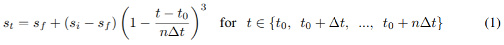

# Supported Pruning Algorithms on NNI

We provide several pruning algorithms that support fine-grained weight pruning and structural filter pruning. **Weight pruning** generally results in  unstructured models, which need specialized haredware or software to speed up the sparse network. **Filter Pruning** achieves acceleratation by removing the entire filter.  We also provide an algorithm to control the **pruning schedule**.


**Weight Pruning**
* [Level Pruner](#level-pruner)
* [Lottery Ticket Hypothesis](#lottery-ticket-hypothesis)

**Filter Pruning**
* [Slim Pruner](#slim-pruner)
* [Filter Pruners with Weight Rank](#weightrankfilterpruner)
    * [FPGM Pruner](#fpgm-pruner)
    * [L1Filter Pruner](#l1filter-pruner)
    * [L2Filter Pruner](#l2filter-pruner)
* [Filter Pruners with Activation Rank](#activationrankfilterpruner)
    * [APoZ Rank Pruner](#activationapozrankfilterpruner)
    * [Activation Mean Rank Pruner](#activationmeanrankfilterpruner)
* [Filter Pruners with Gradient Rank](#gradientrankfilterpruner)
    * [Taylor FO On Weight Pruner](#taylorfoweightfilterpruner)

**Pruning Schedule**
* [AGP Pruner](#agp-pruner)

## Level Pruner

This is one basic one-shot pruner: you can set a target sparsity level (expressed as a fraction, 0.6 means we will prune 60%).

We first sort the weights in the specified layer by their absolute values. And then mask to zero the smallest magnitude weights until the desired sparsity level is reached.

### 用法

Tensorflow code
```python
from nni.compression.tensorflow import LevelPruner
config_list = [{ 'sparsity': 0.8, 'op_types': ['default'] }]
pruner = LevelPruner(model_graph, config_list)
pruner.compress()
```

PyTorch code
```python
from nni.compression.torch import LevelPruner
config_list = [{ 'sparsity': 0.8, 'op_types': ['default'] }]
pruner = LevelPruner(model, config_list)
pruner.compress()
```

#### Level Pruner 的用户配置
* **sparsity:** This is to specify the sparsity operations to be compressed to

***

## AGP Pruner
This is an iterative pruner, In [To prune, or not to prune: exploring the efficacy of pruning for model compression](https://arxiv.org/abs/1710.01878), authors Michael Zhu and Suyog Gupta provide an algorithm to prune the weight gradually.
> 我们引入了一种新的自动梯度剪枝算法。这种算法从初始的稀疏度值 si（一般为 0）开始，通过 n 步的剪枝操作，增加到最终所需的稀疏度 sf。从训练步骤 t0 开始，以 ∆t 为剪枝频率：  在神经网络训练时‘逐步增加网络稀疏度时，每训练  ∆t 步更新一次权重剪枝的二进制掩码。同时也允许训练步骤恢复因为剪枝而造成的精度损失。 根据我们的经验，∆t 设为 100 到 1000 个训练步骤之间时，对于模型最终精度的影响可忽略不计。 一旦模型达到了稀疏度目标 sf，权重掩码将不再更新。 公式背后的稀疏函数直觉。

### 用法
You can prune all weight from 0% to 80% sparsity in 10 epoch with the code below.

Tensorflow code
```python
from nni.compression.tensorflow import AGP_Pruner
config_list = [{
    'initial_sparsity': 0,
    'final_sparsity': 0.8,
    'start_epoch': 0,
    'end_epoch': 10,
    'frequency': 1,
    'op_types': 'default'
}]
pruner = AGP_Pruner(tf.get_default_graph(), config_list)
pruner.compress()
```
PyTorch code
```python
from nni.compression.torch import AGP_Pruner
config_list = [{
    'initial_sparsity': 0,
    'final_sparsity': 0.8,
    'start_epoch': 0,
    'end_epoch': 10,
    'frequency': 1,
    'op_types': ['default']
}]
pruner = AGP_Pruner(model, config_list, pruning_algorithm='level')
pruner.compress()
```

AGP pruner uses `LevelPruner` algorithms to prune the weight by default, however you can set `pruning_algorithm` parameter to other values to use other pruning algorithms:
* `level`: LevelPruner
* `slim`: SlimPruner
* `l1`: L1FilterPruner
* `l2`: L2FilterPruner
* `fpgm`: FPGMPruner
* `taylorfo`: TaylorFOWeightFilterPruner
* `apoz`: ActivationAPoZRankFilterPruner
* `mean_activation`: ActivationMeanRankFilterPruner

You should add code below to update epoch number when you finish one epoch in your training code.

Tensorflow code
```python
pruner.update_epoch(epoch, sess)
```
PyTorch code
```python
pruner.update_epoch(epoch)
```
You can view example for more information

#### AGP Pruner 的用户配置
* **initial_sparsity:** This is to specify the sparsity when compressor starts to compress
* **final_sparsity:** This is to specify the sparsity when compressor finishes to compress
* **start_epoch:** This is to specify the epoch number when compressor starts to compress, default start from epoch 0
* **end_epoch:** This is to specify the epoch number when compressor finishes to compress
* **frequency:** This is to specify every *frequency* number epochs compressor compress once, default frequency=1

***

## Lottery Ticket 假设
[The Lottery Ticket Hypothesis: Finding Sparse, Trainable Neural Networks](https://arxiv.org/abs/1803.03635), authors Jonathan Frankle and Michael Carbin,provides comprehensive measurement and analysis, and articulate the *lottery ticket hypothesis*: dense, randomly-initialized, feed-forward networks contain subnetworks (*winning tickets*) that -- when trained in isolation -- reach test accuracy comparable to the original network in a similar number of iterations.

In this paper, the authors use the following process to prune a model, called *iterative prunning*:
> 1. 随机初始化一个神经网络 f(x;theta_0) (其中 theta_0 为 D_{theta}).
> 2. 将网络训练 j 次，得出参数 theta_j。
> 3. 在 theta_j 修剪参数的 p%，创建掩码 m。
> 4. 将其余参数重置为 theta_0 的值，创建获胜彩票 f(x;m*theta_0)。
> 5. 重复步骤 2、3 和 4。

If the configured final sparsity is P (e.g., 0.8) and there are n times iterative pruning, each iterative pruning prunes 1-(1-P)^(1/n) of the weights that survive the previous round.

### 用法

PyTorch code
```python
from nni.compression.torch import LotteryTicketPruner
config_list = [{
    'prune_iterations': 5,
    'sparsity': 0.8,
    'op_types': ['default']
}]
pruner = LotteryTicketPruner(model, config_list, optimizer)
pruner.compress()
for _ in pruner.get_prune_iterations():
    pruner.prune_iteration_start()
    for epoch in range(epoch_num):
        ...
```

The above configuration means that there are 5 times of iterative pruning. As the 5 times iterative pruning are executed in the same run, LotteryTicketPruner needs `model` and `optimizer` (**Note that should add `lr_scheduler` if used**) to reset their states every time a new prune iteration starts. Please use `get_prune_iterations` to get the pruning iterations, and invoke `prune_iteration_start` at the beginning of each iteration. `epoch_num` is better to be large enough for model convergence, because the hypothesis is that the performance (accuracy) got in latter rounds with high sparsity could be comparable with that got in the first round.


*Tensorflow version will be supported later.*

#### LotteryTicketPruner 的用户配置

* **prune_iterations:** The number of rounds for the iterative pruning, i.e., the number of iterative pruning.
* **sparsity:** The final sparsity when the compression is done.

### Reproduced Experiment

We try to reproduce the experiment result of the fully connected network on MNIST using the same configuration as in the paper. The code can be referred [here](https://github.com/microsoft/nni/tree/master/examples/model_compress/lottery_torch_mnist_fc.py). In this experiment, we prune 10 times, for each pruning we train the pruned model for 50 epochs.


The above figure shows the result of the fully connected network. `round0-sparsity-0.0` is the performance without pruning. Consistent with the paper, pruning around 80% also obtain similar performance compared to non-pruning, and converges a little faster. If pruning too much, e.g., larger than 94%, the accuracy becomes lower and convergence becomes a little slower. A little different from the paper, the trend of the data in the paper is relatively more clear.

***

## Slim Pruner

This is an one-shot pruner, In ['Learning Efficient Convolutional Networks through Network Slimming'](https://arxiv.org/pdf/1708.06519.pdf), authors Zhuang Liu, Jianguo Li, Zhiqiang Shen, Gao Huang, Shoumeng Yan and Changshui Zhang.


> Slim Pruner **会遮盖卷据层通道之后 BN 层对应的缩放因子**，训练时在缩放因子上的 L1 正规化应在批量正规化 (BN) 层之后来做。BN 层的缩放因子在修剪时，是**全局排序的**，因此稀疏模型能自动找到给定的稀疏度。

### Usage

PyTorch 代码

```python
from nni.compression.torch import SlimPruner
config_list = [{ 'sparsity': 0.8, 'op_types': ['BatchNorm2d'] }]
pruner = SlimPruner(model, config_list)
pruner.compress()
```

#### Slim Pruner 的用户配置

- **sparsity:**，指定压缩的稀疏度。
- **op_types:** Only BatchNorm2d is supported in Slim Pruner

### Reproduced Experiment

We implemented one of the experiments in ['Learning Efficient Convolutional Networks through Network Slimming'](https://arxiv.org/pdf/1708.06519.pdf), we pruned $70\%$ channels in the **VGGNet** for CIFAR-10 in the paper, in which $88.5\%$ parameters are pruned. Our experiments results are as follows:

| Model         | Error(paper/ours) | Parameters | Pruned |
| ------------- | ----------------- | ---------- | ------ |
| VGGNet        | 6.34/6.40         | 20.04M     |        |
| Pruned-VGGNet | 6.20/6.26         | 2.03M      | 88.5%  |

The experiments code can be found at [examples/model_compress](https://github.com/microsoft/nni/tree/master/examples/model_compress/)

***

## WeightRankFilterPruner
WeightRankFilterPruner is a series of pruners which prune the filters with the smallest importance criterion calculated from the weights in convolution layers to achieve a preset level of network sparsity

### FPGM Pruner

This is an one-shot pruner, FPGM Pruner is an implementation of paper [Filter Pruning via Geometric Median for Deep Convolutional Neural Networks Acceleration](https://arxiv.org/pdf/1811.00250.pdf)

FPGMPruner prune filters with the smallest geometric median

 
> 以前的方法使用 “smaller-norm-less-important” 准则来修剪卷积神经网络中规范值较小的。 本文中，分析了基于规范的准则，并指出其所依赖的两个条件不能总是满足：(1) 过滤器的规范偏差应该较大；(2) 过滤器的最小规范化值应该很小。 为了解决此问题，提出了新的过滤器修建方法，即 Filter Pruning via Geometric Median (FPGM)，可不考虑这两个要求来压缩模型。 与以前的方法不同，FPGM 通过修剪冗余的，而不是相关性更小的部分来压缩 CNN 模型。

#### 用法

Tensorflow code
```python
from nni.compression.tensorflow import FPGMPruner
config_list = [{
    'sparsity': 0.5,
    'op_types': ['Conv2D']
}]
pruner = FPGMPruner(model, config_list)
pruner.compress()
```
PyTorch 代码
```python
from nni.compression.torch import FPGMPruner
config_list = [{
    'sparsity': 0.5,
    'op_types': ['Conv2d']
}]
pruner = FPGMPruner(model, config_list)
pruner.compress()
```
Note: FPGM Pruner is used to prune convolutional layers within deep neural networks, therefore the `op_types` field supports only convolutional layers.

You should add code below to update epoch number at beginning of each epoch.

Tensorflow code
```python
pruner.update_epoch(epoch, sess)
```
PyTorch code
```python
pruner.update_epoch(epoch)
```
You can view example for more information

#### FPGM Pruner 的用户配置
* **sparsity:** How much percentage of convolutional filters are to be pruned.

***

### L1Filter Pruner

This is an one-shot pruner, In ['PRUNING FILTERS FOR EFFICIENT CONVNETS'](https://arxiv.org/abs/1608.08710), authors Hao Li, Asim Kadav, Igor Durdanovic, Hanan Samet and Hans Peter Graf.


> L1Filter Pruner 修剪**卷积层**中的过滤器
> 
> 从第 i 个卷积层修剪 m 个过滤器的过程如下：
> 
> 1. 对于每个过滤器 ，计算其绝对内核权重之和
> 2. 将过滤器按  排序。
> 3. 修剪  具有最小求和值及其相应特征图的筛选器。 在 下一个卷积层中，被剪除的特征图所对应的内核也被移除。
> 4. 为第  和  层创建新的内核举证，并保留剩余的内核 权重，并复制到新模型中。

#### 用法

PyTorch code

```python
from nni.compression.torch import L1FilterPruner
config_list = [{ 'sparsity': 0.8, 'op_types': ['Conv2d'] }]
pruner = L1FilterPruner(model, config_list)
pruner.compress()
```

#### L1Filter Pruner 的用户配置

- **sparsity:** This is to specify the sparsity operations to be compressed to
- **op_types:** Only Conv1d and Conv2d is supported in L1Filter Pruner

#### Reproduced Experiment

We implemented one of the experiments in ['PRUNING FILTERS FOR EFFICIENT CONVNETS'](https://arxiv.org/abs/1608.08710) with **L1FilterPruner**, we pruned **VGG-16** for CIFAR-10 to **VGG-16-pruned-A** in the paper, in which $64\%$ parameters are pruned. Our experiments results are as follows:

| Model           | Error(paper/ours) | Parameters | Pruned |
| --------------- | ----------------- | ---------- | ------ |
| VGG-16          | 6.75/6.49         | 1.5x10^7   |        |
| VGG-16-pruned-A | 6.60/6.47         | 5.4x10^6   | 64.0%  |

The experiments code can be found at [examples/model_compress](https://github.com/microsoft/nni/tree/master/examples/model_compress/)

***

### L2Filter Pruner

This is a structured pruning algorithm that prunes the filters with the smallest L2 norm of the weights. It is implemented as a one-shot pruner.

#### Usage

PyTorch code

```python
from nni.compression.torch import L2FilterPruner
config_list = [{ 'sparsity': 0.8, 'op_types': ['Conv2d'] }]
pruner = L2FilterPruner(model, config_list)
pruner.compress()
```

#### User configuration for L2Filter Pruner

- **sparsity:** This is to specify the sparsity operations to be compressed to
- **op_types:** Only Conv1d and Conv2d is supported in L2Filter Pruner

***

## ActivationRankFilterPruner
ActivationRankFilterPruner is a series of pruners which prune the filters with the smallest importance criterion calculated from the output activations of convolution layers to achieve a preset level of network sparsity.

### ActivationAPoZRankFilterPruner

We implemented it as a one-shot pruner, it prunes convolutional layers based on the criterion `APoZ` which is explained in the paper [Network Trimming: A Data-Driven Neuron Pruning Approach towards Efficient Deep Architectures](https://arxiv.org/abs/1607.03250). Iterative pruning based on `APoZ` will be supported in future release.

The APoZ is defined as:


#### Usage

PyTorch 代码

```python
from nni.compression.torch import ActivationAPoZRankFilterPruner
config_list = [{
    'sparsity': 0.5,
    'op_types': ['Conv2d']
}]
pruner = ActivationAPoZRankFilterPruner(model, config_list, statistics_batch_num=1)
pruner.compress()
```

Note: ActivationAPoZRankFilterPruner is used to prune convolutional layers within deep neural networks, therefore the `op_types` field supports only convolutional layers.

You can view example for more information

#### User configuration for ActivationAPoZRankFilterPruner

- **sparsity:** 卷积过滤器要修剪的百分比。
- **op_types:** Only Conv2d is supported in ActivationAPoZRankFilterPruner

***

### ActivationMeanRankFilterPruner

We implemented it as a one-shot pruner, it prunes convolutional layers based on the criterion `mean activation` which is explained in section 2.2 of the paper[Pruning Convolutional Neural Networks for Resource Efficient Inference](https://arxiv.org/abs/1611.06440). Other pruning criteria mentioned in this paper will be supported in future release.

#### Usage

PyTorch code

```python
from nni.compression.torch import ActivationMeanRankFilterPruner
config_list = [{
    'sparsity': 0.5,
    'op_types': ['Conv2d']
}]
pruner = ActivationMeanRankFilterPruner(model, config_list)
pruner.compress()
```

Note: ActivationMeanRankFilterPruner is used to prune convolutional layers within deep neural networks, therefore the `op_types` field supports only convolutional layers.

You can view example for more information

#### User configuration for ActivationMeanRankFilterPruner

- **sparsity:** How much percentage of convolutional filters are to be pruned.
- **op_types:** Only Conv2d is supported in ActivationMeanRankFilterPruner.

***

## GradientRankFilterPruner

GradientRankFilterPruner is a series of pruners which prune the filters with the smallest importance criterion calculated from the gradients of convolution layers to achieve a preset level of network sparsity.

### TaylorFOWeightFilterPruner

We implemented it as a one-shot pruner, it prunes convolutional layers based on the first order taylor expansion on weights. The estimated importance of filters is defined as the paper [Importance Estimation for Neural Network Pruning](http://jankautz.com/publications/Importance4NNPruning_CVPR19.pdf). Other pruning criteria mentioned in this paper will be supported in future release.
>


#### Usage

PyTorch code

```python
from nni.compression.torch import TaylorFOWeightFilterPruner
config_list = [{
    'sparsity': 0.5,
    'op_types': ['Conv2d']
}]
pruner = TaylorFOWeightFilterPruner(model, config_list, optimizer)
pruner.compress()
```

You can view example for more information

#### User configuration for GradientWeightSumFilterPruner

- **sparsity:** How much percentage of convolutional filters are to be pruned.
- **op_types:** Currently only Conv2d is supported in TaylorFOWeightFilterPruner.


 