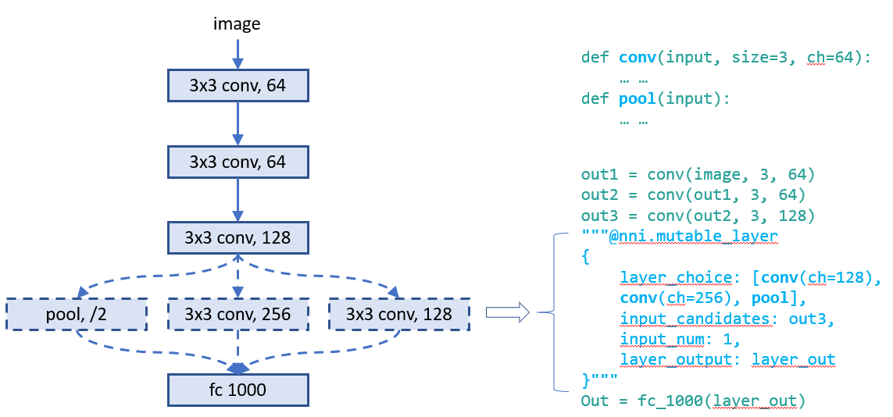
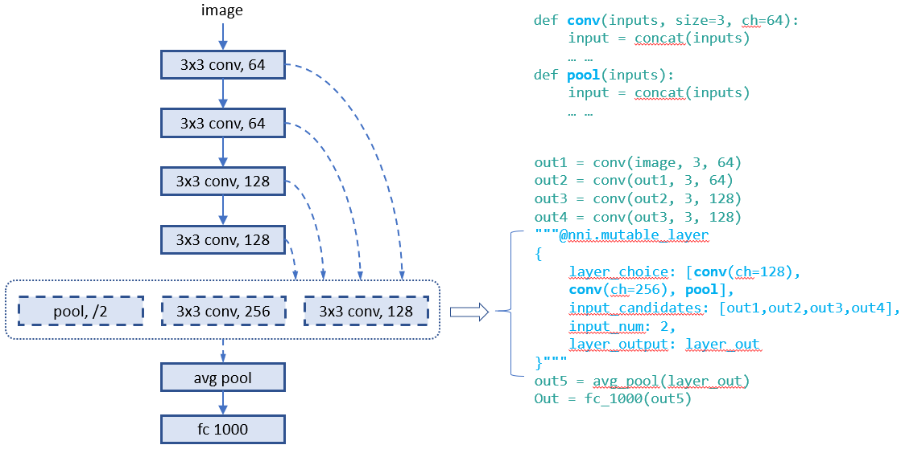
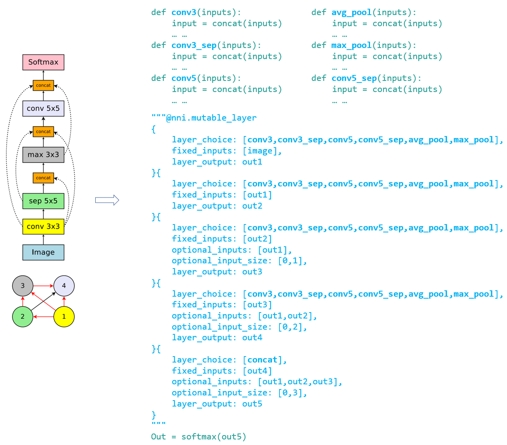
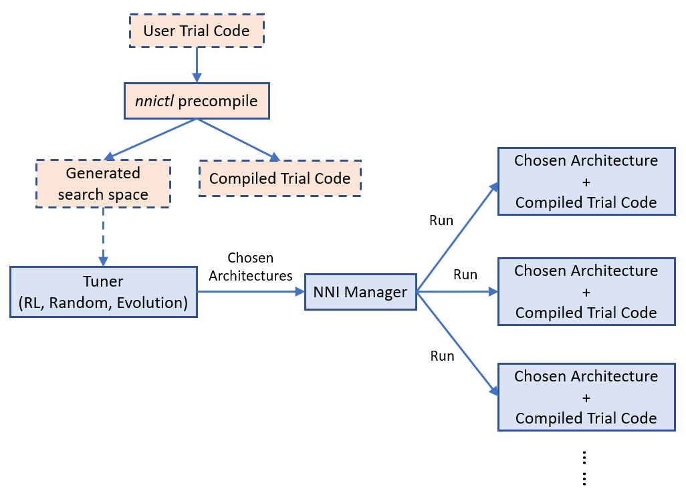
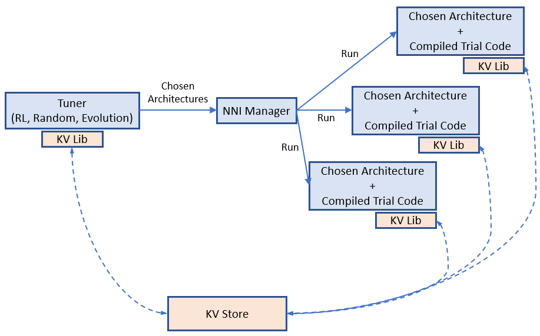
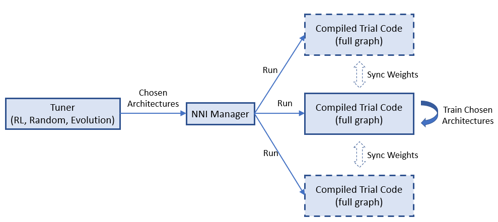

# 神经网络架构搜索的通用编程接口（测试版）

** 这是一个测试中的功能，目前只实现了通用的 NAS 编程接口。 接下来的版本会基于此接口支持权重共享和 one-shot NAS。*

自动化的神经网络架构（NAS）搜索在寻找更好的模型方面发挥着越来越重要的作用。 最近的研究工作证明了自动化 NAS 的可行性，并发现了一些超越手动设计和调整的模型。 代表算法有 [NASNet](https://arxiv.org/abs/1707.07012)，[ENAS](https://arxiv.org/abs/1802.03268)，[DARTS](https://arxiv.org/abs/1806.09055)，[Network Morphism](https://arxiv.org/abs/1806.10282)，以及 [Evolution](https://arxiv.org/abs/1703.01041) 等。 新的算法还在不断涌现。 然而，实现这些算法需要很大的工作量，且很难重用其它算法的代码库来实现。

要促进 NAS 创新（例如，设计实现新的 NAS 模型，并列比较不同的 NAS 模型），易于使用且灵活的编程接口非常重要。

## 编程接口

在两种场景下需要用于设计和搜索模型的新的编程接口。 1) 在设计神经网络时，层、子模型或连接有多个可能，并且不确定哪一个或哪种组合表现最好。 如果有一种简单的方法来表达想要尝试的候选层、子模型，将会很有价值。 2) 研究自动化 NAS 时，需要统一的方式来表达神经网络架构的搜索空间， 并在不改变 Trial 代码的情况下来使用不同的搜索算法。

本文基于 [NNI Annotation](./AnnotationSpec.md) 实现了简单灵活的编程接口 。 通过以下示例来详细说明。

### 示例：为层选择运算符

在设计此模型时，第四层的运算符有多个可能的选择，会让模型有更好的表现。 如图所示，在模型代码中可以对第四层使用 Annotation。 此 Annotation 中，共有五个字段：



* **layer_choice**：它是函数调用的 list，每个函数都要在代码或导入的库中实现。 函数的输入参数格式为：`def XXX (input, arg2, arg3, ...)`，其中输入是包含了两个元素的 list。 其中一个是 `fixed_inputs` 的 list，另一个是 `optional_inputs` 中选择输入的 list。 `conv` 和 `pool` 是函数示例。 对于 list 中的函数调用，无需写出第一个参数（即 input）。 注意，只会从这些函数调用中选择一个来执行。
* **fixed_inputs** ：它是变量的 list，可以是前一层输出的张量。 也可以是此层之前的另一个 `nni.mutable_layer` 的 `layer_output`，或此层之前的其它 Python 变量。 list 中的所有变量将被输入 `layer_choice` 中选择的函数（作为输入 list 的第一个元素）。
* **optional_inputs** ：它是变量的 list，可以是前一层的输出张量。 也可以是此层之前的另一个 `nni.mutable_layer` 的 `layer_output`，或此层之前的其它 Python 变量。 只有 `optional_input_size` 变量被输入 `layer_choice` 到所选的函数 （作为输入 list 的第二个元素）。
* **optional_input_size** ：它表示从 `input_candidates` 中选择多少个输入。 它可以是一个数字，也可以是一个范围。 范围 [1, 3] 表示选择 1、2 或 3 个输入。
* **layer_output** ：表示输出的名称。本例中，表示 `layer_choice` 选择的函数的返回值。 这是一个变量名，可以在随后的 Python 代码或 `nni.mutable_layer` 中使用。

此示例有两种写 Annotation 的方法。 对于上面的示例，输入函数的形式是 `[[], [out3]]` 。 对于下面的示例，输入的形式是 `[[out3], []]`。

**调试**：`nnictl trial codegen` 命令可帮助调试 NAS 编程接口。 如果 Experiment `YYY` 中的 Trial 的 `XXX` 出错了，可以运行 `nnictl trial codegen YYY --trial_id XXX` 在当前目录下生成这个 Trial 的可执行代码。 通过运行此代码，可以不需要 NNI 就能调试 Trial 失败的原因。 此命令会编译 Trial 代码，并用实际选择的层次和输入来替换 NNI 的 NAS 代码。

### 示例：为层选择输入的连接

设计层的连接对于制作高性能模型至关重要。 通过此接口，可选择一个层可以采用哪些连接来作为输入。 可以从一组连接中选择几个。 下面的示例从三个候选输入中为 `concat` 这个函数选择两个输入 。 `concat` 还会使用 `fixed_inputs` 获取其上一层的输出 。


### 示例：同时选择运算符和连接

此示例从三个运算符中选择一个，并为其选择两个连接作为输入。 由于输入会有多个变量,，在函数的开头需要调用 `concat` 。



### 示例：[ENAS](https://arxiv.org/abs/1802.03268) 宏搜索空间

为了证明编程接口带来的便利，使用该接口来实现 “ENAS + 宏搜索空间” 的 Trial 代码。 左图是 ENAS 论文中的宏搜索空间。



## 统一的 NAS 搜索空间说明

通过上面的 Annotation 更新 Trial 代码后，即在代码中隐式指定了神经网络架构的搜索空间。 基于该代码，NNI 将自动生成一个搜索空间文件，可作为调优算法的输入。 搜索空间文件遵循以下 JSON 格式。

```json
{
    "mutable_1": {
        "layer_1": {
            "layer_choice": ["conv(ch=128)", "pool", "identity"],
            "optional_inputs": ["out1", "out2", "out3"],
            "optional_input_size": 2
        },
        "layer_2": {
            ...
        }
    }
}
```

相应生成的神经网络结构（由调优算法生成）如下：

```json
{
    "mutable_1": {
        "layer_1": {
            "chosen_layer": "pool",
            "chosen_inputs": ["out1", "out3"]
        },
        "layer_2": {
            ...
        }
    }
}
```

通过对搜索空间格式和体系结构选择 (choice) 表达式的说明，可以自由地在 NNI 上实现神经体系结构搜索的各种或通用的调优算法。 接下来的工作会提供一个通用的 NAS 算法。

=============================================================

## 神经网络结构搜索在 NNI 上的应用

### Experiment 执行的基本流程

NNI 的 Annotation 编译器会将 Trial 代码转换为可以接收架构选择并构建相应模型（如图）的代码。 NAS 的搜索空间可以看作是一个完整的图（在这里，完整的图意味着允许所有提供的操作符和连接来构建图），调优算法所选择的是其子图。 默认情况下，编译时 Trial 代码仅构建并执行子图。



上图显示了 Trial 代码如何在 NNI 上运行。 `nnictl` 处理 Trial 代码，并生成搜索空间文件和编译后的 Trial 代码。 前者会输入 Tuner，后者会在 Trial 代码运行时使用。

[使用 NAS 的简单示例](https://github.com/microsoft/nni/tree/v0.8/examples/trials/mnist-nas)。

### [**待实现**] 权重共享

在所选择的架构（即 Trial）之间共享权重可以加速模型搜索。 例如，适当地继承已完成 Trial 的权重可加速新 Trial 的收敛。 One-shot NAS（例如，ENAS，Darts）更为激进，不同架构（即子图）的训练会在完整图中共享相同的权重。



权重分配（转移）在加速 NAS 中有关键作用，而找到有效的权重共享方式仍是热门的研究课题。 NNI 提供了一个键值存储，用于存储和加载权重。 Tuner 和 Trial 使用 KV 客户端库来访问存储。

NNI 上的权重共享示例。

### [**待实现**] 支持 One-Shot NAS

One-Shot NAS 是流行的，能在有限的时间和资源预算内找到较好的神经网络结构的方法。 本质上，它会基于搜索空间来构建完整的图，并使用梯度下降最终找到最佳子图。 它有不同的训练方法，如：[training subgraphs (per mini-batch)](https://arxiv.org/abs/1802.03268) ，[training full graph through dropout](http://proceedings.mlr.press/v80/bender18a/bender18a.pdf)，以及 [training with architecture weights (regularization)](https://arxiv.org/abs/1806.09055) 。 这里会关注第一种方法，即训练子图（ENAS）。

使用相同 Annotation Trial 代码，可选择 One-Shot NAS 作为执行模式。 具体来说，编译后的 Trial 代码会构建完整的图形（而不是上面演示的子图），会接收所选择的架构，并在完整的图形上对此体系结构进行小型的批处理训练，然后再请求另一个架构。 它通过 [NNI 多阶段 Experiment](./multiPhase.md) 来支持。 因为子图训练非常快，而每次启动子图训练时都会产生开销，所以采用此方法。



One-Shot NAS 的设计如上图所示。 One-Shot NAS 通常只有一个带有完整图的 Trial 任务。 NNI 支持运行多个此类 Trial 任务，每个任务都独立运行。 由于 One-Shot NAS 不够稳定，运行多个实例有助于找到更好的模型。 此外，Trial 任务之间也能在运行时同步权重（即，只有一份权重数据，如异步的参数 — 服务器模式）。 这样有可能加速收敛。

One-Shot NAS 示例。

## [**待实现**] NAS 的一般调优算法。

与超参数调优一样，NAS 也需要相对通用的算法。 通用编程接口使其更容易。 贡献者为 NAS 提供了基于 RL 的调参算法。 期待社区努力设计和实施更好的 NAS 调优算法。

NAS 的一般调优算法。

## [**待实现**] 导出最佳神经网络架构和代码

Experiment 完成后，可通过 `nnictl experiment export --code` 来导出用最好的神经网络结构和 Trial 代码。

## 结论和未来的工作

如本文所示，不同的 NAS 算法和执行模式，可通过相同的编程接口来支持。

在这一领域有许多系统和机器学习方向的有趣的研究主题。