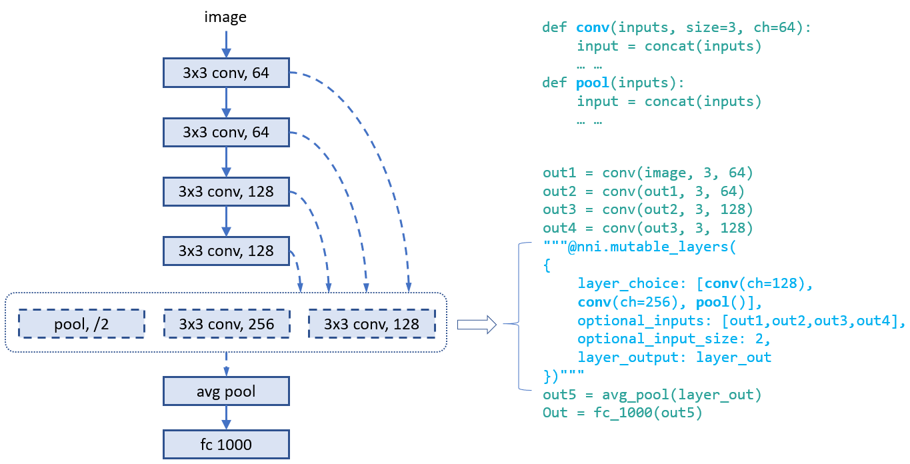

# 神经网络架构搜索的通用编程接口

自动神经架构搜索在寻找更好的模型方面发挥着越来越重要的作用。 最近的研究工作证明了自动NAS的可行性，并且还发现了一些可以击败手动设计和调整模型的模型。 一些代表作品是[ NASNet ](https://arxiv.org/abs/1707.07012) ，[ ENAS ](https://arxiv.org/abs/1802.03268) ，[ DARTS ](https://arxiv.org/abs/1806.09055) ，[Network Morphism](https://arxiv.org/abs/1806.10282) ，和[Evolution](https://arxiv.org/abs/1703.01041)等 。 新的创新不断涌现。 然而，实现这些算法需要付出很大的努力，并且很难重用一种算法的代码库来实现另一种算法。

为了促进NAS创新（例如，设计/实施新的NAS模型，并排比较不同的NAS模型），易于使用且灵活的编程接口至关重要。

## 编程接口

在两种情况下经常需要使用用于设计和搜索模型的新编程接口。 1）在设计神经网络时，设计者可能对层，子模型或连接有多种选择，并且不确定哪一个或组合表现最佳。 如果能有一种简单的方法来表达他们想要尝试的候选层/子模型，将是很有吸引力的。 2）对于正在研究自动NAS的研究人员，他们希望有一种统一的方式来表达神经架构的搜索空间。 并使不变的试验代码适应不同的搜索算法。

我们基于[ NNI注释](./AnnotationSpec.md)设计了一个简单灵活的编程接口 。 通过以下示例详细说明。

###示例：为图层选择运算符

在设计以下模型时，第四层中可能有多个运算符选项可能使该模型表现良好。 在此模型的脚本中, 我们可以对第四层使用注释, 如图所示。 在此注释中，总共有五个字段：


* ** layer_choice ** ：它是一个函数调用列表，每个函数都应该在用户脚本或导入的库中定义。 函数的输入参数应遵循以下格式：` def XXX（输入，arg2，arg3，...） ` ，其中`输入`是一个包含两个元素的列表。 一个是` fixed_inputs的列表` ，另一个是来自` optional_inputs的所选输入的列表` 。 图中的` conv `和`pool`函数定义的示例。 对于此列表中的函数调用，无需编写第一个参数（即`input` ）。 Note that only one of the function calls are chosen for this layer.
* **fixed_inputs**: It is a list of variables, the variable could be an output tensor from a previous layer. The variable could be `layer_output` of another nni.mutable_layer before this layer, or other python variables before this layer. All the variables in this list will be fed into the chosen function in `layer_choice` (as the first element of the `input` list).
* **optional_inputs**: It is a list of variables, the variable could be an output tensor from a previous layer. The variable could be `layer_output` of another nni.mutable_layer before this layer, or other python variables before this layer. Only `input_num` variables will be fed into the chosen function in `layer_choice` (as the second element of the `input` list).
* **optional_input_size**: It indicates how many inputs are chosen from `input_candidates`. It could be a number or a range. A range [1,3] means it chooses 1, 2, or 3 inputs.
* **layer_output**: The name of the output(s) of this layer, in this case it represents the return of the function call in `layer_choice`. This will be a variable name that can be used in the following python code or nni.mutable_layer(s).

There are two ways to write annotation for this example. For the upper one, `input` of the function calls is `[[],[out3]]`. For the bottom one, `input` is `[[out3],[]]`.

### Example: choose input connections for a layer

Designing connections of layers is critical for making a high performance model. With our provided interface, users could annotate which connections a layer takes (as inputs). They could choose several ones from a set of connections. Below is an example which chooses two inputs from three candidate inputs for `concat`. Here `concat` always takes the output of its previous layer using `fixed_inputs`.


### Example: choose both operators and connections

In this example, we choose one from the three operators and choose two connections for it. As there are multiple variables in `inputs`, we call `concat` at the beginning of the functions.



### Example: [ENAS](https://arxiv.org/abs/1802.03268) macro search space

To illustrate the convenience of the programming interface, we use the interface to implement the trial code of "ENAS + macro search space". The left figure is the macro search space in ENAS paper.


## Unified NAS search space specification

After finishing the trial code through the annotation above, users have implicitly specified the search space of neural architectures in the code. Based on the code, NNI will automatcailly generate a search space file which could be fed into tuning algorithms. This search space file follows the following `json` format.

```json
{
    "mutable_1": {
        "layer_1": {
            "layer_choice": ["conv(ch=128)", "pool", "identity"],
            "optional_inputs": ["out1", "out2", "out3"],
            "optional_input_size": 2
        },
        "layer_2": {
            ...
        }
    }
}
```

Accordingly, a specified neural architecture (generated by tuning algorithm) is expressed as follows:

```json
{
    "mutable_1": {
        "layer_1": {
            "chosen_layer": "pool",
            "chosen_inputs": ["out1", "out3"]
        },
        "layer_2": {
            ...
        }
    }
}
```

With the specification of the format of search space and architecture (choice) expression, users are free to implement various (general) tuning algorithms for neural architecture search on NNI. One future work is to provide a general NAS algorihtm.

=============================================================

## Neural architecture search on NNI

### Basic flow of experiment execution

NNI's annotation compiler transforms the annotated trial code to the code that could receive architecture choice and build the corresponding model (i.e., graph). The NAS search space can be seen as a full graph (here, full graph means enabling all the provided operators and connections to build a graph), the architecture chosen by the tuning algorithm is a subgraph in it. By default, the compiled trial code only builds and executes the subgraph.


The above figure shows how the trial code runs on NNI. `nnictl` processes user trial code to generate a search space file and compiled trial code. The former is fed to tuner, and the latter is used to run trilas.

[**TODO**] Simple example of NAS on NNI.

### Weight sharing

Sharing weights among chosen architectures (i.e., trials) could speedup model search. For example, properly inheriting weights of completed trials could speedup the converge of new trials. One-Shot NAS (e.g., ENAS, Darts) is more aggressive, the training of different architectures (i.e., subgraphs) shares the same copy of the weights in full graph.


We believe weight sharing (transferring) plays a key role on speeding up NAS, while finding efficient ways of sharing weights is still a hot research topic. We provide a key-value store for users to store and load weights. Tuners and Trials use a provided KV client lib to access the storage.

[**TODO**] Example of weight sharing on NNI.

### Support of One-Shot NAS

One-Shot NAS is a popular approach to find good neural architecture within a limited time and resource budget. Basically, it builds a full graph based on the search space, and uses gradient descent to at last find the best subgraph. There are different training approaches, such as [training subgraphs (per mini-batch)](https://arxiv.org/abs/1802.03268), [training full graph through dropout](http://proceedings.mlr.press/v80/bender18a/bender18a.pdf), [training with architecture weights (regularization)](https://arxiv.org/abs/1806.09055). Here we focus on the first approach, i.e., training subgraphs (ENAS).

With the same annotated trial code, users could choose One-Shot NAS as execution mode on NNI. Specifically, the compiled trial code builds the full graph (rather than subgraph demonstrated above), it receives a chosen architecture and training this architecture on the full graph for a mini-batch, then request another chosen architecture. It is supported by [NNI multi-phase](./multiPhase.md). We support this training approach because training a subgraph is very fast, building the graph every time training a subgraph induces too much overhead.


The design of One-Shot NAS on NNI is shown in the above figure. One-Shot NAS usually only has one trial job with full graph. NNI supports running multiple such trial jobs each of which runs independently. As One-Shot NAS is not stable, running multiple instances helps find better model. Moreover, trial jobs are also able to synchronize weights during running (i.e., there is only one copy of weights, like asynchroneous parameter-server mode). This may speedup converge.

[**TODO**] Example of One-Shot NAS on NNI.

## General tuning algorithms for NAS

Like hyperparameter tuning, a relatively general algorithm for NAS is required. The general programming interface makes this task easier to some extent. We have a RL-based tuner algorithm for NAS from our contributors. We expect efforts from community to design and implement better NAS algorithms.

[**TODO**] More tuning algorithms for NAS.

## Export best neural architecture and code

[**TODO**] After the NNI experiment is done, users could run `nnictl experiment export --code` to export the trial code with the best neural architecture.

## Conclusion and Future work

There could be different NAS algorithms and execution modes, but they could be supported with the same programming interface as demonstrated above.

There are many interesting research topics in this area, both system and machine learning.