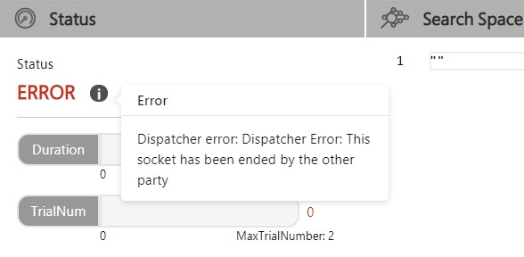

# **在 NNI 中调试代码**

## 概述

NNI 中的日志分为三部分。 包括 NNI Manager， Dispatcher 以及 Trial。 这里会简单介绍这些组件。 更多信息可参考[概述](Overview.md)。

- **NNI Controller**：NNI Controller (nnictl) 是命令行工具，用来管理 Experiments（如：启动 Experiment）。
- **NNI Manager**：这是 NNI 的核心。当 Experiment 出现严重错误时，从它的日志中才能找到原因。（例如，Web 界面无法打开，或者训练服务失败）
- **Dispatcher**: Dispatcher 调用 **Tuner** 和 **Assessor** 的方法。 它的日志与 Tuner 和 Assessor 代码有关。 
    - **Tuner**: Tuner 是一个自动机器学习算法，会为下一个 Trial 生成新的配置。 新的 Trial 会使用这组配置来运行。
    - **Assessor**：Assessor 分析 Trial 的中间结果（例如，测试数据集上定期的精度），来确定 Trial 是否应该被提前终止。
- **Trial**：Trial 的代码是用户编写的代码，每次 Trial 运行时会尝试一组新的配置（例如，一组新的超参值，或者某个神经网络结构）。

## Where is the log

There are three kinds of log in NNI. When creating a new experiment, you can specify log level as debug by adding `--debug`. Besides, you can set more detailed log level in your configuration file by using `logLevel` keyword. Available logLevels are: `trace`, `debug`, `info`, `warning`, `error`, `fatal`.

### NNI controller

All possible errors that happen when launching an NNI experiment can be found here.

You can use `nnictl log stderr` to find error information. For more options please refer to [NNICTL](NNICTLDOC.md)

### Experiment Root Directory

Every experiment has a root folder, which is shown on the right-top corner of webUI. Or you could assemble it by replacing the `experiment_id` with your actual experiment_id in path `~/nni/experiment/experiment_id/` in case of webUI failure. `experiment_id` could be seen when you run `nnictl create ...` to create a new experiment.

> For flexibility, we also offer a `logDir` option in your configuration, which specifies the directory to store all experiments (defaults to `~/nni/experiment`). Please refer to [Configuration](ExperimentConfig.md) for more details.

Under that directory, there is another directory named `log`, where `nnimanager.log` and `dispatcher.log` are placed.

### Trial Root Directory

Usually in webUI, you can click `+` in the left of every trial to expand it to see each trial's log path.

Besides, there is another directory under experiment root directory, named `trials`, which stores all the trials. Every trial has a unique id as its directory name. In this directory, a file named `stderr` records trial error and another named `trial.log` records this trial's log.

## Different kinds of errors

There are different kinds of errors. However, they can be divided into three categories based on their severity. So when nni fails, check each part sequentially.

Generally, if webUI is started successfully, there is a `Status` in the `Overview` tab, serving as a possible indicator of what kind of error happens. Otherwise you should check manually.

### **NNI** Fails

This is the most serious error. When this happens, the whole experiment fails and no trial will be run. Usually this might be related to some installation problem.

When this happens, you should check `nnictl`'s error output file `stderr` (i.e., nnictl log stderr) and then the `nnimanager`'s log to find if there is any error.

### **Dispatcher** Fails

Dispatcher fails. Usually, for some new users of NNI, it means that tuner fails. You could check dispatcher's log to see what happens to your dispatcher. For built-in tuner, some common errors might be invalid search space (unsupported type of search space or inconsistence between initializing args in configuration file and actual tuner's *\_init*\_ function args).

Take the later situation as an example. If you write a customized tuner who's *\_init*\_ function has an argument called `optimize_mode`, which you do not provide in your configuration file, NNI will fail to run your tuner so the experiment fails. You can see errors in the webUI like:

Here we can see it is a dispatcher error. So we can check dispatcher's log, which might look like:

    [2019-02-19 19:36:45] DEBUG (nni.main/MainThread) START
    [2019-02-19 19:36:47] ERROR (nni.main/MainThread) __init__() missing 1 required positional arguments: 'optimize_mode'
    Traceback (most recent call last):
      File "/usr/lib/python3.7/site-packages/nni/__main__.py", line 202, in <module>
        main()
      File "/usr/lib/python3.7/site-packages/nni/__main__.py", line 164, in main
        args.tuner_args)
      File "/usr/lib/python3.7/site-packages/nni/__main__.py", line 81, in create_customized_class_instance
        instance = class_constructor(**class_args)
    TypeError: __init__() missing 1 required positional arguments: 'optimize_mode'.
    

### **Trial** Fails

In this situation, NNI can still run and create new trials.

It means your trial code (which is run by NNI) fails. This kind of error is strongly related to your trial code. Please check trial's log to fix any possible errors shown there.

A common example of this would be run the mnist example without installing tensorflow. Surely there is an Import Error (that is, not installing tensorflow but trying to import it in your trial code) and thus every trial fails.

As it shows, every trial has a log path, where you can find trial'log and stderr.