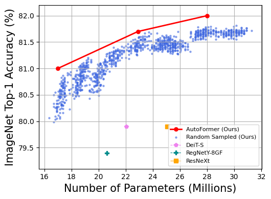

AutoFormer: Searching Transformers for Visual Recognition
===========================

* `论文 <https://openaccess.thecvf.com/content/ICCV2021/papers/Chen_AutoFormer_Searching_Transformers_for_Visual_Recognition_ICCV_2021_paper.pdf>`__
* `模型-Github <https://github.com/silent-chen/AutoFormer-model-zoo/releases>`__
* `模型-Google Drive <https://drive.google.com/drive/folders/1HqzY3afqQUMI6pJ5_BgR2RquJU_b_3eg?usp=sharing>`__
* `引用 <https://scholar.googleusercontent.com/scholar.bib?q=info:uVE0aYZPbq4J:scholar.google.com/&output=citation&scisdr=CgUmooSCEO-o3SJbHUM:AAGBfm0AAAAAYa9dBUM_GY4F66gh9gncq3kh97AsBRzG&scisig=AAGBfm0AAAAAYa9dBfdIZekUI938zpgyRfsTag4Nis25&scisf=4&ct=citation&cd=-1&hl=zh-CN>`__

介绍
------------
Autoformer 是全新的面向视觉transformer的单阶段网络结构搜索方法。在超网训练阶段，它搭配了权重纠缠技术，使得同一层不同模块的权重互相纠缠。
得益于这一技术，我们可以一次性得到成千上万训练良好的transformer网络。特别的，这些从超网中继承权重的网络和从零训练的网络性能相似。

.. image:: https://github.com/microsoft/AutoML/releases/download/static_files/autoformer_overview.gif
    :scale: 45 %
.. image:: https://github.com/microsoft/AutoML/releases/download/static_files/autoformer_details.gif
    :scale: 45 %

复现结果
------------------
本项目可以复现出官方论文中汇报的在ImageNet验证集上的Top-1准确率。为了方便使用，我们提供了训练好的模型，分别在 
`Google Drive <https://drive.google.com/drive/folders/1HqzY3afqQUMI6pJ5_BgR2RquJU_b_3eg?usp=sharing>`__
和 `GitHub <https://github.com/silent-chen/AutoFormer-model-zoo>`__。总结如下：

.. list-table::
   :header-rows: 1
   :widths: auto

   * - Model
     - Params.
     - Top-1 Acc. %
     - Top-5 Acc. %
     - Download link
   * - AutoFormer-T
     - 5.8M
     - 75.3
     - 92.7 
     - `Google Drive <https://drive.google.com/file/d/1uRCW3doQHgn2H-LjyalYEZ4CvmnQtr6Q/view?usp=sharing>`__, `GitHub <https://github.com/silent-chen/AutoFormer-model-zoo/releases/download/v1.0/supernet-tiny.pth>`__
   * - AutoFormer-S
     - 22.9M
     - 81.7
     - 95.7
     - `Google Drive <https://drive.google.com/file/d/1JTBmLR_nW7-ZbTKafWFvSl8J2orJXiNa/view?usp=sharing>`__, `GitHub <https://github.com/silent-chen/AutoFormer-model-zoo/releases/download/v1.0/supernet-small.pth>`__
   * - AutoFormer-B
     - 53.7M
     - 82.4
     - 95.7
     - `Google Drive <https://drive.google.com/file/d/1KPjUshk0SbqkaTzlirjPHM9pu19N5w0e/view?usp=sharing>`__, `GitHub <https://github.com/silent-chen/AutoFormer-model-zoo/releases/download/v1.0/supernet-base.pth>`__

示例
--------

`示例代码 <https://github.com/microsoft/nni/tree/master/examples/nas/oneshot/autoformer>`__

请在该文件夹下运行下面的代码。

数据准备
----------------
首先，您需要下载 `ImageNet-2012 <http://www.image-net.org/>`__ 到文件夹 ``./data/imagenet`` 并且将验证集部分移动到子文件夹 ``./data/imagenet/val``.
您可以使用 `该脚本 <https://raw.githubusercontent.com/soumith/imagenetloader.torch/master/valprep.sh>`__ 来移动验证集数据。

标准的目录结构应如下所示

.. code-block:: bash

    /path/to/imagenet/
        train/
            class1/
                img1.jpeg
            class2/
                img2.jpeg
        val/
            class1/
                img3.jpeg
            class/2
                img4.jpeg

快速开始
-----------
我们提供了超网的训练、子网络搜索和验证的代码。

0. 环境准备
^^^^^^^^^

首先，为autoformer安装所需的运行环境。

.. code-block:: bash

   pip install -r ./requirements

1. 超网训练
^^^^^^^^^

为了训练超网，我们提供了不同模型规模（T，S和B）的配置文件，在目录 ``/experiments/supernet/`` 中。
举例说明，为了训练超网-B，您可以运行下面的脚本。其中，默认的输出地址为 ``./``，
您可以通过参数 ``--output_dir`` 来自定义输出地址。

.. code-block:: bash

    python -m torch.distributed.launch --nproc_per_node=8 --use_env supernet_train.py --data-path /PATH/TO/IMAGENT --gp \
    --change_qk --relative_position --mode super --dist-eval --cfg ./experiments/supernet/supernet-B.yaml --epochs 500 --warmup-epochs 20 \
    --output_dir /OUTPUT_PATH --batch-size 128

2. 搜索
^^^^^^^^^
我们使用进化算法来搜索最优结构。我们使用ImageNet训练集的子集作为验证集，寻找最优结构，并在ImageNet的官方验证集上测试汇报性能。
为了生成ImangeNet的子集，您可以运行如下脚本。生成的子集会被保存在 ``/PATH/TO/IMAGENET``。

.. code-block:: bash
    
    python ./lib/subImageNet.py --data-path /PATH/TO/IMAGENT

在得到ImageNet的子集并且完成超网的训练后，我们可以用如下命令启动进化搜索算法。
请根据您的需求使用 ``--min-param-limits`` 和 ``--param-limits`` 修改参数限制。

.. code-block:: bash

    python -m torch.distributed.launch --nproc_per_node=8 --use_env evolution.py --data-path /PATH/TO/IMAGENT --gp \
    --change_qk --relative_position --dist-eval --cfg ./experiments/supernet/supernet-B.yaml --resume /PATH/TO/CHECKPOINT \
    --min-param-limits YOUR/CONFIG --param-limits YOUR/CONFIG --data-set EVO_IMNET

3. 测试
^^^^^^^^^

为了测试训练好的模型，您需要将模型放在 ``/PATH/TO/CHECKPOINT`` 目录下。然后，您可以通过运行如下命令来测试模型性能。此处，我们使用 Autoformer-B 作为例子。

.. code-block:: bash

    python -m torch.distributed.launch --nproc_per_node=8 --use_env supernet_train.py --data-path /PATH/TO/IMAGENT --gp \
    --change_qk --relative_position --mode retrain --dist-eval --cfg ./experiments/subnet/AutoFormer-B.yaml --resume /PATH/TO/CHECKPOINT --eval 

性能
------------
左图: ImageNet上的Top-1准确率。我们的方法实现了极具竞争力的性能，超越了DeiT和ViT。
右图：从Supernet-S中随机采样的1000个子网络。我们的训练方法可以使子网络得到良好的训练。

.. image:: ../../img/autoformer_performance.png
    :scale: 50%
