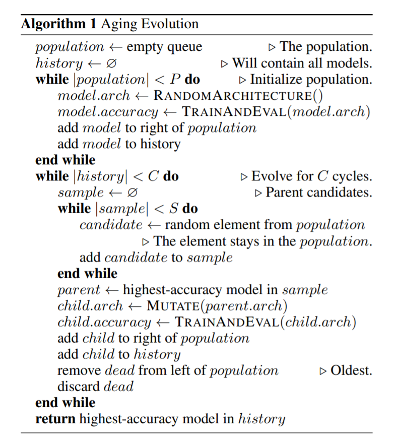

.. role:: raw-html(raw)
   :format: html

经典 NAS 算法
======================

在经典 NAS 算法中，每个结构都作为 Trial 来训练，而 NAS 算法来充当 Tuner。 因此，训练过程能使用 NNI 中的超参调优框架，Tuner 为下一个 Trial 生成新的结构，Trial 在训练平台中运行。

快速入门
-----------

下例展示了如何使用经典 NAS 算法。 与 NNI 超参优化非常相似。

.. code-block:: python

   model = Net()

   # get the chosen architecture from tuner and apply it on model
   get_and_apply_next_architecture(model)
   train(model)  # your code for training the model
   acc = test(model)  # test the trained model
   nni.report_final_result(acc)  # report the performance of the chosen architecture

首先，实例化模型。 模型中，搜索空间通过 ``LayerChoice`` 和 ``InputChoice`` 来定义。 然后，调用 ``get_and_apply_next_architecture(model)`` 来获得特定的结构。 此函数会从 Tuner （即，经典的 NAS 算法）中接收结构，并应用到 ``model`` 上。 此时，``model`` 成为了某个结构，不再是搜索空间。 然后可以像普通 PyTorch 模型一样训练此模型。 获得模型精度后，调用 ``nni.report_final_result(acc)`` 来返回给 Tuner。

至此，Trial 代码已准备好了。 然后，准备好 NNI 的 Experiment，即搜索空间文件和 Experiment 配置文件。 与 NNI 超参优化不同的是，要通过运行命令（详情参考 `这里 <../Tutorial/Nnictl.rst>`_) 从 Trial 代码中自动生成搜索空间文件。

``nnictl ss_gen --trial_command="运行 Trial 代码的命令"``

此命令会自动生成 ``nni_auto_gen_search_space.json`` 文件。 然后，将生成的搜索空间文件路径填入 Experiment 配置文件的 ``searchSpacePath`` 字段。 配置文件中的其它字段，可参考 `此教程 <../Tutorial/QuickStart.md>`_。

现在我们只支持经典NAS算法中的 :githublink:`PPO Tuner <examples/tuners/random_nas_tuner>` 。 未来将支持更多经典 NAS 算法。

完整的示例可以参考 :githublink:`PyTorch <examples/nas/classic_nas>` 和 :githublink:`TensorFlow <examples/nas/classic_nas-tf>`。

用于调试的独立模式
----------------------------------

为了便于调试，其支持独立运行模式，可直接运行 Trial 命令，而不启动 NNI Experiment。 可以通过此方法来检查 Trial 代码是否可正常运行。 在独立模式下，``LayerChoice`` 和 ``InputChoice`` 会选择最开始的候选项。

:raw-html:``

Regularized Evolution Tuner
---------------------------

这是一个用于 NNI 神经网络架构搜索（NAS）接口的 Tuner。 它使用了 `evolution 算法 <https://arxiv.org/pdf/1802.01548.pdf>`_。

Tuner 首先随机初始化 ``population`` 模型的数量并进行评估。 之后，每次生成新架构时，Tuner 都会从 ``population`` 中随机选择一定数量的 ``sample`` 架构，然后将父模型 ``sample`` 中的最佳模型 mutates 为 产生子模型。 突变包括隐藏突变和op突变。 隐藏状态突变包括在单元格内形成循环的约束下，用 cell 的另一个隐藏状态替换隐藏状态。 op 变异的行为就像隐藏状态变异一样，只是将一个 op 替换为 op 集中的另一个 op。 请注意，不允许将子模型与其父模型保持相同。 评估子模型后，将其添加到 ``population`` 的尾部，然后弹出前一个。

请注意，**试验并发应小于模型的数量** \，否则将引发 NO_MORE_TRIAL 异常。

下面的伪代码总结了整个过程。

