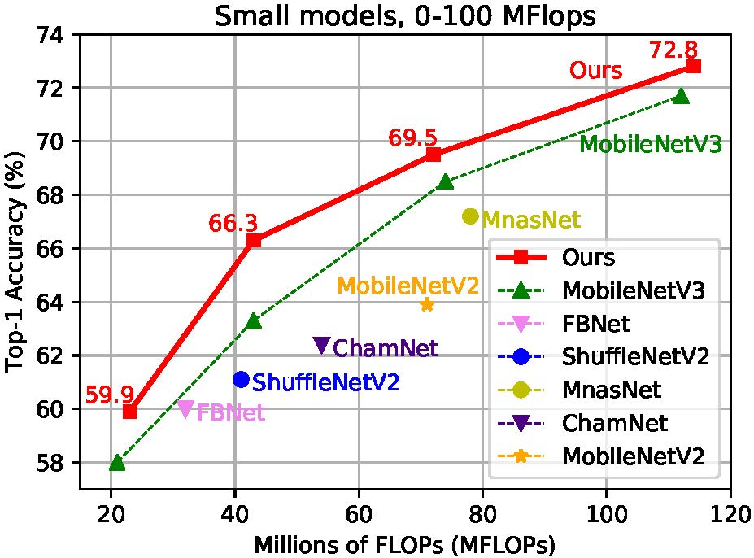
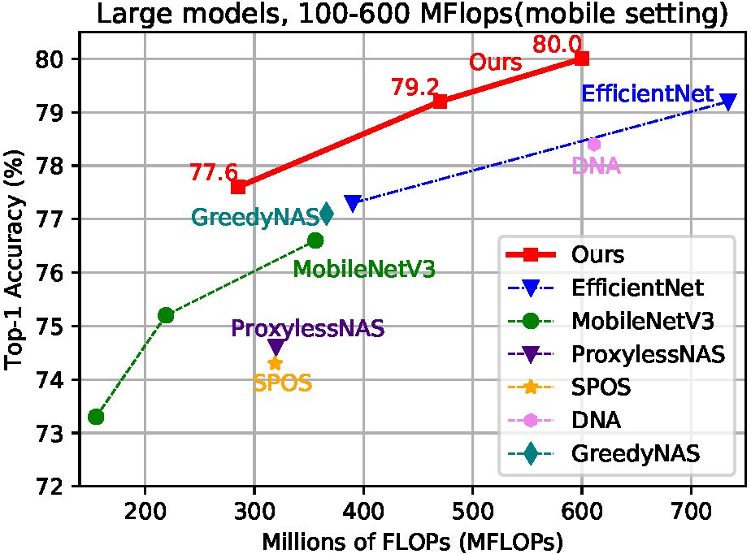

.. role:: raw-html(raw)
   :format: html

百里挑一：一站式神经体系结构搜索的优先路径提取
=======================================================================================

`[Paper] <https://papers.nips.cc/paper/2020/file/d072677d210ac4c03ba046120f0802ec-Paper.pdf>`__ `[Models-Google Drive] <https://drive.google.com/drive/folders/1NLGAbBF9bA1IUAxKlk2VjgRXhr6RHvRW?usp=sharing>`__ `[Models-Baidu Disk (PWD: wqw6)] <https://pan.baidu.com/s/1TqQNm2s14oEdyNPimw3T9g>`__ `[BibTex] <https://scholar.googleusercontent.com/scholar.bib?q=info:ICWVXc_SsKAJ:scholar.google.com/&output=citation&scisdr=CgUmooXfEMfTi0cV5aU:AAGBfm0AAAAAX7sQ_aXoamdKRaBI12tAVN8REq1VKNwM&scisig=AAGBfm0AAAAAX7sQ_RdYtp6BSro3zgbXVJU2MCgsG730&scisf=4&ct=citation&cd=-1&hl=ja>`__   :raw-html:` `

在这项工作中，我们提出了一种简单有效的体系结构提炼方法。 中心思想是子网可以在整个训练过程中进行协作学习并相互教，目的是促进各个模型的融合。 我们介绍了优先路径的概念，它是指在训练过程中表现出卓越性能的体系结构候选人。 从优先路径中提取知识可以促进子网的训练。 由于优先路径会根据其性能和复杂性而动态变化，因此最终获得的路径就是百里挑一。 与最近的架构 `MobileNetV3 <https://arxiv.org/abs/1905.02244>`__ 和 `EfficientNet <https://arxiv.org/abs/1905.11946>`__  系列在对齐设置下相比，发现的体系结构具有更高的性能。

.. image:: https://raw.githubusercontent.com/microsoft/Cream/main/demo/intro.jpg

重现结果
------------------

ImageNet 的 top-1 准确性。 Cream 搜索算法的 top-1 准确性超过 ImageNet 上的 MobileNetV3 和 EfficientNet-B0 / B1。
如下所示，使用 16 Gpus 的训练比使用 8 Gpus 的训练略胜一筹。

.. list-table::
   :header-rows: 1
   :widths: auto

   * - Model (M Flops)
     - 8Gpus
     - 16Gpus
   * - 14M
     - 53.7
     - 53.8
   * - 43M
     - 65.8
     - 66.5
   * - 114M
     - 72.1
     - 72.8
   * - 287M
     - 76.7
     - 77.6
   * - 481M
     - 78.9
     - 79.2
   * - 604M
     - 79.4
     - 80.0

示例
--------

`示例代码 <https://github.com/microsoft/nni/tree/master/examples/nas/cream>`__

请在示例目录下运行下面的脚本。

准备数据
----------------

首先你需要下载 `ImageNet-2012 <http://www.image-net.org/>`__ 到目录 ``./data/imagenet`` 里，然后把验证集移动到子文件夹 ``./data/imagenet/val`` 。 你可以用下面这个命令来移动验证集：https://raw.githubusercontent.com/soumith/imagenetloader.torch/master/valprep.sh 

把 imagenet 数据放在 ``./data`` 里， 如下：

.. code-block:: bash

   ./data/imagenet/train
   ./data/imagenet/val
   ...

快速入门
-----------

I. 搜索
^^^^^^^^^

首先构建搜索环境。

.. code-block:: bash

   pip install -r ./requirements

   git clone https://github.com/NVIDIA/apex.git
   cd apex
   python setup.py install --cpp_ext --cuda_ext

搜索架构需要配置参数 ``FLOPS_MINIMUM`` 和 ``FLOPS_MAXIMU`` 以指定所需的模型触发器，例如 [0,600] MB flops。 可以通过修改以下两个参数来指定触发器间隔 ``./configs/train.yaml`` 。

.. code-block:: bash

   FLOPS_MINIMUM: 0 # Minimum Flops of Architecture
   FLOPS_MAXIMUM: 600 # Maximum Flops of Architecture

例如，如果希望搜索模型 <= 200M 的架构，请将 ``FLOPS_MINIMU`` 和 ``FLOPS_MAXIMU`` 分别设置为 ``0`` 和 ``200`` 。

在指定要搜索的体系结构之后，可以通过运行以下命令立即搜索体系结构：

.. code-block:: bash

   python -m torch.distributed.launch --nproc_per_node=8 ./train.py --cfg ./configs/train.yaml

搜索的体系结构需要重新训练并获得最终模型。 最终模型以 ``.pth.tar`` 格式保存。 训练代码不久就会发布。

II. 重新训练
^^^^^^^^^^^^^^^^^^

为了训练搜索的架构，需要配置 ``MODEL_SELECTION`` 参数来指定模型触发器。 在 ``./configs/retrain.yaml`` 文件里加上 ``MODEL_SELECTION`` 可以声明训练模型。 您可以从 [14,43,112,287,481,604] 中选择一个，代表不同的 Flops(MB)。

.. code-block:: bash

   MODEL_SELECTION: 43 # Retrain 43m model
   MODEL_SELECTION: 481 # Retrain 481m model
   ......

为了训练随机架构，需要设置 ``MODEL_SELECTION`` 为 ``-1`` ，并且设置参数 ``INPUT_ARCH``：

.. code-block:: bash

   MODEL_SELECTION: -1 # Train random architectures
   INPUT_ARCH: [[0], [3], [3, 3], [3, 1, 3], [3, 3, 3, 3], [3, 3, 3], [0]] # Random Architectures
   ......

在 ``./configs/retrain.yaml`` 文件里添加 ``MODEL_SELECTION`` 之后，可以使用下面的命令来训练模型。

.. code-block:: bash

   python -m torch.distributed.launch --nproc_per_node=8 ./retrain.py --cfg ./configs/retrain.yaml

III. 测试
^^^^^^^^^

要测试我们训练的模型，需要使用 ``./configs/test.yaml`` 中的 ``MODEL_SELECTION`` 来指定要测试的模型。

.. code-block:: bash

   MODEL_SELECTION: 43 # test 43m model
   MODEL_SELECTION: 481 # test 470m model
   ......

在指定了模型的触发器之后，需要在 ``./ test.sh`` 中写入恢复模型的路径：

.. code-block:: bash

   RESUME_PATH: './43.pth.tar'
   RESUME_PATH: './481.pth.tar'
   ......

我们在 `google drive <https://drive.google.com/drive/folders/1CQjyBryZ4F20Rutj7coF8HWFcedApUn2>`__ 和 `[Models-Baidu Disk (password: wqw6)] <https://pan.baidu.com/s/1TqQNm2s14oEdyNPimw3T9g>`__ 提供了 14M/43M/114M/287M/481M/604M 预训练模型。

下载完预训练模型并且在 ``./configs/test.yaml`` 文件中添加了 ``MODEL_SELECTION`` 和 ``RESUME_PATH`` 之后，可以使用下面的命令来测试模型。

.. code-block:: bash

   python -m torch.distributed.launch --nproc_per_node=8 ./test.py --cfg ./configs/test.yaml
