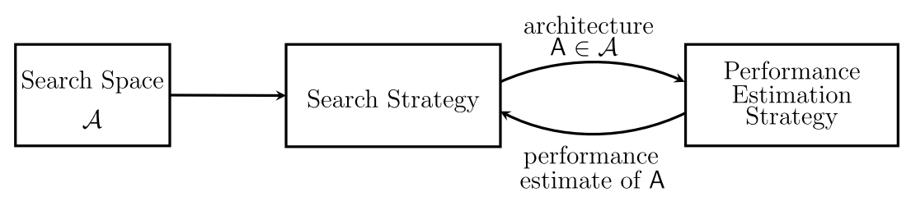

# 指南：在 NNI 上使用 NAS

```eval_rst
.. contents::

.. Note:: 此 API 初始试验阶段。 当前接口可能会更改。
```



现代神经架构搜索（NAS）方法通常包含 [三个维度](https://arxiv.org/abs/1808.05377)：搜索空间、搜索策略和性能估计策略。 搜索空间通常是要搜索的一个有限的神经网络架构，而搜索策略会采样来自搜索空间的架构，评估性能，并不断演进。 理想情况下，搜索策略会找到搜索空间中最好的架构，并返回给用户。 在获得了 "最好架构" 后，很多方法都会有 "重新训练" 的步骤，会像普通神经网络模型一样训练。

## 实现搜索空间

假设已经有了基础的模型，该如何使用 NAS 来提升？ 以 [PyTorch 上的 MNIST](https://github.com/pytorch/examples/blob/master/mnist/main.py) 为例，代码如下：

```python
from nni.nas.pytorch import mutables

class Net(nn.Module):
    def __init__(self):
        super(Net, self).__init__()
        self.conv1 = mutables.LayerChoice([
            nn.Conv2d(1, 32, 3, 1),
            nn.Conv2d(1, 32, 5, 3)
        ])  # try 3x3 kernel and 5x5 kernel
        self.conv2 = nn.Conv2d(32, 64, 3, 1)
        self.dropout1 = nn.Dropout2d(0.25)
        self.dropout2 = nn.Dropout2d(0.5)
        self.fc1 = nn.Linear(9216, 128)
        self.fc2 = nn.Linear(128, 10)

    def forward(self, x):
        x = self.conv1(x)
        x = F.relu(x)
        # ... 与原始的一样 ...
        返回输出
```

以上示例在 conv1 上添加了 conv5x5 的选项。 修改非常简单，只需要声明 `LayerChoice` 并将原始的 conv3x3 和新的 conv5x5 作为参数即可。 就这么简单！ 不需要修改 forward 函数。 可将 conv1 想象为没有 NAS 的模型。

如何表示可能的连接？ 通过 `InputChoice` 来实现。 要在 MNIST 示例上使用跳过连接，需要增加另一层 conv3。 下面的示例中，从 conv2 的可能连接加入到了 conv3 的输出中。

```python
from nni.nas.pytorch import mutables

class Net(nn.Module):
    def __init__(self):
        # ... 相同 ...
        self.conv2 = nn.Conv2d(32, 64, 3, 1)
        self.conv3 = nn.Conv2d(64, 64, 1, 1)
        # 声明搜索策略，来选择最多一个选项
        self.skipcon = mutables.InputChoice(n_candidates=1)
        # ... 相同 ...

    def forward(self, x):
        x = self.conv1(x)
        x = F.relu(x)
        x = self.conv2(x)
        x0 = self.skipcon([x])  # 从 [x] 中选择 0 或 1 个
        x = self.conv3(x)
        if x0 is not None:  # 允许跳过连接
            x += x0
        x = F.max_pool2d(x, 2)
        # ... 相同 ...
        返回输出
```

Input Choice 可被视为可调用的模块，它接收张量数组，输出其中部分的连接、求和、平均（默认为求和），或没有选择时输出 `None`。 与 Layer Choice 一样，Input Choice 要**在 `__init__` 中初始化，并在 `forward` 中调用。 稍后的例子中会看到搜索算法如何识别这些 Choice，并进行相应的准备。</p>

`LayerChoice` 和 `InputChoice` 都是 **Mutable**。 Mutable 表示 "可变化的"。 与传统深度学习层、模型都是固定的不同，使用 Mutable 的模块，是一组可能选择的模型。

用户可为每个 Mutable 指定 **key**。 默认情况下，NNI 会分配全局唯一的，但如果需要共享 Choice（例如，两个 `LayerChoice` 有同样的候选操作，希望共享同样的 Choice。即，如果一个选择了第 i 个操作，第二个也要选择第 i 个操作），那么就应该给它们相同的 key。 key 标记了此 Choice，并会在存储的检查点中使用。 如果要增加导出架构的可读性，可为每个 Mutable 的 key 指派名称。 高级用法参考 [Mutable](./NasReference.md)。

## 使用搜索算法

除了使用搜索空间外，还可以通过其他两种方式进行搜索。 一种是分布式运行 NAS，可从头枚举运行所有架构。或者利用更多高级功能，如 [SMASH](https://arxiv.org/abs/1708.05344), [ENAS](https://arxiv.org/abs/1802.03268), [DARTS](https://arxiv.org/abs/1808.05377), [FBNet](https://arxiv.org/abs/1812.03443), [ProxylessNAS](https://arxiv.org/abs/1812.00332), [SPOS](https://arxiv.org/abs/1904.00420), [Single-Path NAS](https://arxiv.org/abs/1904.02877),  [Understanding One-shot](http://proceedings.mlr.press/v80/bender18a) 以及 [GDAS](https://arxiv.org/abs/1910.04465)。 由于很多不同架构搜索起来成本较高，另一类方法，即 One-Shot NAS，在搜索空间中，构建包含有所有候选网络的超网络，每一步中选择一个或几个子网络来训练。

当前，NNI 支持数种 One-Shot 方法。 例如，`DartsTrainer` 使用 SGD 来交替训练架构和模型权重，`ENASTrainer` [使用 Controller 来训练模型](https://arxiv.org/abs/1802.03268)。 新的、更高效的 NAS Trainer 在研究界不断的涌现出来，NNI 会在将来的版本中实现其中的一部分。

### One-Shot NAS

每个 One-Shot NAS 算法都实现了 Trainer，可在每种算法说明中找到详细信息。 这是如何使用 `EnasTrainer` 的简单示例。

```python
# 此处与普通模型训练相同
model = Net()
dataset_train = CIFAR10(root="./data", train=True, download=True, transform=train_transform)
dataset_valid = CIFAR10(root="./data", train=False, download=True, transform=valid_transform)
criterion = nn.CrossEntropyLoss()
optimizer = torch.optim.SGD(model.parameters(), 0.05, momentum=0.9, weight_decay=1.0E-4)

# 使用 NAS
def top1_accuracy(output, target):
    # ENAS 使用此函数来计算奖励
    batch_size = target.size(0)
    _, predicted = torch.max(output.data, 1)
    return (predicted == target).sum().item() / batch_size

def metrics_fn(output, target):
    # 指标函数接收输出和目标，并计算出指标 dict
    return {"acc1": reward_accuracy(output, target)}

from nni.nas.pytorch import enas
trainer = enas.EnasTrainer(model,
                           loss=criterion,
                           metrics=metrics_fn,
                           reward_function=top1_accuracy,
                           optimizer=optimizer,
                           batch_size=128
                           num_epochs=10,  # 10 epochs
                           dataset_train=dataset_train,
                           dataset_valid=dataset_valid,
                           log_frequency=10)  # 每 10 步打印
trainer.train()  # 训练
trainer.export(file="model_dir/final_architecture.json")  # 将最终架构导出到文件
```

用户可直接通过 `python3 train.py` 开始训练，不需要使用 `nnictl`。 训练完成后，可通过 `trainer.export()` 导出找到的最好的模型。

通常，Trainer 会提供一些可以自定义的参数。 如，损失函数，指标函数，优化器以及数据集。 这些功能可满足大部分需求，NNI 会尽力让内置 Trainer 能够处理更多的模型、任务和数据集。 但无法保证全面的支持。 例如，一些 Trainer 假设必须是分类任务；一些 Trainer 对 "Epoch" 的定义有所不同（例如，ENAS 的 epoch 表示一部分子步骤加上一些 Controller 的步骤）；大多数 Trainer 不支持分布式训练，不会将模型通过 `DataParallel` 或 `DistributedDataParallel` 进行包装。 如果通过试用，想要在定制的应用中使用 Trainer，可能需要[自定义 Trainer](./Advanced.md#extend-the-ability-of-one-shot-trainers)。

此外，可以使用 NAS 可视化来显示 One-Shot NAS。 [了解详情](./Visualization.md)。

### 分布式 NAS

神经网络架构搜索通过在 Trial 任务中独立运行单个子模型来实现。 NNI 同样支持这种搜索方法，其天然适用于 NNI 的超参搜索框架。Tuner 为每个 Trial 生成子模型，并在训练平台上运行。

要使用此模式，不需要修改 NNI NAS API 的搜索空间定义 (即, `LayerChoice`, `InputChoice`, `MutableScope`)。 模型初始化后，在模型上调用 `get_and_apply_next_architecture`。 One-shot NAS Trainer 不能在此模式中使用。 简单示例：

```python
model = Net()

# 从 Tuner 中获得选择的架构，并应用到模型上
get_and_apply_next_architecture(model)
train(model)  # 训练模型的代码
acc = test(model)  # 测试训练好的模型
nni.report_final_result(acc)  # 报告所选架构的性能
```

搜索空间应生成，并发送给 Tuner。 与 NNI NAS API 一样，搜索空间嵌入到了用户代码中。 用户可以使用 "[nnictl ss_gen](../Tutorial/Nnictl.md)" 以生成搜索空间文件。 然后，将生成的搜索空间文件路径填入 `config.yml` 的 `searchSpacePath`。 `config.yml` 中的其它字段参考[教程](../Tutorial/QuickStart.md)。

可使用 [NNI Tuner](../Tuner/BuiltinTuner.md) 来搜索。 目前，只有 PPO Tuner 支持 NAS 搜索空间。

为了便于调试，其支持独立运行模式，可直接运行 Trial 命令，而不启动 NNI Experiment。 可以通过此方法来检查 Trial 代码是否可正常运行。 在独立模式下，`LayerChoice` 和 `InputChoice` 会选择最开始的候选项。

[此处](https://github.com/microsoft/nni/tree/master/examples/nas/classic_nas/config_nas.yml)是完整示例。

### 使用导出的架构重新训练

搜索阶段后，就该训练找到的架构了。 与很多开源 NAS 算法不同，这些算法为重新训练实现了新的模型。 实际上搜索模型和重新训练模型的过程非常相似，因而可直接将一样的模型代码用到最终模型上。 例如

```python
model = Net()
apply_fixed_architecture(model, "model_dir/final_architecture.json")
```

此 JSON 是从 Mutable 键值到 Choice 的映射。 Choice 可为：

* string: 根据名称来指定候选项。
* number: 根据索引来指定候选项。
* string 数组: 根据名称来指定候选项。
* number 数组: 根据索引来指定候选项。
* boolean 数组: 可直接选定多项的数组。

例如：

```json
{
    "LayerChoice1": "conv5x5",
    "LayerChoice2": 6,
    "InputChoice3": ["layer1", "layer3"],
    "InputChoice4": [1, 2],
    "InputChoice5": [false, true, false, false, true]
}
```

应用后，模型会被固定，并准备好进行最终训练。 虽然它可能包含了更多的参数，但可作为单个模型来使用。 这各有利弊。 好的方面是，可以在搜索阶段直接读取来自超网络的检查点，并开始重新训练。 但是，这也造成模型有冗余的参数，在计算模型所包含的参数数量时，可能会不准确。 更多深层次原因和解决方法可参考 [Trainer](./NasReference.md)。

也可参考 [DARTS](./DARTS.md) 的重新训练代码。
