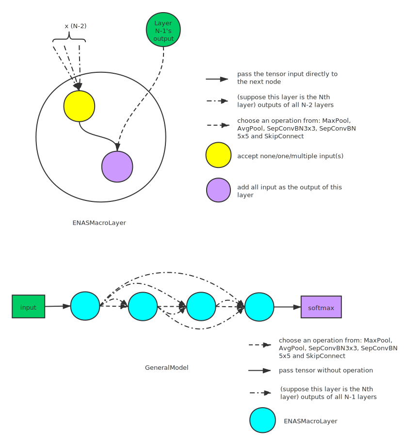
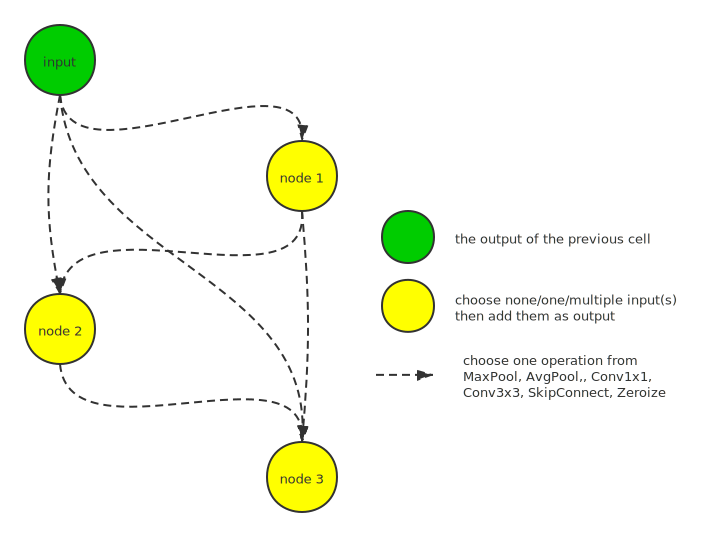

# 搜索空间集合

## DartsCell

DartsCell 是从[这里](https://github.com/microsoft/nni/tree/master/examples/nas/darts)的 [CNN 模型](./DARTS.md)中提取出来的。 一个 DartsCell 是一个包含 N 个节点的序列的有向无环图 ，其中每个节点代表一个潜在特征的表示（例如卷积网络中的特征图）。 从节点1到节点2的有向边表示一些将节点1转换为节点2的操作。这些操作获取节点1的值并将转换的结果储存在节点2上。 The [Candidate operators](#predefined-operations-darts) between nodes is predefined and unchangeable. 一条边表示从预定义的操作中选择的一项，并将该操作将应用于边的起始节点。 一个 cell 包括两个输入节点，一个输出节点和其他 `n_node` 个节点。 输入节点定义为前两个 cell 的输出。 Cell 的输出是通过对所有中间节点进行归约运算（例如连接）而获得的。 为了使搜索空间连续，在所有可能的操作上通过softmax对特定操作选择进行松弛。 通过调整每个节点上softmax的权重，选择概率最高的操作作为最终结构的一部分。 可以通过堆叠多个cell组成一个CNN模型，从而构建一个搜索空间。 值得注意的是，在DARTS论文中，模型中的所有cell都具有相同的结构。

Darts的搜索空间如下图所示。 请注意，在NNI的实现中将最后一个中间节点与输出节点进行了合并。


The predefined operators are shown [here](#predefined-operations-darts).

```eval_rst
..  autoclass:: nni.nas.pytorch.search_space_zoo.DartsCell
    :members:
```

### 示例代码

[示例代码](https://github.com/microsoft/nni/tree/master/examples/nas/search_space_zoo/darts_example.py)

```bash
git clone https://github.com/Microsoft/nni.git
cd nni/examples/nas/search_space_zoo
# search the best structure
python3 darts_example.py
```

<a name="predefined-operations-darts"></a>

### Candidate operators

All supported operators for Darts are listed below.

* 最大池化 / 平均池化
  * 最大池化：调用`torch.nn.MaxPool2d`。 这个操作对所有输入的通道进行最大池化。 操作的参数固定，`kernel_size=3`，`padding=1`。 在池化操作后通过BatchNorm2d得到最终结果。
  * 平均池化：调用`torch.nn.AvgPool2d`。 这个操作对所有输入的通道进行平均池化。 操作的参数固定，`kernel_size=3`，`padding=1`。 在池化操作后通过BatchNorm2d得到最终结果。

    参数为`kernel_size=3`和`padding=1` 的最大池化操作和平均池化操作后均有BatchNorm2d操作。
    ```eval_rst
    ..  autoclass:: nni.nas.pytorch.search_space_zoo.darts_ops.PoolBN
    ```
* 跳过连接

    两个节点之间没有任何操作。 调用` torch.nn.Identity `将其获取的内容转发到输出。
* 零操作

    两个节点之间没有连接。
* DilConv3x3 / DilConv5x5

    <a name="DilConv"></a>深度可分离卷积。 3x3深度可分离卷积是由 `C_in` 组的3x3深度卷积和1x1的卷积串联组成。 这个操作减少了参数的数量。 输入首先通过RelLU，然后通过DilConv，最后是batchNorm2d。 **请注意这个操作不是扩散卷积，但是我们按照NAS论文中的约定命名为DilConv。**3x3深度可分离卷积的参数是 `kernel_size=3`, `padding=1` 。5x5深度可分离卷积的参数是 `kernel_size=5`, `padding=4`。
    ```eval_rst
    ..  autoclass:: nni.nas.pytorch.search_space_zoo.darts_ops.DilConv
    ```
* SepConv3x3 / SepConv5x5

    由两个参数为`kernel_size=3`， `padding=1`或`kernel_size=5`, `padding=2` 的深度可分离卷积串联组成。
    ```eval_rst
    ..  autoclass:: nni.nas.pytorch.search_space_zoo.darts_ops.SepConv
    ```

## ENASMicroLayer

这个层是由[这里](https://github.com/microsoft/nni/tree/master/examples/nas/enas)的模型提取出来的。 一个模型包含共享结构的多个块。 一个块由一些常规层和约简层组成，`ENASMicroLayer`是这两型层的统一实现。 这两类层之间的唯一区别是约简层的所有操作`stride=2`。

ENAS Micro的一个cell是含有N个节点的有向无环图。其中节点表示张量，边表示N个节点间的信息流。 一个cell包含两个输入节点和一个输出节点。 接下来节点选择前两个之前的节点作为输入，并从[预定义的的操作集](#predefined-operations-enas)中选择两个操作，分别应用到输入上，然后将它们相加为该节点的输出。 例如，节点4选择节点1和节点3作为输入，然后分别对输入应用` MaxPool `和` AvgPool `，然后将它们相加作为节点4的输出。 未用作任何其他节点输入的节点将被视为该层的输出。 如果有多个输出节点，则模型将计算这些节点的平均值作为当前层的输出。

The ENAS micro search space is shown below.


The predefined operators can be seen [here](#predefined-operations-enas).

```eval_rst
..  autoclass:: nni.nas.pytorch.search_space_zoo.ENASMicroLayer
    :members:
```

归约层由两个卷积操作和之后的BatchNorm组成，每个卷积操作都将输出` C_out//2`个通道并将它们在通道方向上串联作为输出。 卷积的参数是`kernel_size=1`，`stride=2`，并且它们对输入进行交替采样以降低分辨率而不会丢失信息。 该层封装在`ENASMicroLayer`中。

### 示例代码

[示例代码](https://github.com/microsoft/nni/tree/master/examples/nas/search_space_zoo/enas_micro_example.py)

```bash
git clone https://github.com/Microsoft/nni.git
cd nni/examples/nas/search_space_zoo
# search the best cell structure
python3 enas_micro_example.py
```

<a name="predefined-operations-enas"></a>

### Candidate operators

All supported operators for ENAS micro search are listed below.

* 最大池化 / 平均池化
    * 最大池化：调用`torch.nn.MaxPool2d`。 这个操作对所有输入的通道进行最大池化，之后进行BatchNorm2d。 池化操作的参数为`kernel_size=3`,，`stride=1` ，`padding=1`。
    * 平均池化：调用`torch.nn.AvgPool2d`。 这个操作对所有输入的通道进行最大池化，之后进行BatchNorm2d。 池化操作的参数为`kernel_size=3`,，`stride=1` ，`padding=1`。
    ```eval_rst
    ..  autoclass:: nni.nas.pytorch.search_space_zoo.enas_ops.Pool
    ```

* SepConv
    * SepConvBN3x3：首先进行ReLU，之后进行[DilConv](#DilConv)，最后是BatchNorm2d。 卷积操作的参数为`kernel_size=3`,，`stride=1` ，`padding=1`。
    * SepConvBN5x5：进行与之前相同的操作，但是它具有不同的内核大小和填充，分别设置为5和2。

    ```eval_rst
    ..  autoclass:: nni.nas.pytorch.search_space_zoo.enas_ops.SepConvBN
    ```

* 跳过连接

    调用`torch.nn.Identity`直接连接到一个cell。

## ENASMacroLayer

在宏搜索中，控制器为每个层做出两个决定：i）对上一层的结果执行的[操作](#macro-operations)，ii）通过跳过连接，连接到之前的那个层。 ENAS使用控制器来设计整个模型结构而不是模型的某一部分。 操作的输出将与跳过连接的所选层的张量连接在一起。 NNI provides [predefined operators](#macro-operations) for macro search, which are listed in [Candidate operators](#macro-operations).

ENAS Macro的搜索空间如下图所示。



```eval_rst
..  autoclass:: nni.nas.pytorch.search_space_zoo.ENASMacroLayer
    :members:
```

为了描述整个搜索空间，NNI提供了一个模型，该模型是通过堆叠ENASMacroLayer构成的。

```eval_rst
..  autoclass:: nni.nas.pytorch.search_space_zoo.ENASMacroGeneralModel
    :members:
```

### 示例代码

[示例代码](https://github.com/microsoft/nni/tree/master/examples/nas/search_space_zoo/enas_macro_example.py)

```bash
git clone https://github.com/Microsoft/nni.git
cd nni/examples/nas/search_space_zoo
# search the best cell structure
python3 enas_macro_example.py
```

<a name="macro-operations"></a>

### Candidate operators

All supported operators for ENAS macro search are listed below.

* ConvBranch

    首先将所有输入传递到StdConv，该操作由1x1Conv，BatchNorm2d和ReLU组成。 然后进行下列的操作之一。 最终结果通过后处理，包括BatchNorm2d和ReLU。
    * Separable Conv3x3：如果`separable=True`，则cell将使用[ SepConv](#DilConv)而不是常规的卷积操作。 卷积操作的参数为`kernel_size=3`，`stride=1` ，`padding=1`。
    * Separable Conv5x5：卷积操作的参数为`kernel_size=5`,，`stride=1` ，`padding=2`。
    * Normal Conv3x3：如果`separable=False`，cell将使用参数为` kernel_size=3`，`stride=1`，` padding=1`的一般卷积。
    * Separable Conv5x5：卷积操作的参数为`kernel_size=5`,，`stride=1` ，`padding=2`。

    ```eval_rst
    ..  autoclass:: nni.nas.pytorch.search_space_zoo.enas_ops.ConvBranch
    ```
* PoolBranch

    首先将所有输入传递到StdConv，该操作由1x1Conv，BatchNorm2d和ReLU组成。 然后对中间结果进行池化操作和BatchNorm。
    * 平均池化：调用`torch.nn.AvgPool2d`。 这个操作对所有输入的通道进行平均池化。 池化操作的参数为`kernel_size=3`,，`stride=1` ，`padding=1`。
    * 最大池化：调用`torch.nn.MaxPool2d`。 这个操作对所有输入的通道进行最大池化。 池化操作的参数为`kernel_size=3`,，`stride=1` ，`padding=1`。

    ```eval_rst
    ..  autoclass:: nni.nas.pytorch.search_space_zoo.enas_ops.PoolBranch
    ```

## NAS-Bench-201

NAS Bench 201 defines a unified search space, which is algorithm agnostic. The predefined skeleton consists of a stack of cells that share the same architecture. Every cell contains four nodes and a DAG is formed by connecting edges among them, where the node represents the sum of feature maps and the edge stands for an operation transforming a tensor from the source node to the target node. The predefined candidate operators can be found in [Candidate operators](#nas-bench-201-reference).

The search space of NAS Bench 201 is shown below.



```eval_rst
..  autoclass:: nni.nas.pytorch.nasbench201.NASBench201Cell
    :members:
```

### Example code

[example code](https://github.com/microsoft/nni/tree/master/examples/nas/search_space_zoo/nas_bench_201.py)

```bash
# for structure searching
git clone https://github.com/Microsoft/nni.git
cd nni/examples/nas/search_space_zoo
python3 nas_bench_201.py
```

<a name="nas-bench-201-reference"></a>

### Candidate operators

All supported operators for NAS Bench 201 are listed below.

* AvgPool

  If the number of input channels is not equal to the number of output channels, the input will first pass through a `ReLUConvBN` layer with `kernel_size=1`, `stride=1`, `padding=0`, and `dilation=0`. Call `torch.nn.AvgPool2d`. This operation applies a 2D average pooling over all input channels followed by BatchNorm2d. Its parameters are fixed to `kernel_size=3` and `padding=1`.

  ```eval_rst
  ..  autoclass:: nni.nas.pytorch.nasbench201.nasbench201_ops.Pooling
      :members:
  ```

* Conv
  * Conv1x1: Consist of a sequence of ReLU, `nn.Cinv2d` and BatchNorm. The Conv operation's parameter is fixed to `kernal_size=1`, `padding=0`, and `dilation=1`.
  * Conv3x3: Consist of a sequence of ReLU, `nn.Cinv2d` and BatchNorm. The Conv operation's parameter is fixed to `kernal_size=3`, `padding=1`, and `dilation=1`.

  ```eval_rst
  ..  autoclass:: nni.nas.pytorch.nasbench201.nasbench201_ops.ReLUConvBN
      :members:
  ```

* SkipConnect

  Call `torch.nn.Identity` to connect directly to the next cell.

* Zeroize

  Generate zero tensors indicating there is no connection from the source node to the target node.

  ```eval_rst
  ..  autoclass:: nni.nas.pytorch.nasbench201.nasbench201_ops.Zero
      :members:
  ```

