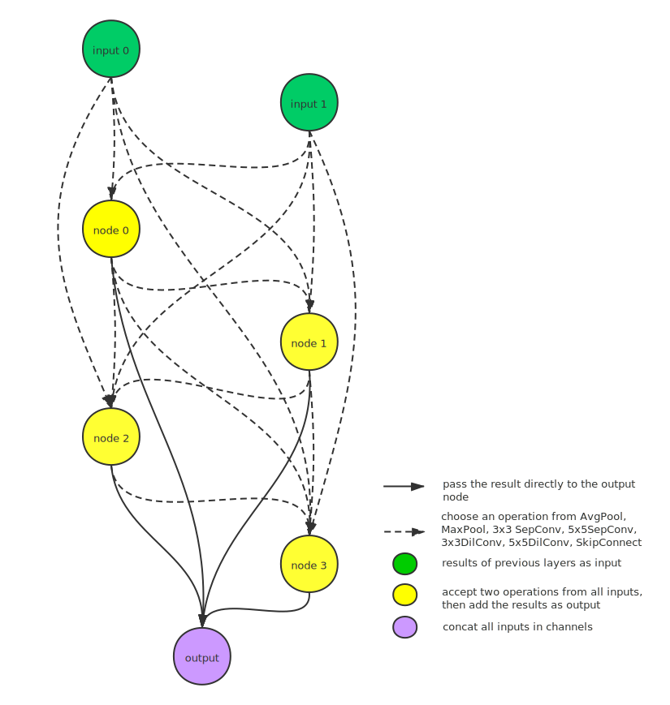
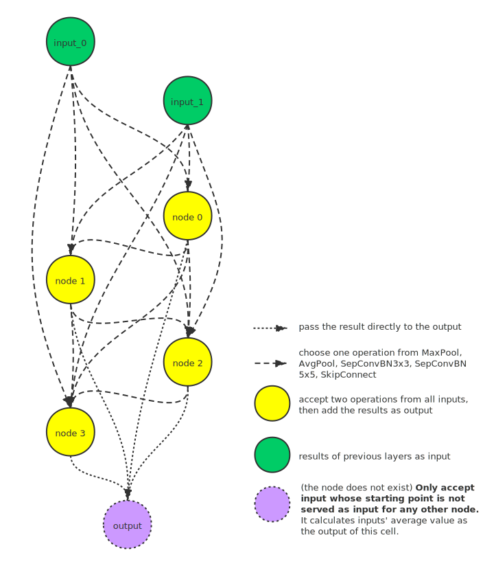

# Search Space Zoo

## DartsCell

DartsCell is extracted from [CNN model](./DARTS.md) designed [here](https://github.com/microsoft/nni/tree/master/examples/nas/darts). A DartsCell is a directed acyclic graph containing an ordered sequence of N nodes and each node stands for a latent representation (e.g. feature map in a convolutional network). Directed edges from Node 1 to Node 2 are associated with some operations that transform Node 1 and the result is stored on Node 2. The [operations](#darts-predefined-operations) between nodes is predefined and unchangeable. One edge represents an operation that chosen from the predefined ones to be applied to the starting node of the edge. One cell contains two input nodes, a single output node, and other `n_node` nodes. The input nodes are defined as the cell outputs in the previous two layers. The output of the cell is obtained by applying a reduction operation (e.g. concatenation) to all the intermediate nodes. To make the search space continuous, the categorical choice of a particular operation is relaxed to a softmax over all possible operations. By adjusting the weight of softmax on every node, the operation with the highest probability is chosen to be part of the final structure. A CNN model can be formed by stacking several cells together, which builds a search space. Note that, in DARTS paper all cells in the model share the same structure.

One structure in the Darts search space is shown below. Note that, NNI merges the last one of the four intermediate nodes and the output node.



The predefined operations are shown in [references](#predefined-operations-darts).

```eval_rst
..  autoclass:: nni.nas.pytorch.search_space_zoo.DartsCell
    :members:
```

### Example code

[example code](https://github.com/microsoft/nni/tree/master/examples/nas/search_space_zoo/darts_example.py)

```bash
git clone https://github.com/Microsoft/nni.git
cd nni/examples/nas/search_space_zoo
# search the best structure
python3 darts_example.py
```

<a name="predefined-operations-darts"></a>

### References

All supported operations for Darts are listed below.

* MaxPool / AvgPool
  * MaxPool: Call `torch.nn.MaxPool2d`. This operation applies a 2D max pooling over all input channels. Its parameters `kernel_size=3` and `padding=1` are fixed. The pooling result will pass through a BatchNorm2d then return as the result.
  * AvgPool: Call `torch.nn.AvgPool2d`. This operation applies a 2D average pooling over all input channels. Its parameters `kernel_size=3` and `padding=1` are fixed. The pooling result will pass through a BatchNorm2d then return as the result.

    MaxPool / AvgPool with `kernel_size=3` and `padding=1` followed by BatchNorm2d
    ```eval_rst
    ..  autoclass:: nni.nas.pytorch.search_space_zoo.darts_ops.PoolBN
    ```
* SkipConnect

    There is no operation between two nodes. Call `torch.nn.Identity` to forward what it gets to the output.
* Zero operation

    There is no connection between two nodes.
* DilConv3x3 / DilConv5x5

    <a name="DilConv"></a>DilConv3x3: (Dilated) depthwise separable Conv. It's a 3x3 depthwise convolution with `C_in` groups, followed by a 1x1 pointwise convolution. It reduces the amount of parameters. Input is first passed through relu, then DilConv and finally batchNorm2d. **Note that the operation is not Dilated Convolution, but we follow the convention in NAS papers to name it DilConv.** 3x3 DilConv has parameters `kernel_size=3`, `padding=1` and 5x5 DilConv has parameters `kernel_size=5`, `padding=4`.
    ```eval_rst
    ..  autoclass:: nni.nas.pytorch.search_space_zoo.darts_ops.DilConv
    ```
* SepConv3x3 / SepConv5x5

    Composed of two DilConvs with fixed `kernel_size=3`, `padding=1` or `kernel_size=5`, `padding=2` sequentially.
    ```eval_rst
    ..  autoclass:: nni.nas.pytorch.search_space_zoo.darts_ops.SepConv
    ```

## ENASMicroLayer

This layer is extracted from the model designed [here](https://github.com/microsoft/nni/tree/master/examples/nas/enas). A model contains several blocks that share the same architecture. A block is made up of some normal layers and reduction layers, `ENASMicroLayer` is a unified implementation of the two types of layers. The only difference between the two layers is that reduction layers apply all operations with `stride=2`.

ENAS Micro employs a DAG with N nodes in one cell, where the nodes represent local computations, and the edges represent the flow of information between the N nodes. One cell contains two input nodes and a single output node. The following nodes choose two previous nodes as input and apply two operations from [predefined ones](#predefined-operations-enas) then add them as the output of this node. For example, Node 4 chooses Node 1 and Node 3 as inputs then applies `MaxPool` and `AvgPool` on the inputs respectively, then adds and sums them as the output of Node 4. Nodes that are not served as input for any other node are viewed as the output of the layer. If there are multiple output nodes, the model will calculate the average of these nodes as the layer output.

One structure in the ENAS micro search space is shown below.



The predefined operations can be seen [here](#predefined-operations-enas).

```eval_rst
..  autoclass:: nni.nas.pytorch.search_space_zoo.ENASMicroLayer
    :members:
```

The Reduction Layer is made up of two Conv operations followed by BatchNorm, each of them will output `C_out//2` channels and concat them in channels as the output. The Convolution has `kernel_size=1` and `stride=2`, and they perform alternate sampling on the input to reduce the resolution without loss of information. This layer is wrapped in `ENASMicroLayer`.

### Example code

[example code](https://github.com/microsoft/nni/tree/master/examples/nas/search_space_zoo/enas_micro_example.py)

```bash
git clone https://github.com/Microsoft/nni.git
cd nni/examples/nas/search_space_zoo
# search the best cell structure
python3 enas_micro_example.py
```

<a name="predefined-operations-enas"></a>

### References

All supported operations for ENAS micro search are listed below.

* MaxPool / AvgPool
    * MaxPool: Call `torch.nn.MaxPool2d`. This operation applies a 2D max pooling over all input channels followed by BatchNorm2d. Its parameters are fixed to `kernel_size=3`, `stride=1` and `padding=1`.
    * AvgPool: Call `torch.nn.AvgPool2d`. This operation applies a 2D average pooling over all input channels followed by BatchNorm2d. Its parameters are fixed to `kernel_size=3`, `stride=1` and `padding=1`.
    ```eval_rst
    ..  autoclass:: nni.nas.pytorch.search_space_zoo.enas_ops.Pool
    ```

* SepConv
    * SepConvBN3x3: ReLU followed by a [DilConv](#DilConv) and BatchNorm. Convolution parameters are `kernel_size=3`, `stride=1` and `padding=1`.
    * SepConvBN5x5: Do the same operation as the previous one but it has different kernel sizes and paddings, which is set to 5 and 2 respectively.

    ```eval_rst
    ..  autoclass:: nni.nas.pytorch.search_space_zoo.enas_ops.SepConvBN
    ```

* SkipConnect

    Call `torch.nn.Identity` to connect directly to the next cell.

## ENASMacroLayer

In Macro search, the controller makes two decisions for each layer: i) the [operation](#macro-operations) to perform on the result of the previous layer, ii) which the previous layer to connect to for SkipConnects. ENAS uses a controller to design the whole model architecture instead of one of its components. The output of operations is going to concat with the tensor of the chosen layer for SkipConnect. NNI provides [predefined operations](#macro-operations) for macro search, which are listed in [references](#macro-operations).

Part of one structure in the ENAS macro search space is shown below.


```eval_rst
..  autoclass:: nni.nas.pytorch.search_space_zoo.ENASMacroLayer
    :members:
```

To describe the whole search space, NNI provides a model, which is built by stacking the layers.

```eval_rst
..  autoclass:: nni.nas.pytorch.search_space_zoo.ENASMacroGeneralModel
    :members:
```

### Example code

[example code](https://github.com/microsoft/nni/tree/master/examples/nas/search_space_zoo/enas_macro_example.py)

```bash
git clone https://github.com/Microsoft/nni.git
cd nni/examples/nas/search_space_zoo
# search the best cell structure
python3 enas_macro_example.py
```

<a name="macro-operations"></a>

### References

All supported operations for ENAS macro search are listed below.

* ConvBranch

    All input first passes into a StdConv, which is made up of a 1x1Conv followed by BatchNorm2d and ReLU. Then the intermediate result goes through one of the operations listed below. The final result is calculated through a BatchNorm2d and ReLU as post-procedure.
    * Separable Conv3x3: If `separable=True`, the cell will use [SepConv](#DilConv) instead of normal Conv operation. SepConv's `kernel_size=3`, `stride=1` and `padding=1`.
    * Separable Conv5x5: SepConv's `kernel_size=5`, `stride=1` and `padding=2`.
    * Normal Conv3x3: If `separable=False`, the cell will use a normal Conv operations with `kernel_size=3`, `stride=1` and `padding=1`.
    * Normal Conv5x5: Conv's `kernel_size=5`, `stride=1` and `padding=2`.

    ```eval_rst
    ..  autoclass:: nni.nas.pytorch.search_space_zoo.enas_ops.ConvBranch
    ```
* PoolBranch

    All input first passes into a StdConv, which is made up of a 1x1Conv followed by BatchNorm2d and ReLU. Then the intermediate goes through pooling operation followed by BatchNorm.
    * AvgPool: Call `torch.nn.AvgPool2d`. This operation applies a 2D average pooling over all input channels. Its parameters are fixed to `kernel_size=3`, `stride=1` and `padding=1`.
    * MaxPool: Call `torch.nn.MaxPool2d`. This operation applies a 2D max pooling over all input channels. Its parameters are fixed to `kernel_size=3`, `stride=1` and `padding=1`.

    ```eval_rst
    ..  autoclass:: nni.nas.pytorch.search_space_zoo.enas_ops.PoolBranch
    ```

<!-- push -->
