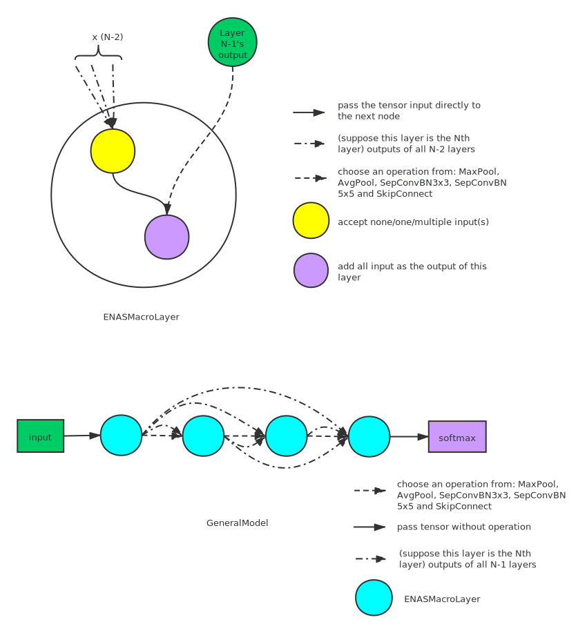

.. role:: raw-html(raw)
   :format: html

搜索空间集合
================

DartsCell
---------

DartsCell 是从 :githublink:`CNN 模型<examples/nas/darts>` 中提取的。 一个 DartsCell 是一个包含 N 个节点的序列的有向无环图 ，其中每个节点代表一个潜在特征的表示（例如， 卷积网络中的特征图）。 从节点 1 到节点 2 的有向边表示一些将节点 1 转换为节点 2 的操作。这些操作获取节点 1 的值并将转换的结果储存在节点 2 上。 节点之间的 `Candidate <＃predefined-operations-darts>`__ 是预定义的且不可更改。 一条边表示从预定义的操作中选择的一项，并将该操作将应用于边的起始节点。 一个 cell 包括两个输入节点，一个输出节点和其他 ``n_node`` 个节点。 输入节点定义为前两个 cell 的输出。 cell 的输出是通过应用归约运算到所有中间节点（例如， 级联）。 为了使搜索空间连续，在所有可能的操作上通过 softmax 对特定操作选择进行松弛。 通过调整每个节点上 softmax 的权重，选择概率最高的操作作为最终结构的一部分。 可以通过堆叠多个 cell 组成一个 CNN 模型，从而构建一个搜索空间。 值得注意的是，在 DARTS 论文中，模型中的所有 cell 都具有相同的结构。

ENAS Micro 的搜索空间如下图所示。 请注意，在 NNI 的实现中将最后一个中间节点与输出节点进行了合并。

.. image:: ../../img/NAS_Darts_cell.svg
   :target: ../../img/NAS_Darts_cell.svg
   :alt: 

预定义的操作在 `参考 <#predefined-operations-darts>`__ 中列出。

..  autoclass:: nni.nas.pytorch.search_space_zoo.DartsCell
    :members:

示例代码
^^^^^^^^^^^^

:githublink:`示例代码 <examples/nas/search_space_zoo/darts_example.py>`

.. code-block:: bash

   git clone https://github.com/Microsoft/nni.git
   cd nni/examples/nas/search_space_zoo
   # 搜索最优结构
   python3 darts_example.py

:raw-html:``

候选运算符
^^^^^^^^^^^^^^^^^^^

所有 Darts 支持的操作如下。

* 
  最大池化 / 平均池化

  * 最大池化：调用 ``torch.nn.MaxPool2d``。 这个操作对所有输入的通道进行最大池化。 参数 ``kernel_size = 3`` 和 ``padding = 1`` 是固定的。 在池化操作后通过 BatchNorm2d 得到最终结果。
  * 
    平均池化：调用 ``torch.nn.AvgPool2d``。 这个操作对所有输入的通道进行平均池化。 参数 ``kernel_size = 3`` 和 ``padding = 1`` 是固定的。 在池化操作后通过 BatchNorm2d 得到最终结果。

    参数为 ``kernel_size=3`` 和 ``padding=1`` 的最大池化操作和平均池化操作后均有 BatchNorm2d 操作。

..  autoclass:: nni.nas.pytorch.search_space_zoo.darts_ops.PoolBN

* 
  跳过连接

    两个节点之间没有任何操作。 调用 ``torch.nn.Identity`` 将其获取的内容转发到输出。

* 
  零操作

    两个节点之间没有连接。

* 
  DilConv3x3 / DilConv5x5

    :raw-html:``\ DilConv3x3: (Dilated) depthwise separable Conv. 3x3 深度可分离卷积是由 ``C_in`` 组的 3x3 深度卷积和 1x1 的卷积串联组成。 这个操作减少了参数的数量。 输入首先通过 RelLU，然后通过 DilConv，最后是 batchNorm2d。 **请注意这个操作不是扩散卷积，但是按照 NAS 论文中的约定命名为 DilConv。** 3x3 深度可分离卷积的参数是 ``kernel_size=3``,  ``padding=1`` 。5x5 深度可分离卷积的参数是 ``kernel_size=5``, ``padding=4``。

  ..  autoclass:: nni.nas.pytorch.search_space_zoo.darts_ops.DilConv

* 
  SepConv3x3 / SepConv5x5

    由两个顺序固定为 ``kernel_size = 3``，``padding = 1`` 或 ``kernel_size = 5``，``padding = 2`` 的 DilConv 组成。

  ..  autoclass:: nni.nas.pytorch.search_space_zoo.darts_ops.SepConv

ENASMicroLayer
--------------

该层是从设计的模型中提取的 :githublink:`这里 <examples/nas/enas>`. 一个模型包含共享结构的多个块。 一个块由一些常规层和约简层组成，``ENASMicroLayer`` 是这两型层的统一实现。 这两类层之间的唯一区别是约简层的所有操作 ``stride=2``。

ENAS Micro 的一个 cell 是含有 N 个节点的有向无环图。其中节点表示张量，边表示 N 个节点间的信息流。 一个 cell 包含两个输入节点和一个输出节点。 接下来节点选择前两个之前的节点作为输入，并从 `预定义的的操作集 <#predefined-operations-enas>`__ 中选择两个操作，分别应用到输入上，然后将它们相加为该节点的输出。 例如，节点 4 选择节点 1 和节点 3 作为输入，然后分别对输入应用 
 ``MaxPool`` 和 ``AvgPool``，然后将它们相加作为节点 4 的输出。 未用作任何其他节点输入的节点将被视为该层的输出。 如果有多个输出节点，则模型将计算这些节点的平均值作为当前层的输出。

ENAS Micro 的搜索空间如下图所示。

.. image:: ../../img/NAS_ENAS_micro.svg
   :target: ../../img/NAS_ENAS_micro.svg
   :alt: 
 

预定义的操作在 `参考 <#predefined-operations-enas>`__ 中列出。

..  autoclass:: nni.nas.pytorch.search_space_zoo.ENASMicroLayer
    :members:

归约层由两个卷积操作和之后的 BatchNorm 组成，每个卷积操作都将输出 ``C_out//2`` 个通道并将它们在通道方向上串联作为输出。 卷积的参数是 ``kernel_size=1``，``stride=2``，并且它们对输入进行交替采样以降低分辨率而不会丢失信息。 该层封装在 ``ENASMicroLayer`` 中。

示例代码
^^^^^^^^^^^^

:githublink:`示例代码 <examples/nas/search_space_zoo/enas_micro_example.py>`

.. code-block:: bash

   git clone https://github.com/Microsoft/nni.git
   cd nni/examples/nas/search_space_zoo
   # 搜索最优结构
   python3 enas_micro_example.py

:raw-html:``

候选运算符
^^^^^^^^^^^^^^^^^^^

所有 ENAS Micro 支持的操作如下。

* 
  最大池化 / 平均池化

  * 最大池化：调用 ``torch.nn.MaxPool2d``。 这个操作对所有输入的通道进行最大池化，之后进行 BatchNorm2d。 参数固定为  ``kernel_size=3``\ , ``stride=1`` 和 ``padding=1``。
  * 平均池化：调用 ``torch.nn.AvgPool2d``。 这个操作对所有输入的通道进行最大池化，之后进行 BatchNorm2d。 参数固定为  ``kernel_size=3``\ , ``stride=1`` 和 ``padding=1``。

..  autoclass:: nni.nas.pytorch.search_space_zoo.enas_ops.Pool

* 
  SepConv

  * SepConvBN3x3：首先进行ReLU，之后进行 `DilConv <#DilConv>`__ ，最后是BatchNorm2d。 卷积参数固定为  ``kernel_size=3``\ , ``stride=1`` 和 ``padding=1``。
  * 
    SepConvBN5x5：进行与之前相同的操作，但是它具有不同的内核大小和填充，分别设置为 5 和 2。

..  autoclass:: nni.nas.pytorch.search_space_zoo.enas_ops.SepConvBN

* 
  跳过连接

    调用 ``torch.nn.Identity`` 直接连接到一个 cell。

ENASMacroLayer
--------------

在宏搜索中，控制器为每个层做出两个决定：i）对上一层的结果执行的 `操作 <#macro-operations>`__ ，ii）通过跳过连接，连接到之前的那个层。 ENAS 使用控制器来设计整个模型结构而不是模型的某一部分。 操作的输出将与跳过连接的所选层的张量连接在一起。 NNI 为宏搜索提供 `预定义运算符 <＃macro-operations>`__，这些宏在 `候选运算符 <＃macro-operations>`__ 中列出。

ENAS Macro 的搜索空间如下图所示。

..  autoclass:: nni.nas.pytorch.search_space_zoo.ENASMacroLayer
    :members:

为了描述整个搜索空间，NNI 提供了一个模型，该模型是通过堆叠 ENASMacroLayer 构成的。

..  autoclass:: nni.nas.pytorch.search_space_zoo.ENASMacroGeneralModel
    :members:

示例代码
^^^^^^^^^^^^

:githublink:`示例代码 <examples/nas/search_space_zoo/enas_macro_example.py>`

.. code-block:: bash

   git clone https://github.com/Microsoft/nni.git
   cd nni/examples/nas/search_space_zoo
   # search the best cell structure
   python3 enas_macro_example.py

:raw-html:``

候选运算符
^^^^^^^^^^^^^^^^^^^

所有 ENAS Macro 支持的操作如下。

* 
  ConvBranch

    首先将所有输入传递到 StdConv，该操作由 1x1Conv，BatchNorm2d 和 ReLU 组成。 然后进行下列的操作之一。 最终结果通过后处理，包括BatchNorm2d和ReLU。

  Separable Conv3x3：如果 ``separable=True``，则 cell 将使用 `SepConv <#DilConv>`__ 而不是常规的卷积操作。 SepConv 固定为  ``kernel_size=3``\ , ``stride=1`` 和 ``padding=1``。
  * Separable Conv5x5: SepConv 固定为 ``kernel_size=5``\ , ``stride=1`` 和 ``padding=2``。
  * 普通的 Conv3x3: 如果 ``separable=False``\ , cell 将使用常规的转化操作 ``kernel_size=3``\ , ``stride=1`` 和 ``padding=1``。
  * 普通的 Conv5x5：Conv 固定为 ``kernel_size=5``\ , ``stride=1`` 和 ``padding=2``。

..  autoclass:: nni.nas.pytorch.search_space_zoo.enas_ops.ConvBranch

* 
  PoolBranch

    首先将所有输入传递到 StdConv，该操作由 1x1Conv，BatchNorm2d 和 ReLU 组成。 然后对中间结果进行池化操作和 BatchNorm。

  * 平均池化：调用 ``torch.nn.AvgPool2d``。 这个操作对所有输入的通道进行平均池化。 参数固定为  ``kernel_size=3``\ , ``stride=1`` 和 ``padding=1``。
  * 
    最大池化：调用 ``torch.nn.MaxPool2d``。 这个操作对所有输入的通道进行最大池化。 参数固定为  ``kernel_size=3``\ , ``stride=1`` 和 ``padding=1``。

..  autoclass:: nni.nas.pytorch.search_space_zoo.enas_ops.PoolBranch

NAS-Bench-201
-------------

NAS Bench 201 定义了与算法无关的统一搜索空间。 预定义的骨架由共享相同体系结构的 cell 堆栈组成。 每个 cell 包含四个节点，并且通过连接它们之间的边来形成 DAG，其中该节点表示特征图的总和，并且边表示将张量从源节点转换为目标节点的操作。 预定义的候选运算符可以在 `候选运算符 <#nas-bench-201-reference>`__ 中找到。

NAS Bench 201 的搜索空间如下所示。

.. image:: ../../img/NAS_Bench_201.svg
   :target: ../../img/NAS_Bench_201.svg
   :alt: 

..  autoclass:: nni.nas.pytorch.nasbench201.NASBench201Cell
    :members:

示例代码
^^^^^^^^^^^^

:githublink:`示例代码 <examples/nas/search_space_zoo/nas_bench_201.py>`

.. code-block:: bash

   # for structure searching
   git clone https://github.com/Microsoft/nni.git
   cd nni/examples/nas/search_space_zoo
   python3 nas_bench_201.py

:raw-html:``

候选运算符
^^^^^^^^^^^^^^^^^^^

所有 NAS Bench 201 支持的操作如下。

* 
  AvgPool

  如果输入通道数不等于输出通道数，则输入会首先通过 ``kernel_size = 1``，``stride = 1``，``padding = 0`` 和 ``dilation = 0`` 的 ``ReLUConvBN`` 层 。
  调用 ``torch.nn.AvgPool2d``。 这个操作对所有输入的通道进行最大池化，之后进行BatchNorm2d。 参数固定为  ``kernel_size=3`` 和 ``padding=1``。

..  autoclass:: nni.nas.pytorch.nasbench201.nasbench201_ops.Pooling
    :members:

* 
  Conv

  * Conv1x1: 由一些列 ReLU，``nn.Cinv2d`` 和 BatchNorm 组成。 Conv 操作的参数固定为 ``kernal_size = 1``，``padding = 0`` 和 ``dilation = 1``。
  * Conv3x3: 由一些列 ReLU，``nn.Cinv2d`` 和 BatchNorm 组成。 Conv 操作的参数固定为 ``kernal_size = 3``，``padding = 1`` 和 ``dilation = 1``。

..  autoclass:: nni.nas.pytorch.nasbench201.nasbench201_ops.ReLUConvBN
    :members:

* 
  跳过连接

  调用 ``torch.nn.Identity`` 直接连接到一个 cell。

* 
  归零

  没有生成 tensors 表示从源节点到目标节点之间没有连接。

..  autoclass:: nni.nas.pytorch.nasbench201.nasbench201_ops.Zero
    :members:
