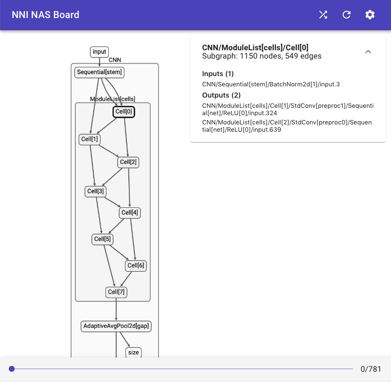

# NAS 可视化（测试版）

## 内置 Trainer 支持

当前，仅 ENAS 和 DARTS 支持可视化。 [ENAS](./ENAS.md) 和 [DARTS](./DARTS.md) 的示例演示了如何在代码中启用可视化，其需要在 `trainer.train()` 前添加代码。

```python
trainer.enable_visualization()
```

此代码会在当前目录中创建新目录 `logs/<current_time_stamp>`，并创建两个新文件 `graph.json` 和 `log`。

不必等到程序运行完后，再启动 NAS 界面，但需要确保这两个文件产生后，再启动。 启动 NAS 界面：

```bash
nnictl webui nas --logdir logs/<current_time_stamp> --port <port>
```

## 可视化定制的 Trainer

如果要定制 Trainer，参考[文档](./Advanced.md#extend-the-ability-of-one-shot-trainers)。

需要对已有 Trainer 代码做两处改动来支持可视化：

1. 在训练前导出图：

```python
vis_graph = self.mutator.graph(inputs)
# `inputs` 是模型的虚拟输入。 例如，torch.randn((1, 3, 32, 32)).cuda()
# 如果模型有多个输入，则要使用 tuple。
with open("/path/to/your/logdir/graph.json", "w") as f:
    json.dump(vis_graph, f)
```

2. 记录选择的 Choice。 可以每个 Epoch，批处理或任何频率下做次记录。

```python
def __init__(self):
    # ...
    self.status_writer = open("/path/to/your/logdir/log", "w")  # create a writer

def train(self):
    # ...
    print(json.dumps(self.mutator.status()), file=self.status_writer, flush=True)  # 保存状态
```

如果继承 `Trainer`，实现定制的 Trainer。 NNI 提供了 `enable_visualization()` 和 `_write_graph_status()` 来简化可视化。 只需要在开始前调用 `trainer.enable_visualization()`，并在每次要记录日志前调用 `trainer._write_graph_status()`。 注意，这两个 API 还处于试用阶段，未来可能会有所更改。

最后，启动 NAS 界面：

```bash
nnictl webui nas --logdir /path/to/your/logdir
```

## NAS 界面预览




## 局限性

* NAS 可视化仅适用于 PyTorch >=1.4。PyTorch 1.3.1 无法正常工作。
* 其依赖于 PyTorch 对 tensorboard 导出图的支持，即依赖于 `torch.jit`。 如果模型不支持 `jit`，也无法使用。
* 在加载中等大小，但有许多 Choice 的模型时（如 DARTS 的搜索空间），会遇到性能问题。

## 反馈

NAS UI 目前是测试版。 欢迎提交反馈。 [这里](https://github.com/microsoft/nni/pull/2085)列出了 NAS UI 接下来的工作。 欢迎直接评论，如果有其它建议，也可以[提交新问题](https://github.com/microsoft/nni/issues/new?template=enhancement.md)。
