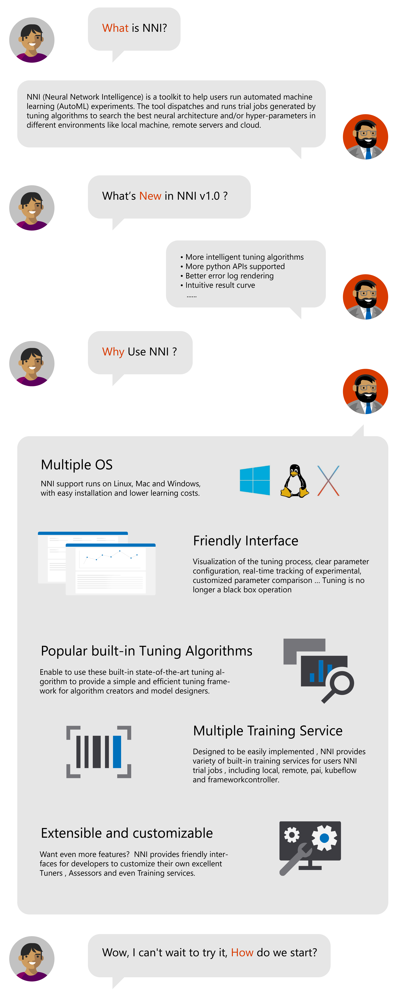

从 2018 年 9 月到 2019 年 9 月，我们一直在前进 ...

**好消息！**&nbsp;&nbsp;NNI v1.0 带来了更强的**伸缩性**和**易用性**。 基于各种[调参算法](./Tuner/BuiltinTuner.md)，NNI 已经支持了超参调优，神经网络结构搜索，自动特侦工程等，对算法工程师非常有用的功能。除此之外，NNI v1.0 带来了大量的改进，包括调优算法的优化，[Web 界面简化并更加直观](./Tutorial/WebUI.md)，以及[更多样的平台](./TrainingService/SupportTrainingService.md)。 NNI 已经成为了一个更加智能的自动机器学习（AutoML）工具包。

  
  
  

  
  

&nbsp;&nbsp;&nbsp;&nbsp;&nbsp;&nbsp;&nbsp;&nbsp;&nbsp;&nbsp;&nbsp;&nbsp;&nbsp;&nbsp;&nbsp;**第一步**： 根据[教程](./Tutorial/Installation.md)安装 NNI v1.0。  
&nbsp;&nbsp;&nbsp;&nbsp;&nbsp;&nbsp;&nbsp;&nbsp;&nbsp;&nbsp;&nbsp;&nbsp;&nbsp;&nbsp;&nbsp;**第二步**：找到 "Hello world" 示例，按照[教程](./Tutorial/QuickStart.md)入门。   
&nbsp;&nbsp;&nbsp;&nbsp;&nbsp;&nbsp;&nbsp;&nbsp;&nbsp;&nbsp;&nbsp;&nbsp;&nbsp;&nbsp;&nbsp;**第三步**：熟悉 [Web 界面](./Tutorial/WebUI.md)，用 NNI 进行自动机器学习！  

全自动工具极大地提高了调优过程的效率。 关于 v1.0 的更多细节，可参考 [Release 1.0](https://github.com/microsoft/nni/releases)。 关于进一步计划，可参考[路线图](https://github.com/microsoft/nni/wiki/Roadmap)。 此外，欢迎更多的参与者加入我们。可参考[如何贡献](./Tutorial/Contributing.md)，来了解多种参与方法。