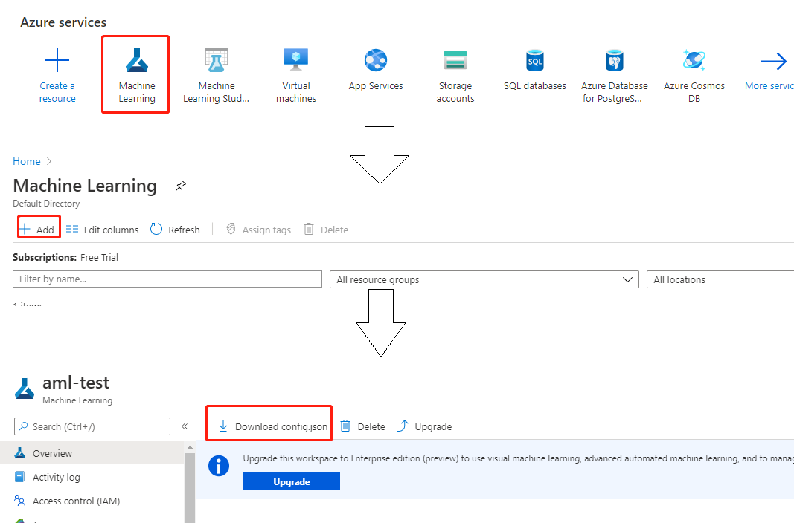
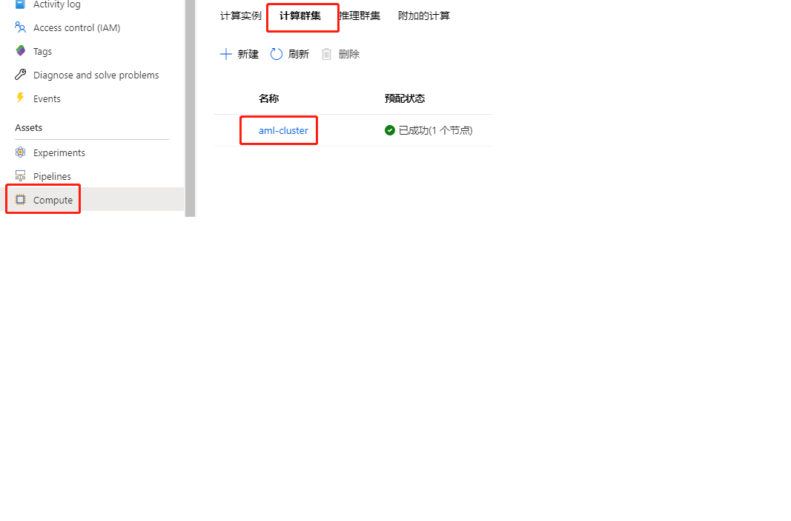

**在 Azure Machine Learning 上运行 Experiment**
===
NNI 支持在 [AML](https://azure.microsoft.com/zh-cn/services/machine-learning/) 上运行 Experiment，称为 aml 模式。

## 设置环境
步骤 1. 参考[指南](../Tutorial/QuickStart.md)安装 NNI。

步骤 2. Create an Azure account/subscription using this [link](https://azure.microsoft.com/en-us/free/services/machine-learning/). If you already have an Azure account/subscription, skip this step.

步骤 3. Install the Azure CLI on your machine, follow the install guide [here](https://docs.microsoft.com/en-us/cli/azure/install-azure-cli?view=azure-cli-latest).

Step 4. Authenticate to your Azure subscription from the CLI. To authenticate interactively, open a command line or terminal and use the following command:
```
az login
```

Step 5. Log into your Azure account with a web browser and create a Machine Learning resource. You will need to choose a resource group and specific a workspace name. Then download `config.json` which will be used later. 

Step 6. Create an AML cluster as the computeTarget. 

Step 7. Open a command line and install AML package environment.
```
python3 -m pip install azureml
python3 -m pip install azureml-sdk
```

## 运行 Experiment
以 `examples/trials/mnist-tfv1` 为例。 NNI 的 YAML 配置文件如下：

```yaml
authorName: default
experimentName: example_mnist
trialConcurrency: 1
maxExecDuration: 1h
maxTrialNum: 10
trainingServicePlatform: aml
searchSpacePath: search_space.json
#可选项: true, false
useAnnotation: false
tuner:
  #可选项: TPE, Random, Anneal, Evolution, BatchTuner, MetisTuner, GPTuner
  #SMAC (SMAC should be installed through nnictl)
  builtinTunerName: TPE
  classArgs:
    #可选项: maximize, minimize
    optimize_mode: maximize
trial:
  command: python3 mnist.py
  codeDir: .
  computeTarget: ${replace_to_your_computeTarget}
  image: msranni/nni
amlConfig:
  subscriptionId: ${replace_to_your_subscriptionId}
  resourceGroup: ${replace_to_your_resourceGroup}
  workspaceName: ${replace_to_your_workspaceName}

```

注意：如果用 aml 模式运行，需要在 YAML 文件中设置 `trainingServicePlatform: aml`。

与[本机模式](LocalMode.md)的 Trial 配置相比，aml 模式下的键值还有：
* computeTarget
    * 必填。 The compute cluster name you want to use in your AML workspace. See Step 6.
* image
    * 必填。 作业中使用的 Docker 映像名称。 The image `msranni/nni` of this example only support GPU computeTargets.

amlConfig:
* subscriptionId
    * Azure 订阅的 Id
* resourceGroup
    * 账户的资源组
* workspaceName
    * 账户的工作区名称

The required information of amlConfig could be found in the downloaded `config.json` in Step 5.

Run the following commands to start the example experiment:
```
git clone -b ${NNI_VERSION} https://github.com/microsoft/nni
cd nni/examples/trials/mnist-tfv1

# modify config_aml.yml ...

nnictl create --config config_aml.yml
```
Replace `${NNI_VERSION}` with a released version name or branch name, e.g., `v1.7`.
