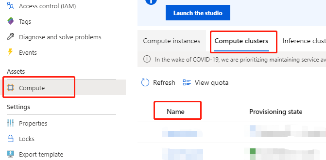

**在 Azure Machine Learning 上运行 Experiment**
===
NNI 支持在 [AML](https://azure.microsoft.com/zh-cn/services/machine-learning/) 上运行 Experiment，称为 aml 模式。

## 设置环境
步骤 1. 参考[指南](../Tutorial/QuickStart.md)安装 NNI。

步骤 2. 按照[此链接](https://azure.microsoft.com/en-us/free/services/machine-learning/)，创建 AML 账户。如果你已经有一个Azure账户，可跳过此步骤。

步骤 3. 在你的机器上安装Azure CLI，参考[这里](https://docs.microsoft.com/en-us/cli/azure/install-azure-cli?view=azure-cli-latest)。

步骤 4. 从CLI验证你的Azure订阅。要进行交互式身份验证，请打开命令行或终端并使用以下命令:
```
az login
```

步骤5. 使用浏览器登录您的Azure帐户并创建一个机器学习工作区。之后下载`config.json`，后面会用到该文件。


步骤6. 创建一个AML 计算集群作为computeTarget。


步骤 7. 在你的机器上安装 AML 包环境。
```
python3 -m pip install azureml --user
python3 -m pip install azureml-sdk --user
```

## 运行 Experiment
以 `examples/trials/mnist-tfv1` 为例。 NNI 的 YAML 配置文件如下：

```yaml
authorName: default
experimentName: example_mnist
trialConcurrency: 1
maxExecDuration: 1h
maxTrialNum: 10
trainingServicePlatform: aml
searchSpacePath: search_space.json
#可选项: true, false
useAnnotation: false
tuner:
  #可选项: TPE, Random, Anneal, Evolution, BatchTuner, MetisTuner, GPTuner
  #SMAC (SMAC should be installed through nnictl)
  builtinTunerName: TPE
  classArgs:
    #可选项: maximize, minimize
    optimize_mode: maximize
trial:
  command: python3 mnist.py
  codeDir: .
  computeTarget: ${replace_to_your_computeTarget}
  image: msranni/nni
amlConfig:
  subscriptionId: ${replace_to_your_subscriptionId}
  resourceGroup: ${replace_to_your_resourceGroup}
  workspaceName: ${replace_to_your_workspaceName}

```

注意：如果用 aml 模式运行，需要在 YAML 文件中设置 `trainingServicePlatform: aml`。

与[本机模式](LocalMode.md)的 Trial 配置相比，aml 模式下的键值还有：
* computeTarget
    * 必填。 要在 AML 工作区中使用的计算集群名称。详见步骤6。
* image
    * 必填。 作业中使用的 Docker 映像名称。本示例中的映像`msranni/nni`须通过支持GPU的computeTarget来运行

amlConfig:
* subscriptionId
    * Azure 订阅的 Id
* resourceGroup
    * 账户的资源组
* workspaceName
    * 账户的工作区名称

amlConfig所需的信息可以在`config.json`中找到。详见步骤5。

运行以下命令来启动示例：
```
git clone https://github.com/microsoft/nni.git
cd nni/examples/trials/mnist-tfv1

# 修改 config_aml.yml ...

nnictl create --config config_aml.yml
```
  