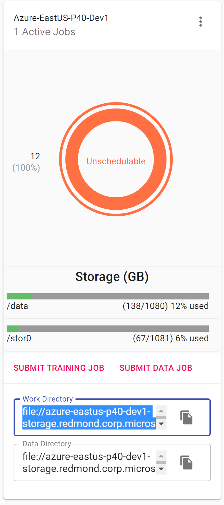
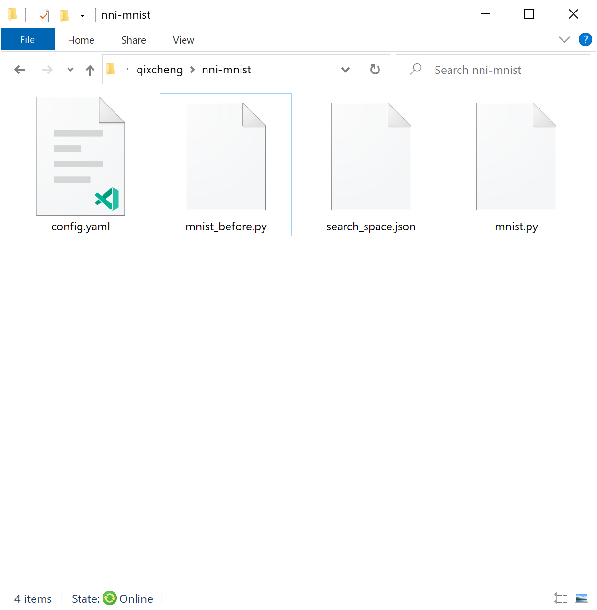
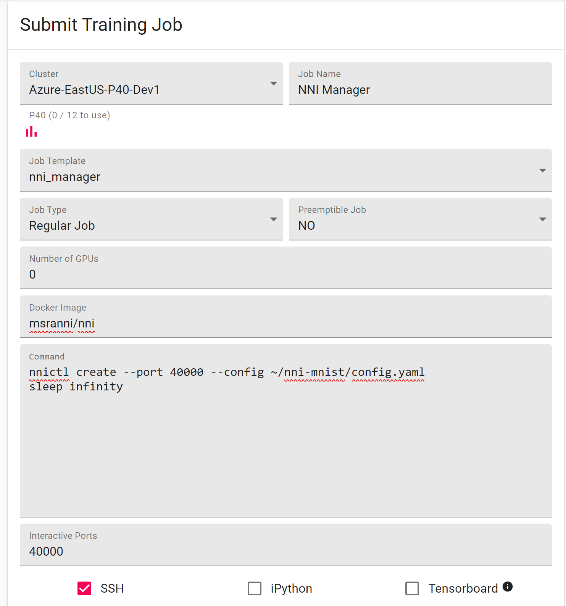
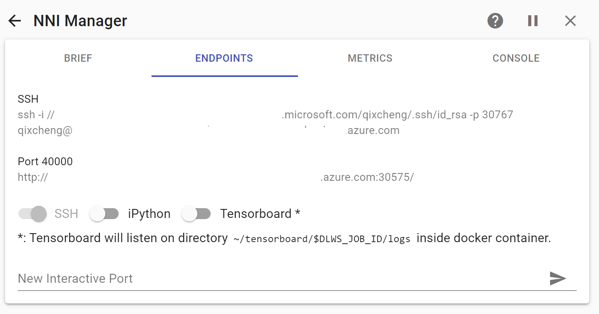

**在 DLTS 上运行 Experiment**
=================================

NNI 支持在 `DLTS <https://github.com/microsoft/DLWorkspace.git>`__\ 上运行 Experiment ，称之为 dlts 模式。 在开始使用 NNI dlts 模式之前，应该有访问 DLTS 仪表板的账号。

设置环境
-----------------

步骤 1. 从 DLTS 仪表板中选择集群，关于仪表板地址，需咨询管理员。

步骤 2. 准备 NNI 配置 YAML，如下所示：

.. code-block:: yaml

   # Set this field to "dlts"
   trainingServicePlatform: dlts
   authorName: your_name
   experimentName: auto_mnist
   trialConcurrency: 2
   maxExecDuration: 3h
   maxTrialNum: 100
   searchSpacePath: search_space.json
   useAnnotation: false
   tuner:
     builtinTunerName: TPE
     classArgs:
       optimize_mode: maximize
   trial:
     command: python3 mnist.py
     codeDir: .
     gpuNum: 1
     image: msranni/nni
   # Configuration to access DLTS
   dltsConfig:
     dashboard: # Ask administrator for the cluster dashboard URL

记得将群集仪表板地址填到最后一行。

步骤 3. 打开群集的工作目录，将 NNI 配置和相关代码放入目录中。

步骤 4. 将 NNI 管理器任务提交到指定的群集。

步骤 5. 转到新创建的任务选项卡，单击端口 40000 的链接检查 Trial 的信息。

