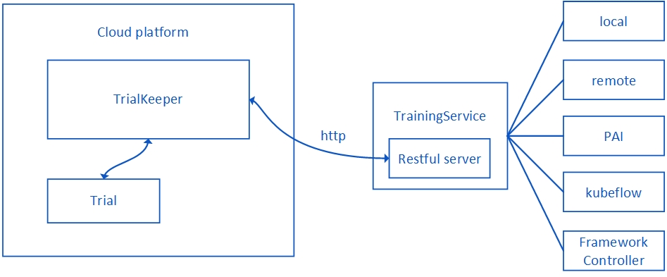

NNI 中如何实现训练平台
========================================

概述
--------

TrainingService 是与平台管理、任务调度相关的模块。 TrainingService 在设计上为了便于实现，将平台相关的公共属性抽象成类。用户只需要继承这个抽象类，并根据平台特点实现子类，便能够实现 TrainingService。

系统架构
-------------------

.. image:: ../../img/NNIDesign.jpg
   :target: ../../img/NNIDesign.jpg
   :alt: 

NNI 的架构如图所示。 NNIManager 是系统的核心管理模块，负责调用 TrainingService 来管理 Trial，并负责不同模块之间的通信。 Dispatcher 是消息处理中心。 TrainingService 是管理任务的模块，它和 NNIManager 通信，并且根据平台的特点有不同的实现。 NNI 目前支持的平台有 `local platfrom <LocalMode.md>`__\ 
 ，`remote platfrom <RemoteMachineMode.md>`__\ ， `PAI platfrom <PaiMode.md>`__\ ， `kubeflow platform <KubeflowMode.md>`__ 和 `FrameworkController platfrom <FrameworkControllerMode.rst>`__。

本文中，会介绍 TrainingService 的简要设计。 如果要添加新的 TrainingService，只需要继承 TrainingServcie 类并实现相应的方法，不需要理解NNIManager、Dispatcher 等其它模块的细节。

代码文件夹结构
------------------------

NNI 的文件夹结构如下：

.. code-block:: bash

   nni
     |- deployment
     |- docs
     |- examaples
     |- src
     | |- nni_manager
     | | |- common
     | | |- config
     | | |- core
     | | |- coverage
     | | |- dist
     | | |- rest_server
     | | |- training_service
     | | | |- common
     | | | |- kubernetes
     | | | |- local
     | | | |- pai
     | | | |- remote_machine
     | | | |- test
     | |- sdk
     | |- webui
     |- test
     |- tools
     | |-nni_annotation
     | |-nni_cmd
     | |-nni_gpu_tool
     | |-nni_trial_tool

``nni/src`` 文件夹存储 NNI 的大部分源代码。 这个文件夹中的代码和 NNIManager、TrainingService、SDK、WebUI 等模块有关。 用户可以在 ``nni/src/nni_manager/common/trainingService.ts`` 文件中找到 TrainingService 抽象类的代码，并且把自己实现的子类放到 ``nni/src/nni_manager/training_service`` 文件夹下。 如果用户实现了自己的 TrainingService，还需要同时实现相应的单元测试代码，并把单元测试放到 ``nni/src/nni_manager/training_service/test`` 文件夹下。

TrainingService 函数解释
--------------------------------------

.. code-block:: bash

   abstract class TrainingService {
       public abstract listTrialJobs(): Promise<TrialJobDetail[]>;
       public abstract getTrialJob(trialJobId: string): Promise<TrialJobDetail>;
       public abstract addTrialJobMetricListener(listener: (metric: TrialJobMetric) => void): void;
       public abstract removeTrialJobMetricListener(listener: (metric: TrialJobMetric) => void): void;
       public abstract submitTrialJob(form: JobApplicationForm): Promise<TrialJobDetail>;
       public abstract updateTrialJob(trialJobId: string, form: JobApplicationForm): Promise<TrialJobDetail>;
       public abstract get isMultiPhaseJobSupported(): boolean;
       public abstract cancelTrialJob(trialJobId: string, isEarlyStopped?: boolean): Promise<void>;
       public abstract setClusterMetadata(key: string, value: string): Promise<void>;
       public abstract getClusterMetadata(key: string): Promise<string>;
       public abstract cleanUp(): Promise<void>;
       public abstract run(): Promise<void>;
   }

TrainingService 父类有一些抽象方法，用户需要继承并实现这些抽象方法。

**setClusterMetadata(key: string, value: string)**

ClusterMetadata 是与平台细节相关的数据，例如，ClusterMetadata 在远程服务器的定义是：

.. code-block:: bash

   export class RemoteMachineMeta {
       public readonly ip : string;
       public readonly port : number;
       public readonly username : string;
       public readonly passwd?: string;
       public readonly sshKeyPath?: string;
       public readonly passphrase?: string;
       public gpuSummary : GPUSummary | undefined;
       /* GPU Reservation info, the key is GPU index, the value is the job id which reserves this GPU*/
       public gpuReservation : Map<number, string>;

       constructor(ip : string, port : number, username : string, passwd : string,
           sshKeyPath : string, passphrase : string) {
           this.ip = ip;
           this.port = port;
           this.username = username;
           this.passwd = passwd;
           this.sshKeyPath = sshKeyPath;
           this.passphrase = passphrase;
           this.gpuReservation = new Map<number, string>();
       }
   }

Metadata 中包括了主机地址，用户名和其它平台相关配置。 用户需要定义自己的 Metadata 格式，并在这个方法中相应实现。 这个方法在 Experiment 启动之前调用。

**getClusterMetadata(key: string)**

此函数将返回相应值的元数据值，如果不需要使用，可留空。

**submitTrialJob(form: JobApplicationForm)**

SubmitTrialJob 是用来提交新 Trial 任务的函数，需要生成一个 TrialJobDetail 类型的任务实例。 TrialJobDetail 定义如下：

.. code-block:: bash

   interface TrialJobDetail {
       readonly id: string;
       readonly status: TrialJobStatus;
       readonly submitTime: number;
       readonly startTime?: number;
       readonly endTime?: number;
       readonly tags?: string[];
       readonly url?: string;
       readonly workingDirectory: string;
       readonly form: JobApplicationForm;
       readonly sequenceId: number;
       isEarlyStopped?: boolean;
   }

根据不同的实现，用户可能需要把 Trial 任务放入队列中，并不断地从队里中取出任务进行提交。 或者也可以直接在这个方法中完成作业提交过程。

**cancelTrialJob(trialJobId: string, isEarlyStopped?: boolean)**

如果此函数被调用，应取消平台启动的 Trial。 不同的平台有不同的取消作业的方式，这个方法应该根据不同平台的特点，实现相应的细节。

**updateTrialJob(trialJobId: string, form: JobApplicationForm)**

调用此函数可更新 Trial 的任务状态，Trial 任务状态根据不同的平台来检测，并需要更新为 ``RUNNING``, ``SUCCEED``, ``FAILED`` 等状态。

**getTrialJob(trialJobId: string)**

此函数根据 trialJobId 返回 trialJob 的实例。

**listTrialJobs()**

用户需要将所有 Trial 任务详情存入列表并返回。

**addTrialJobMetricListener(listener: (metric: TrialJobMetric) => void)**

NNI 会启动一个 EventEmitter 来处理任务的指标数据，如果有检测到有新的数据，EventEmitter 就会被触发，来执行相应的事件。 用户需要在这个方法中开始 EventEmitter。

**removeTrialJobMetricListener(listener: (metric: TrialJobMetric) => void)**

关闭 EventEmitter。

**run()**

Run() 函数是 TrainingService 的主循环，用户可以在这个函数中循环执行他们的代码逻辑，这个函数在实验结束前会一直循环执行。

**cleanUp()**

当实验结束后，此方法用来清除实验环境。 用户需要在这个方法中实现与平台相关的清除操作。

TrialKeeper 工具
----------------

NNI 提供了 TrialKeeper 工具，用来帮助维护 Trial 任务。 可以在 ``nni/tools/nni_trial_tool`` 文件夹中找到 TrialKeeper 的源代码。 如果想要运行在云平台上，这是维护任务的好工具。

TrialKeeper 的架构如下：

当用户需要在远程云平台上运行作业，要把作业启动的命令行传入 TrailKeeper 中，并在远程云平台上启动 TrailKeeper 进程。 注意，TrialKeeper 在远程平台中使用 RESTful 服务来和 TrainingService 进行通信，用户需要在本地机器启动一个 RESTful 服务来接受 TrialKeeper 的请求。 关于 RESTful 服务的源代码可以在 ``nni/src/nni_manager/training_service/common/clusterJobRestServer.ts`` 文件夹中找到。

参考
---------

有关调试的进一步信息，可参考 `这里 <../Tutorial/HowToDebug.rst>`__。

如何参与贡献的指南，请参考 `这里 <../Tutorial/Contributing.rst>`__。
