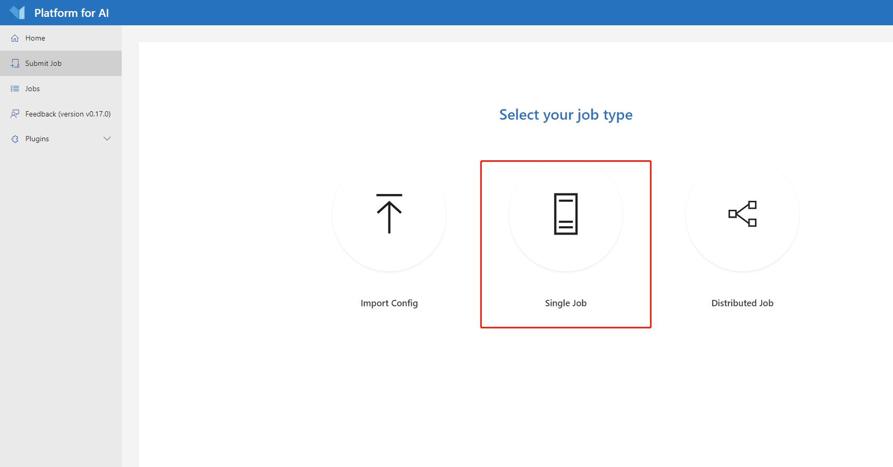
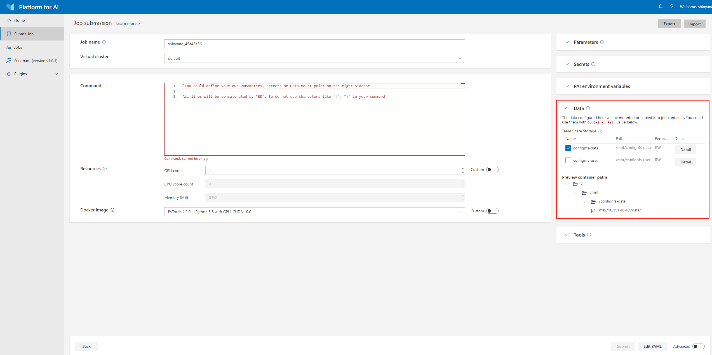

# **在 OpenPAI 上运行 Experiment**

NNI 支持在 [OpenPAI](https://github.com/Microsoft/pai) （简称 pai）上运行 Experiment，即 pai 模式。 在使用 NNI 的 pai 模式前, 需要有 [OpenPAI](https://github.com/Microsoft/pai) 群集的账户。 如果没有 OpenPAI 账户，参考[这里](https://github.com/Microsoft/pai#how-to-deploy)来进行部署。 在 pai 模式中，会在 Docker 创建的容器中运行 Trial 程序。

## 设置环境

步骤 1. 参考[指南](../Tutorial/QuickStart.md)安装 NNI。

步骤 2. 获取 OpenPAI 的令牌。  
点击 OpenPAI 界面右上方的 `My profile` 按钮。  找到 token management，复制当前账号的令牌。 

步骤 3. Mount NFS storage to local machine.  
Click `Submit job` button in PAI's webportal.   
Find the data management region in job submission page.   
The `DEFAULT_STORAGE`field is the path to be mounted in PAI's container when a job is started. The `Preview container paths` is the NFS host and path that PAI provided, you need to mount the corresponding host and path to your local machine first, then NNI could use the PAI's NFS storage.  
For example, use the following command:

    sudo mount nfs://gcr-openpai-infra02:/pai/data /local/mnt
    

Then the `/data` folder in container will be mounted to `/local/mnt` folder in your local machine.  
You could use the following configuration in your NNI's config file:

    nniManagerNFSMountPath: /local/mnt
    containerNFSMountPath: /data
    

Step 4. Get PAI's storage plugin name. Contact PAI's admin, and get the PAI's storage plugin name for NFS storage. The default storage name is `teamwise_storage`, the configuration in NNI's config file is in following value:

    paiStoragePlugin: teamwise_storage
    

## 运行 Experiment

Use `examples/trials/mnist-annotation` as an example. The NNI config YAML file's content is like:

```yaml
authorName: your_name
experimentName: auto_mnist
# how many trials could be concurrently running
trialConcurrency: 2
# maximum experiment running duration
maxExecDuration: 3h
# empty means never stop
maxTrialNum: 100
# choice: local, remote, pai
trainingServicePlatform: pai
# search space file
searchSpacePath: search_space.json
# choice: true, false
useAnnotation: true
tuner:
  builtinTunerName: TPE
  classArgs:
    optimize_mode: maximize
trial:
  command: python3 mnist.py
  codeDir: ~/nni/examples/trials/mnist-annotation
  gpuNum: 0
  cpuNum: 1
  memoryMB: 8196
  image: msranni/nni:latest
  virtualCluster: default
  nniManagerNFSMountPath: /home/user/mnt
  containerNFSMountPath: /mnt/data/user
  paiStoragePlugin: team_wise
# Configuration to access OpenPAI Cluster
paiConfig:
  userName: your_pai_nni_user
  token: your_pai_token
  host: 10.1.1.1
```

Note: You should set `trainingServicePlatform: pai` in NNI config YAML file if you want to start experiment in pai mode.

Compared with [LocalMode](LocalMode.md) and [RemoteMachineMode](RemoteMachineMode.md), trial configuration in pai mode have these additional keys:

* cpuNum 
    * 可选。 Trial 程序的 CPU 需求，必须为正数。 如果没在 Trial 配置中设置，则需要在 `paiConfigPath` 指定的配置文件中设置。
* memoryMB 
    * 可选。 Trial 程序的内存需求，必须为正数。 如果没在 Trial 配置中设置，则需要在 `paiConfigPath` 指定的配置文件中设置。
* image 
    * 可选。 在 pai 模式中，Trial 程序由 OpenPAI 在 [Docker 容器](https://www.docker.com/)中安排运行。 此键用来指定 Trial 程序的容器使用的 Docker 映像。
    * [Docker Hub](https://hub.docker.com/) 上有预制的 NNI Docker 映像 [nnimsra/nni](https://hub.docker.com/r/msranni/nni/)。 它包含了用来启动 NNI Experiment 所依赖的所有 Python 包，Node 模块和 JavaScript。 生成此 Docker 映像的文件在[这里](https://github.com/Microsoft/nni/tree/master/deployment/docker/Dockerfile)。 可以直接使用此映像，或参考它来生成自己的映像。 如果没在 Trial 配置中设置，则需要在 `paiConfigPath` 指定的配置文件中设置。
* virtualCluster 
    * 可选。 设置 OpenPAI 的 virtualCluster，即虚拟集群。 如果未设置此参数，将使用默认（default）虚拟集群。
* nniManagerNFSMountPath 
    * 必填。 在 nniManager 计算机上设置挂载的路径。
* containerNFSMountPath 
    * 必填。 在 OpenPAI 的容器中设置挂载路径。
* paiStoragePlugin 
    * 可选。 设置 PAI 中使用的存储插件的名称。 如果没在 Trial 配置中设置，则需要在 `paiConfigPath` 指定的配置文件中设置。
* paiConfigPath 
    * 可选。 设置 OpenPAI 作业配置文件路径，文件为 YAML 格式。

Once complete to fill NNI experiment config file and save (for example, save as exp_pai.yml), then run the following command

    nnictl create --config exp_pai.yml
    

to start the experiment in pai mode. NNI will create OpenPAI job for each trial, and the job name format is something like `nni_exp_{experiment_id}_trial_{trial_id}`. You can see jobs created by NNI in the OpenPAI cluster's web portal, like: 

Notice: In pai mode, NNIManager will start a rest server and listen on a port which is your NNI WebUI's port plus 1. For example, if your WebUI port is `8080`, the rest server will listen on `8081`, to receive metrics from trial job running in Kubernetes. So you should `enable 8081` TCP port in your firewall rule to allow incoming traffic.

Once a trial job is completed, you can goto NNI WebUI's overview page (like http://localhost:8080/oview) to check trial's information.

Expand a trial information in trial list view, click the logPath link like: 

And you will be redirected to HDFS web portal to browse the output files of that trial in HDFS: 

You can see there're three fils in output folder: stderr, stdout, and trial.log

## 数据管理

Befour using NNI to start your experiment, users should set the corresponding mount data path in your nniManager machine. PAI has their own storage(NFS, AzureBlob ...), and the storage will used in PAI will be mounted to the container when it start a job. Users should set the PAI storage type by `paiStoragePlugin` field to choose a storage in PAI. Then users should mount the storage to their nniManager machine, and set the `nniManagerNFSMountPath` field in configuration file, NNI will generate bash files and copy data in `codeDir` to the `nniManagerNFSMountPath` folder, then NNI will start a trial job. The data in `nniManagerNFSMountPath` will be sync to PAI storage, and will be mounted to PAI's container. The data path in container is set in `containerNFSMountPath`, NNI will enter this folder first, and then run scripts to start a trial job.

## 版本校验

NNI support version check feature in since version 0.6. It is a policy to insure the version of NNIManager is consistent with trialKeeper, and avoid errors caused by version incompatibility. Check policy:

1. 0.6 以前的 NNIManager 可与任何版本的 trialKeeper 一起运行，trialKeeper 支持向后兼容。
2. 从 NNIManager 0.6 开始，与 triakKeeper 的版本必须一致。 例如，如果 NNIManager 是 0.6 版，则 trialKeeper 也必须是 0.6 版。
3. 注意，只有版本的前两位数字才会被检查。例如，NNIManager 0.6.1 可以和 trialKeeper 的 0.6 或 0.6.2 一起使用，但不能与 trialKeeper 的 0.5.1 或 0.7 版本一起使用。

If you could not run your experiment and want to know if it is caused by version check, you could check your webUI, and there will be an error message about version check. 