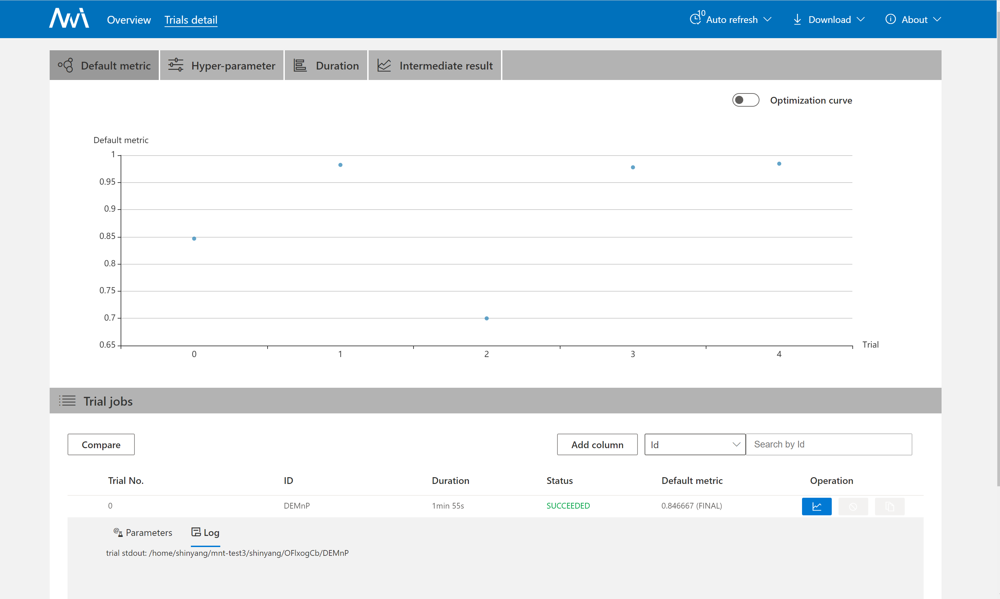
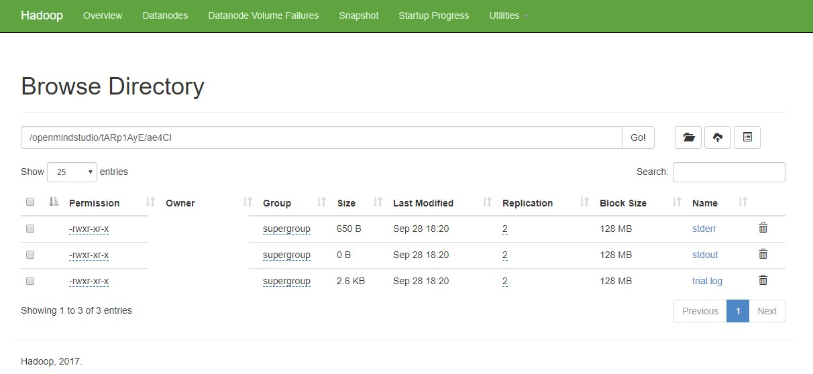

**在 OpenPAIYarn 上运行 Experiment**
===
原始的 `pai` 模式改为了 `paiYarn` 模式，这是基于 Yarn 的分布式训练平台。

## 设置环境
参考[指南](../Tutorial/QuickStart.md)安装 NNI。

## 运行 Experiment
以 `examples/trials/mnist-tfv1` 为例。 NNI 的 YAML 配置文件如下：

```yaml
authorName: your_name
experimentName: auto_mnist
# 并发运行的 Trial 数量
trialConcurrency: 2
# Experiment 的最长持续运行时间
maxExecDuration: 3h
# 空表示一直运行
maxTrialNum: 100
# 可选项: local, remote, pai, paiYarn
trainingServicePlatform: paiYarn
# 搜索空间文件
searchSpacePath: search_space.json
# 可选项: true, false
useAnnotation: false
tuner:
  builtinTunerName: TPE
  classArgs:
    optimize_mode: maximize
trial:
  command: python3 mnist.py
  codeDir: ~/nni/examples/trials/mnist-tfv1
  gpuNum: 0
  cpuNum: 1
  memoryMB: 8196
  image: msranni/nni:latest
# 配置访问的 OpenpaiYarn 集群
paiYarnConfig:
  userName: your_paiYarn_nni_user
  passWord: your_paiYarn_password
  host: 10.1.1.1
```

注意：如果用 paiYarn 模式运行，需要在 YAML 文件中设置 `trainingServicePlatform: paiYarn`。

与[本机模式](LocalMode.md)，以及[远程计算机模式](RemoteMachineMode.md)相比，paiYarn 模式的 Trial 有额外的配置：
* cpuNum
    * 必填。 Trial 程序的 CPU 需求，必须为正数。
* memoryMB
    * 必填。 Trial 程序的内存需求，必须为正数。
* image
    * 必填。 在 paiYarn 模式中，Trial 程序由 OpenpaiYarn 在 [Docker 容器](https://www.docker.com/)中安排运行。 此键用来指定 Trial 程序的容器使用的 Docker 映像。
    * [Docker Hub](https://hub.docker.com/) 上有预制的 NNI Docker 映像 [nnimsra/nni](https://hub.docker.com/r/msranni/nni/)。 它包含了用来启动 NNI Experiment 所依赖的所有 Python 包，Node 模块和 JavaScript。 生成此 Docker 映像的文件在[这里](https://github.com/Microsoft/nni/tree/master/deployment/docker/Dockerfile)。 可以直接使用此映像，或参考它来生成自己的映像。
* virtualCluster
    * 可选。 设置 OpenPAIYarn 的 virtualCluster，即虚拟集群。 如果未设置此参数，将使用默认（default）虚拟集群。
* shmMB
    * 可选。 设置 OpenPAIYarn 的 shmMB，即 Docker 中的共享内存。
* authFile
    * 可选。在使用 paiYarn 模式时，为私有 Docker 仓库设置认证文件，[见参考文档](https://github.com/microsoft/paiYarn/blob/2ea69b45faa018662bc164ed7733f6fdbb4c42b3/docs/faq.md#q-how-to-use-private-docker-registry-job-image-when-submitting-an-openpaiYarn-job)。提供 authFile 的本地路径即可， NNI 会上传此文件。
* portList
    * 可选。 设置 OpenPAIYarn 的 portList。指定了容器中使用的端口列表，[参考文档](https://github.com/microsoft/paiYarn/blob/b2324866d0280a2d22958717ea6025740f71b9f0/docs/job_tutorial.md#specification)。<br /> 示例如下： NNI 中的配置架构如下所示：
    ```
    portList:
      - label: test
        beginAt: 8080
        portNumber: 2
    ```
    假设需要在 MNIST 示例中使用端口来运行 TensorBoard。 第一步是编写 `mnist.py` 的包装脚本 `launch_paiYarn.sh`。

    ```bash
    export TENSORBOARD_PORT=paiYarn_PORT_LIST_${paiYarn_CURRENT_TASK_ROLE_NAME}_0_tensorboard
    tensorboard --logdir . --port ${!TENSORBOARD_PORT} &
    python3 mnist.py
    ```
    portList 的配置部分如下：

    ```yaml
  trial:
    command: bash launch_paiYarn.sh
    portList:
      - label: tensorboard
        beginAt: 0
        portNumber: 1
    ```

NNI 支持 OpenPAIYarn 中的两种认证授权方法，即密码和 paiYarn 令牌（token)，[参考](https://github.com/microsoft/paiYarn/blob/b6bd2ab1c8890f91b7ac5859743274d2aa923c22/docs/rest-server/API.md#2-authentication)。 授权配置在 `paiYarnConfig` 字段中。 密码认证的 `paiYarnConfig` 配置如下：
```
paiYarnConfig:
  userName: your_paiYarn_nni_user
  passWord: your_paiYarn_password
  host: 10.1.1.1
```
令牌认证的 `paiYarnConfig` 配置如下：
```
paiYarnConfig:
  userName: your_paiYarn_nni_user
  token: your_paiYarn_token
  host: 10.1.1.1
```

完成并保存 NNI Experiment 配置文件后（例如可保存为：exp_paiYarn.yml），运行以下命令：
```
nnictl create --config exp_paiYarn.yml
```
来在 paiYarn 模式下启动 Experiment。 NNI 会为每个 Trial 创建 OpenPAIYarn 作业，作业名称的格式为 `nni_exp_{experiment_id}_trial_{trial_id}`。 可以在 OpenPAIYarn 集群的网站中看到 NNI 创建的作业，例如： 

注意：paiYarn 模式下，NNIManager 会启动 RESTful 服务，监听端口为 NNI 网页服务器的端口加1。 例如，如果网页端口为`8080`，那么 RESTful 服务器会监听在 `8081`端口，来接收运行在 Kubernetes 中的 Trial 作业的指标。 因此，需要在防火墙中启用端口 `8081` 的 TCP 协议，以允许传入流量。

当一个 Trial 作业完成后，可以在 NNI 网页的概述页面（如：http://localhost:8080/oview）中查看 Trial 的信息。

在 Trial 列表页面中展开 Trial 信息，点击如下的 logPath： 

接着将会打开 HDFS 的 WEB 界面，并浏览到 Trial 的输出文件： 

在输出目录中可以看到三个文件：stderr, stdout, 以及 trial.log

## 数据管理
如果训练数据集不大，可放在 codeDir 中，NNI会将其上传到 HDFS，或者构建 Docker 映像来包含数据。 如果数据集非常大，则不可放在 codeDir 中，可参考此[指南](https://github.com/microsoft/paiYarn/blob/master/docs/user/storage.md)来将数据目录挂载到容器中。

如果要将 Trial 的其它输出保存到 HDFS 上，如模型文件等，需要在 Trial 代码中使用 `NNI_OUTPUT_DIR` 来保存输出文件。NNI 的 SDK 会将文件从 Trial 容器的 `NNI_OUTPUT_DIR` 复制到 HDFS 上，目标路径为：`hdfs://host:port/{username}/nni/{experiments}/{experimentId}/trials/{trialId}/nnioutput`。

## 版本校验
从 0.6 开始，NNI 支持版本校验。确保 NNIManager 与 trialKeeper 的版本一致，避免兼容性错误。 检查策略：
1. 0.6 以前的 NNIManager 可与任何版本的 trialKeeper 一起运行，trialKeeper 支持向后兼容。
2. 从 NNIManager 0.6 开始，与 triakKeeper 的版本必须一致。 例如，如果 NNIManager 是 0.6 版，则 trialKeeper 也必须是 0.6 版。
3. 注意，只有版本的前两位数字才会被检查。例如，NNIManager 0.6.1 可以和 trialKeeper 的 0.6 或 0.6.2 一起使用，但不能与 trialKeeper 的 0.5.1 或 0.7 版本一起使用。

如果 Experiment 无法运行，而且不能确认是否是因为版本不匹配造成的，可以在 Web 界面检查是否有相关的错误消息。 
