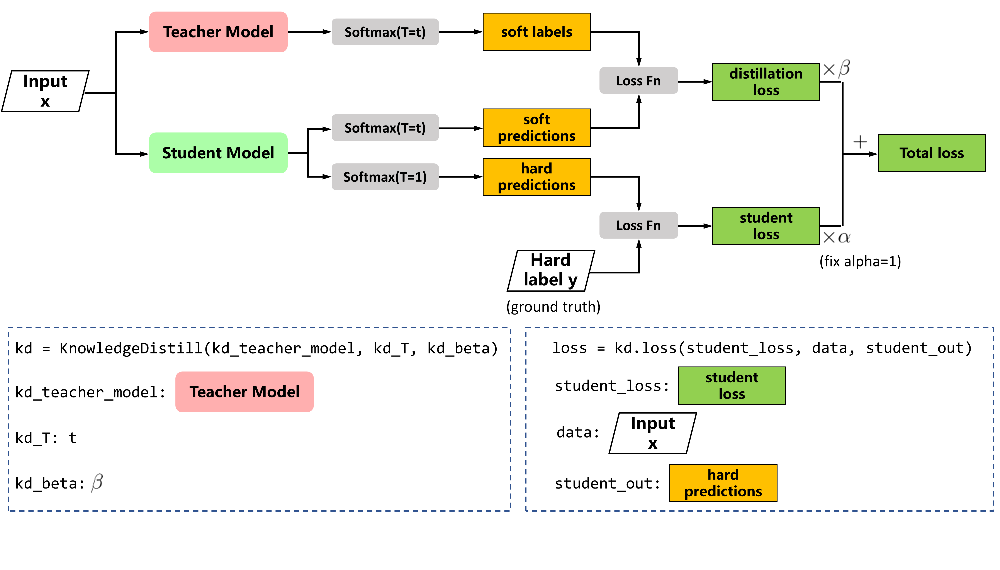

NNI 上的知识蒸馏
=============================

知识蒸馏 (Knowledge Distillation)
---------------------------------------

知识蒸馏，在 `Distilling the Knowledge in a Neural Network <https://arxiv.org/abs/1503.02531>`__ 中，压缩模型被训练成模拟预训练的大模型。  这种训练设置也称为"师生（teacher-student）"方式，其中大模型是教师，小模型是学生。

用法
^^^^^

PyTorch 代码

.. code-block:: python

   from knowledge_distill.knowledge_distill import KnowledgeDistill
   kd = KnowledgeDistill(kd_teacher_model, kd_T=5)
   alpha = 1
   beta = 0.8
   for batch_idx, (data, target) in enumerate(train_loader):
       data, target = data.to(device), target.to(device)
       optimizer.zero_grad()
       output = model(data)
       loss = F.cross_entropy(output, target)
       # 只需要添加以下行来使用知识蒸馏微调模型
       loss = alpha * loss + beta * kd.loss(data=data, student_out=output)
       loss.backward()

知识蒸馏的用户配置
^^^^^^^^^^^^^^^^^^^^^^^^^^^^^^^^^^^^^^^

* **kd_teacher_model**：预训练过的教师模型 
* **kd_T**：用于平滑教师模型输出的温度。

完整代码在 `这里 <https://github.com/microsoft/nni/tree/v1.3/examples/model_compress/knowledge_distill/>`__。
